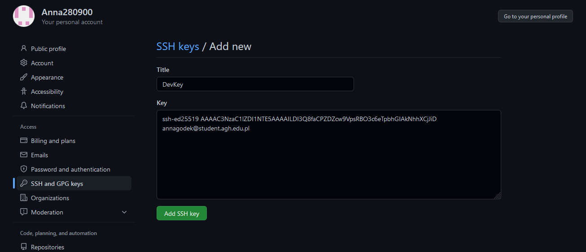

### Anna Godek
# Sprawozdanie 
# Laboratorium 1
[1] Klient Git oraz obsługa kluczy SSH zostały zainstalowane już wcześniej za pomocą komendy: 
        $ sudo apt install git

[2] Sklonowano repozytorium za pomocą HTTPS.
        $ git clone https://github.com/InzynieriaOprogramowaniaAGH/MDO2022_S.git

[3] Wygenerowano nowy klucz SSH.
        $ ssh-keygen -t ed25519 -f kluczyk.id

Wygenerowano również klucz SSH zabezpieczony hasłem
        $ ssh-keygen -t ecdsa -f kluczyk2.id -C annagodek@student.agh.edu.pl

Następnie skopiowano i dodano klucz publiczny do konta na githubie. 

Sprawdzono połączenie i sklonowano repozytorium z wykorzystaniem protokołu SSH.
        $ ssh -T git@github.com
        $ git clone git@github.com:InzynieriaOprogramowaniaAGH/MDO2022_S.git

[4] Przełączono sie na gałąź main a następnie na gałąź swojej grupy.
        $ git checkout main
        $ git checkout INO-GCL01
   

[5] Utworzono gałąź o nazwie AG401570.
        $ git checkout -b AG401570

[6] W katalogu wlaściwym dla grupy utworzono nowy katalog o nazwie AG401570 a w nim katalog Lab01.

