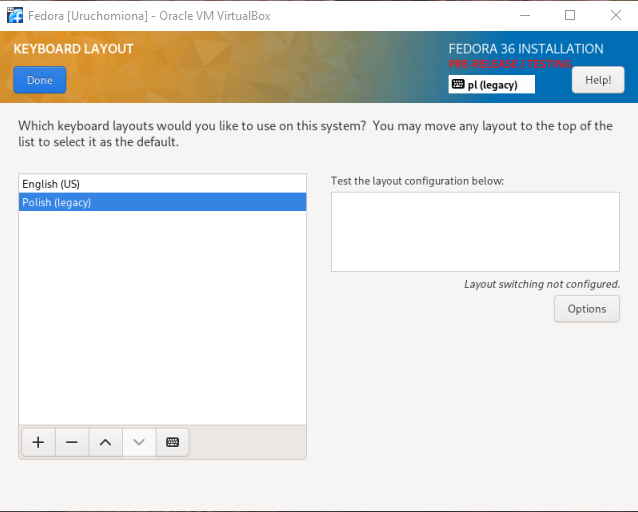
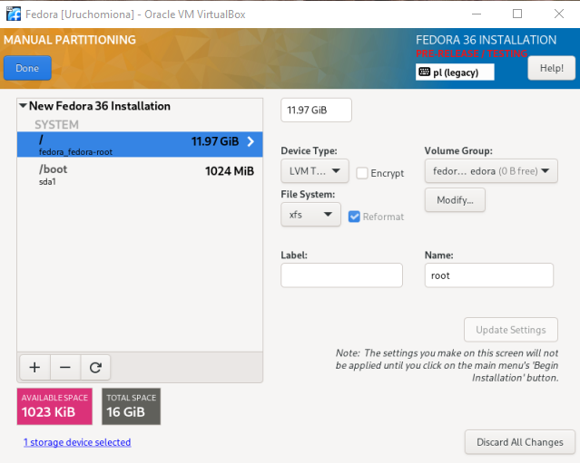
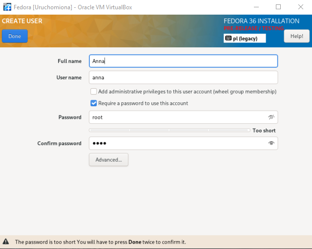
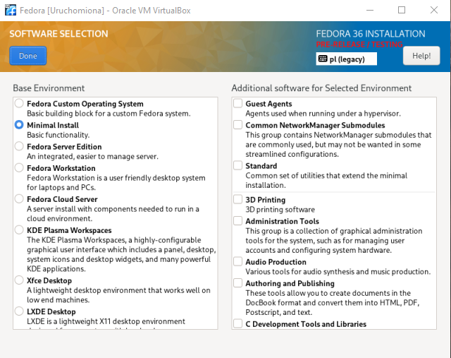
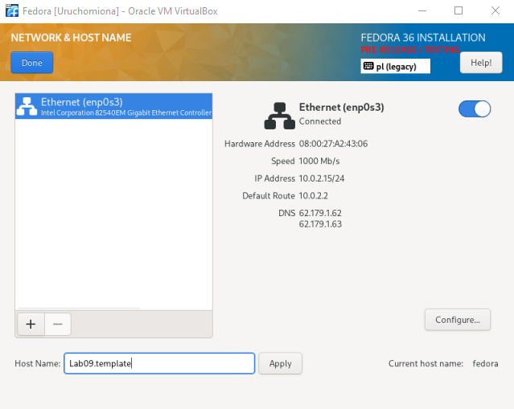
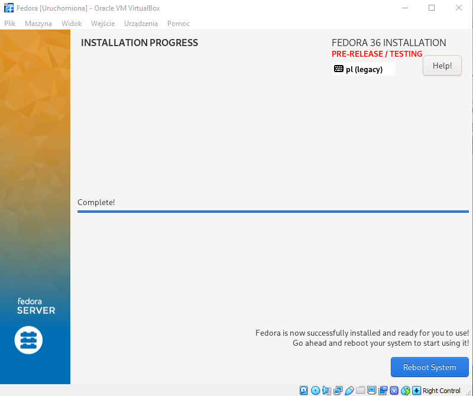
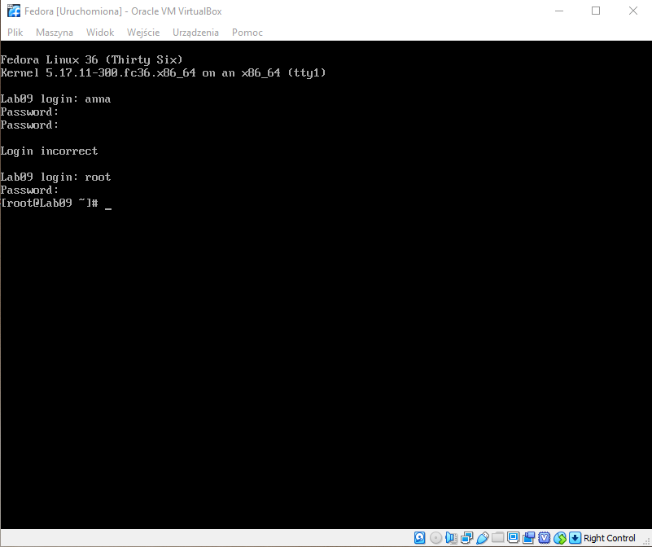
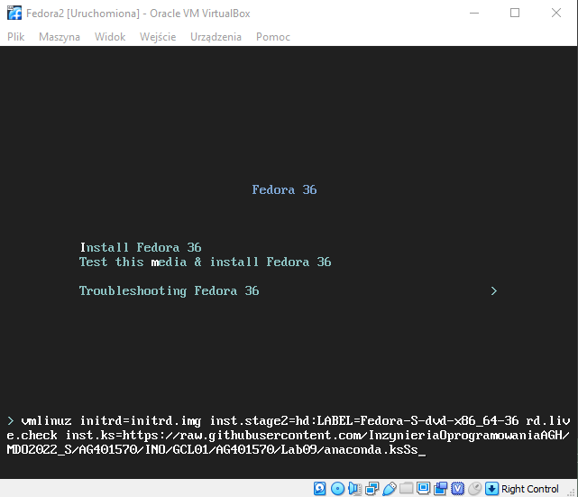
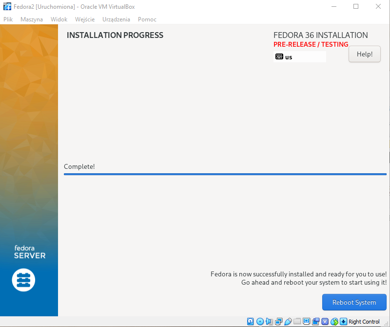
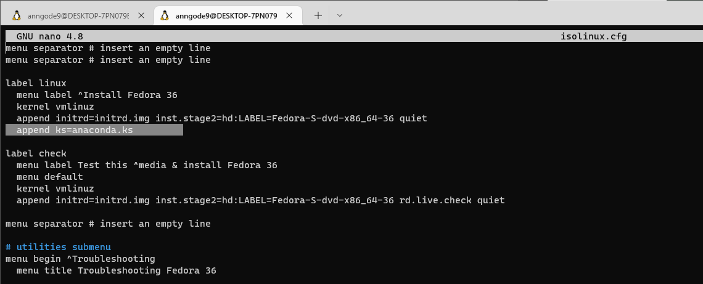

Anna Godek

Inżynieria Obliczeniowa

GCL01

# Metodyki DevOps

**Przygotowanie maszyny**
Instalacje systemu Fedora przeprowadzono w VM, wykorzystano środowisko VirtualBox. Pierwszym krokiem było utworzenie nowej maszyny wirtualnej.
Konfiguracja ustawień.

Ustawiono polską klawiaturę.


Zmieniono ustawienia partycji.


Utworzono konta dla roota i użytkownika



Wybrano minimalną wersję instalacji, następnie skonfigurowano ustawienia sieci.



Instalacja:

  

Zalogowano się do utworzonej maszyny i skopiowano plik `anaconda-ks.cfg` na Windowsa (w celu prostszej edycji), aby później ułatwić do niego dostęp, zmodyfikowany plik został umieszczony w repozytorium.

 
Dodane fragmenty: 
```bash
# Repo
url --mirrorlist=http://mirrors.fedoraproject.org/mirrorlist?repo=fedora-$releasever&arch=x86_64
repo --name=updates --mirrorlist=http://mirrors.fedoraproject.org/mirrorlist?repo=updates-released-f$releasever&arch=x86_64
```
```bash
%post
sudo apt-get install git
mkdir /programmer-calculator
mkdir /programmer-calculator/calc
wget https://github.com/InzynieriaOprogramowaniaAGH/MDO2022_S/blob/AG401570/INO/GCL01/AG401570/Lab09/pcalc -P /programmer-calculator
cp /programmer-calculator/pcalc programmer-calculator/calc
%end
```
Cały plik: 
```bash
# Generated by Anaconda 36.16.2
# Generated by pykickstart v3.36
#version=F36
# Use graphical install
graphical

# Keyboard layouts
keyboard --vckeymap=us --xlayouts='us','pl (legacy)'
# System language
lang en_US.UTF-8

# Network information
network --bootproto=dhcp --device=enp0s3 --ipv6=auto --activate
network --hostname=Lab09.template

# Repo
url --mirrorlist=http://mirrors.fedoraproject.org/mirrorlist?repo=fedora-$releasever&arch=x86_64
repo --name=updates --mirrorlist=http://mirrors.fedoraproject.org/mirrorlist?repo=updates-released-f$releasever&arch=x86_64

%packages
@^minimal-environment

%end

# Run the Setup Agent on first boot
firstboot --enable

# Generated using Blivet version 3.4.3
ignoredisk --only-use=sda
# Partition clearing information
clearpart --none --initlabel
# Disk partitioning information
part pv.50 --fstype="lvmpv" --ondisk=sda --size=15359
part /boot --fstype="xfs" --ondisk=sda --size=1024
volgroup fedora_fedora --pesize=4096 pv.50
logvol none --size=12260 --thinpool --metadatasize=12 --chunksize=64 --name=pool00 --vgname=fedora_fedora
logvol / --fstype="xfs" --size=12260 --thin --poolname=pool00 --name=root --vgname=fedora_fedora

# System timezone
timezone Europe/Warsaw --utc

# Root password
rootpw --iscrypted $y$j9T$eoMzEDNqJVYu34Bz/ni7HVNL$Detq82vgXysAI9rhHAf/BnqgnFqAOXhGrONln0zqi14
user --name=anna --password=$y$j9T$t.ny23qrs7o5uCle1nxZxuCj$MjY7PjuqUKDJ4blCfqP/ImmlsuKO4oRbjVTq1y1TGJ7 --iscrypted --gecos="Anna"

%post
sudo apt-get install git
mkdir /programmer-calculator
mkdir /programmer-calculator/calc
wget https://github.com/InzynieriaOprogramowaniaAGH/MDO2022_S/blob/AG401570/INO/GCL01/AG401570/Lab09/pcalc -P /programmer-calculator
cp /programmer-calculator/pcalc programmer-calculator/calc
%end
```

Następnie utworzono maszynę z niezainstalowanym systemem, której podczas uruchamiania podano plik startowy
```bash
inst.ks=https://raw.githubusercontent.com/InzynieriaOprogramowaniaAGH/MDO2022_S/AG401570/INO/GCL01/AG401570/Lab09/anaconda.ks
```

 


**Połączenie pliku odpowiedzi z ISO.**

Zamontowano pobrany obrany obraz ISO, wyodrębniono obraz ISO do katalogu roboczego, dodano plik `.ks` do `iso/` katalogu.

 
Zmodyfikowano plik `isolinux.cfg`, który określa wszystkie opcje menu, pojawiające się w menu startowym. Dopisano:
```bash
append ks=anaconda.ks
```


 
Utworzono nowy obraz ISO.
  
 

