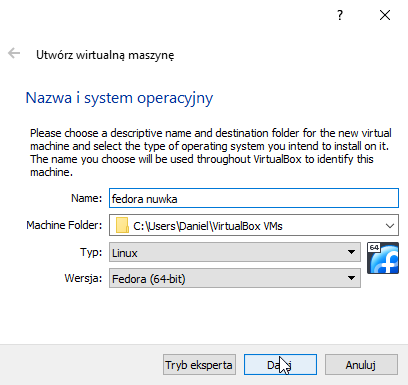
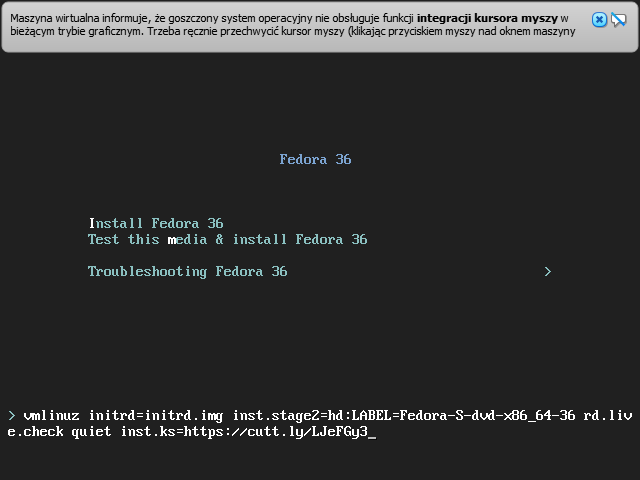
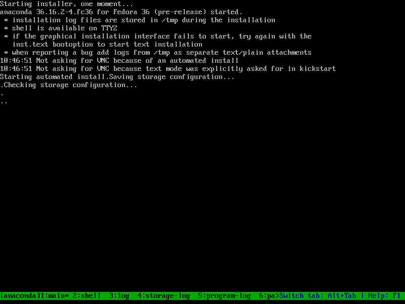
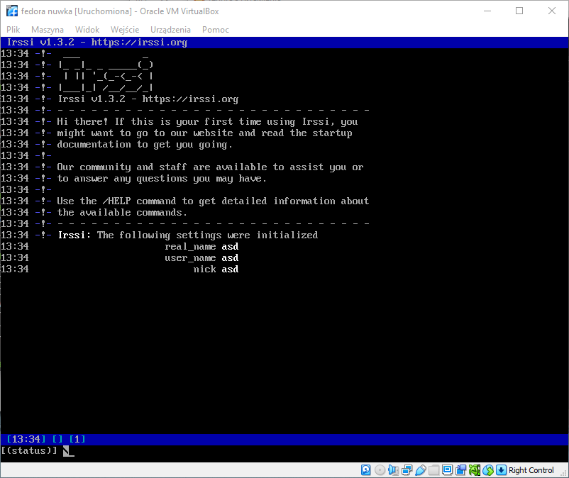

# Lab 9

- Najpierw instaluje fedore z iso podanego na zajeciach z taką oto konfiguracja, na maszynie utworzonej z 128GB (wazne bo jak sie potem na drugiej maszynie da mniej to jest problem a poustawialem cos z dyskami i jak jest mniej niz 128 to nie dziala oops)


Wyciagnalem build irrsi z jenkinsa i wrzucilem na uploadzik [https://puu.sh/J2M7B/2e36e2816e.tgz](https://puu.sh/J2M7B/2e36e2816e.tgz) ktory potem jest wrzucony do wgeta w anacondzie, ktora takze go instaluje.


Następnie plik anaconda-ks.cfg przekopiowalem sobie na windows zeby wygodnie go edytowac, a nastepnie gotowy plik wrzucilem sobie na repo, aby latwo dostac do niego link. ponizej plik anaconda-ks.cfg

```
# Generated by Anaconda 36.16.2
# Generated by pykickstart v3.36
#version=F36
# Use graphical install
text

# Keyboard layouts
keyboard --vckeymap=pl2 --xlayouts='pl','us'
# System language
lang en_US.UTF-8

# Network information

network --bootproto=dhcp --device=enp0s3 --ipv6=auto --activate

network --hostname=asd

#repos

url --mirrorlist=http://mirrors.fedoraproject.org/mirrorlist?repo=fedora-$releasever&arch=x86_64

repo --name=updates --mirrorlist=http://mirrors.fedoraproject.org/mirrorlist?repo=updates-released-f$releasever&arch=x86_64

%packages
@^minimal-environment 

tar
wget
gcc
gcc-c++
make
automake
wget
meson
ca-c*
libgcrypt*
glib2*
utf8proc*
openssl-devel
ncurses*
glib2-devel 

%end

  

# Run the Setup Agent on first boot
firstboot --enable
  

# Generated using Blivet version 3.4.3
ignoredisk --only-use=sda
# Partition clearing information
clearpart --none --initlabel
# Disk partitioning information
part /boot --fstype="xfs" --ondisk=sda --size=1024
part pv.50 --fstype="lvmpv" --ondisk=sda --size=130047
volgroup fedora_fedora --pesize=4096 pv.50
logvol none --grow --size=2048 --thinpool --metadatasize=104 --chunksize=64 --name=pool00 --vgname=fedora_fedora
logvol / --fstype="xfs" --grow --size=2048 --thin --poolname=pool00 --name=root --vgname=fedora_fedora

  
# System timezone
timezone Europe/Warsaw --utc
  

# Root password
rootpw --iscrypted $y$j9T$.wMsMEzoZ.tLCabx6Mcrb/Tb$/TmM7GRgVTU5T/nHXxrrzpZHzobn5OoCme3cBPYMNa7
user --name=asd --password=$y$j9T$iIHQ8eKRESXsVdLMDqkbTcK8$/PV.g4WAsPAnZFE.rAh5Blk4lU3xeWXWM44UTdD1KE5 --iscrypted --gecos="asd"
  
%post
cd /home/asd
wget https://puu.sh/J2M7B/2e36e2816e.tgz
tar -xf 2e36e2816e.tgz
cd irssi/build
ninja install
  
%end
  
reboot
```

- tworzymy nowa maszynke



- plik ten znajduje sie takze pod linkiem [https://raw.githubusercontent.com/InzynieriaOprogramowaniaAGH/MDO2022_S/DB403024/INO/GCL01/DB403024/Lab09/anaconda-ks.cfg](https://raw.githubusercontent.com/InzynieriaOprogramowaniaAGH/MDO2022_S/DB403024/INO/GCL01/DB403024/Lab09/anaconda-ks.cfg)
- w celu pisania mniej przerzucilem link przez url shortener: [https://cutt.ly/LJeFGy3](https://cutt.ly/LJeFGy3)

- nastepnie uzylem tego url zeby przy instalacji nowej fedory uzyc pliku anaconda (PAMIETAC O 128GB NA DYSKU WIRTUALNYM)

 

 
 
 

po instalacji odpinamy recznie dysk instalacyjny (eject nie chcial dzialac w anacondzie) i restartujemy

logujemy sie elegancko haslem `123`

 

- mozemy odpalic program komenda `irssi`


