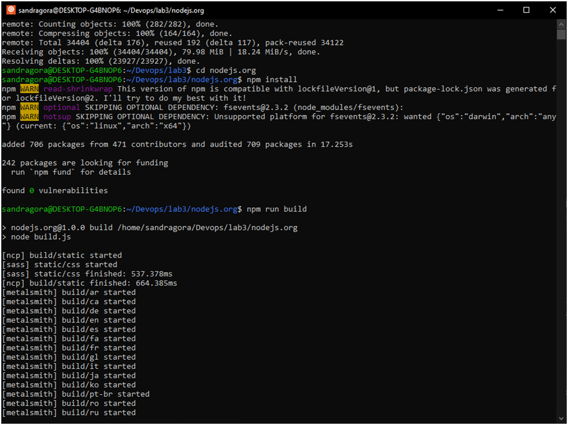
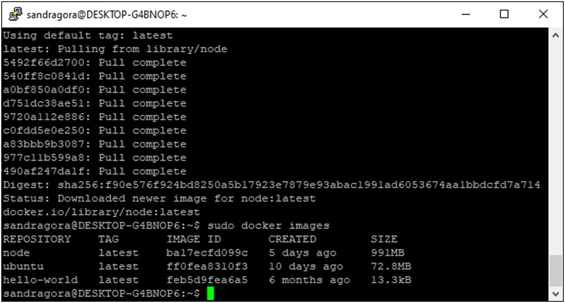
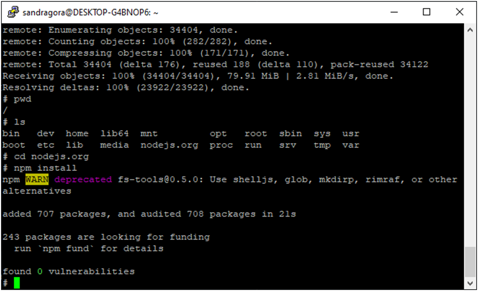
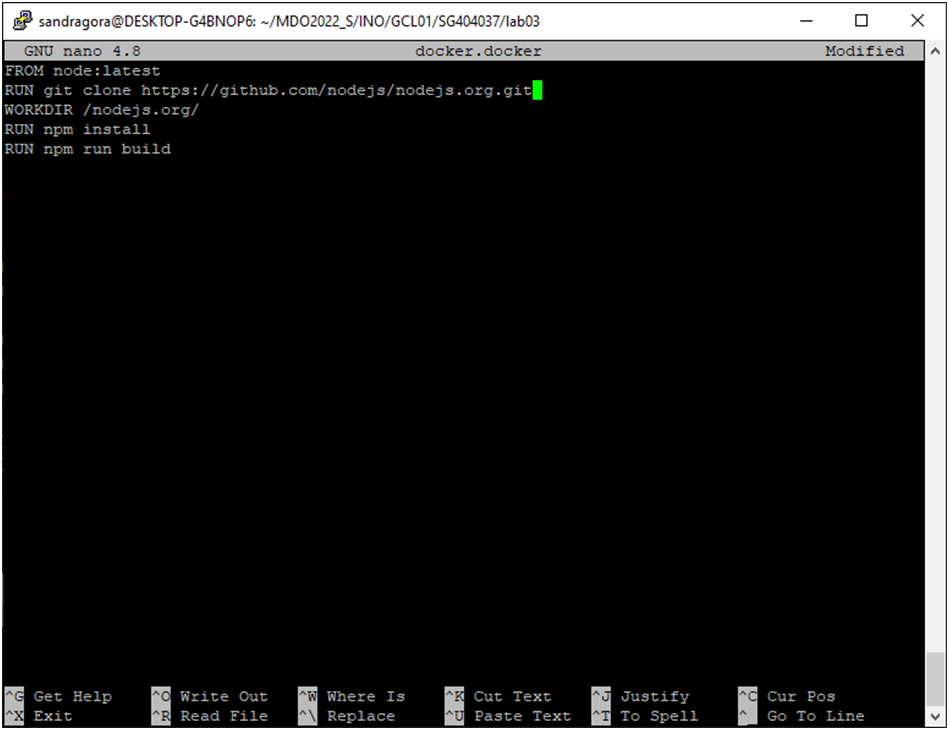
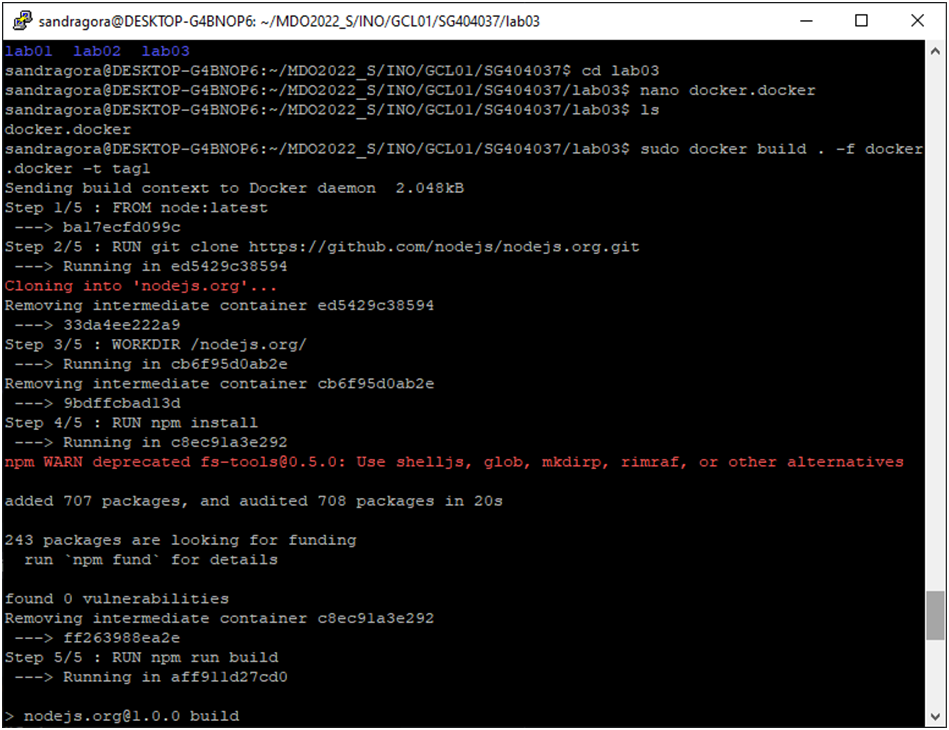
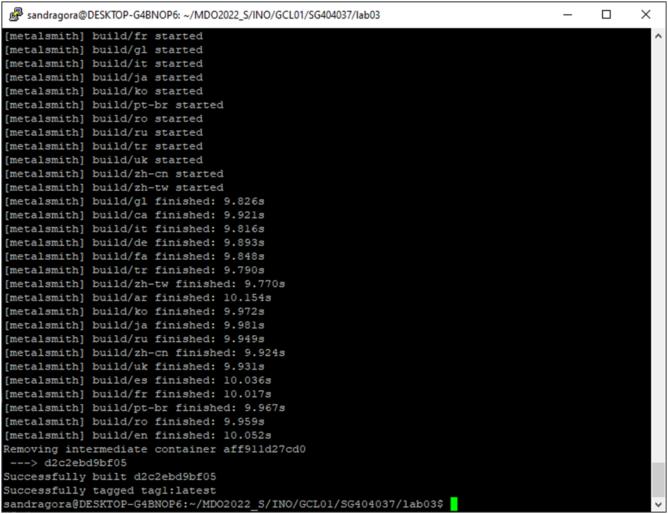
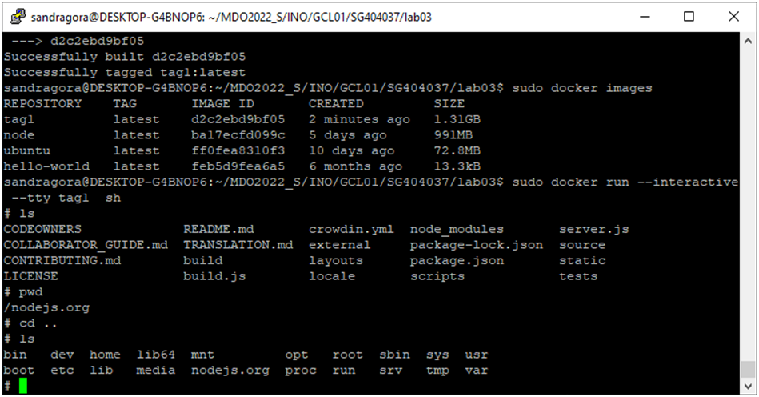
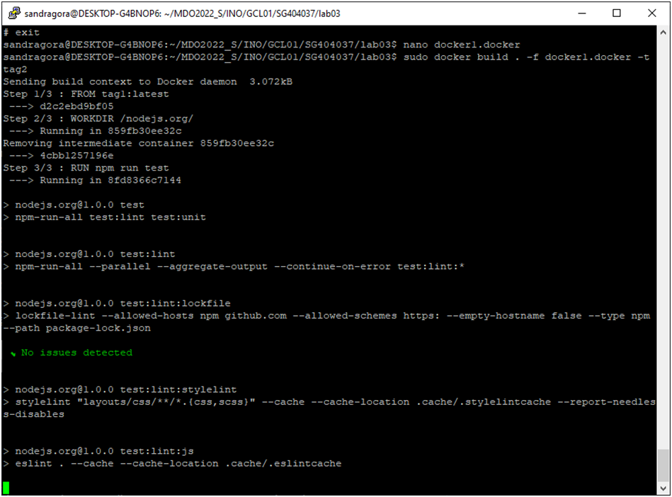
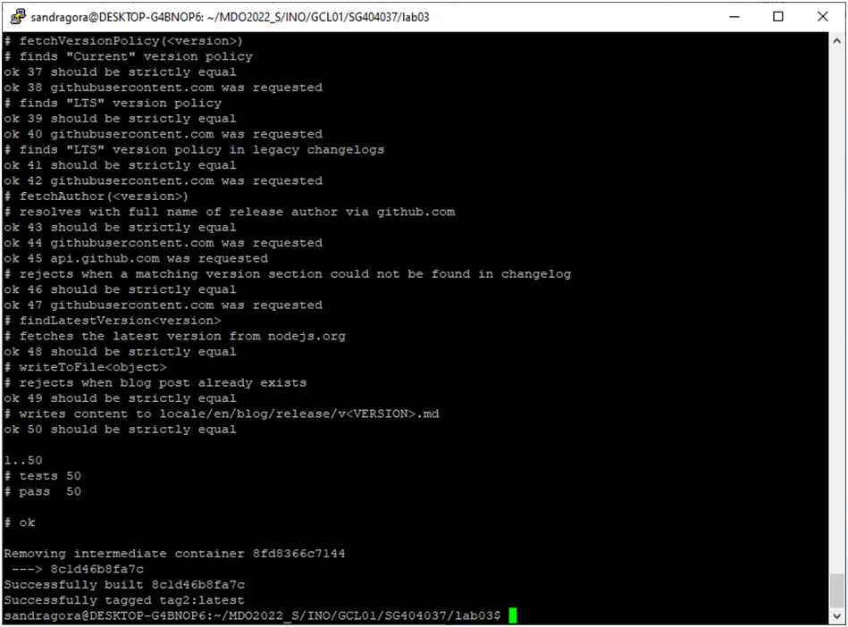
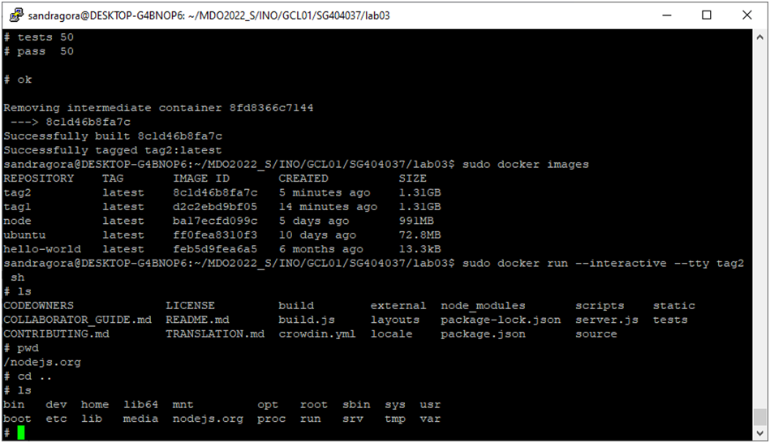

# Sprawozdanie nr 3
## DevOps – Sandra Góra – Nr albumu 404037
	
Przebieg laboratorium nr3:

1.Wybrałam repozytorium z zajeć ( to jest irris )  i sklonowałam je :
 
 
 
 
 
2. Najpierw użyłam komendy npm install , następnie npm  run build oraz run test :
 


 
3.  Następnie przeszłam do putty i  tam wykonałam następujące komendy :

```
$sudo docker pull node
```
.png)

```
$ sudo docker images
 ```

 ```
$ sudo docker run –interactive –tty node sh
 ```
 
 ```
$ npm install
```

 ```
$ npm run build
```


 ```
$ npm run test
``` 
 
 
 
 
4. Utworzyłam plik Docker, tutaj zawartość pliku :

 
5. Sprawdziłam poprawność działania tego pliku :

  
  
  
 
6. Ponownie założyłam  plik Docker1, w którym wybrany jest aktualny obraz i uruchamiane są testy jednostkowe :
7
   
7. Sprawdziłam czy poprawnie działa :
 
  
 
   

  
  
8. Wykazałam, że dany kontener hostuje strone na porcie 8080 :
 
  

9. Ostatecznie sprawdziłam historie :

  