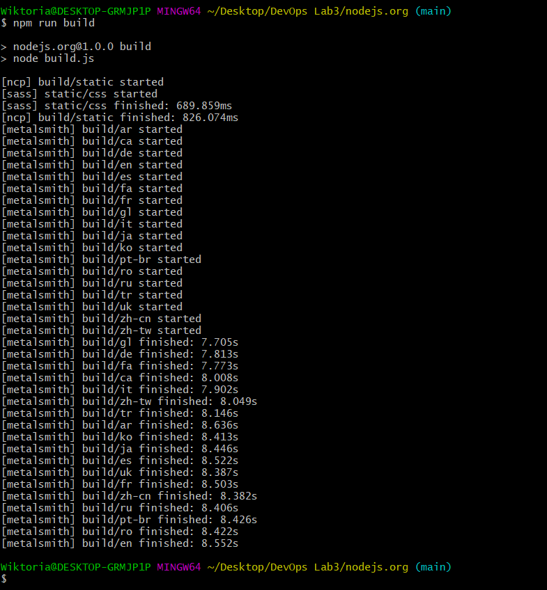
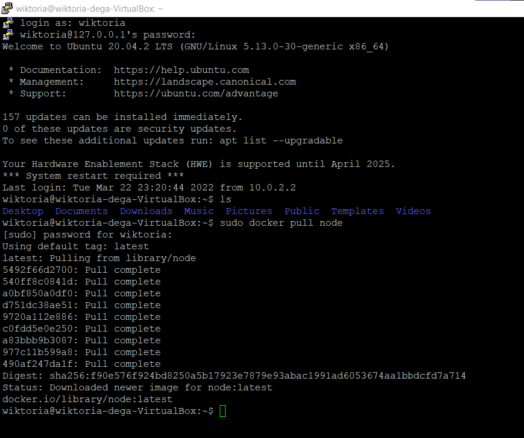
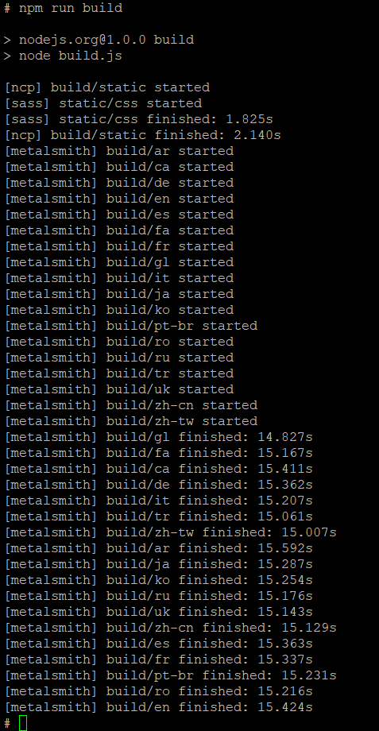
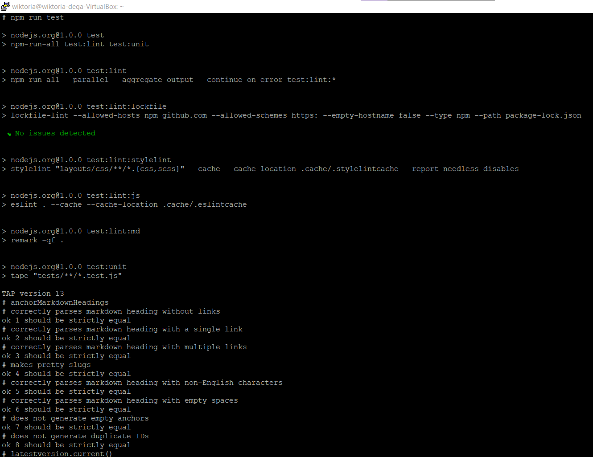
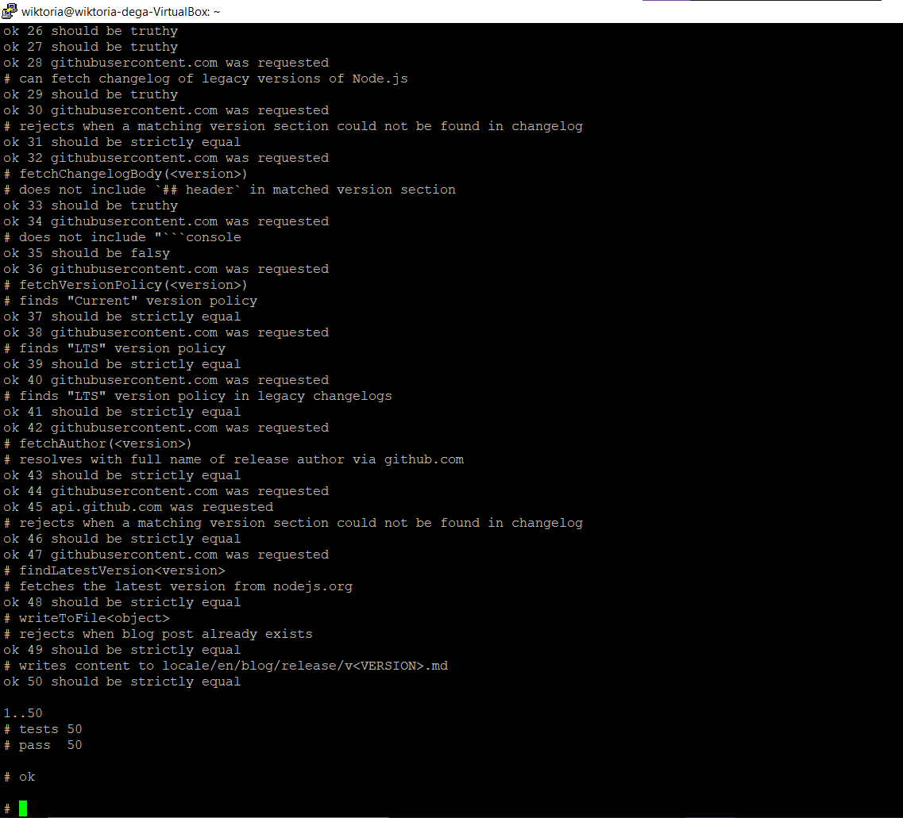
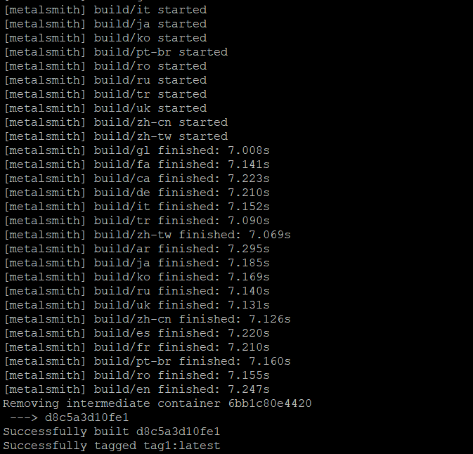
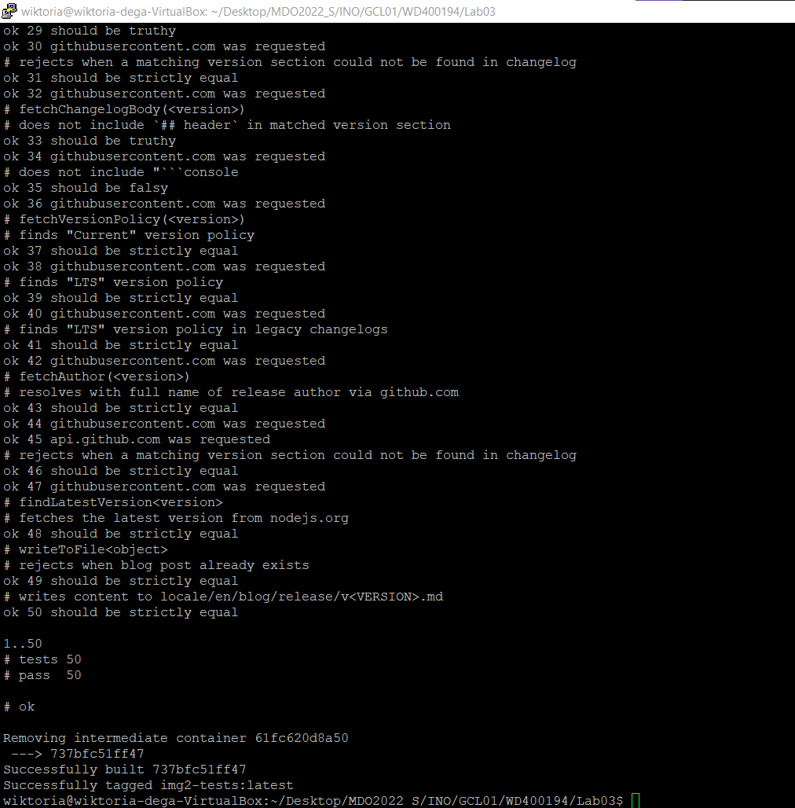
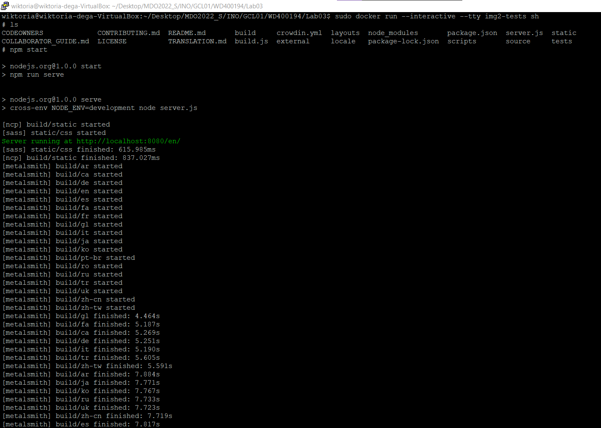

# Sprawozdanie 3
### 21.03.2022
---
Wybranym przeze mnie projektem na Github jest nodejs.org . Spełnia on wymagania określone w instrukcji do sprawozdania, tzn. ma otwartą licencję oraz zawiera testy w repozytorium.
Pierwszym krokiem w trakcie realizacji laboratoriów było sklonowanie repozytorium wybranego projektu poprzez `git clone` . Link do repozytorium: https://github.com/nodejs/nodejs.org.git


Następnie zainstalowałam wymagane zależności, po czym przeprowadziłam build programu oraz uruchomiłam testy jednostkowe z repozyroium. Wywołałam kolejno poniższe komendy:
```bash
$ npm install
```
```bash
$ npm run build
```
```bash
$ npm run test
```





Za pomocą poniższej komendy pobrałam obraz node:
```bash
$ sudo docker pull node
```



Później uruchomiłam kontener i podłączyłam sie do niego TTY celem rozpoczęcia interaktywnej pracy poprzez:

```bash
$ sudo docker run --interactive --tty node sh
```
Będąc w kontenerze, przystąpiłam do wykonania wcześniejszych kroków. Najpierw sklonowałam repozytorium. 


Następnie pobrałam potrzebne pakiety, uruchomiłam build oraz testy, w ten sam sposób jak na początku nie będąc w kontenerze.








W następnym kroku przeszłam do wykonania kolejnego podpunktu, jakim było stworzenie dwóch plików Dockerfile, automatyzujących powyższe kroki. Pierwszy z nich miał przeprowadzać wszystkie kroki do builda. 


Zawartość pierwszego pliku Dockerfile `img1-build` (`tag1`) wygląda następująco:


Dzięki `FROM` następuje wybór konkretnego obrazu, `RUN` odpowiada za klonowanie odpowiedniego repozytorium, `WORKDIR` ustawia bezwględną ścieżkę roboczą, natomiast ostatnie `RUN` powoduje uruchomienie `npm install` i  przeprowadzenie builda.

Następnie sprawdziłam poprawność działania tego pliku, używając w tym celu:
```bash
$ sudo docker build . -f dockerfile1.dockerfile -t tag1
```





Plik Dockerfile działa poprawnie. Nazwa pliku `tag1` została przeze mnie zmieniona na `img1-build` (dlatego taka też widoczna jest na ostatnim screenie).

Drugi z plików miał bazować na pierwszym oraz wykonywać testy.


Zawartość drugiego pliku Dockerfile `img2-tests` wygląda następująco:


Różni się od pierwszego pliku głównie tym, że wybierany jest aktualny obraz (utworzony wcześniej), a na końcu uruchamiane są testy jednostkowe.

W tym przypadku również sprawdziłam poprawność działania w identyczny sposób.




Plik Dockerfile działa poprawnie.


Ostatnim krokiem było wykazanie, że dany kontener hostuje stronę na porcie 8080. Dostałam się do działającego kontenera i użyłam komendy:

```bash
$ npm start
```




Następnie przejrzałam historię poprzez:
```bash
$ sudo docker ps -a
```


Można zauważyć, że wszystko przebiegło w sposób poprawny i kontenery są aktywne.

Potwierdzenie, że node.js działa na porcie 8080:


