# Sprawozdanie Lab04
### 28.03.2022
---
## Zachowywanie stanu

Na początku zaczęłam od przygotowania woluminu wejściowego oraz wyjściowego o nazwach `volin` i `volout` używając komendy `sudo docker volume create` .

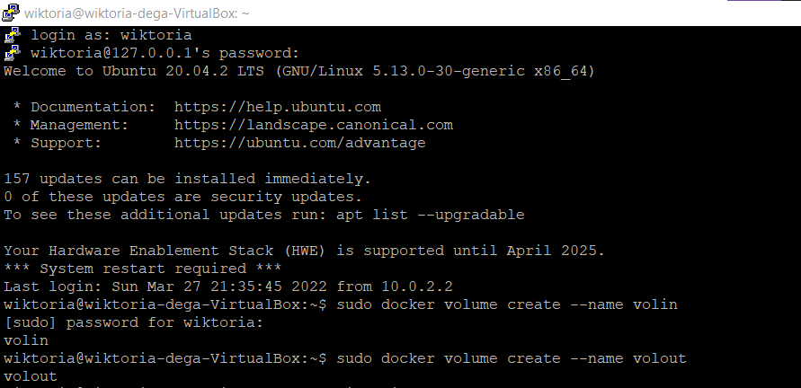

Następnie przy pomocy `sudo docker volume inspect` wyświetliłam szczegóły o obydwu woluminach (w szczególności ścieżkę, która będzie potrzebna w kolejnych krokach) .

Uruchomiłam kontener z woluminami poprzez `sudo docker run` . Wyświetliłam odpowiednie katalogi `vin` oraz `vout`, więc wykazane zostało zamontowanie ich w kontenerze.

Następnie sklonowałam repozytorium na wolumin wejściowy `volin` (wykonałam to z poziomu roota) używając `git clone` i odpowiedniej ścieżki z wcześniejszego kroku.

Będąc w kontenerze widać sklonowane repozytorium:

Pobrałam zależności za pomocą `npm install` .

Uruchomiłam build w kontenerze poprzez użycie `npm run build`.

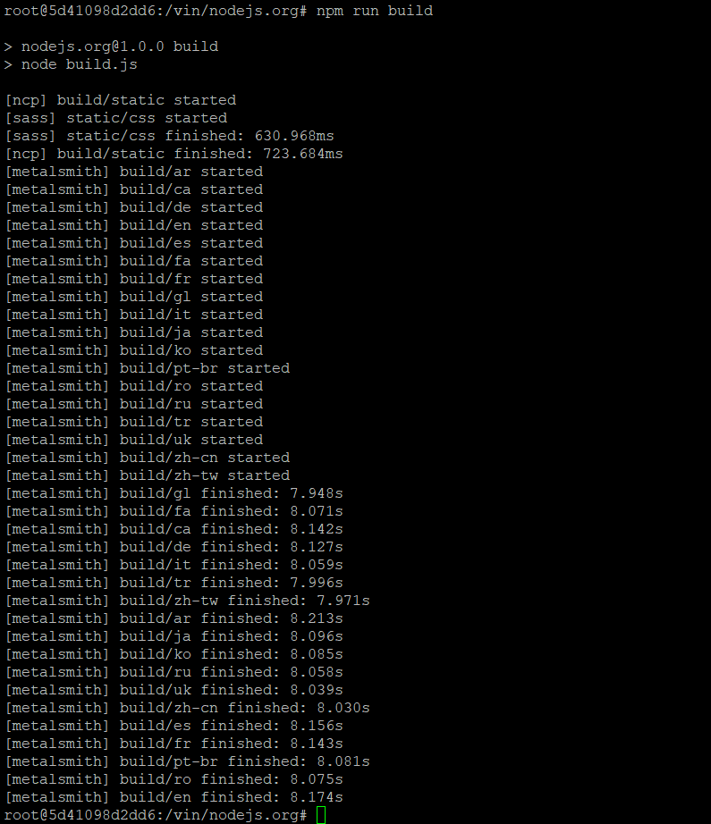

Następnie powstałe pliki zostały zapisane na woluminie wyjściowym `vout` .

## Eksponowanie portu

W następnym kroku przeszłam do uruchomienia wewnątrz kontenera serwera iperf (iperf3). Na początek jednak musiałam poszukać odpowiedniego obrazu dockerowego. Dzięki poleceniu `sudo docker pull networkstatic/iperf3` pobrałam go i następnie uruchomiłam. 

Widoczny obraz dockerowy po wpisaniu `sudo docker images`:

Sprawdziłam także, czy serwer nasłuchuje poprzez `sudo netstat` .

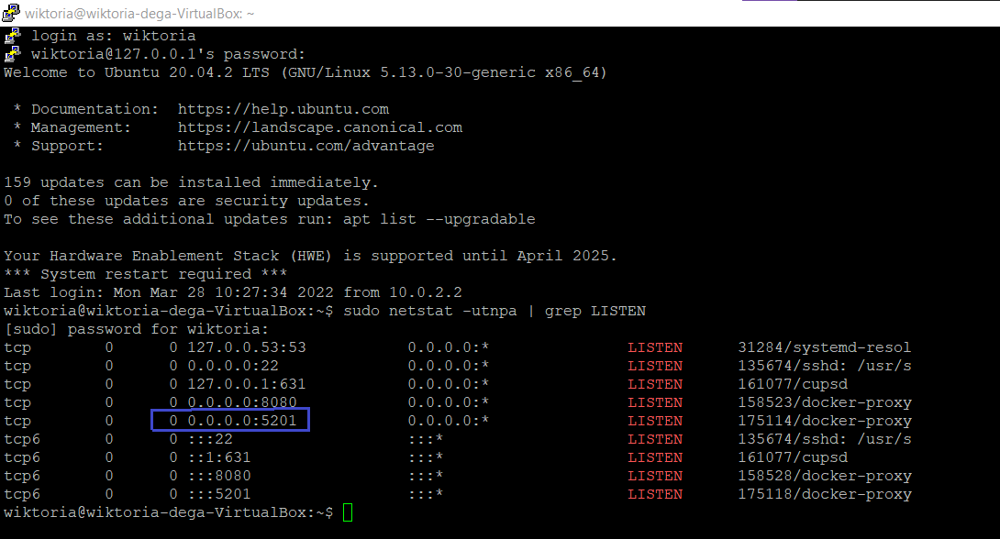

Następnie sprawdziłam IP serwera za pomocą `sudo docker inspect`.

W kolejnym kroku przeszłam do połączenia się z serwerem z drugiego kontenera. Uruchomiłam kontener podobnie jak wcześniej i określiłam działanie jako client. Połączenie zostało nawiązane.

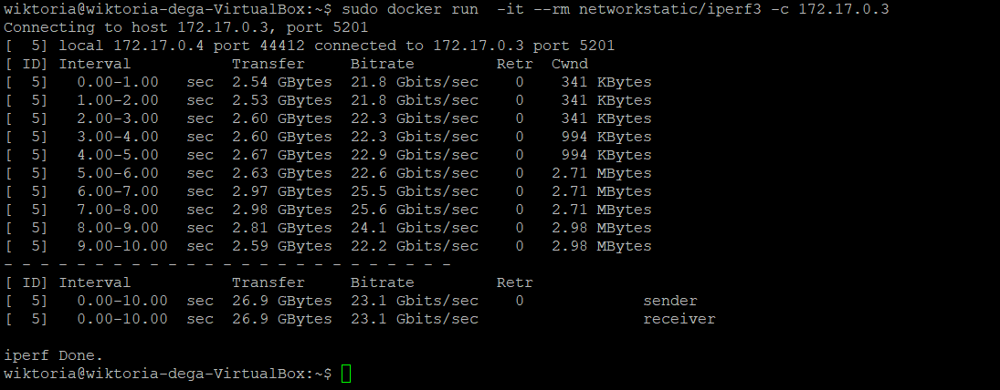

Następnie przeszłam do połączenia spoza kontenera (z hosta i spoza hosta). Najpierw jednak zainstalowałam iperf3 na hoscie za pomocą `sudo apt install iperf3` .

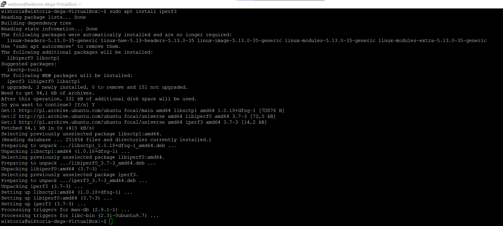

Jako pierwsze sprawdziłam połączenie z hosta.

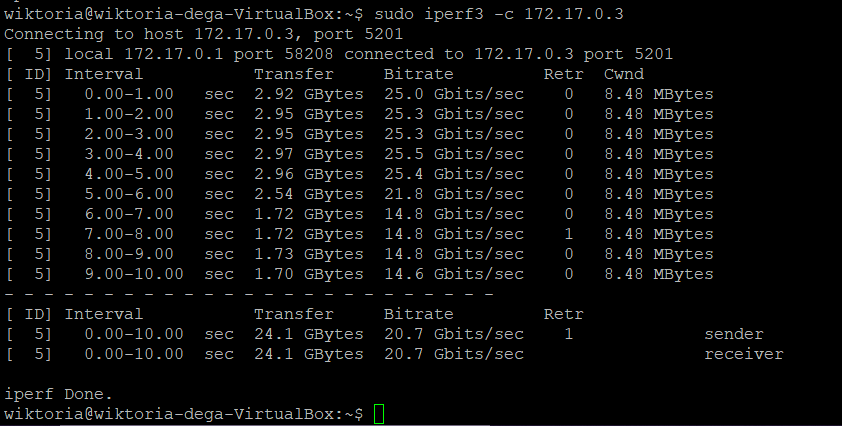

Połączenie zostało nawiązane.
Na koniec sprawdziłam połączenie spoza hosta.Przetestowałam to z mojego komputera z systemem Windows 10.

Następnie przeszłam do przedstawienia przepustowości komunikacji, poprzez wyciągnięcie logów z kontenera.

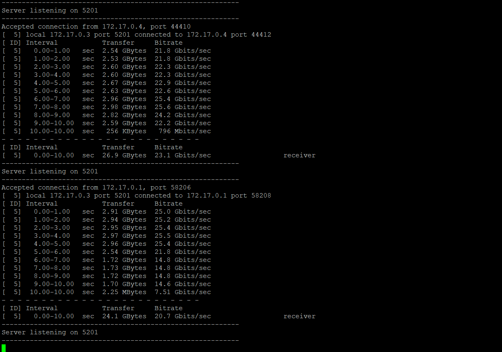

Podsumowując, największa przepustowość występowała pomiędzy jednym i drugim kontenerem. Niewiele mniejszy transfer danych występował pomiędzy hostem a kontenerem (minimalna różnica), natomiast najniższy wynik został uzyskany dla transferu pomiędzy komputerem zewnętrznym z Windowsem a kontenerem. 

## Instancja Jenkins

Najpierw zapoznałam się z dokumentacją https://www.jenkins.io/doc/book/installing/docker/ .

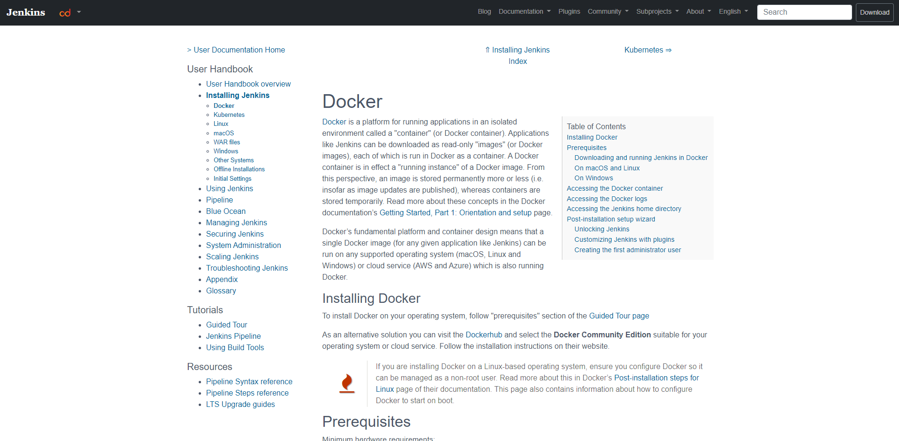

Następnie przeszłam do instalacji skonteneryzowanej instancji Jenkins z pomocnikiem DIND. Zaczęłam od utworzenia nowej sieci dockerowej przy użyciu polecenia `sudo docker network create jenkins`.

W dalszych krokach postępowałam zgodnie z poleceniami podanymi w dokumentacji. Pobrałam i uruchomiłam obraz DIND kontenera.

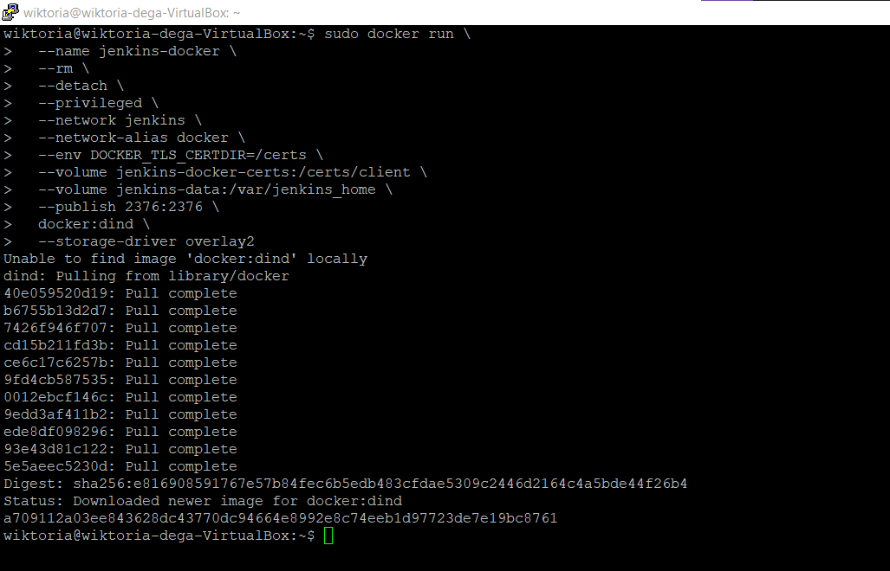

Później używając `touch` stworzyłam plik Dockerfile. `FROM` wskazuje na dziedziczenie z obrazu `jenkins/jenkins: 2.332.1-jdk11` przez kontener. `USER` wskazuje na użytkownika tj. root, natomiast `RUN` wykonuje dane polecenia w kontenerze.

Następnie uruchomiłam build przy pomocy `sudo docker build` określając za pomocą `-t` nazwę powstałego obrazu.

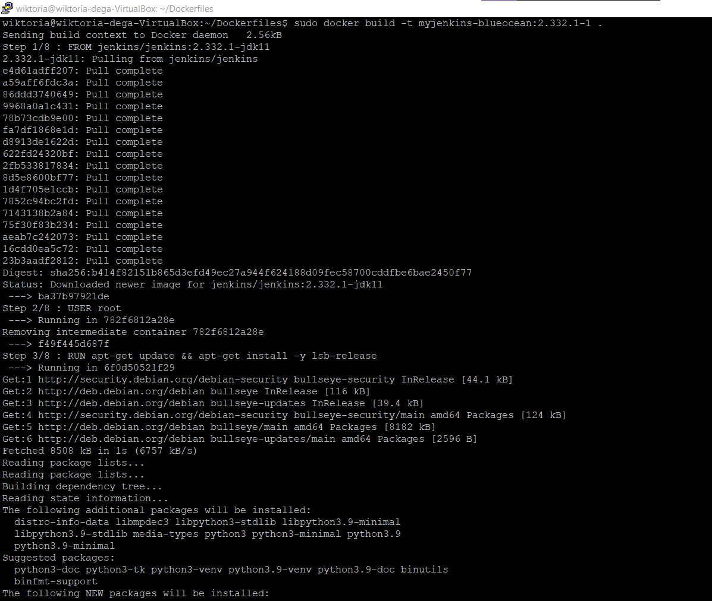

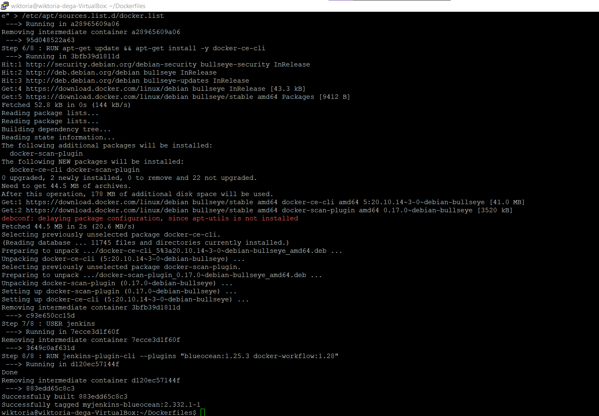

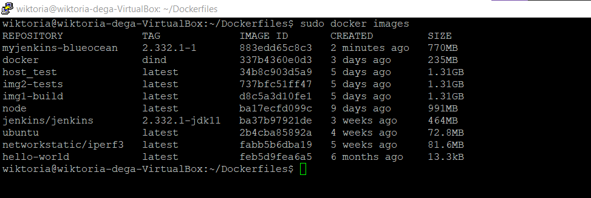

Stworzony obraz został przeze mnie uruchomiony.

Pokazałam także, że instancja Jenkinsa jest uruchomiona, wchodząc wcześniej na adres localhost:8080 .

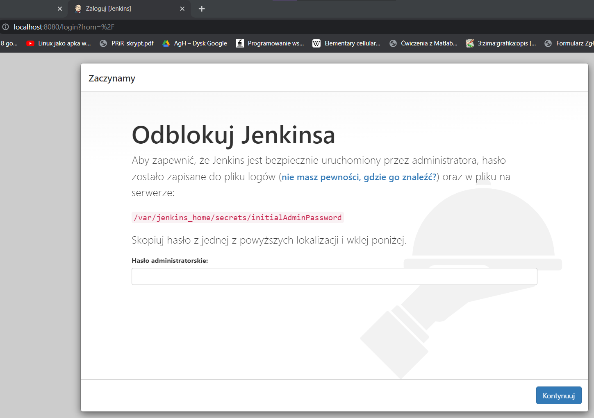

W następnym kroku odczytałam hasło. Użyłam `sudo docker exec` do uruchomienia interaktywnego terminala na kontenerze, który jest aktywny. Dzięki `cat` odczytałam hasło.

Zalogowałam się i zainstalowałam zalecane wtyczki.

Na koniec wykazałam, że kontenery działają używając polecenia `sudo docker ps` .

Zgodnie z instrukcją, pokazałam ekran logowania.

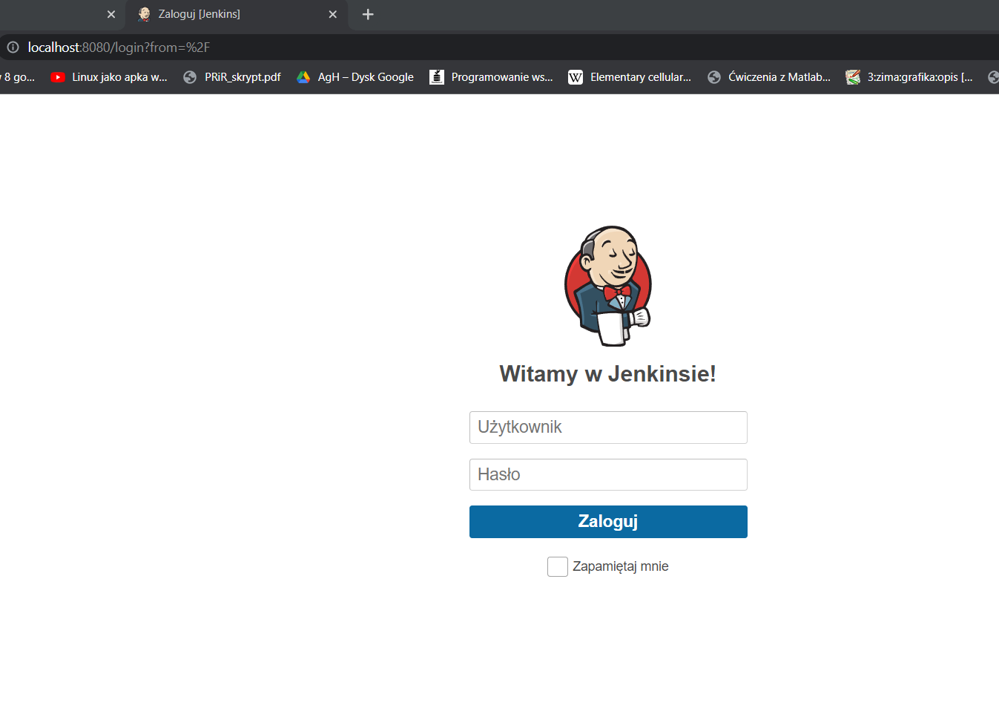

