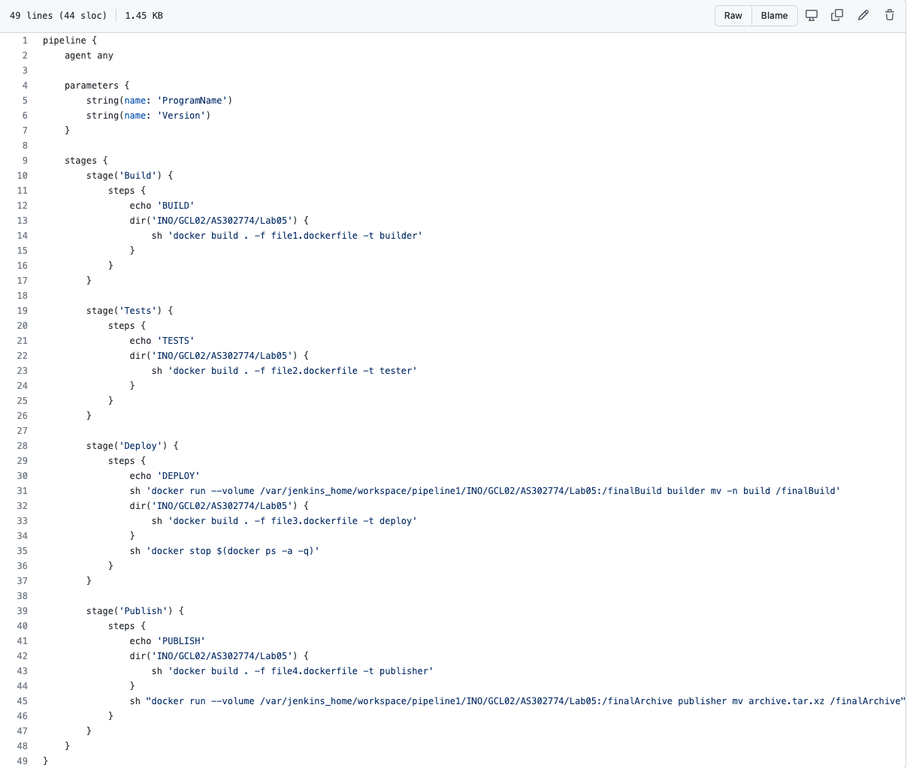
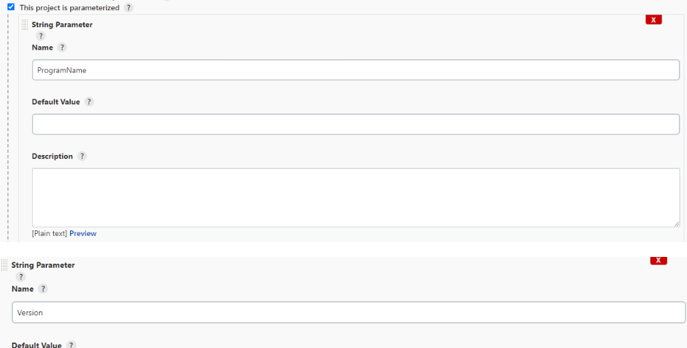
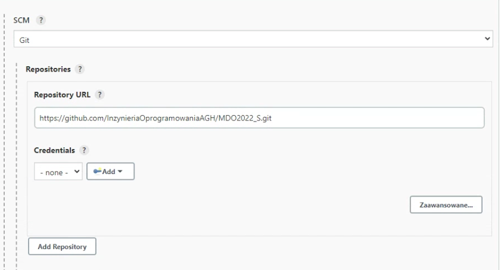
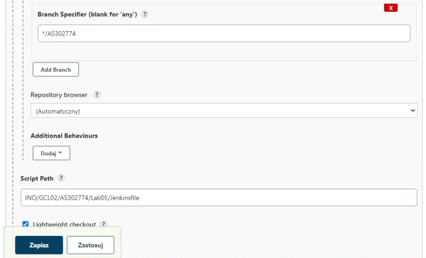
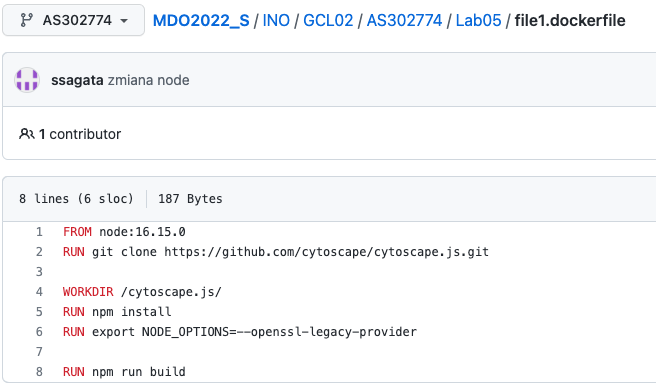
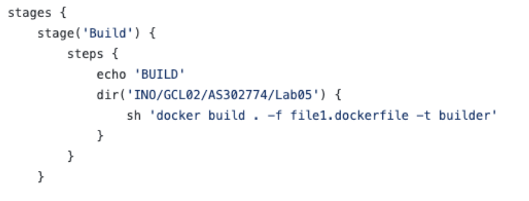
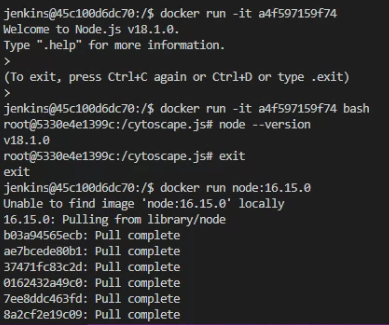
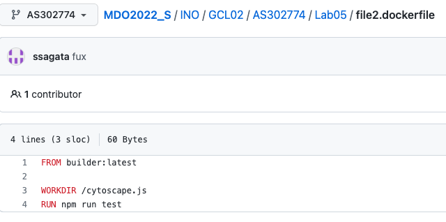
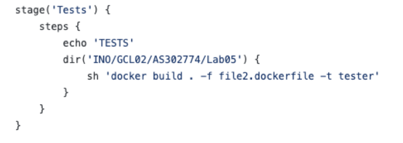

# Sprawozdanie z projektu

OPISAC CEL PROJEKTU I Zrobic streszczenie 
- dodać aargumentacjee czemu co zostało użyte 
- diagramy UML 
## Skonfigurowanie Jenkins i DIND

Instalacja Jenkinsa została wykonana zgodnie z  [dokumentacją](https://www.jenkins.io/doc/book/installing/docker/) na poprzednich zajęciach. 
Do uruchomienia kontenerów użyto komend: 

Poniżej przedstawiam screen z potwierdzenia prawidłowego działania obu kontenerów. 

## Pliki Dockerfile
Do działania projektu było potrzebne stworzenie odpowiednich plików Dockerfile. Pliki te zostały stworzone na mojej  gałęzi AS303774 w folderze Lab05. 

### file1. dockerfile - build
Pierszy plik odpowiedzialny jest za build naszego programu

### file2.dockerfile - test
Drugi dockerfile służy odpaleniu testu 

### file3.dockerfile - deploy
Trzeci plik odpowiedzialny jest już za deploy odpowiednieego pliku wykonawczego

### file4.dockerfile - publish
Ostatni plik dockerfile służy wydaniu nowego programu. Wykonano za pomocą zapakowania zawartości woluminu. 
 
### jenkinsfile

## Stworzenie Pipeline wewnątrz Jenkinsa

Aby wykonać zadanie należało wcześniej stworzyć nowu obiekt projektowy pipeline ( u mnie o nazwie pipeline1). 
Krok ten wykonano poprzez wejście na localhost:8080  i zalogowanie się na swoje konto. 
Nowemu projektowi *pipeline1* zostały nadane dwaa parametry tekstowe - **ProgramName** oraz **Version**.

Po dodaniu parametrów należało ustawić definicję pipeline na ***Pipeline script from SCM.*** 

Żeby Jenkins działał na naszym repozytorium i pobierał odpowiednie pliki Dockerfile i Jenkinsfile, należało podać ścieżkę do naszego repozytorium i naszego brancha. 

### Kroki Pipeline

1. **Build**

Obraz **builder** tworzymy na podstawie obrazu **node**. 
Za ten krok odpowiedzialny jest wcześniej wspomniany plik file1.dockerfile oraz część kodu w Jenkinsfile. 
Dockerfile zawiera w sobie sklonowanie repozytorium z naszym projektem, następnie przechodząc do folderu z projektem instalowany jest npm `npm install` oraz tworzone zbuildowane pliki   - `npm run install`. 

W tym kroku pojawiły się problemy, dlatego zmieniono wersję node z 18 na 16. 
W tym celu w konsoli w Jenkinsie, za pomocą komendy `docker run nod:16.15.0`zmieniono wersję node. 

2. **Test**
Obraz **test** tworzony jest na podstawie obrazu **builder** z poprzedniego kroku. 
Test odpowieada za przeprowadzenie testów sprawdzających odpowiednie działanie programu. 

3. **Deploy**
Do tego kroku potrzebne było wykonanie kroku **build**, dzięki któremu otrzymaliśmy zbuildowane pliki programu. 

Krok **deploy** krok po kroku: 

- uruchomienie obrazu buildera z woluminem znajdującym się w Jenkinsie razem ze sklonowanym repozytorium 
- stworzenie obrazu deploy 
- w pliku dockerfile .....

4. **Publish**
Ostatnim krokiem było wypromowanie nowego wydania programu. 
Krok ten został wykonany drogą alternatywną, czyli zawrtość woluminu spakowano do pliku TAR.XZ a następnie odpalono obraz publish. 

