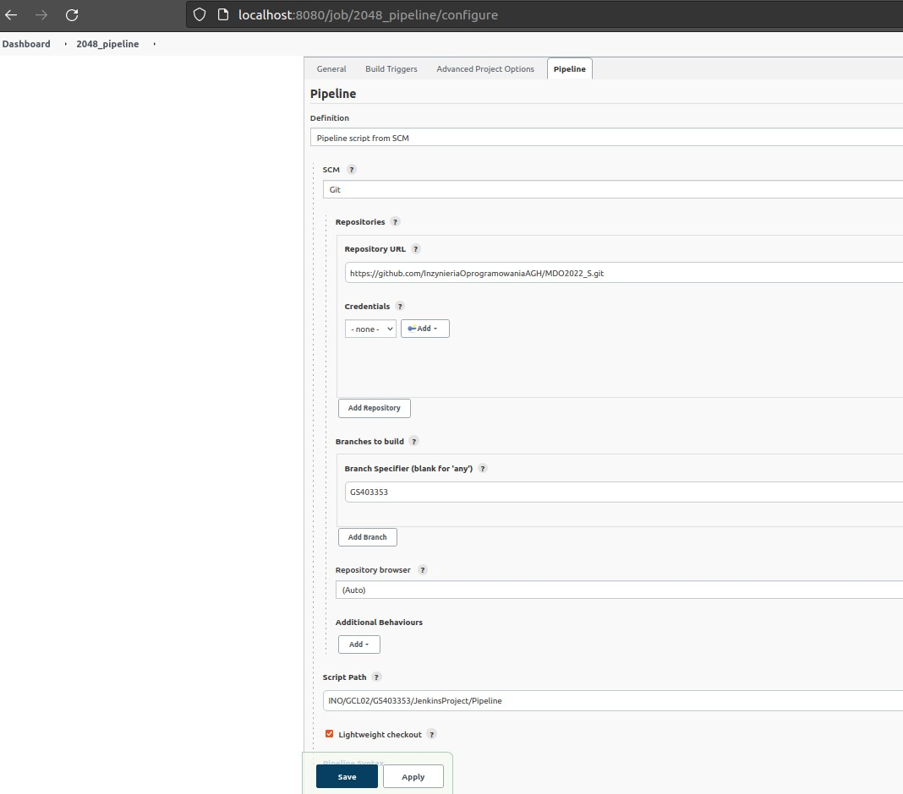
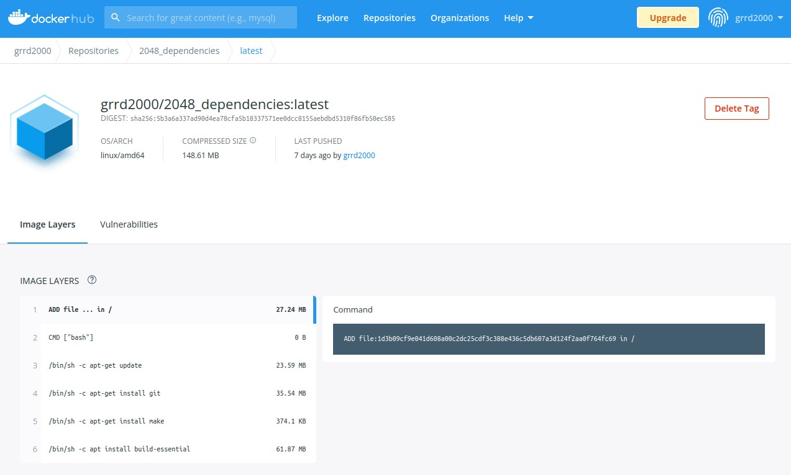

# Sprawozdanie - lab_05-lab_07, lab_09
## Gerard Skomin - 403353
___
#### Celem projektu jest skonfigurowanie środowiska, a następnie utworzenie pełnego pipeline'a zawierającego rozdzielone kroki: Build, Test, Deploy oraz Publish. W dokumentacji projektu zawierają się wszystkie kroki od momentu zklonowania repozytorium z platformy GitHub, aż do utworzenia funkcjonalnego instalatora programu. Konteneryzacja przebiega w Dockerze, który zapewnia wszystkie potrzebne funkcjonalności.
### Środowisko Jenkins & Docker-In-Docker
Miejscami obsługującymi życie pipeline'u będą kontenery Jenkins oraz Docker-In-Docker (DIND). Konfiguracja kontenerów przebiegła zgodnie z instrukcjami dostawcy oprogramowania, korzystając z następujących komend:  
* DIND  
```groovy
docker run \
  --name jenkins-docker \
  --rm \
  --detach \
  --privileged \
  --network jenkins \
  --network-alias docker \
  --env DOCKER_TLS_CERTDIR=/certs \
  --volume jenkins-docker-certs:/certs/client \
  --volume jenkins-data:/var/jenkins_home \
  --publish 2376:2376 \
  docker:dind \
  --storage-driver overlay2
```
* Jenkins  
```groovy
docker run \
  --name jenkins-blueocean \
  --restart=on-failure \
  --detach \
  --network jenkins \
  --env DOCKER_HOST=tcp://docker:2376 \
  --env DOCKER_CERT_PATH=/certs/client \
  --env DOCKER_TLS_VERIFY=1 \
  --publish 8080:8080 \
  --publish 50000:50000 \
  --volume jenkins-data:/var/jenkins_home \
  --volume jenkins-docker-certs:/certs/client:ro \
  myjenkins-blueocean:2.332.2-1 
```
Dowodem pomyślnego uruchomienia kontenerów jest zastosowanie komendy ``docker ps`` w konsoli maszyny wirtualnej. Na screenie widać dwa uruchomione kontenery.  

  
### Pipeline
Konfiguracja nowego obiektu projektowego "**2048_pipeline**" przebiegła w sposób widoczny na poniższym screenie.  
W polu *Definition* wybrane zostało pole ``Pipeline from SCM``, które wydawało się najwygodniejszą opcją. Kolejnymi krokami był oczywisty wybór ``Git'a``, a następnie uzupełnienie pola ``Repository URL`` repozytorium kierunkowym. Kolejno, wybrano odpowiedniego *branch'a* ``GS403353``. Ostatecznym krokiem było uzupełnienie ścieżki, w której znajdują się odłożone pliki typu ``Dockerfile`` oraz plik ``Jenkinsfile``.  

  

Pliki, do których ścieżka podana jest przy konfiguracji pipeline'a znajdują się w katalogu *GS403353/JenkinsProject*, oraz widoczne są na poniższym screenie.  

  

#### Build  
W celu przeprowadzenia kroku **Build** pipeline'a potrzebne było wykonanie następujących czynności:  
* Zaprojektowanie pliku dockerfile z niezbędnymi do zbudowania programu dependencjami:  
    ```
    FROM ubuntu:latest
    
    RUN apt-get update  -y
    RUN apt-get install git -y
    RUN apt-get install make -y
    RUN apt install build-essential -y
    ```
  Jest to obraz oparty o ``ubuntu:latest`` doinstalowujący zależności obsługujące kompilację programu w **języku C**. Wybrano takie rozwiązanie ze względu na sprowadzenie obsługi wdrażania do minimum (biorąc na uwagę minimalizację rozmiaru, lecz również przejrzystość rozwiązania).  

* Utworzony został własny **publiczny obraz na DockerHub'ie** oparty o powyższy plik ``Dependencies.dockerfile`` widoczny na poniższym zrzucie ekranu:  

    

* Na następującym listingu Jenkinsfile'a widoczny jest fragment odpowiedzialny za **build**. Tworzony w nim jest obraz ``build`` po przejściu do odpowiedniego katalogu (*dir*):  
  ```groovy
  stages {
         stage('Build') {
             steps {
                 echo 'BUILD'
                 dir('INO/GCL02/GS403353/JenkinsProject') {
                     sh 'docker build . -f Build.dockerfile -t builder'
                 }
                 echo 'BUILD COMPLETED'
             }
         }
  ```
* Poniżej ``Build.dockerfile`` korzystający z utworzonego wcześniej obrazu z dependekcjami ``grrd2000/2048_dependencies:latest``, w którym następuje zklonowanie repozytorium projektu 2048, przejście do odpowiedniego katalogu i wywołanie ``make'a``:  
  ```
  FROM grrd2000/2048_dependencies:latest
    
  RUN git clone https://github.com/mevdschee/2048.c.git
  WORKDIR /2048.c/
    
  RUN make
  ```
  Utworzony w ten sposób zostaje gotowy do wywołania i testowania **plik binarny** ``2048``.  
#### Tests
Testy są udostępnione bezpośrednio w zklonowanym repozytorium. Jest ich 13, przy poprawnym ich przeprowadzeniu wyświetlana jest jednoznaczna linijka tekstu.  
* Analogiczny do kroku z build'em krok ``Test`` w pliku Jenkinsfile:  
  ```groovy
  stage('Test') {
            steps {
                echo 'TEST'
                dir('INO/GCL02/GS403353/JenkinsProject') {
                    sh 'docker build . -f Test.dockerfile -t tester'
                } 
                echo 'TESTS COMPLETED' } 
             }
  ```
* Dockerfile **korzystający z poprzedniego obrazu builder'a** (potrzebna nam 'binarka') z włączanymi testami z pliku ``Makefile`` projektu komendą ``make test``:  
    ```
    FROM builder:latest

    WORKDIR /2048.c/

    RUN make test
    ```
#### Deploy  
Krok ``Deploy`` ma na celu uruchomienie zbudowanego i przetestowanego programu w przemyślanym, przeznaczonym do niego środowisku. W tym przypadku wystarczającym środowiskiem jest obraz ``ubuntu:latest``.  
* Poniżej widoczny jest fragment Jenkinsfile odpowiedzialny za krok ``Deploy``. Wykonuje komendę ``docker run``, przy której następuje przeniesienie pliku binarnego, potrzebnego w późniejszych czynnościach.   
  ```groovy
  stage('Deploy') {
          steps {
              echo 'DEPLOY'
              sh 'docker run --volume /var/jenkins_home/workspace/2048_pipeline/INO/GCL02/GS403353/JenkinsProject:/build builder mv -n /2048.c/2048 /build'
              dir('INO/GCL02/GS403353/JenkinsProject') {
                  sh 'docker build . -f Deploy.dockerfile -t deploy'
              }
              echo 'DEPLOY COMPLETED'
          }
  }
  ```  
* Dockerfile wykorzystywany w tym kroku. Korzysta tylko z obrazu ``ubuntu:latest``. Dodatkowo, wykorzystany jest do przeniesienia 'binarki' do */usr/bin/* odpowiedniego dla takich plików. Dzięki komendzie ``CMD`` program ``2048`` jest uruchamiany, a jego działanie kończy się, gdy pipeline przechodzi do kolejnych czynności.  
    ```
    FROM ubuntu:latest

    COPY ./2048 /usr/bin/
    CMD ["/usr/bin/2048"]
    ```
#### Publish
Ostatnim krokiem jest ``Publish``, czyli odpowiednia dla programu publikacja. Tworzony jest instalator paczki ``deb`` obarczony skryptem po-inastalacyjnym wykonywującym czynności zdogdne z charakterem projektu. Dodatkowo, gotowa paczka, w swojej nazwie zawierać będzie nazwe wersji programu.  
* Do skryptu Jenkinsfile dołączone zostają parametry ``PROMOTE`` będący 'checkbox'em' decydującym czy wydanie programu zasługuje na publikację, oraz parametr ``VERSION``, *string* przetrymujący odpowiednią 'nazwę' wersji.  
  ```groovy
  pipeline {  
      agent any
      parameters {
          booleanParam(name: 'PROMOTE')
          string(name: 'VERSION')
      }
  ```
* Poniższy screen przedstawia sposób wykorzystania powyżej zaprojektowanych parametrów:  

    

* Poniżej widnieje fragment Jenkinsfile'a obsługujący krok ``Publish``. Użyto wyrażenia ``when`` w celu wyjścia z *stage'a*, gdy parametr ``PROMOTE`` nie jest zaznaczony. Następnie, uruchamiany jest ``Publish.dockerfile``, a w kolejnej linijce w ``docker run`` przekazywany jest parametr wyrażeniem ``-e VERSION``.  
  ```groovy
  stage('Publish') {
      when {
            expression {
                params.PROMOTE == true
            }
      }
      steps {
            echo 'PUBLISH'
            dir('INO/GCL02/GS403353/JenkinsProject') {
                sh 'docker build . -f Publish.dockerfile -t publisher'
                sh 'docker run -e VERSION --volume /var/jenkins_home/workspace/2048_pipeline/INO/GCL02/GS403353/JenkinsProject:/archive publisher'
            }
            echo 'PUBLISH COMPLETED'
      }
  }
  ```
* Dockerfile obsługujący krok Publish oparty jest na bazie builder'a. Tworzy odpowiednią dla instalatora chierarchię katalogów, a kolejno przenosi do nich plik binarny oraz plik ``2048.desktop`` obsługujący skrót aplikacji. Kolejno, do pliku ``control`` wklejany jest skrypt obsługujący instalację, oraz plik ``postinst`` przenoszący rozpakowane pliki do odpowiednich katalogów. Krok ten jest istotny dla osiągnięcia założeń funkcjonowania programu, analogicznych dla tego typu aplikacji w systemie ``Linux`` (*efekt takiego działania pokazany jest pod koniec dokupentacji projektu*). Ostatecznym krokiem jest spakowanie plików do paczki przy pomocy ``dpkg-deb`` i nadanie odpowiedniej nazwy korzystając z przekazanego parametru ``VERSION``.  
  ```
  FROM builder:latest
  
  RUN mkdir -p 2048_package
  RUN mkdir -p 2048_package/DEBIAN
  RUN mkdir -p 2048_package/usr/bin
  
  RUN mv 2048.desktop 2048_package/usr/bin/
  RUN mv 2048 2048_package/usr/bin/
  
  RUN echo "Package:2048\n\
  Version: 0.1 \n\
  Maintainer: grrd2000 \n\
  Architecture: all \n\
  Description: 2048 the game package" > 2048_package/DEBIAN/control
  
  RUN echo "#!/bin/bash\n\
  if [ "$1" = configure ]; then\n\
      mv 2048.desktop /usr/share/application\n\
      mv 2048 /usr/games\n\
  fi" > 2048_package/DEBIAN/postinst
  RUN chmod 0755 2048_package/DEBIAN/postinst
  
  CMD ["/bin/bash", "-c", "dpkg-deb --build 2048_package && mv 2048_package.deb 2048_package_${VERSION}.deb && mv 2048_package_${VERSION}.deb /archive"]
  ```
* Skonfigurowanie paczki bez pliku ``postinst`` nie przyniosło oczekiwanego działania - utworzenia ikonki oraz uruchomienia programu po kliknięciu. Repozytorium programu umożliwiło wykorzystanie pliku ``2048.desktop`` widocznego poniżej.  
  ```
  [Desktop Entry]
  Name=2048
  Comment=Add values sliding tiles until you reach 2048
  Comment[es]=Alcanza el 2048 deslizando y sumando teselas
  Exec=sh -c '/usr/games/2048;echo;echo PRESS ENTER TO EXIT;read line'
  Icon=2048
  Terminal=true
  Type=Application
  Categories=Game;LogicGame;
  Keywords=2d;math;colour;single-player;
  ```
### Wyniki pipeline'a i efekt działania  
* Pipeline po całkowitym przejściu kroków (wraz z krokiem Publish) nie napotkał żadnych problemów. Ostateczny ``Build with Parameters`` ukończył działanie w następujący sposób:  
 
    

* Odpowiednie przeniesienie plików konfiguracyjnych programu ``2048`` powoduje pożądane pojawienie się ikonki w sekcji **Applications**, gdzie widnieje też program ``Pacman``.  

    

* Dzięki takiemu zastosowaniu aplikacja uruchamia się w konsoli kliknięciu. W przeciwnym przypadku koniecznym było manualne uruchomienie gry w konsoli.  

    

### Podsumowanie i napotkane problemy
* Całość konfiguracji środowiska oraz projekt pipeline'a przebiegł dosyć intuicyjnie. Wpływ na to na pewno miała prostota programu oraz znikoma ilość potrzebnych zależności.  
* Napotkane utrudnienia:
  * Instalacja Jenkinsa nie była w stanie doinstalować podstawowych pluginów w moim środowisku pracy, przez co nie jestem w stanie obrazowo zilustrować pomyślność przejścia wszystkich kroków pipeline'a.  
  * Niestety katalog główny projektu jak i gra mają takie same nazwy co w wielu momentach projektówania różnych kroków spowodowało zamęt...
  * Utworzenie zwykłej paczki z pojedynczym umieszczonym plikiem binarnym nie była satysfakcjonująca, a pożądana przez instalator hierarchia plików oraz kod pliku ``postint`` przytworzyło wiele błędów podczas kroku Publish.

