# Sprawozdanie - lab_09
## Gerard Skomin - 403353
___
### 1. Przygotowanie systemu  
* Instalację systemu rozpoczęto poprzez pobranie obrazu `Fedora Server 36` z linku: https://download.fedoraproject.org/pub/fedora/linux/releases/test/36_Beta/Server/x86_64/iso/Fedora-Server-netinst-x86_64-36_Beta-1.4.iso    
* W programie `Oracle VM Menager` utworzona została nowa wirtualna maszyna, do której podpięto pobrany obraz  
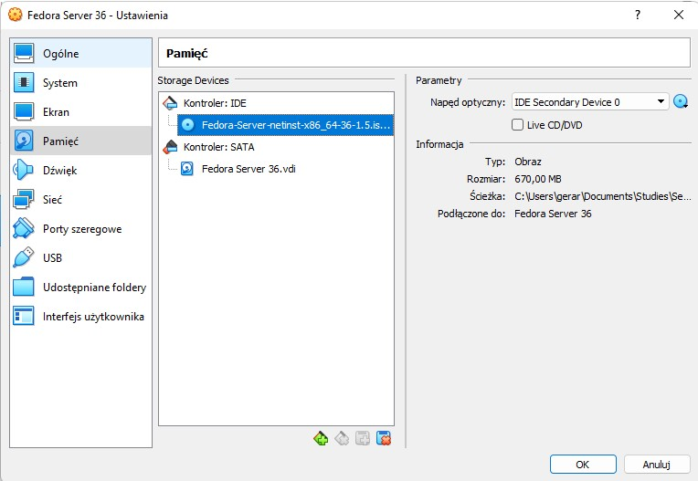  
* Po uruchomieniu instalacji z interfejsem graficznym dokonano następujących konfiguracji:  
  * Dodano język polski klawiatury  
    
  * Dokonano edycji ustawień `Manual Partitiooning`  
  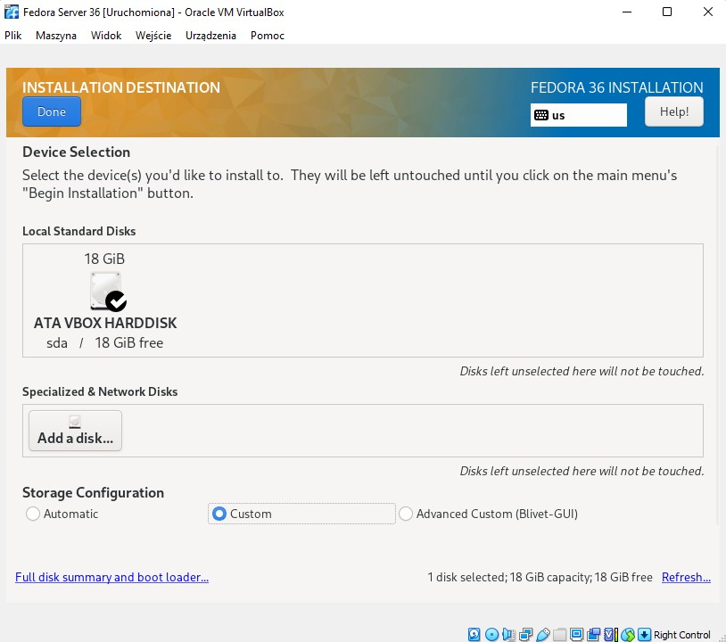  
  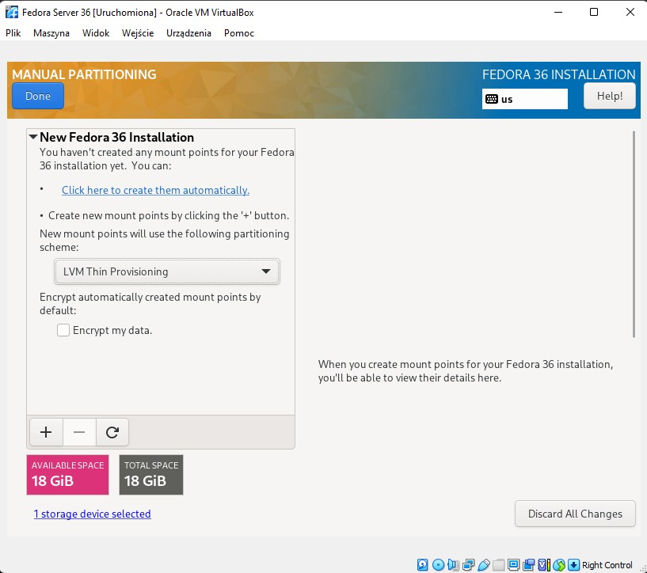  
  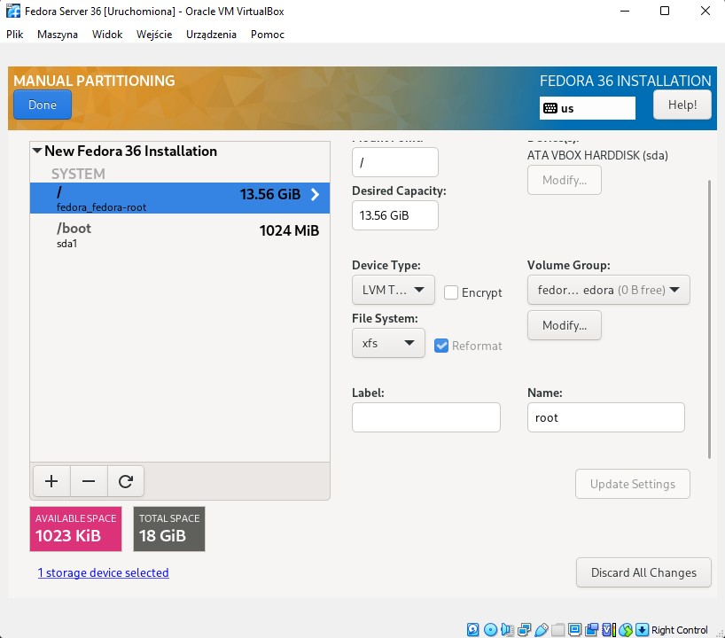  
  * Dodano `Root Account`  
  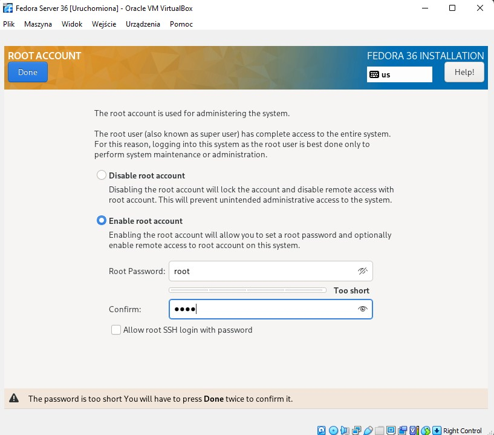  
  * Dodano standardowego 'user'a'  
  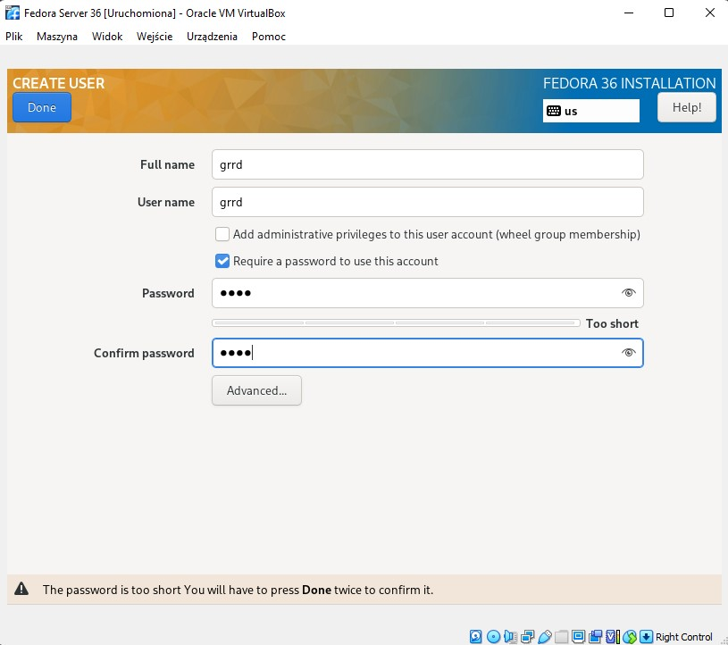  
  * Z opcji instalacji oprogramowania na maszynę wybrano opcję `Minimal Install`  
    
  * Dodano `Host Name`  
  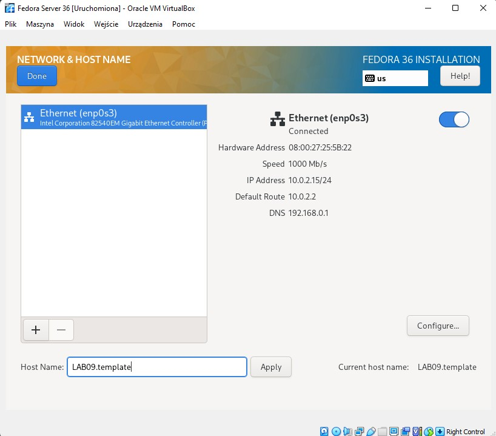  
* Po powyższych zmianach uruchomiono instalację systemu  
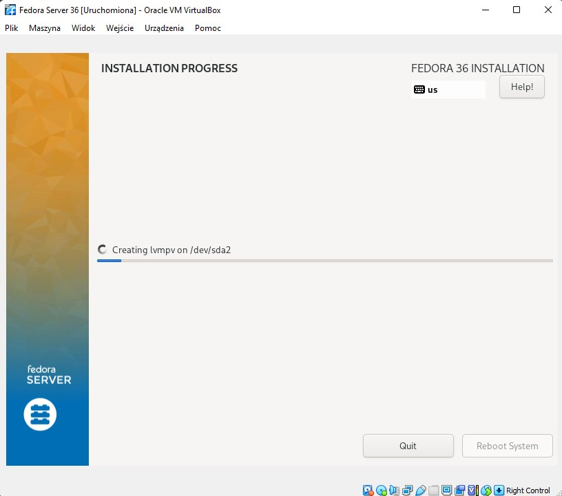  
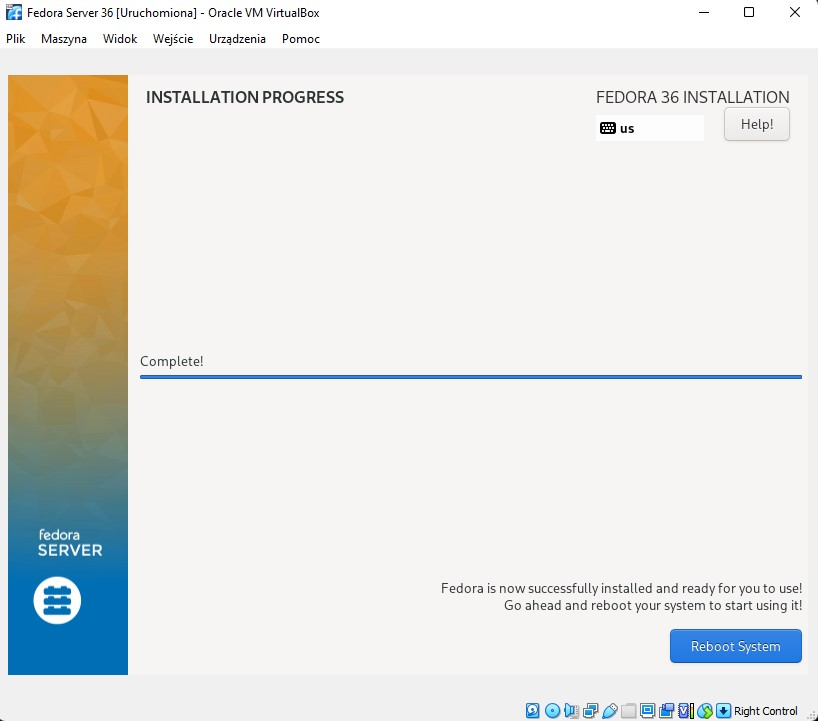  

### 2. Instalacja systemu z pliku odpowiedzi  
* W celu zainstalowania systemu korzystającego z utworzonego pliku odpowiedzi wpierw artefakt (plik binarny) umieszczony został na postawionym serwerze `Apache` w następujący sposób  
  * Instalacja pakietów `httpd` przy pomocy komendy `dnf install httpd` oraz `dnf group install "Web Server"`  
  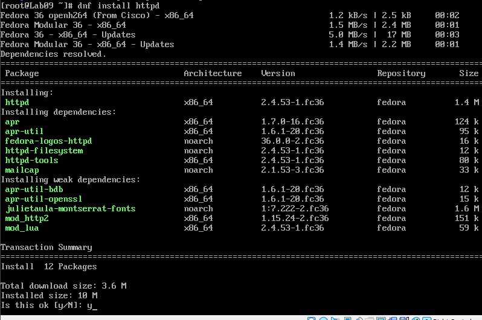  
  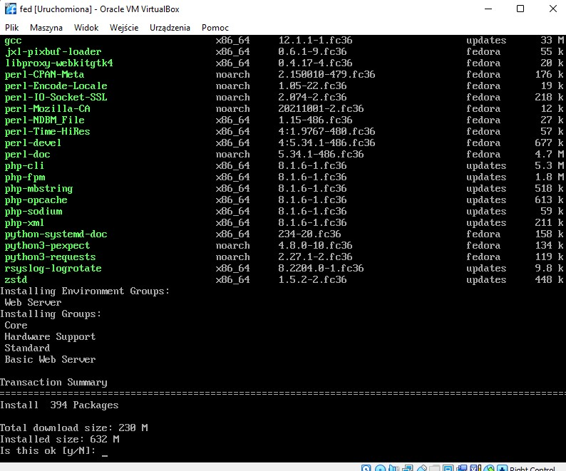  
  * Uruchomienie i aktywacja servera używając komend `systemctl start httpd` oraz `systemctl enable httpd`, następnie konfiguracja firewall'a komendami `firewall-cmd --add-service=http --add-service=https --permanent` i `firewall-cmd --reload`  
    
  * Przeniesienie artefaktu do odpowiedniego katalogu w hierarchii  
    
    
  * Odczytanie adresu IP komendą `ifconfig`  
  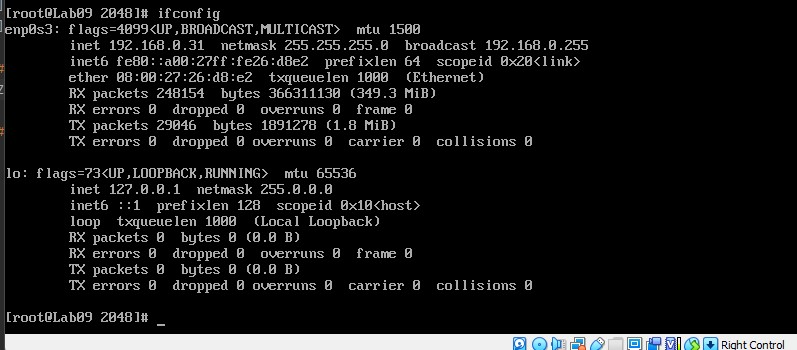  
  * Konfiguracja sieci w Menedżerze maszyny wirtualnej: ustawienie opcji *Mostkowa karta sieciowa*  
    
  * Sprawdzenie działania hostowania pliku  
  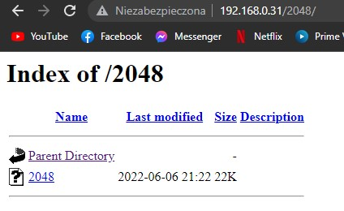  
* Następnie, do utworzonego pliku odpowiedzi dla szybszej instalacji zmieniono instalację z interfejsem graficznym na tekstową w konsoli opcją `text` oraz dodana została sekcja `post` w której następuje utworzenie katalogu i pobranie pliku z serwera  
  ```
  %post
  echo "post-inst code"
  
  mkdir /root/2048game
  cd /root/2048game
  curl -o 2048 -L http://192.168.0.31/2048/2048
  
  %end
  ```
* Tak zmieniony plik odpowiedzi wrzucony został do repozytorium w katalogu `Lab09`  
  
* Po powyższych istotnych krokach można było przejść do instalacji systemu pamiętając o wybraniu linku do pliku pającego 'czystą postać' `Raw`  
  
* Instalacja systemu przebiegła pomyślnie, a na maszynie pojacił się działający plik wykonywalny  
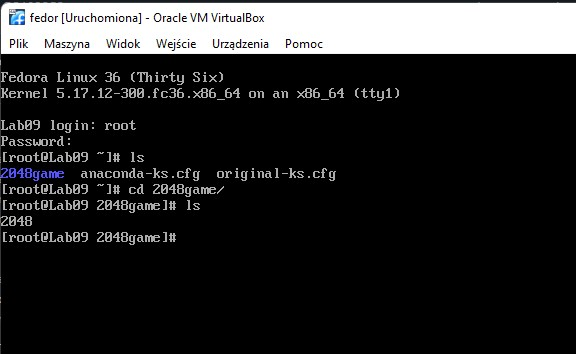  
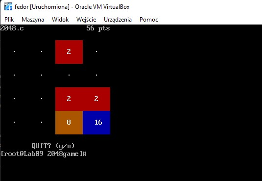

### 3. Połączenie pliku odpowiedzi z *ISO*  
* W celu połączenia pliku odpowiedzi z ISO pobrano obraz `Fedora Server` i na początku wykonane zostały następujące kroki:  
  `sudo mount Fedora-Server-netinst-x86_64-36_Beta-1.4.iso mnt/iso`  
  `sudo cp -pRf mnt/iso tmp`  
  `sudo umount mnt/iso`  
  `sudo cp lab09_anaconda_ks.cfg tmp/iso`  
* Następnie, w pliku konfiguracyjnym `isolinux.cfg` dodano kolejną opcję boot'owania systemu zaciągającą nasz plik odpowiedzi z repozytorium:  
```
label linux
   menu label ^Install or upgrade Fedora Server 36
   menu default
   kernel vmlinuz
   append initrd=initrd.img inst.ks=https://raw.githubusercontent.com/InzynieriaOprogramowaniaAGH/MDO2022_S/GS403353/INO/GCL02/GS403353/Lab09/lab09_anaconda_ks.cfg
```
* Uworzono nowe ISO komendą:  
```bash
sudo genisoimage -U -r -v -T -J -joliet-long -V "RHEL-6.9" -volset "RHEL-6.9" -A "RHEL-6.9" -b isolinux/isolinux.bin -c isolinux/boot.cat -no-emul-boot -boot-load-size 4 -boot-info-table -eltorito-alt-boot -e images/efiboot.img -no-emul-boot -o ../NEWISO.iso .
```
  
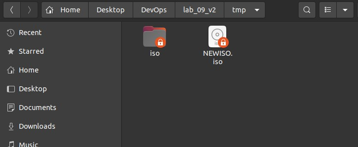  
* Pobrano `NEWISO.iso` na system `Windows`, a następnie przetestowano własne ISO tworząc na nim nową maszynę wirtualną  
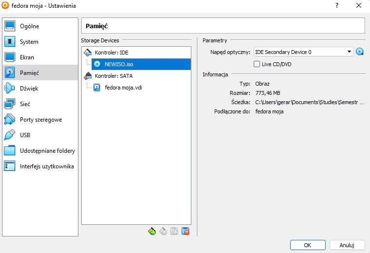  
* W menu początkowym dostępna jest dodana wcześniej opcja `Install or upgrade Fedora Server 36`  
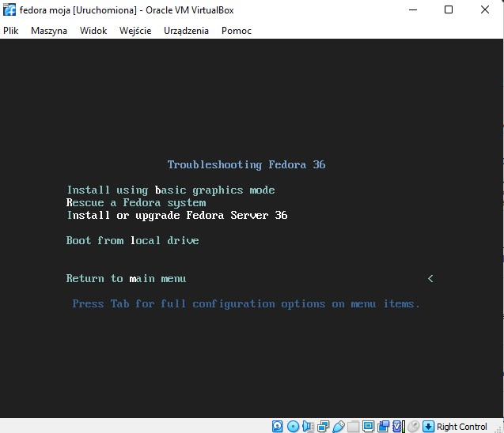  
* Instalacja systemu zakończyła się sukcesem, na dysku dostępny jest artefakt `2048`  
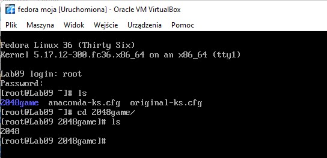  