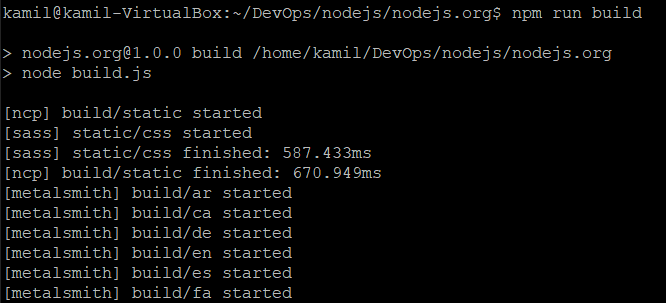
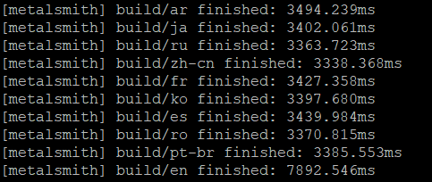
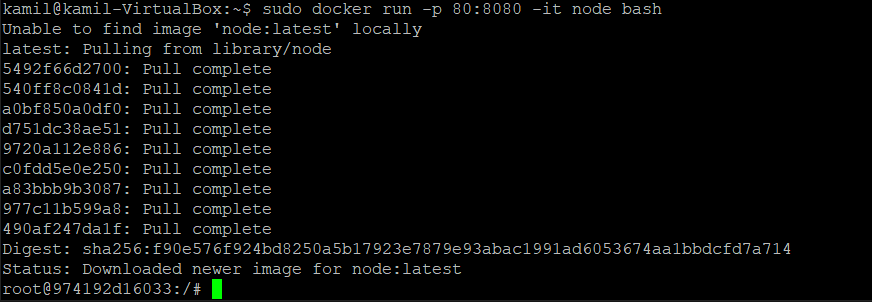
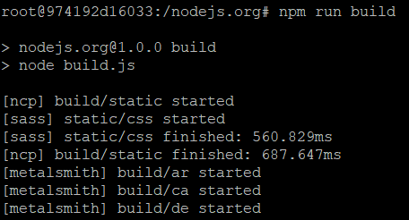
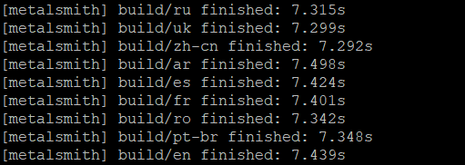
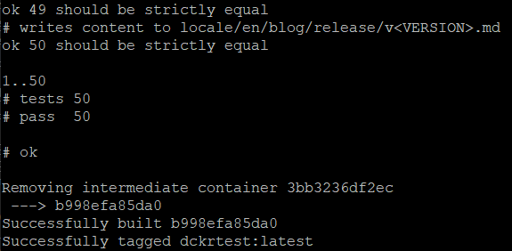

# Sprawozdanie 3
# Kamil Pazgan Inżynieria Obliczeniowa GCL02

## Wybór oprogramowania na zajęcia
1. Repozytorium, które wybrałem w ramach zajęć to node-red: https://github.com/nodejs/nodejs.org
- Posiada ono otwartą licencję
- Narzędzia Makefile, dostępne na potrzeby testów to *npm*
- Sklonowałem repozytorium wykorzystując HTTPS i pobierając link z repozytorium\

- Zainstalowałem zależności '''npm install'''\

- Następnie buduję projekt za pomocą '''npm run build'''\
\

- Na koniec uruchomiłem testy jednostkowe dołączone do repozytorium '''npm test'''\

## Przeprowadzenie buildu w kontenerze
1. Kroki wykonane wewnątrz kontenera Node, który jest adekwatny do repozytorium
- W pierwszej kolejności uruchamiam kontener wraz z podłączeniem TTY za pomocą '''sudo docker run''', wykorzystując odpowiednie opcje: '''-p''' - określenie portu, '''-it''' - interaktywny terminal, '''bash''' - bash terminal\

- Następnie klonuje repozytorium '''git clone https://github.com/nodejs/nodejs.org'''\

- Instaluje na kontenerze npm '''npm install'''\

- Uruchomienie buildu '''npm run build'''\
\

- Na koniec uruchomienie testu za pomocą '''npm test'''\
\

2. Pliki Dockerfile automatyzujące kroki powyżej
- Pierwszy plik wykonuje wszytkie kroki, aż do builda: '''FROM''' - najnowszy obraz, '''RUN''' - uruchamianie, '''WORKDIR''' - ścieżka\

- Drugi plik bazuje na pierwszym i uruchamia testy\

3. Wykazanie, poprawności wdrażania się kontenera i poprawności działania
- W pierwszej kolejności sprawdziłem działanie pierwszego Dockerfile poprzez '''sudo docker build''', '''-f''' - wybór pliku, '''-t''' - nazwa obrazu\
\

- Następnie drugiego\
\

- Stworzone obrazy '''sudo docker images'''\

- Potwierdzenie działania, uruchomienie kontenera z utworzonego obrazu\

