# Zajęcia 03
### 21.03.2022
---

## Zachowanie stanu

Na początku przygotowano dwa woluminy: wejściowy i wyjściowy:

```bash
$ docker volume create in
$ docker volume create out
```


Następnie utworzono nowy obraz do zbudowania projektu, bez narzędzi `git`, utworzono następujący plik `docker/build/Dockerfile`:

```dockerfile
FROM ubuntu:20.04
# Fix: Avoid asking some packages for geographic area
ENV DEBIAN_FRONTEND=noninteractive
RUN apt-get update
RUN apt-get install -y nodejs npm
WORKDIR /home
```

* `ENV DEBIAN_FRONTEND=noninteractive` - polecenie to wykorzystano aby uniknąć pytania o region w trakcie konfiguracji paczki `tzdata`

Wykorzystano komendę:

```bash
$ docker build -f ./docker/build/Dockerfile -t node-nogit .
```

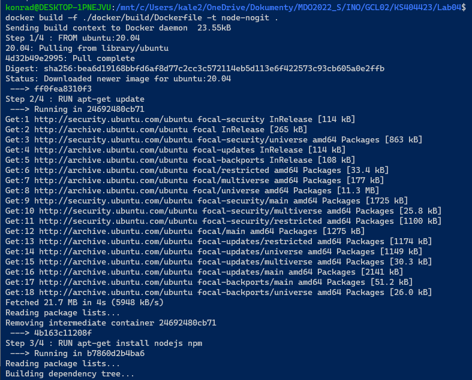

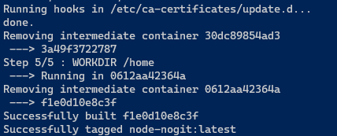

Następnie wdrożono testowy kontener sprawdzający czy faktycznie udało się utworzyć obraz bez `git`:

```bash
$ docker run -it node-nogit bash
```


Jak widać udało się.

Aby sklonować repozytorium [simple-tetris](https://github.com/robertrypula/simple-tetris/) - program użytego na poprzednich zajęciach, najpierw należy znaleźć ścieżkę prowadzącą do woluminu wejściowego `in`:

```bash
$ docker volume inspect in
```


Jak widać miejsce zamontowania to `/var/lib/docker/volumes/in/_data`:

```bash
$ cd /var/lib/docker/volumes/in/_data
```


Próba przejścia do katalogu jako user kończy się niepowodzeniem, dlatego wykorzystano root:

```bash
$ sudo su
```

 


Następnie sklonowano repozytorium:

```bash
$ git clone https://github.com/robertrypula/simple-tetris.git
```

Dalej wdrożono kontener montując oba woluminy:

```bash
$ docker run -it -v in:/home/src -v out:/home/dist node-nogit
```

* Parametr `-v` jako pierwszy argument przyjmuje punkt montowania na maszynie hosta, a jako drugi punkt montowania w kontenerze
  * W tym przypadku wolumin wejściowy zamontowano w kontenerze w `/home/src` a wyjściowy w `/home/dist`


Zweryfikowano czy zamontowane ścieżki faktycznie znajdują się w kontenerze:

```bash
$ ls /home
$ ls /home/src
```


Dalej rozpoczęto build:

```bash
$ cd /home/src
$ npm install
$ npm run-script build
```


Powstałe pliki skopiowano do woluminu wyjściowego:

```bash
$ cp -r dist /home/dist/
```

Na komputerze hosta otworzono ścieżkę woluminu wyjściowego `/var/lib/docker/volumes/out/_data` jako root:

```bash
$ sudo su
$ cd /var/lib/docker/volumes/out/_data
```


Oraz uruchomiono grę:

```bash
$ node ascii-runner-node.js
```

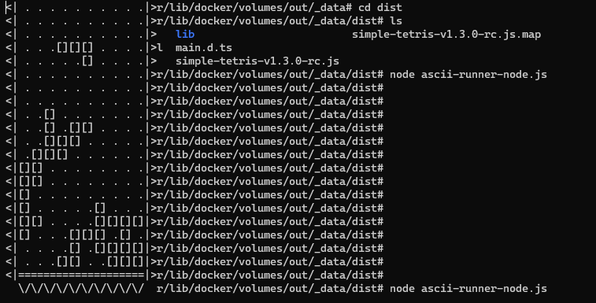


---

## Eksponowanie portu

Na początku zalogowano się do Docker Hub z poziomu CLI:

```bash
$ docker login
```


Następnie zainicjowano wdrożenie kontenera serwera z narzędziem `ipref` (które zostanie pobrane z repozytorium do którego przed chwilą się zalogowano):

```bash
$ docker run -it networkstatic/iperf3 -p 8000:8000 -s
```

* Parametr `-p` odpowiada za eksponowanie portu, w tym przypadku portu 8000 oraz opublikowanie go do portu 8000 w komputerze hosta
* Parametr `-s` odpowiada za uruchomienie serwera `iperf3`


Następnie aby wdrożyć kontener klienta należy poznać adres IP serwera, co można osiągnąć następująco:

```bash
$ docker container list
$ docker inspect efcf18ffa857
```


Inspektor printuje mnóstwo informacji ale ta szukana znajduje się na końcu:

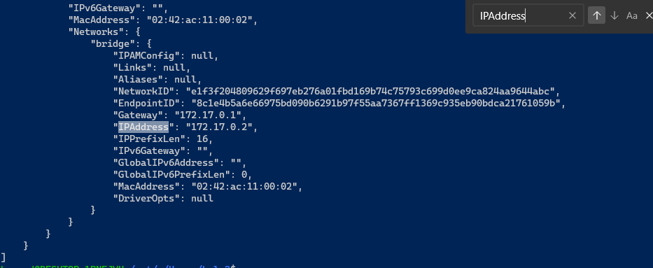

Dalej wdrożono kontener klienta:

```bash
$ docker run -it networkstatic/iperf3 -c 172.17.0.2 -p 8000:8000
```

* Parametr `-c` odpowiada za uruchomienie klienta oraz połączenie do wskazanego adresu IP


###  Połączenie kontener do kontenera

**Klient:**

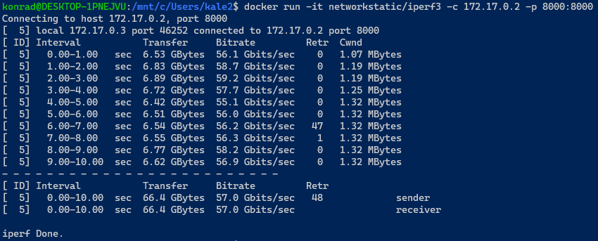

**Serwer:**


## Połączenie host do kontenera

**Klient host:**


**Serwer kontener:**

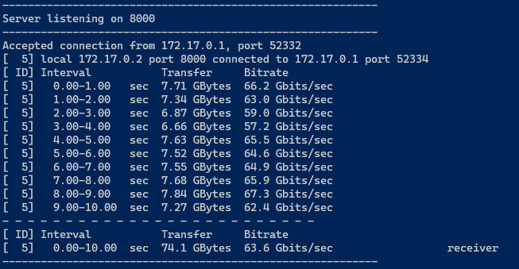


## Połączenie poza hostem do kontenera w tej samej sieci LAN

**Klient poza hostem**


**Serwer kontener**

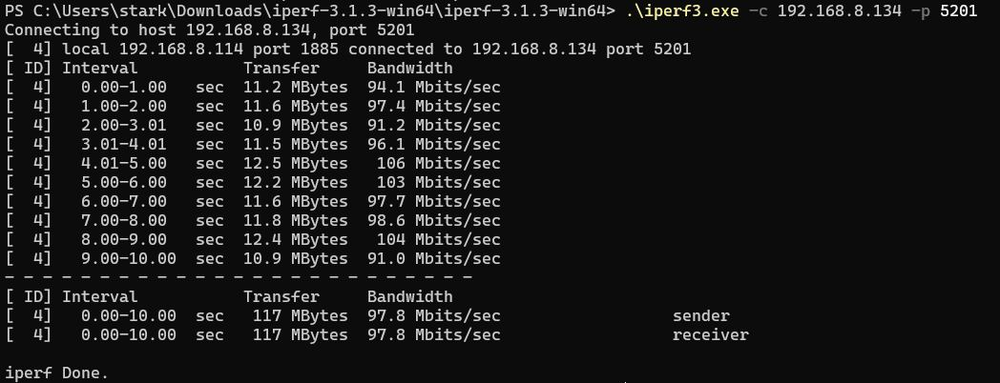


Jak widać wyniki przepustowości dla połączenia z innego kontenera oraz z hosta są dosyć podobne, na pewną korzyść hosta.

Z kolei łączenie się z innego komputera po sieci LAN dało najgorsze wyniki.


---

## Instalacja Jenkins

Zgodnie z [dokumentacją](https://www.jenkins.io/doc/book/installing/docker/), najpierw utworzono nową sieć dockerową:

```bash
$ docker network create jenkins
```


Następnie pobrano obraz `docker:dind` wykorzystując szereg argumentów:

* `--name` - nazwa kontenera
* `--detach` - wdraża kontener w tle
* `--privileged` - nadaje uprawnienia kontenerowi
* `--network` - precyzuje wcześniej utworzoną sieć
* `--network-alias` - pozwala na utworzenie aliasu sieci
* `--env` - podaje zmienne środowiskowe, w tym przypadku uruchamia TLS na serwerze
* `--volume` - montuje wolumin
* `--publish` - eksponuje porty do hosta
* `--storage-driver` - sterownik zapisu danych

```bash
$ docker run \
  --name jenkins-docker \
  --rm \
  --detach \
  --privileged \
  --network jenkins \
  --network-alias docker \
  --env DOCKER_TLS_CERTDIR=/certs \
  --volume jenkins-docker-certs:/certs/client \
  --volume jenkins-data:/var/jenkins_home \
  --publish 2376:2376 \
  docker:dind \
  --storage-driver overlay2
```

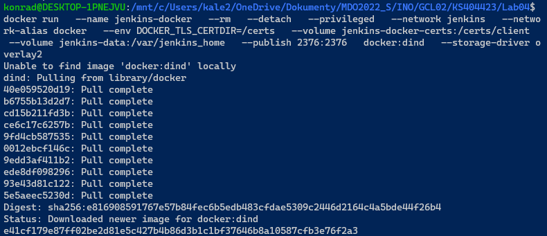

Następnie utworzono plik `docker/jenkins/Dockerfile` o następującej treści:

```dockerfile
FROM jenkins/jenkins:2.332.1-jdk11
USER root
RUN apt-get update && apt-get install -y lsb-release
RUN curl -fsSLo /usr/share/keyrings/docker-archive-keyring.asc \
  https://download.docker.com/linux/debian/gpg
RUN echo "deb [arch=$(dpkg --print-architecture) \
  signed-by=/usr/share/keyrings/docker-archive-keyring.asc] \
  https://download.docker.com/linux/debian \
  $(lsb_release -cs) stable" > /etc/apt/sources.list.d/docker.list
RUN apt-get update && apt-get install -y docker-ce-cli
USER jenkins
RUN jenkins-plugin-cli --plugins "blueocean:1.25.3 docker-workflow:1.28"
```

Dalej zbudowano obraz:

```bash
$ docker build -t myjenkins-blueocean:2.332.1-1 .
```


Na końcu wdrożono kontener, publikując go na portach 8080 oraz 50000:

```bash
$ docker run --name jenkins-blueocean --rm --detach \
  --network jenkins --env DOCKER_HOST=tcp://docker:2376 \
  --env DOCKER_CERT_PATH=/certs/client --env DOCKER_TLS_VERIFY=1 \
  --volume jenkins-data:/var/jenkins_home \
  --volume jenkins-docker-certs:/certs/client:ro \
  --publish 8080:8080 --publish 50000:50000 myjenkins-blueocean:2.332.1-1
```

Uruchomiono przeglądarkę:

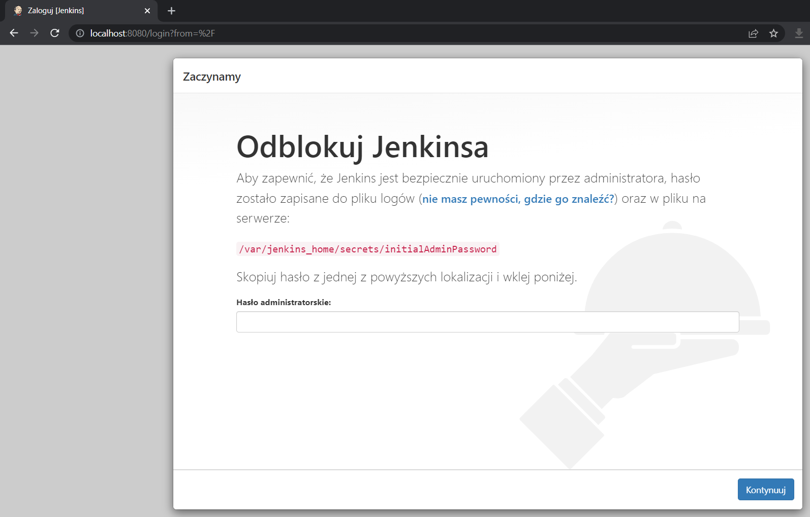

Wyszukano hasło:

```bash
$ docker exec -it jenkins-blueocean bash
$ cat /var/jenkins_home/secrets/initialAdminPassword 
```


Wybrano opcję instalacji sugerowanych wtyczek:

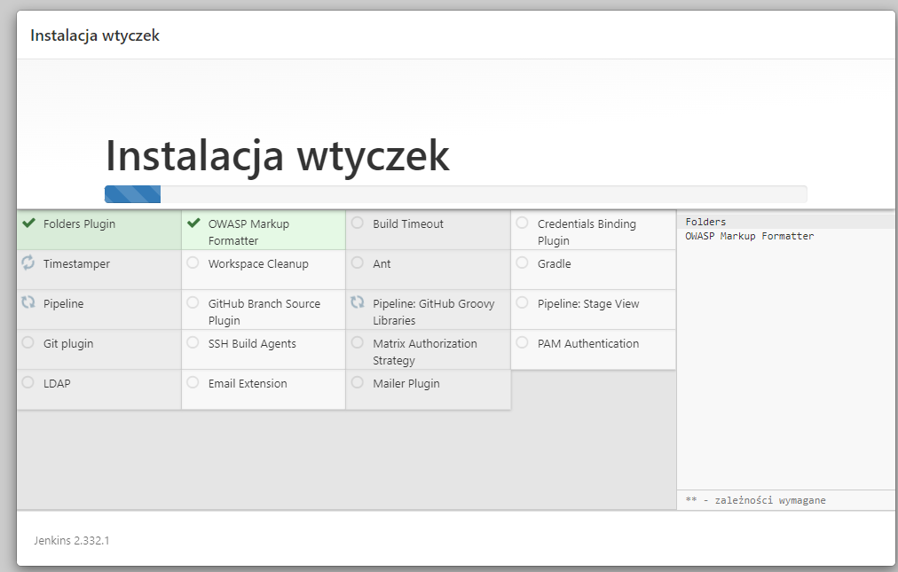

Na końcu otrzymano dashboard Jenkinsa:

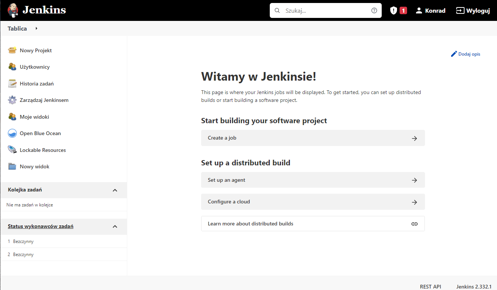
