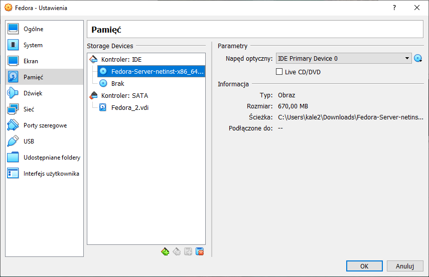
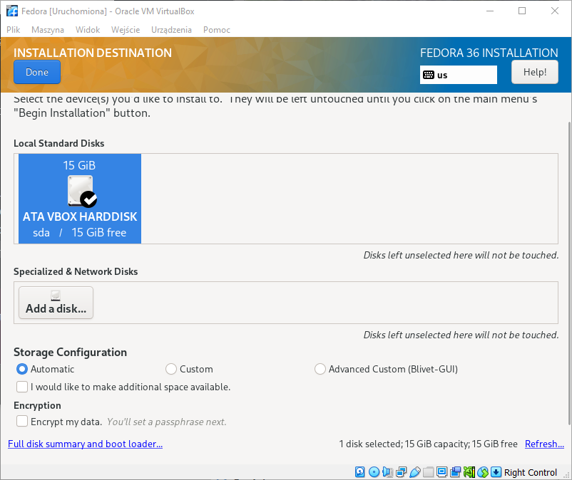
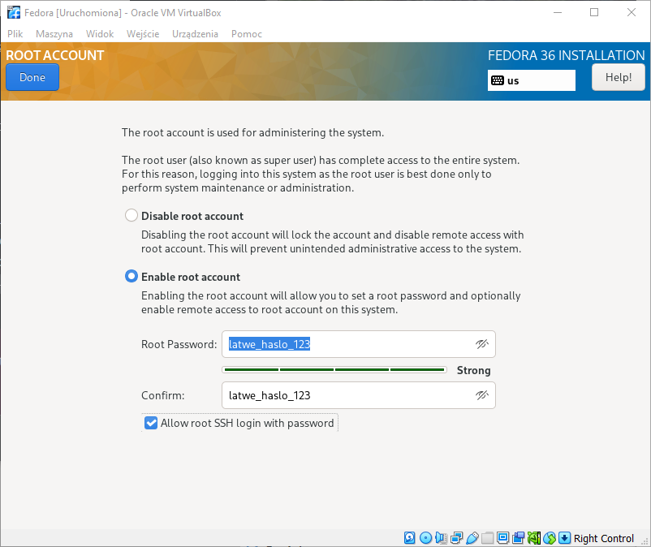
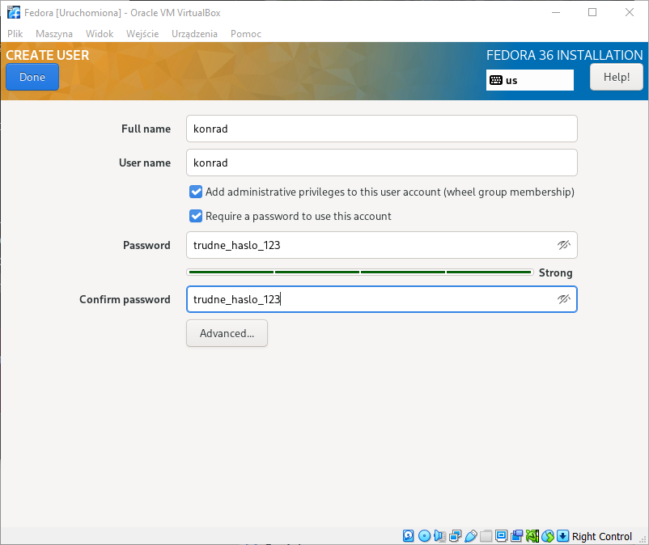

# Zajęcia 09
---

### Instalacja systemu Fedora w VM

Jako środowisko wirtualizacji wybieram VirtualBox. Najpierw tworzę nową maszynę wirtualną w trybie eksperta:


Ustawiam wielkość pamięci RAM jako 4GB. Następnie tworzę dysk o rozmiarze 15 GB:


W ustawieniach nowo powstałej maszyny dodaję obraz rozruchowy instalatora w formie ISO pobranego z oficjalnej strony Fedory:



Następnie uruchamiam maszynę wirtualną:


Wybieram język na angielski:


Wybieram dysk, na którym zostanie zainstalowany system:



Następnie przystępuję do konfiguracji profilu roota, pozwalam na dostęp do niego przez SSH w celu łatwiejszej komunikacji w dalszej części:



Dalej tworzę konto użytkownika:



Wybieram instalację jako minimalną z podstawowymi narzędziami:


Rozpoczyna się proces instalacji:


### Druga instalacja systemu Fedora w VM jako serwer HTTP dla artefaktu

Aby zaoszczędzić czasu z uwagi na to, że obie maszyny z Fedorą po instalacji są takie same, używam opcji klonowania obrazu dostępnej w VM aby utworzyć drugą instancję.

Następnie maszynie będącej serwerem instaluję oraz konfiguruję Apache httpd jako root:

```bash
$ dnf install -y httpd 
$ dnf group install -y "Web Server"
```

Następnie uruchamiam proces:

```bash
$ systemctl start httpd
$ systemctl enable httpd
```

Na końcu konfiguruję Firewalla aby ten nie blokował requestów:

```bash
$ firewall-cmd --add-service=http --add-service=https --permament
$ firewall-cmd --reload
```


### Umieszczenie artefaktu z projektu na serwerze HTTP

Pobieram z Jenkinsa artefakt:


Na maszynie serwera instaluję i uruchamiam SSH:

```bash
$ dnf install -y openssh-server
$ systemctl start sshd.service
```

W VirtualBoxie ustawiam przekierowanie portu 22:

<ZDJECIE>


Na komputerze hoście łączę się z Powershella do maszyny kopiując plik artefaktu:

```powershell
$ scp C:\Users\kale2\Downloads\simple-tetris-1.3.0-rc.tgz konrad@127.0.0.1:/var/www/html/
```

<ZDJECIE>


Na końcu wyciągam plik konfiguracyjny instalatora:

```powershell
$ scp root@127.0.0.1:/root/anaconda-ks.cfg anaconda-ks.cfg
```

