# Kubernetes 

### Problem na Oracle OCI

VPS który posiadam w darmowym planie posiada dysk 47 Gb, z czego większość jest używana przez dockera, obrazy zmodyfikowanych systemów, i docker registry

Dlatego dokonałem próby zwiększenia dysku, aby nie utracić pracy


Pozostała ilość wolnego miejsca na dysku


Okazało się że Oracle udostępnia z poziomu panelu możliwość rozszerzenia dysku do max 70Gb

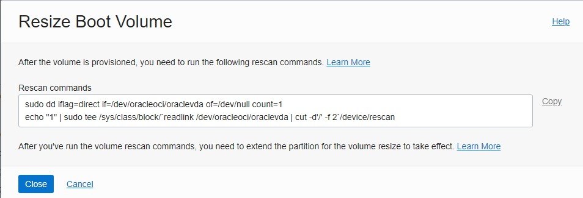

Rozszerzanie po restarcie systemu:


Efekt końcowy


# Instalacje MiniKube

Instalacje przeprowadziłem według [instrukcji deweloperów na stronie](./https://minikube.sigs.k8s.io/docs/start/)

```bash
ubuntu@szymonvm:~$ curl -LO https://storage.googleapis.com/minikube/releases/latest/minikube_latest_arm64.deb
  % Total    % Received % Xferd  Average Speed   Time    Time     Time  Current
                                 Dload  Upload   Total   Spent    Left  Speed
100 21.1M  100 21.1M    0     0  20.1M      0  0:00:01  0:00:01 --:--:-- 20.1M
ubuntu@szymonvm:~$ sudo dpkg -i minikube_latest_arm64.deb
Selecting previously unselected package minikube.
(Reading database ... 168838 files and directories currently installed.)
Preparing to unpack minikube_latest_arm64.deb ...
Unpacking minikube (1.25.2-0) ...
Setting up minikube (1.25.2-0) ...
ubuntu@szymonvm:~$

```

Próba uruchomienia nie powiodła się ze względu na ograniczenie dockera który aktualnie był u mnie na prawach root-a

```ubuntu@szymonvm:~$ sudo minikube start
😄  minikube v1.25.2 on Ubuntu 20.04 (arm64)
✨  Automatically selected the docker driver. Other choices: ssh, none
🛑  The "docker" driver should not be used with root privileges.
💡  If you are running minikube within a VM, consider using --driver=none:
📘    https://minikube.sigs.k8s.io/docs/reference/drivers/none/

❌  Exiting due to DRV_AS_ROOT: The "docker" driver should not be used with root privileges.

ubuntu@szymonvm:~$
```

Wcześniej mogłem manipulować dockerem ze względu na wysoki poziom uprawnień roota.

docker należy do grupy docker, która działa bez problemu na root, ale aby skorzystać z niego na koncie lokalnym dodałem do niego grupę docker tym samym uzyskując dostęp do większości poleceń dockera ponieważ socket nie będzie już tworzony dla root-a a dla grupy docker do której przynależy konto lokalne

```
ubuntu@szymonvm:~$  sudo groupadd docker
groupadd: group 'docker' already exists
ubuntu@szymonvm:~$  sudo usermod -aG docker $USER
ubuntu@szymonvm:~$  newgrp docker
ubuntu@szymonvm:~$  docker run hello-world
Unable to find image 'hello-world:latest' locally
latest: Pulling from library/hello-world
7050e35b49f5: Pull complete
Digest: sha256:80f31da1ac7b312ba29d65080fddf797dd76acfb870e677f390d5acba9741b17
Status: Downloaded newer image for hello-world:latest

Hello from Docker!
This message shows that your installation appears to be working correctly.

To generate this message, Docker took the following steps:
 1. The Docker client contacted the Docker daemon.
 2. The Docker daemon pulled the "hello-world" image from the Docker Hub.
    (arm64v8)
 3. The Docker daemon created a new container from that image which runs the
    executable that produces the output you are currently reading.
 4. The Docker daemon streamed that output to the Docker client, which sent it
    to your terminal.

To try something more ambitious, you can run an Ubuntu container with:
 $ docker run -it ubuntu bash

Share images, automate workflows, and more with a free Docker ID:
 https://hub.docker.com/

For more examples and ideas, visit:
 https://docs.docker.com/get-started/

ubuntu@szymonvm:~$
```

Po tym zabiegu uruchomiłem bezproblemowo minikube

```
ubuntu@szymonvm:~$ minikube start
😄  minikube v1.25.2 on Ubuntu 20.04 (arm64)
✨  Automatically selected the docker driver. Other choices: ssh, none
👍  Starting control plane node minikube in cluster minikube
🚜  Pulling base image ...
💾  Downloading Kubernetes v1.23.3 preload ...
    > preloaded-images-k8s-v17-v1...: 419.07 MiB / 419.07 MiB  100.00% 232.38 M
    > gcr.io/k8s-minikube/kicbase: 343.11 MiB / 343.12 MiB  100.00% 14.72 MiB p
🔥  Creating docker container (CPUs=2, Memory=2900MB) ...
🐳  Preparing Kubernetes v1.23.3 on Docker 20.10.12 ...
    ▪ kubelet.housekeeping-interval=5m
    ▪ Generating certificates and keys ...
    ▪ Booting up control plane ...
    ▪ Configuring RBAC rules ...
🔎  Verifying Kubernetes components...
    ▪ Using image gcr.io/k8s-minikube/storage-provisioner:v5
🌟  Enabled addons: default-storageclass, storage-provisioner
💡  kubectl not found. If you need it, try: 'minikube kubectl -- get pods -A'
🏄  Done! kubectl is now configured to use "minikube" cluster and "default" namespace by default
ubuntu@szymonvm:~$ alias kubectl="minikube kubectl --"
ubuntu@szymonvm:~$ kubectl get po -A
    > kubectl.sha256: 64 B / 64 B [--------------------------] 100.00% ? p/s 0s
    > kubectl: 44.06 MiB / 44.06 MiB [-----------] 100.00% 206.01 MiB p/s 400ms
NAMESPACE     NAME                               READY   STATUS    RESTARTS     AGE
kube-system   coredns-64897985d-qd4ps            1/1     Running   0            36s
kube-system   etcd-minikube                      1/1     Running   0            48s
kube-system   kube-apiserver-minikube            1/1     Running   0            48s
kube-system   kube-controller-manager-minikube   1/1     Running   0            51s
kube-system   kube-proxy-pt2vg                   1/1     Running   0            36s
kube-system   kube-scheduler-minikube            1/1     Running   0            48s
kube-system   storage-provisioner                1/1     Running   1 (5s ago)   47s
ubuntu@szymonvm:~$

```

Aby uzyskać widok panelu stworzyłem tunel ssh, z powodu hostowania dashboardu na loopback 

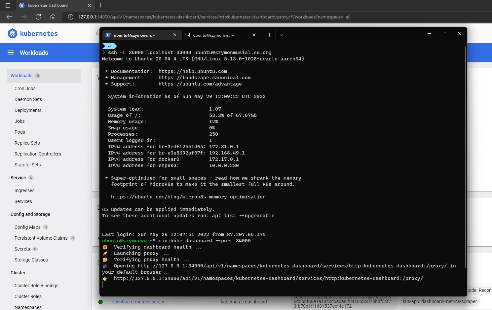


Pobierając obraz produkcyjny znajdujący się na własnym rejestrze pojawił się błąd wygaśnięcia certyfikatu, co uniemożliwiłoby pobieranie obrazu przez kubernetesa

Dlatego dokonałem uzyskania certyfikatu metodą negocjacji DNS A/AAAA txt

```
❯ docker pull szymonmusial.eu.org:10000/prodenv
Using default tag: latest
Error response from daemon: Get "https://szymonmusial.eu.org:10000/v2/": x509: certificate has expired or is not yet valid: current time 2022-05-29T12:15:44Z is after 2022-05-19T18:46:49Z

```
Po problemach z portami, firewallem, przekierowaniem uruchomiłem jednego poda korzystającego z obrazu produkcyjnego

```
ubuntu@szymonvm:~$ minikube kubectl run -- emotoprod --image=szymonmusial.eu.org:10000/prodenv --port=5000 --labels app=EmotoProdApp
pod/emotoprod created
ubuntu@szymonvm:~$
```

Pody:
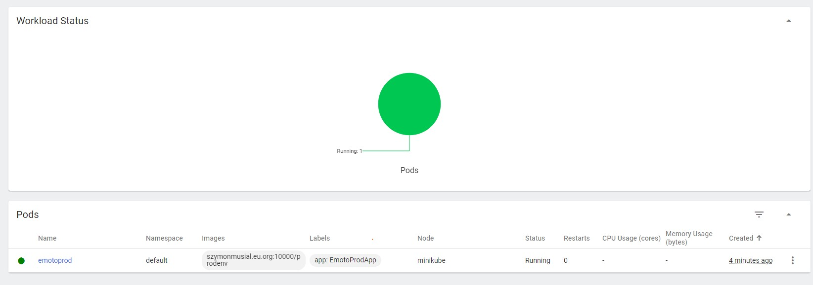
Zdarzenia:


Logi aplikacji, świadczące o poprawnym uruchomieniu


Aby uzyskać dostęp do pod-a można skorzystać z proxy, wtedy na wybranym porcie nastąpi przekierowanie ale będzie ono dostępne z karty sieciowej "localhost".

Dlatego jawnie wskazuję na adres ```0.0.0.0``` co świadczy o nasłuchiwaniu na karcie sieciowej dostępnej z zewnątrz

```
ubuntu@szymonvm:~$ kubectl port-forward emotoprod --address 0.0.0.0 8060:5000
```


Całość przełożyła się na poniższy efekt

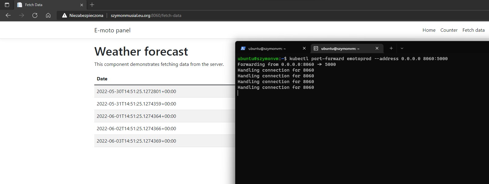

Ostatecznie zapisałem proces do pliku konfiguracyjnego. Tworzy on 3 repliki i każdorazowo podczas uruchomienia aktualizuje obraz dockerowy.

```yaml
apiVersion: apps/v1
kind: Deployment
metadata:
  name: emoto-prod
  labels:
    app: emoto-prod
spec:
  replicas: 3
  selector:
    matchLabels:
      app: emoto-prod
  template:
    metadata:
      labels:
        app: emoto-prod
    spec:
      containers:
      - name: prodenv
        image: szymonmusial.eu.org:10000/prodenv
        imagePullPolicy: Always
        ports:
        - containerPort: 5000
```

Z jenkinsem miałem analogiczne problemy jak wcześniej które wynikały one z konteneryzacji.

Podjąłem próbę instalacji pluginu kubernetesa aczkolwiek poza tym że były one z lukami bezpieczeństwa to ich konfiguracja wymagała wskazania autoryzacji serwera kubernetes który jest dostępny na localhost czyli niedostępny dla kontenera jenkinsa. 

Dlatego analogicznie jak ostatnio jenkins wysyła REST-owe zapytanie a serwer wykonuje komendy w pliku. W tym przypadku

```
kubectl rollout restart deploy emoto-prod
```

Co skutkuje pobraniem najnowszego obrazu (tymczasowe rozwiązanie) gdy jest on oznaczony że nadaje się na wgranie w systemie kontroli wersji

Przykładowo:

Commit zmieniał styl formatera logów

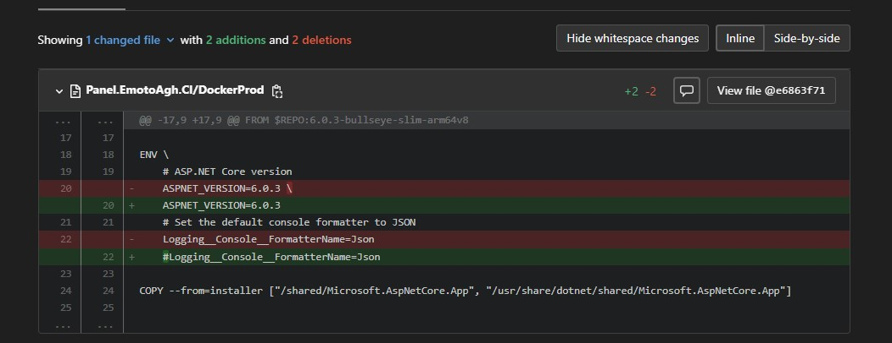

Pody:

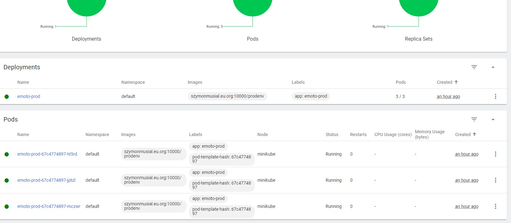

I efekt końcowy

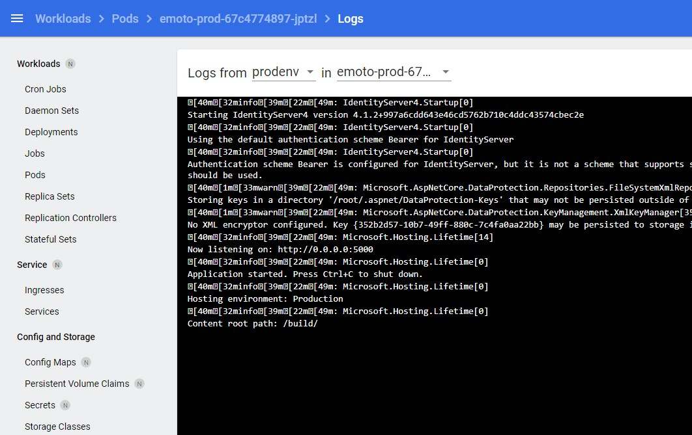


# Zajęcia 2

Problem jenkinsa w kontenerze który miał mieć wpływ na środowisko produkcyjne został zniwelowany przez przeniesienie go na hosta.

W tym celu skopiowałem rekursywnie pliki z woluminu kontenera jenkinsa do katalogu standardowego użytkownika  ```/var/lib/jenkins```

Następnie dla użytkownika jenkins dodałem prawa do wykonywania poleceń dockera oraz przeniosłem konfigurację minikube

Aby kontrolować proces wdrożenia w jenkinsie zdefiniowałem krok którego fragment niżej pokazuje:

```jenkinsfile

 stage('Kube deploy'){
            agent any
            when { tag "*" }
            steps{
                dir('./Panel.EmotoAgh.CI/Kube')
                {
                    sh 'minikube kubectl -- apply -f mykube.yaml'
                    sh 'timeout 60 minikube kubectl -- rollout status deployment/emoto-prod'
                }
            }
            post {
                failure {
                    sh 'minikube kubectl -- rollout undo deployment/emoto-prod'
                }
            }
        }
```

Wdrożenie w moim pipeline następuje po zdefiniowaniu tagu.
Przechodząc do kroków najpierw stosuję konfigurację.

Gdy nie ma ona żadnych zmian nic nie jest robione, a gdy jest następuje aktualizacja replika setu

Kolejny krok to oczekiwanie 60 sekund na wdrożenie. ```timeout``` w sekundach. W przypadku gdy mioną czas oczekiwania a proces nie zakończył działania zwraca kod ```124```

```sh
jenkins@szymonvm:~$ timeout 1 top
jenkins@szymonvm:~$ echo $?
124
 ```

Polecenie ``` kubectl rollout status ``` jest blokujące dopóty wdrożenie zakończy się sukcesem

W przypadku gdy po 60 sekundach wdrożenie nie powiedzie się nastąpi przejście do Post failure ponieważ ```timeout``` zwrócił kod błędu.

w tym bloku następuje powrót do poprzedniej wersji

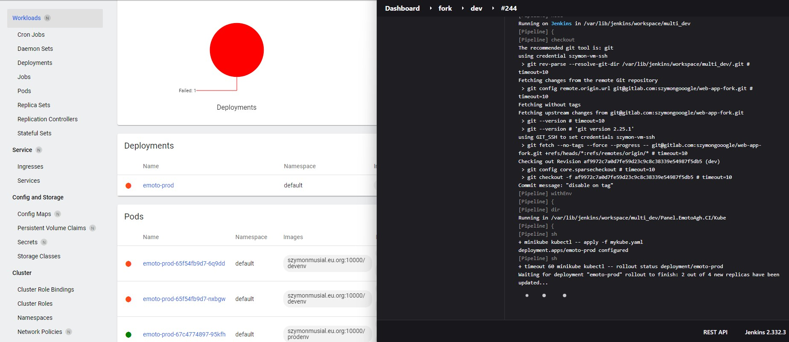

```sh
+ minikube kubectl -- apply -f mykube.yaml
deployment.apps/emoto-prod configured
[Pipeline] sh
+ timeout 60 minikube kubectl -- rollout status deployment/emoto-prod
Waiting for deployment "emoto-prod" rollout to finish: 2 out of 4 new replicas have been updated...
[Pipeline] }
[Pipeline] // dir
Post stage
[Pipeline] sh
+ minikube kubectl -- rollout undo deployment/emoto-prod
deployment.apps/emoto-prod rolled back
[Pipeline] }
[Pipeline] // withEnv
[Pipeline] }
[Pipeline] // node
[Pipeline] }
[Pipeline] // stage
[Pipeline] End of Pipeline
ERROR: script returned exit code 124
Finished: FAILURE
```

Warianty wdrożenia:
- zwiększenie replik

```sh
+ timeout 60 minikube kubectl -- rollout status deployment/emoto-prod
Waiting for deployment "emoto-prod" rollout to finish: 2 of 20 updated replicas are available...
Waiting for deployment "emoto-prod" rollout to finish: 3 of 20 updated replicas are available...
Waiting for deployment "emoto-prod" rollout to finish: 4 of 20 updated replicas are available...
Waiting for deployment "emoto-prod" rollout to finish: 5 of 20 updated replicas are available...
Waiting for deployment "emoto-prod" rollout to finish: 6 of 20 updated replicas are available...
Waiting for deployment "emoto-prod" rollout to finish: 7 of 20 updated replicas are available...
Waiting for deployment "emoto-prod" rollout to finish: 8 of 20 updated replicas are available...
Waiting for deployment "emoto-prod" rollout to finish: 9 of 20 updated replicas are available...
Waiting for deployment "emoto-prod" rollout to finish: 10 of 20 updated replicas are available...
Waiting for deployment "emoto-prod" rollout to finish: 11 of 20 updated replicas are available...
Waiting for deployment "emoto-prod" rollout to finish: 12 of 20 updated replicas are available...
Waiting for deployment "emoto-prod" rollout to finish: 13 of 20 updated replicas are available...
Waiting for deployment "emoto-prod" rollout to finish: 14 of 20 updated replicas are available...
Waiting for deployment "emoto-prod" rollout to finish: 15 of 20 updated replicas are available...
Waiting for deployment "emoto-prod" rollout to finish: 16 of 20 updated replicas are available...
Waiting for deployment "emoto-prod" rollout to finish: 17 of 20 updated replicas are available...
Waiting for deployment "emoto-prod" rollout to finish: 18 of 20 updated replicas are available...
Waiting for deployment "emoto-prod" rollout to finish: 19 of 20 updated replicas are available...
deployment "emoto-prod" successfully rolled out
```


- zmniejszenie liczby replik do 1
```sh
+ timeout 60 minikube kubectl -- rollout status deployment/emoto-prod
deployment "emoto-prod" successfully rolled out
```


- zmniejszenie liczby replik do 0
```sh
+ timeout 60 minikube kubectl -- rollout status deployment/emoto-prod
deployment "emoto-prod" successfully rolled out
```
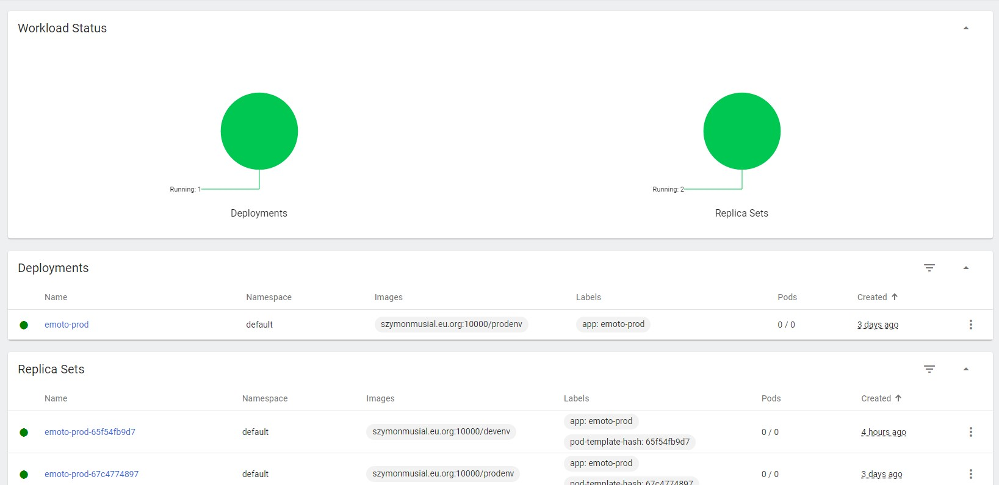

- Zastosowanie nowej wersji obrazu (v 4.0.0)

Tagi repozytorium - tj. w mom przypadku wersje stabilne aplikacji


Wersja 4.0.0


```sh
+ timeout 60 minikube kubectl -- rollout status deployment/emoto-prod
Waiting for deployment "emoto-prod" rollout to finish: 0 of 4 updated replicas are available...
Waiting for deployment "emoto-prod" rollout to finish: 1 of 4 updated replicas are available...
Waiting for deployment "emoto-prod" rollout to finish: 2 of 4 updated replicas are available...
Waiting for deployment "emoto-prod" rollout to finish: 3 of 4 updated replicas are available...
deployment "emoto-prod" successfully rolled out
```

Fragment pliku konfiguracyjnego kube
```yml
spec:
  replicas: 4
  selector:
    matchLabels:
      app: emoto-prod
  template:
    metadata:
      labels:
        app: emoto-prod
    spec:
      containers:
      - name: prodenv
        image: szymonmusial.eu.org:10000/prodenv:4.0.0 <--
        imagePullPolicy: Always
        ports:
        - containerPort: 5000
```

- Zastosowanie starszej wersji obrazu

```sh
+ timeout 60 minikube kubectl -- rollout status deployment/emoto-prod
Waiting for deployment "emoto-prod" rollout to finish: 2 out of 4 new replicas have been updated...
Waiting for deployment "emoto-prod" rollout to finish: 2 out of 4 new replicas have been updated...
Waiting for deployment "emoto-prod" rollout to finish: 2 out of 4 new replicas have been updated...
Waiting for deployment "emoto-prod" rollout to finish: 2 out of 4 new replicas have been updated...
Waiting for deployment "emoto-prod" rollout to finish: 3 out of 4 new replicas have been updated...
Waiting for deployment "emoto-prod" rollout to finish: 3 out of 4 new replicas have been updated...
Waiting for deployment "emoto-prod" rollout to finish: 1 old replicas are pending termination...
Waiting for deployment "emoto-prod" rollout to finish: 1 old replicas are pending termination...
Waiting for deployment "emoto-prod" rollout to finish: 1 old replicas are pending termination...
Waiting for deployment "emoto-prod" rollout to finish: 3 of 4 updated replicas are available...
deployment "emoto-prod" successfully rolled out
```

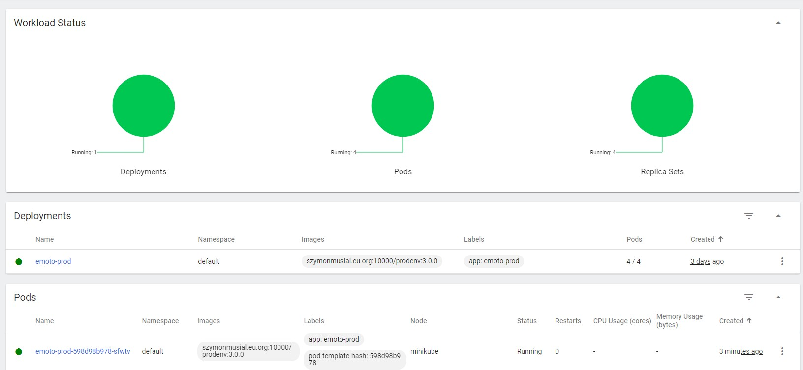


## Strategie wdrożenia

### Recreate


```sh
Waiting for deployment "emoto-prod" rollout to finish: 0 out of 4 new replicas have been updated...
Waiting for deployment "emoto-prod" rollout to finish: 0 out of 4 new replicas have been updated...
Waiting for deployment "emoto-prod" rollout to finish: 0 of 4 updated replicas are available...
Waiting for deployment "emoto-prod" rollout to finish: 1 of 4 updated replicas are available...
Waiting for deployment "emoto-prod" rollout to finish: 2 of 4 updated replicas are available...
Waiting for deployment "emoto-prod" rollout to finish: 3 of 4 updated replicas are available...
deployment "emoto-prod" successfully rolled out
```

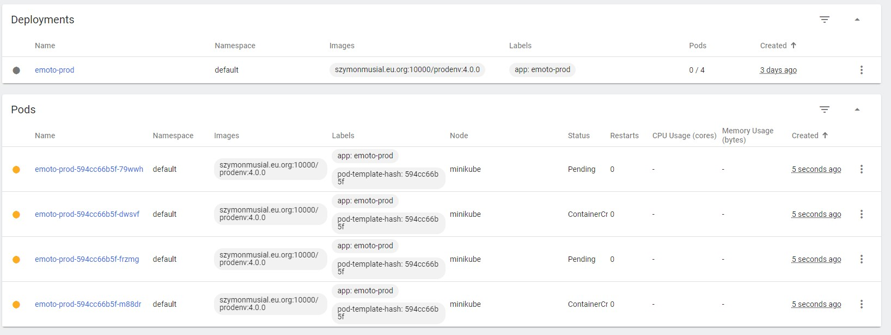

### Rolling Update


```sh
Waiting for deployment "emoto-prod" rollout to finish: 1 out of 4 new replicas have been updated...
Waiting for deployment "emoto-prod" rollout to finish: 1 out of 4 new replicas have been updated...
Waiting for deployment "emoto-prod" rollout to finish: 2 out of 4 new replicas have been updated...
Waiting for deployment "emoto-prod" rollout to finish: 2 out of 4 new replicas have been updated...
Waiting for deployment "emoto-prod" rollout to finish: 2 out of 4 new replicas have been updated...
Waiting for deployment "emoto-prod" rollout to finish: 2 out of 4 new replicas have been updated...
Waiting for deployment "emoto-prod" rollout to finish: 2 out of 4 new replicas have been updated...
Waiting for deployment "emoto-prod" rollout to finish: 3 out of 4 new replicas have been updated...
Waiting for deployment "emoto-prod" rollout to finish: 3 out of 4 new replicas have been updated...
Waiting for deployment "emoto-prod" rollout to finish: 3 out of 4 new replicas have been updated...
Waiting for deployment "emoto-prod" rollout to finish: 3 out of 4 new replicas have been updated...
Waiting for deployment "emoto-prod" rollout to finish: 3 out of 4 new replicas have been updated...
Waiting for deployment "emoto-prod" rollout to finish: 1 old replicas are pending termination...
Waiting for deployment "emoto-prod" rollout to finish: 1 old replicas are pending termination...
Waiting for deployment "emoto-prod" rollout to finish: 1 old replicas are pending termination...
Waiting for deployment "emoto-prod" rollout to finish: 3 of 4 updated replicas are available...
deployment "emoto-prod" successfully rolled out
```


### canary


pipeline 
kuby podobne


zle

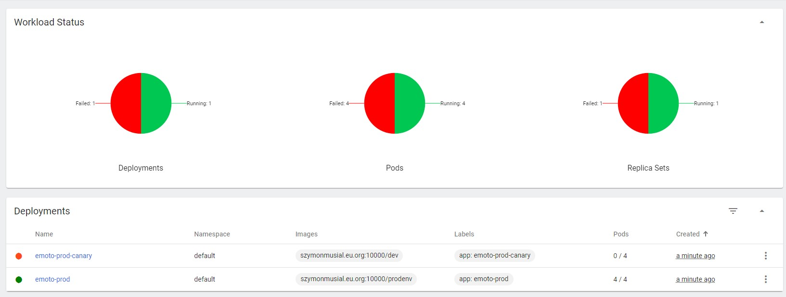

prod
```sh
+ minikube kubectl -- apply -f mykube.yaml
deployment.apps/emoto-prod created
[Pipeline] sh
+ timeout 60 minikube kubectl -- rollout status deployment/emoto-prod
Waiting for deployment "emoto-prod" rollout to finish: 0 of 4 updated replicas are available...
Waiting for deployment "emoto-prod" rollout to finish: 1 of 4 updated replicas are available...
Waiting for deployment "emoto-prod" rollout to finish: 2 of 4 updated replicas are available...
Waiting for deployment "emoto-prod" rollout to finish: 3 of 4 updated replicas are available...
deployment "emoto-prod" successfully rolled out
```

canar

```sh

+ minikube kubectl -- apply -f mykubecanary.yaml
deployment.apps/emoto-prod-canary created
[Pipeline] sh
+ timeout 60 minikube kubectl -- rollout status deployment/emoto-prod-canary
Waiting for deployment "emoto-prod-canary" rollout to finish: 0 of 4 updated replicas are available...
[Pipeline] }
[Pipeline] // dir
Post stage
[Pipeline] sh
+ minikube kubectl -- rollout undo deployment/emoto-prod-canary
error: no rollout history found for deployment "emoto-prod-canary"
Error when executing failure post condition:
hudson.AbortException: script returned exit code 1
	at org.jenkinsci.plugins.workflow.steps.durable_task.DurableTaskStep$Execution.handleExit(DurableTaskStep.java:664)
	at org.jenkinsci.plugins.workflow.steps.durable_task.DurableTaskStep$Execution.check(DurableTaskStep.java:610)
	at org.jenkinsci.plugins.workflow.steps.durable_task.DurableTaskStep$Execution.run(DurableTaskStep.java:554)
	at java.util.concurrent.Executors$RunnableAdapter.call(Executors.java:511)
	at java.util.concurrent.FutureTask.run(FutureTask.java:266)
	at java.util.concurrent.ScheduledThreadPoolExecutor$ScheduledFutureTask.access$201(ScheduledThreadPoolExecutor.java:180)
	at java.util.concurrent.ScheduledThreadPoolExecutor$ScheduledFutureTask.run(ScheduledThreadPoolExecutor.java:293)
	at java.util.concurrent.ThreadPoolExecutor.runWorker(ThreadPoolExecutor.java:1149)
	at java.util.concurrent.ThreadPoolExecutor$Worker.run(ThreadPoolExecutor.java:624)
	at java.lang.Thread.run(Thread.java:748)

[Pipeline] }
[Pipeline] // withEnv
[Pipeline] }
[Pipeline] // node
[Pipeline] }
[Pipeline] // stage
[Pipeline] End of Pipeline
ERROR: script returned exit code 124
Finished: FAILURE

```


OK

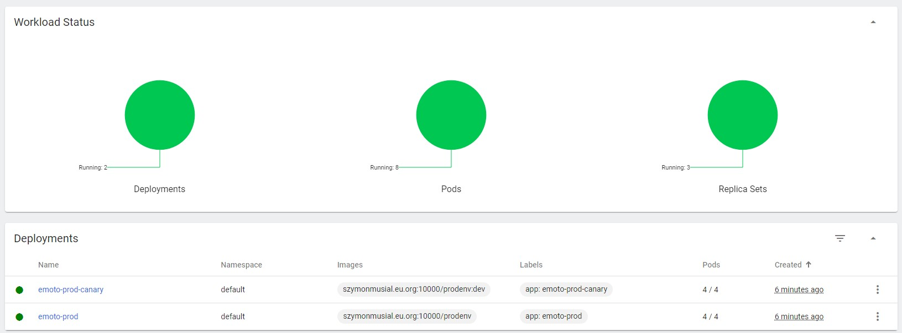

```sh
+ timeout 60 minikube kubectl -- rollout status deployment/emoto-prod
deployment "emoto-prod" successfully rolled out
```


```sh
+ minikube kubectl -- apply -f mykubecanary.yaml
deployment.apps/emoto-prod-canary configured
[Pipeline] sh
+ timeout 60 minikube kubectl -- rollout status deployment/emoto-prod-canary
Waiting for deployment "emoto-prod-canary" rollout to finish: 2 out of 4 new replicas have been updated...
Waiting for deployment "emoto-prod-canary" rollout to finish: 2 out of 4 new replicas have been updated...
Waiting for deployment "emoto-prod-canary" rollout to finish: 2 out of 4 new replicas have been updated...
Waiting for deployment "emoto-prod-canary" rollout to finish: 2 out of 4 new replicas have been updated...
Waiting for deployment "emoto-prod-canary" rollout to finish: 2 out of 4 new replicas have been updated...
Waiting for deployment "emoto-prod-canary" rollout to finish: 2 out of 4 new replicas have been updated...
Waiting for deployment "emoto-prod-canary" rollout to finish: 3 out of 4 new replicas have been updated...
Waiting for deployment "emoto-prod-canary" rollout to finish: 1 old replicas are pending termination...
Waiting for deployment "emoto-prod-canary" rollout to finish: 1 old replicas are pending termination...
Waiting for deployment "emoto-prod-canary" rollout to finish: 1 old replicas are pending termination...
Waiting for deployment "emoto-prod-canary" rollout to finish: 3 of 4 updated replicas are available...
deployment "emoto-prod-canary" successfully rolled out
```