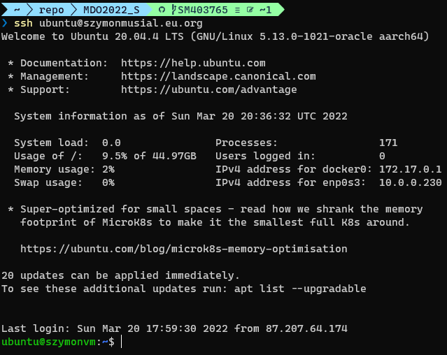
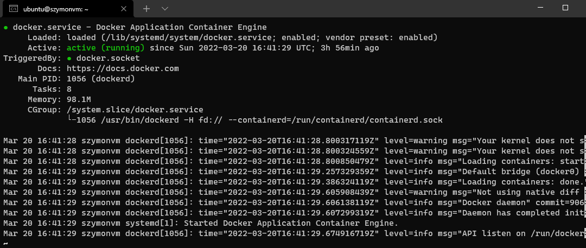
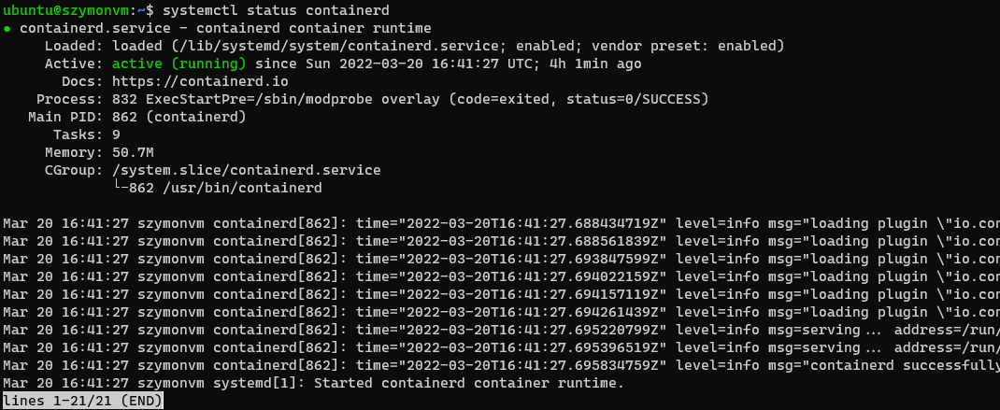

# Hooki

## Sprawdzenie tutułu commita SM403765

Do realizacji używam hooków gita, są to skryptu uruchamiana przy danym zadaniu znajdującym się w folderze ./.git/hooks domyślnie wyłączone.

Korzystam z skryptów commit-msg który to w argumencie $1 zawiera ścieżkę do pliku tekstowego zawierającego tekst commita.

W skryptach w pierwszej lini powinno określić się "interpreter" shella, można m.in użyć bash, pythona, czy sh. Ja korzystam z sh.

Zawartość pliku z zostaje porównywana z kluczem w przypadku sprawdzenia nazwy commita, natomiast w przypadku wyszukania wzorca (nr lab) w commicie korzystam z funkcji grep z odpowiednim przełącznikiem.

Ostatecznie wyświetlam stosowne informację, a w przypadku błędu zwracam -1 co zaniecha stworzenia commita

commit-msg
```bash
#!/bin/sh

if test $(cat $1) = SM403765
then
  echo "Correct commit"
else
  echo "Bad commit"
  exit 1
fi
```


<figcaption align = "center">Zrzut 1. Sprawdzenie zawartości brancha w commicie</figcaption>


## Sprawdzenie czy tytule commita zawiera się numer laboratorium

commit-msg

```bash
#!/bin/sh

if (cat $1) | grep -Eq '(Lab2)'
then
  echo "Correct commit"
else
  echo "Bad commit"
  exit 1
fi
```


<figcaption align = "center">Zrzut 2. Sprawdzenie zawartości numeru labów w commicie</figcaption>


# Docker

## Dostęp do maszyny

Prywatnie korzystam z aplikacji Windows Terminal która jest prosta do skonfigurowania dla różnych profili, taki jak jeden zaprezentowany poniżej przedstawiający clouda oci.

Od kilku miesięcy Oracle w ramach planu [Oracle Cloud Free Tier](https://www.oracle.com/cloud/free/) udostępnia zasoby VPS za darmo nie na limitowany czas. Z połączeniu to z moją domeną poniższa konfiguracja jest poprawna


<figcaption align = "center">Zrzut 3. Konfiguracja Windows Terminal </figcaption>

## Wykazanie remote


<figcaption align = "center">Zrzut 4. Logowanie po SSH </figcaption>

## Zainstalowanie dockera

Zainstalowałem dockera według zaleceń twórców oprogramowania wcześniej, włączyłem odpowiednie usługi dlatego niżej prezentuję ten fakt poprzez wersję dockera


<figcaption align = "center">Zrzut 5. Wersja zainstalowanego dockera </figcaption>

## Działanie

Docker rejestruje dwa zadania w demonie systemd linuxa:
- docker
- constainerd
Z tego też powodu sprawdzam oba statusy procesów.



<figcaption align = "center">Zrzut 6. status serwisu docker </figcaption>


<figcaption align = "center">Zrzut 7. status serwisu containerd </figcaption>


## Numer wersji

Polecenie Docker ps służy do wylistowania kontenerów


<figcaption align = "center">Zrzut 8. Docker ps </figcaption>

Wyświetlenie obrazów, pobranie obrazu ubuntu oraz wypisanie zawartości pliku /etc/os-relese w kontenerze ubuntu zawierającego informację o wersji systemu


<figcaption align = "center">Zrzut 9. Ubuntu container</figcaption>

Proces ładowania systemu po starcie bios/uefi odszukuje rekord rozruchowy zapisany na dysku, potem procesor jest przydzielany programowi tam się znajdującemu. W systemach linux może to być grub który to skonfigurowany ładuje odpowiednie pliki (np. ramdisk), kernel. W zależności od systemu linux po załadowaniu jądra następuje wywołanie pierwszego procesu PID 1 systemu zazwyczaj systemd ( W przypadku androida jest to plik wykonywalny init, który to posiłkuje się również skryptem init.sh. Całość uruchamia resztę m.in Systemserwer, ART czy Zygote).

 Natomiast w przypadku kontenera który nie jest systemem PID 1 to proces w moim przypadku terminala. Inaczej na PID 1 kontenera domyślnie nie znajdzie się systemd


<figcaption align = "center">Zrzut 10. Ubuntu container init PID</figcaption>

# Konto Docker Hub

Repozytorium obrazów kontenerów dockera


<figcaption align = "center">Zrzut 11. Konto w docker Hub</figcaption>