## 1. Przygotowanie systemu pod uruchomienie
* Przeprowadź instalację systemu Fedora w VM, skonfiguruj użytkowników (użyj haseł, które można bezkarnie umieścić na GitHubie!), sieć, wybierz podstawowy zbiór oprogramowania, optymalnie bez GUI  
  
Należy pobrać obraz fedory z tego linku (https://getfedora.org/en/server/download/) i zainstalować system na maszynie wirtualnej. Pobieramy wersję Netinstall.  
Konfiguracja:  
  
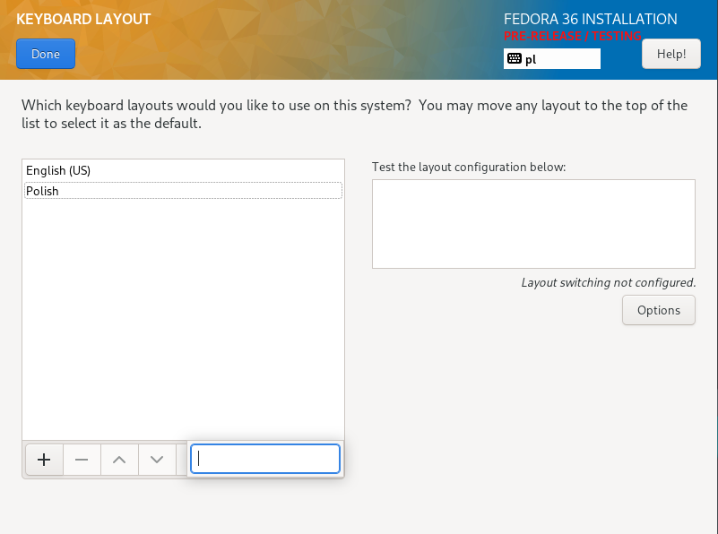  
  
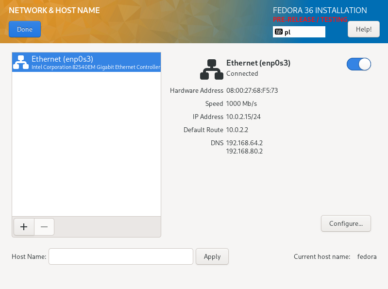  
  
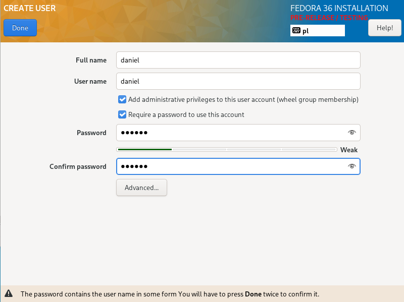  
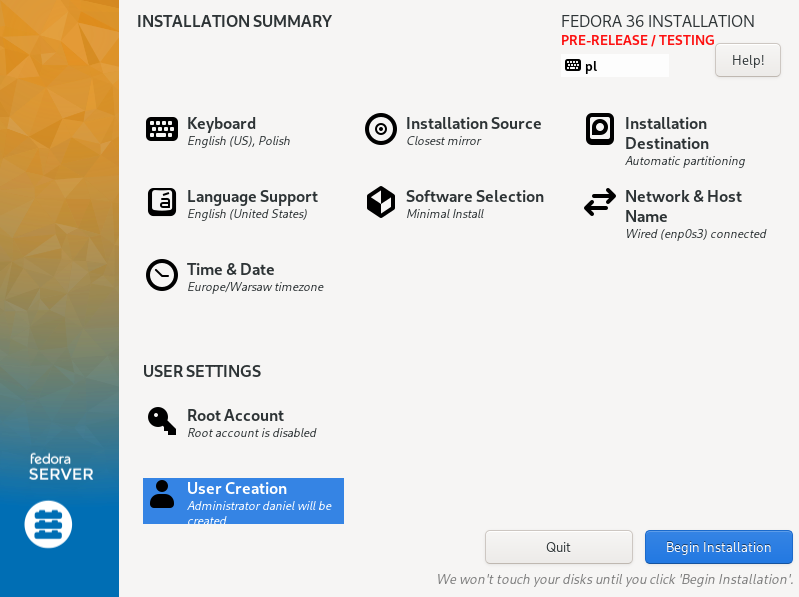  
Instalacja zakończona pomyślnie:  
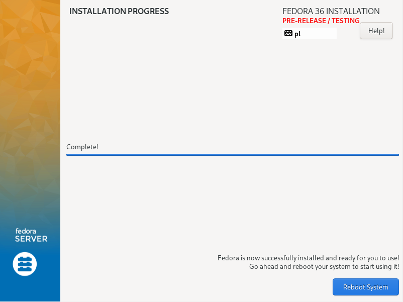  
* Przeprowadź drugą instalację systemu Fedora w VM - celem drugiego systemu będzie wyłącznie serwowanie repozytorium przez HTTP  
  
Drugi system został zainstalowany w analogiczny sposób jak poprzedni. Dodatkowo skonfigurowałem na nim serwer HTTP (Wybrałem serwer nginx). Polecenia, którymi zainstalowałem serwer nginx znajdują się poniżej. 
```bash
sudo dnf module enable nginx:mainline  
sudo dnf install nginx
```
Sprawdzenie wersji nginx:  
```bash
nginx -v
```
  
Włączenie nginx i skonfigurowanie firewall:  
```bash
sudo systemctl enable nginx --now
sudo firewall-cmd --permanent --zone=public --add-service=http
sudo firewall-cmd --permanent --zone=public --add-service=https
sudo firewall-cmd --reload
```
  
Aby oba serwery się widziały muszę je dodać do tej samej sieci. Zrobiłem to w VirtualBoxie. Na samym początku należy utworzyć wspólną sieć, robimy to wykonując następujące kroki: przechodzimy do głównego okna VirtualBoxa, klikamy "Tools", następnie wybieramy "Globalne ustawienia", po czym wyświetli się nam nowe mniejsze okienko (VirtualBox - Ustawienia), w którym wybieramy zakładkę "Sieć" i klikamy przycisk "Dodaj nową sieć NAT.":  
Wyżej wymieniony przycisk:  
  
Po kliknięciu tego przycisku pojawi się nam na liście nowa sieć o nazwie "NatNetwork" 
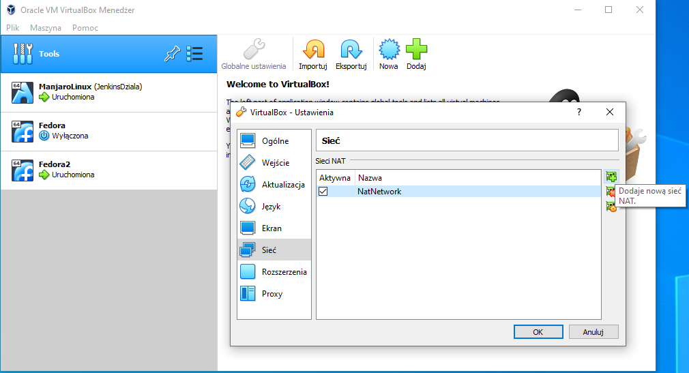  
Następnie zaznaczamy tę sieć i klikamy przycisk "Edytuj wybraną sieć NAT", który wygląda następująco:  
  
Wyskoczy nam nowe okienko, w którym ustawiamy następujące wartości i po ustawieniu klikamy ok:  
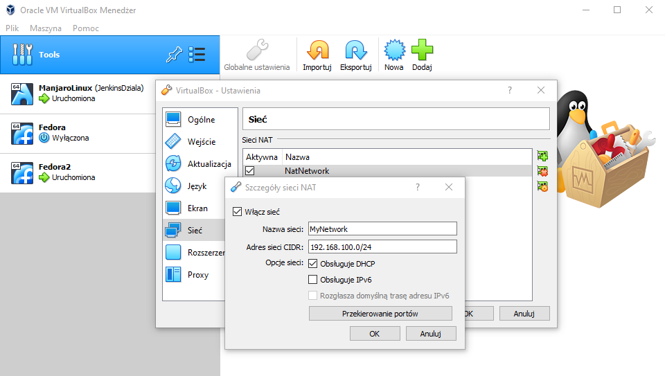  
  
Następnym krokiem jest ustawienie tej sieci w obu maszynach wirtualnych. Robimy to w następujący sposób: w oknie maszyny wirtualnej klikamy zakładkę "Maszyna", a następnie "Ustwienia":  
  
Kolejnym krokiem jest przejście do zakładki "Sieć" i ustawienie opcji w następujący sposób:  
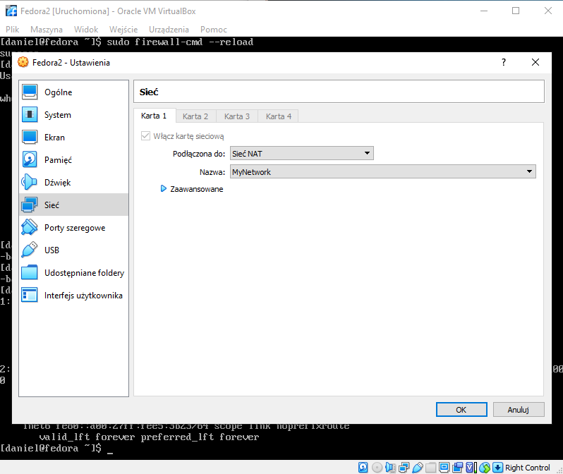  
Po wykonaniu tych kroków w obu maszynach wirtualnych, są one dla siebie widoczne. Możemy to przetestować pobierając adres ip maszyny z zainstalowanym serwerem nginx. Restart maszyny nie jest wymagany po ustawieniu sieci, ponieważ sama się ona nam przełączy. Adres ip sprawdzamy poleceniem `ip addr`:  
  
Możemy zauważyć, że adres ip jest z tego zakresu, który podaliśmy: 192.168.100.4  
Teraz na maszynie bez nginxa, możemy sprawdzić czy maszyna z nginx jest osiągalna, robimy to poleceniem `ping 192.168.100.4`. Możemy zauważyć, że pakiety są odbierane:  
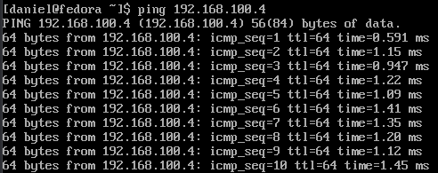  
* Umieść artefakty z projektu na serwerze HTTP  
  
Aby umieścić artefakt w odpowiednim katalogu, z którego można będzie można go pobrać musimy sprawdzić lokalizację root nginx. Sprawdzimy to w pliku /etc/nginx/nginx.conf w sekcji server:  
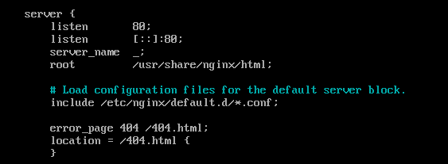  
Także nasz plik musimy wrzucić do katalogu /usr/share/nginx/html. Osiągnąłem to poprzez wejście do tego katalogu komendą `cd /usr/share/nginx/html`, następnie zainstalowanie wget poleceniem `sudo dnf install wget` i pobrałem mój artefaktu z innego serwera http, na którego go wrzuciłem, poniewa tak mi było najłatwiej i najszybciej przetransportować ten plik. Pobrałem go poleceniem `sudo wget https://r3craft.pl/download/1.0.1_DiscordSRV-Build-1.25.1-339e5e8.jar`, a następnie zmieniłem uprawnienia poleceniem `sudo chmod 777 1.0.1_DiscordSRV-Build-1.25.1-339e5e8.jar`. W tym momencie możemy już pobrać ten plik z serwera nginx na drugą maszynę:  
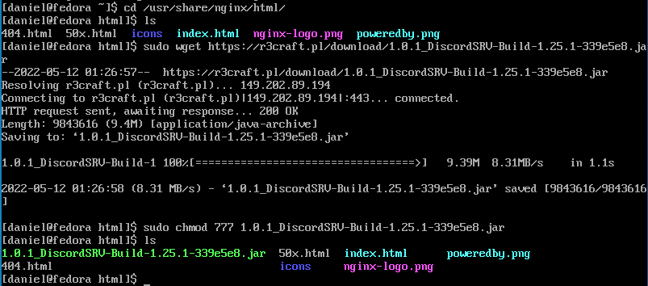  
* Na zainstalowanym systemie wykonaj zbiór poleceń umożliwiających pobranie artefaktu, zapisz polecenia  
  
Aby pobrać artefakt wytarczy należy na maszynie zainstalować wget: `sudo dnf install wget`, a następnie pobrać artefakt poleceniem: `wget --user-agent="Mozilla" http://192.168.100.4/1.0.1_DiscordSRV-Build-1.25.1-339e5e8.jar`. Pomyślnie pobranie artefaktu możemy zaobserwować na poniższym zrzucie ekranu:  
  

## 2. Instalacja nienadzorowana
* Zlokalizuj plik odpowiedzi z instalacji  
  
  
Plik odpowiedzi z instalacji znajduje się w katalogu /root.
* Dodaj do niego elementy odpowiedzialne za wszystkie potrzebne dependencje  
  
Dodałem następujące elementy:  
```cfg
%packages
@^minimal-environment
wget

%end
```
* Zdefiniuj repozytoria (co najmniej OS i aktualizacje, najlepiej też depednecje, optymalnie także repozytorium z własnym oprogramowaniem)  

Zdefiniowałem następujące repoytoria:
```  
# Repo
url --mirrorlist=http://mirrors.fedoraproject.org/mirrorlist?repo=fedora-$releasever&arch=x86_64
repo --name=updates --mirrorlist=http://mirrors.fedoraproject.org/mirrorlist?repo=updates-released-f$releasever&arch=x86_64
```
* Dodaj proces pobierania artefaktu (wybierz co najmniej jedno):  

Dodałem następując proces pobierania artefaktu:  
```cfg
%post
wget --user-agent="Mozilla" http://192.168.100.4/1.0.1_DiscordSRV-Build-1.25.1-339e5e8.jar

%end
```  
Cały plik konfiguracyjny można znaleźć na repozytorium:  
https://github.com/InzynieriaOprogramowaniaAGH/MDO2022_S/blob/DG401340/ITE/GCL03/DG401340/Lab09/anaconda-ks.cfg
  
## 3. Infrastructure as a code
* Umieść plik odpowiedzi w repozytorium
* Połącz plik odpowiedzi z ISO instalacyjnym
