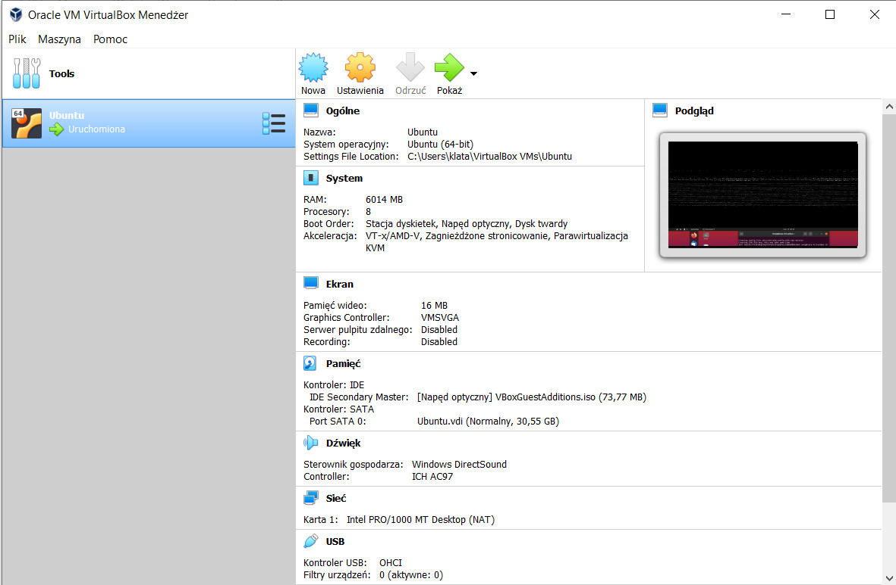
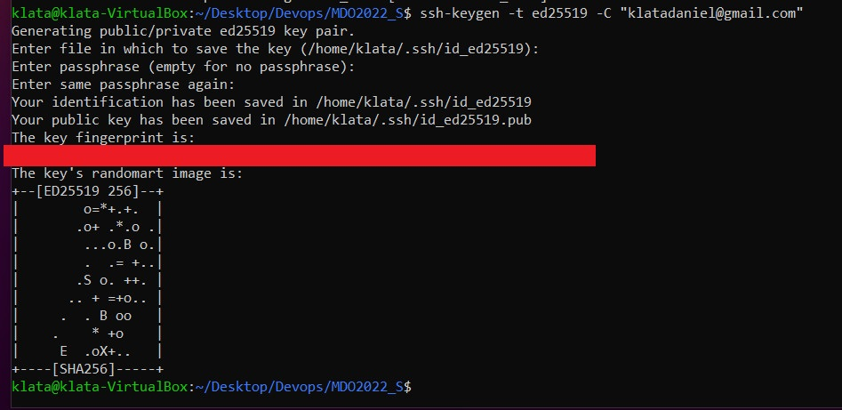
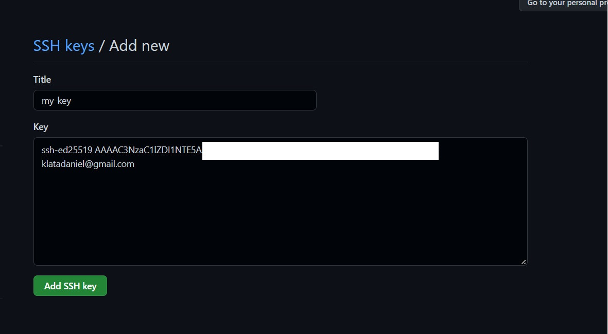
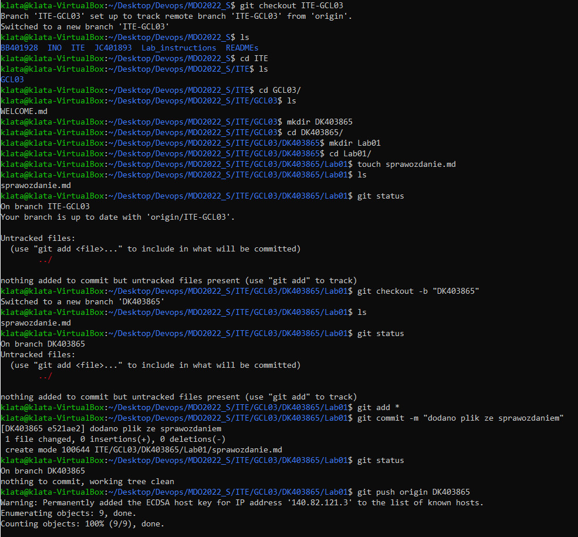
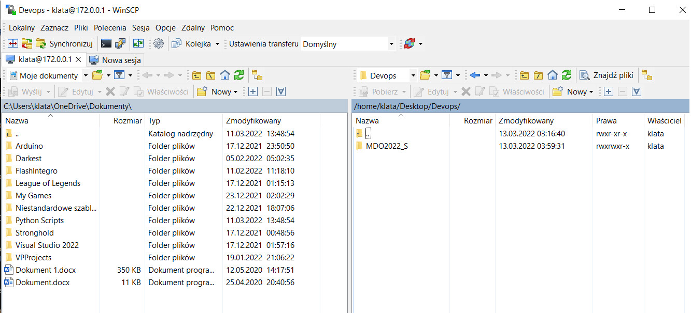

# Sprawozdanie DevOps - Lab01
### Daniel Klata - ITE-GCL03

## 1. Zainstaluj klienta Git i obsługę kluczy SSH

- Utworzono maszynę wirtualną w programie VirtualBox, pobrano na niej Git przy pomocy komendy `sudo apt-get install git` oraz pobrano obsługę ssh za pomocą komendy `sudo apt-get install openssh-server`

## 2. Przetestowano działanie git klonując repozytorium przy pomocy https, uzywając komendy `git clone {link_do_repo}`

## 3. Skonfigurowano połączenie githuba z maszyną przez SSH 
- wygenerowano klucze ssh (nie rsa):

- upewniono się, że agent ssh działa oraz dodano prywatny klucz:

- następnie skopiowano klucz publiczny i dodano go na githubie:

## 4, 5, 6 Stworzono nową gałąź odchodzącą od gałęzi grupy `ITE-GCL03` oraz dodano do niej plik sprawozdanie.md
- Użyto komendy `git checkout ITE-GCL03` aby przełączyć się na gałąź grupową
- Następnie użyto komendy `git checkout -b DK403865`, parametr -b tworzy nową gałąź, co oznacza, że stworzyliśmy swojego lokalnego brancha
- Na lokalnym branchu utworzono odpowiednie foldery komendą `mkdir {nazwa}`, a następnie dodano plik sprawozdanie.md
- Aby wypchnąć zmiany wykonano następujące kroki:
- Dodano zmiany do commita `git add *`
- Zcommitowano lokalnie do naszego brancha `git commit -m "wiadomosc"`
- Wypchnięto zmiany na zdalne repozytorium `git push origin KD403865` 

## Aby ułatwić pracę i przesłanie screenshotów do sprawozdania skonfigurowano połączenie menedżera plików WinSCP z maszyną wirtualną
