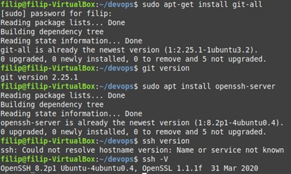
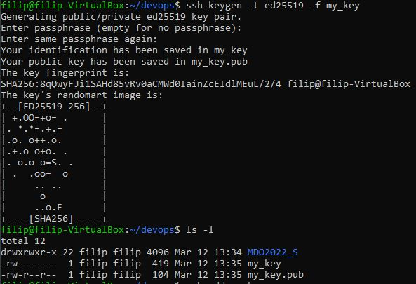
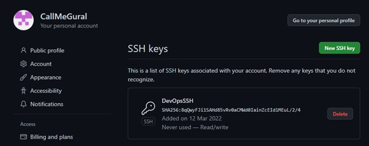
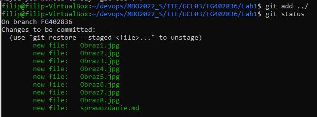
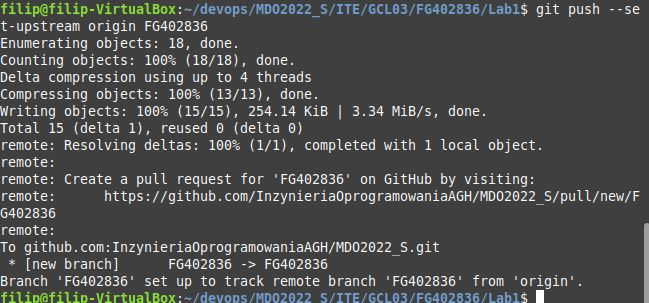
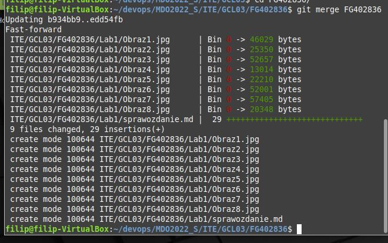

# Sprawozdanie 1
Filip Górnicki gr III DevOps
10.03.2022

## 1. Instalacja Gita oraz SSH na maszynie wirtualnej

### Zainstalowałem Gita oraz SSH-Server
## 2. Sklonowanie repozytorium przy pomocy HTTPS

###Wykonując operację git clone, sklonowałem repozytorium 
## 3. Wygenerowanie klucza SSH, dodanie go jako metodę dostępu do GitHuba oraz sklonowanie repozytorium przy pomocy SSH
### a. Generowanie klucza i dodanie go do agenta SSH

### Wykorzystałem komendę ssh-keygen

### Wykorzystałem komendę ssh-add
### b. Dodanie klucza SSH do konta na GitHubie

### c. Sklonowanie repozytorium wykorzystując SSH

### Wykonując operację git clone wraz z linkiem .git 
### Poprzednio usunąłem repozytorium sklonowane poprzez HTTPS (rm -r)
## 4. Przełączenie się na gałąź swojej grupy

### Wykorzystałem komendy git checkout
## 5. Utworzenie własnej gałęzi o nazwie "inicjały & nr indeksu"

### Wykorzystałem komendę git checkout z opcją -b
## 6. Dodanie plików do katalogu

### Dodałem pliki do katalogi
## 7. Dodanie i wysłanie zmian

### Komenda git add

### Komenda git commit

## 8. Próba wciągnięcia gałęzi do gałęzi grupowej

### Nie udało się wciągnąc gałęzi do gałęzi grupowej
## 9. Aktualizacja sprawozdania
