Kamil Kalisztan <br>
WIMiIP, IT, sem.: VI <br>
DevOps GCL03

- - -

# Sprawozdanie

## Instrukcja IX

### Przygotowanie wdrożeń nienadzorowanych dla platform z pełnym OS

--- 

## 1. Przygotowanie systemu pod uruchomienie

### a) Przeprowadź instalację systemu Fedora w VM, skonfiguruj użytkowników (użyj haseł, które można bezkarnie umieścić na GitHubie!), sieć, wybierz podstawowy zbiór oprogramowania, optymalnie bez GUI

* #### Obraz wybrany do realizacji tego laboratorium został pobrany ze strony: https://getfedora.org/en/server/download/ 
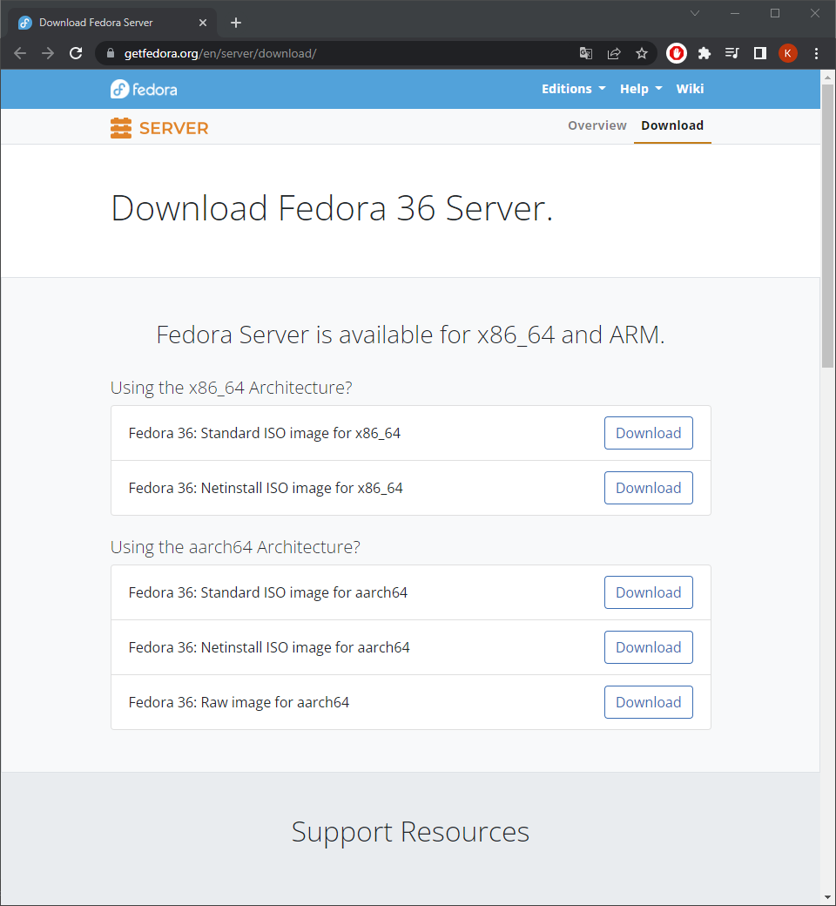

* #### Po pobraniu obrazu przeprowadzono instalację na pierwszej maszynie - "Fedora"

* #### W trakcie procesu instalacji dokonano następujących konfiguracji:
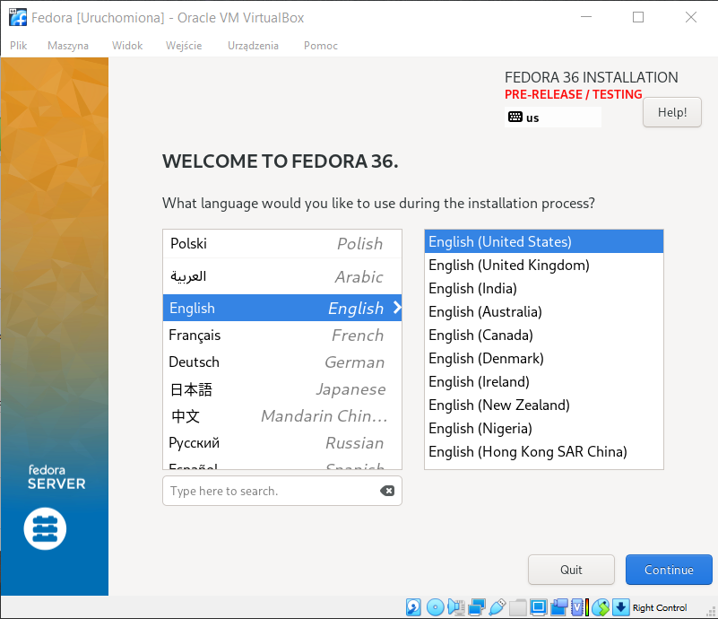
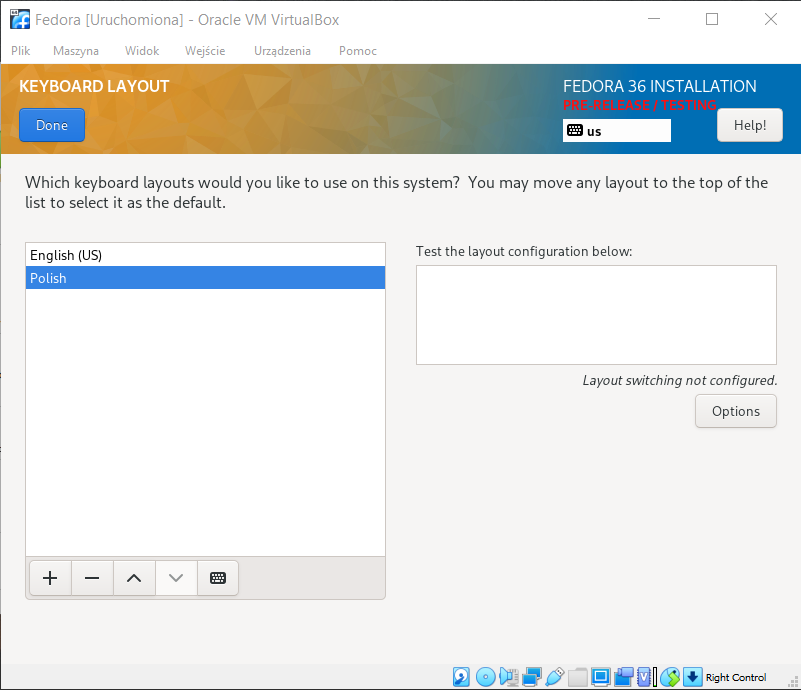
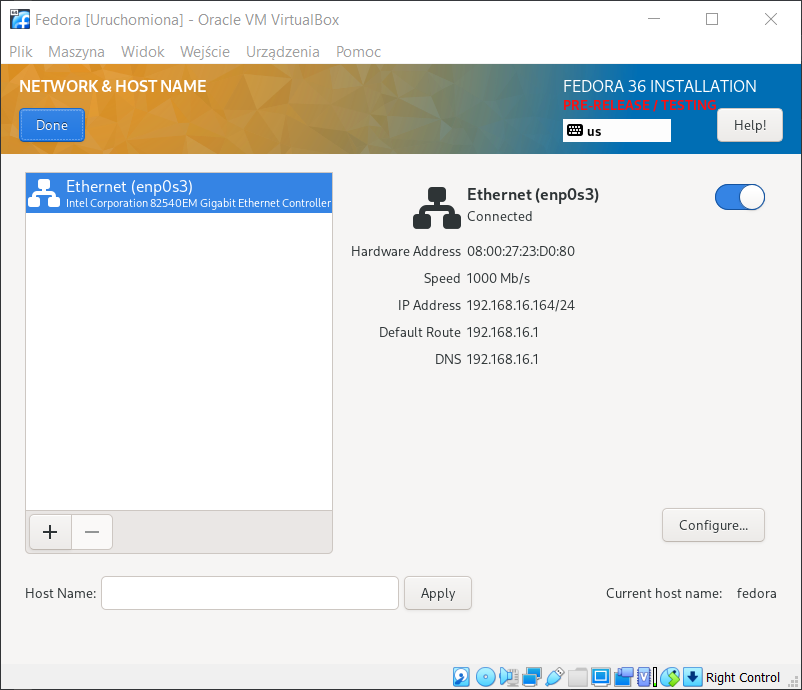

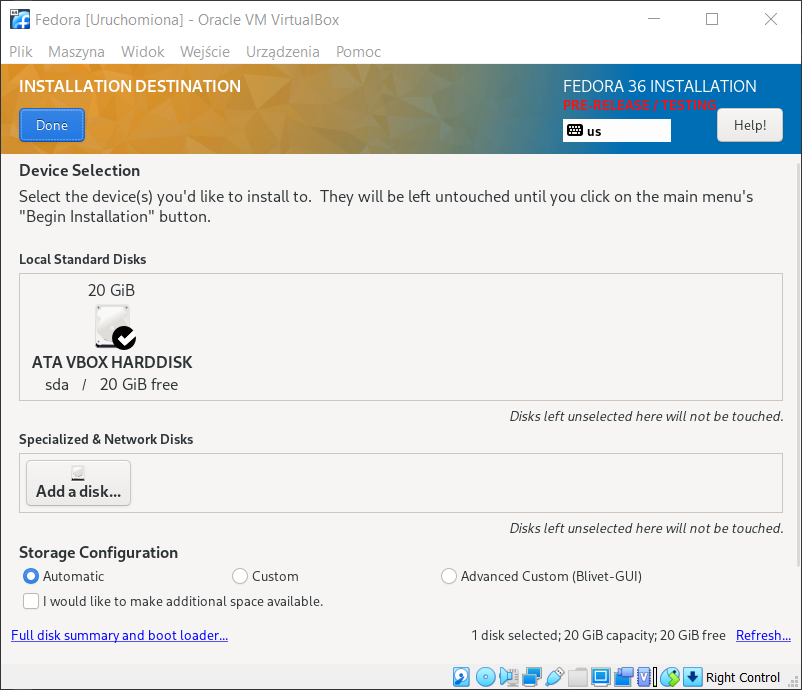
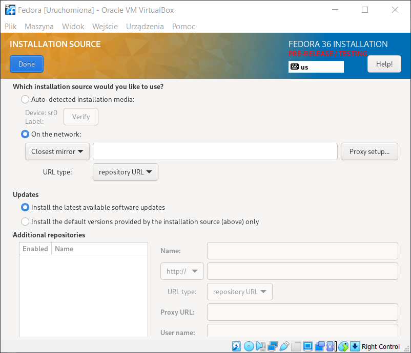


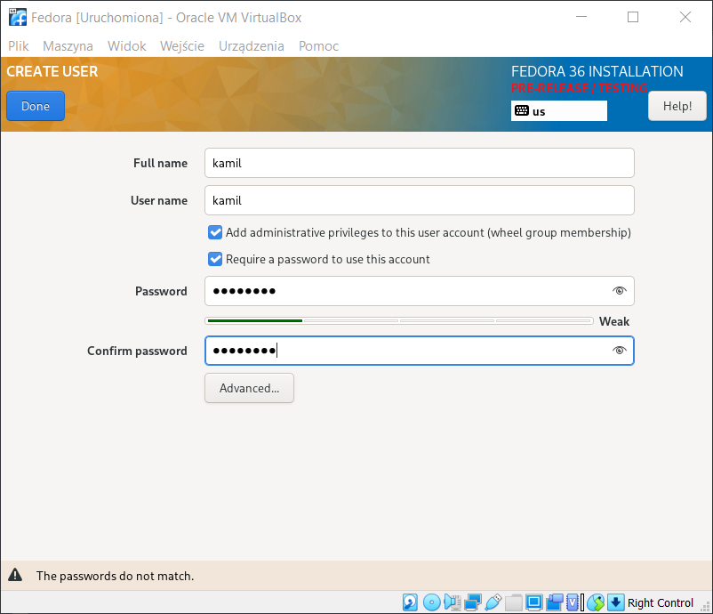


### b) Przeprowadź drugą instalację systemu Fedora w VM - celem drugiego systemu będzie wyłącznie serwowanie repozytorium przez HTTP

* #### Utworzono drugą maszynę ("Fedora2"), którą skonfigurowano w ten sam sposób


* #### Na tej maszynie dokonano instalacji serwera HTTP (w oparciu o https://codepre.com/pl/como-instalar-apache-servidor-web-en-fedora.html)
> ```sudo dnf group install "Web Server"```
>
> ```sudo firewall-cmd --add-service=http --add-service=https --permanent```
>
> ```sudo firewall-cmd --reload```

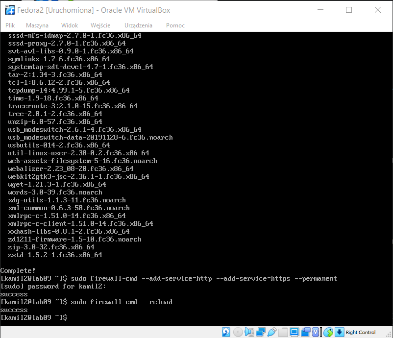

* #### Uruchomiono usługę

> ```sudo systemctl enable httpd --now```
>
> ```sudo systemctl status httpd```

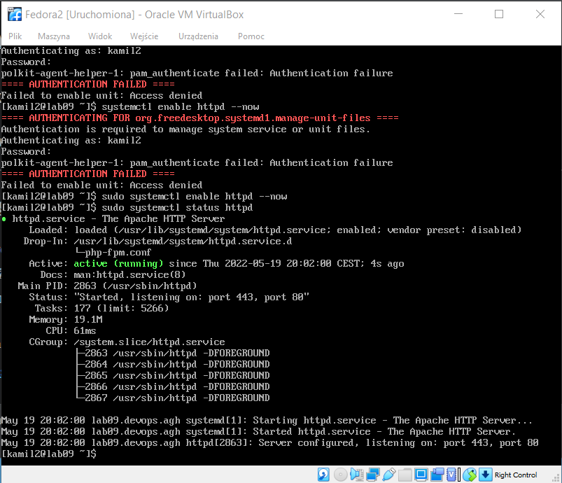
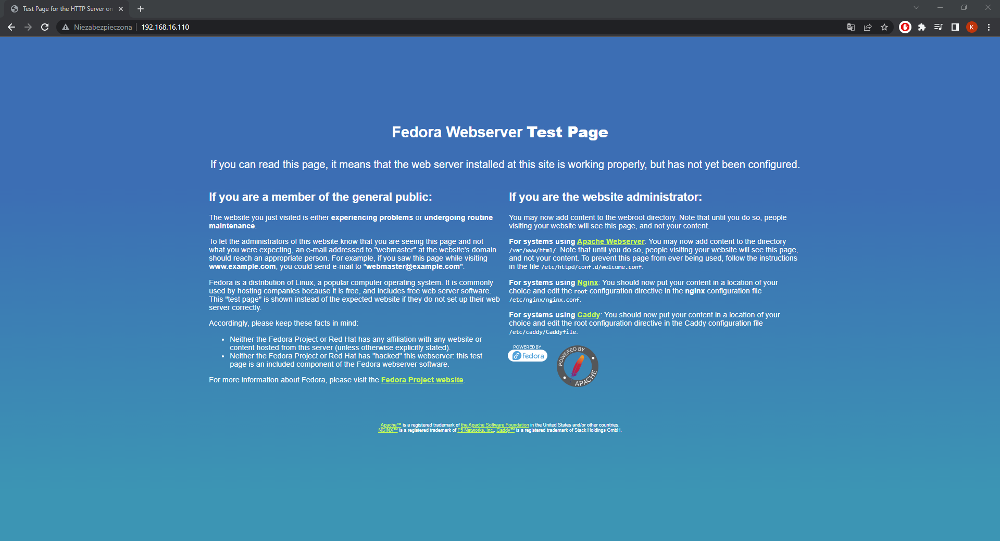

### c) Umieść artefakty z projektu na serwerze HTTP

* #### Umieszczono artefakt przy wykorzystaniu programu FileZilla, przy uprzednim zainstalowaniu usługi serwera ftp na maszynie wirtualnej.

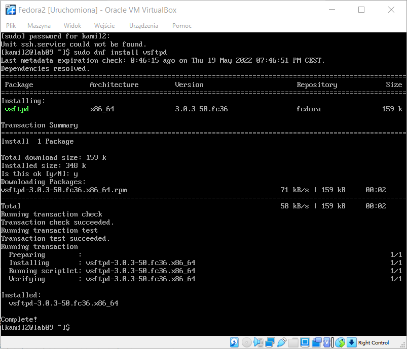
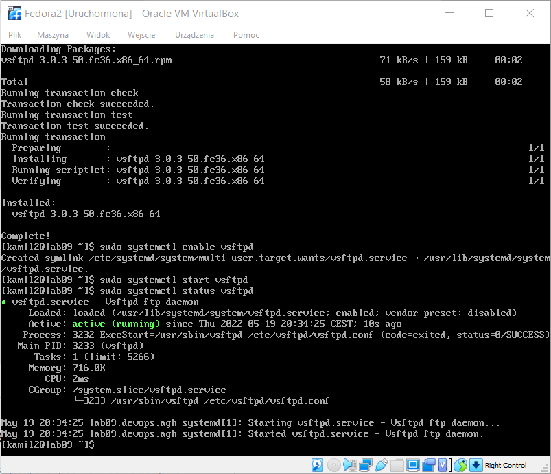


### d) Na zainstalowanym systemie wykonaj zbiór poleceń umożliwiających pobranie artefaktu, zapisz polecenia

* #### W celu pobrania artefaktu z serwera http został zainstalowany wget

> ```sudo dnf install wget``
>
> ```wget http://192.168.16.110/calculator/calculator-0.1.0.tgz```


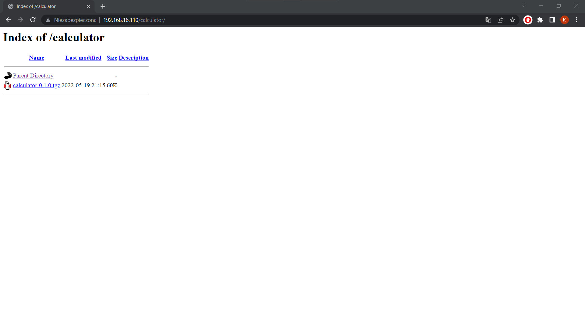
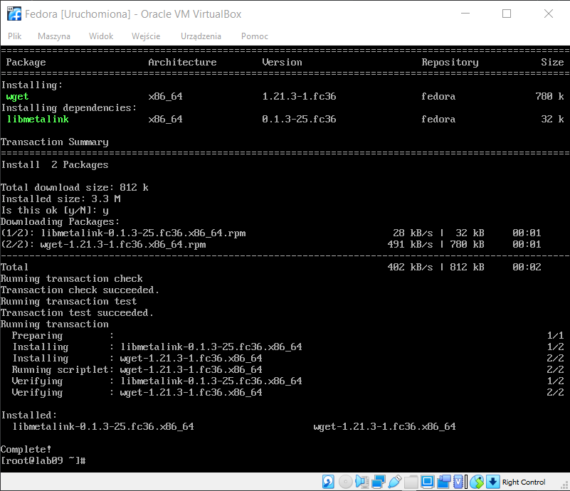
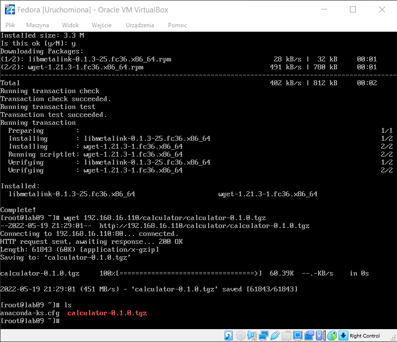


## 2. instalacja nienadzorowana  

### a) Zlokalizuj plik odpowiedzi z instalacji

* #### Plik "anaconda-ks.cfg" znajduje się w ścieżce:
> /root/anaconda-ks.cfg

### b) Dodaj do niego elementy odpowiedzialne za wszystkie potrzebne dependencje

* #### Do pliku dodałem instalację pakietu wget, repozytoria oraz komendę odpowiedzialną za pobranie artefaktu z serwera.


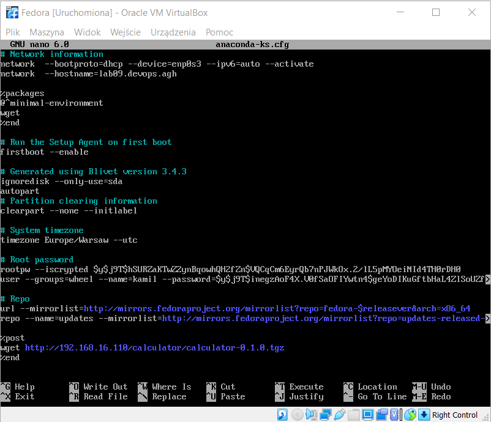

* #### Następnie umieściłem zedytowany plik na github'ie: https://github.com/InzynieriaOprogramowaniaAGH/MDO2022_S/blob/KK401258/ITE/GCL03/KK401258/Lab09/anaconda-ks.cfg


## 3. Infrastructure as a code

### a) Utworzyłem kolejną maszynę w analogiczny sposób jak poprzednie dwie.

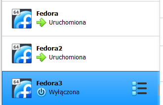

### b) Przystąpiłem do instalacji systemu
* #### Przed rozpoczęciem instalacji wprowadziłem następującą komendę ze ścieżką do piku na githubie
> vmlinuz initrd=initrd.img inst.stage2=hd:LABEL=Fedora-S-dvd-x86_64-36 rd.live.check quiet inst.ks=https://raw.githubusercontent.com/InzynieriaOprogramowaniaAGH/MDO2022_S/blob/KK401258/ITE/GCL03/KK401258/Lab09/anaconda-ks.cfg

### c) W rezultacie przeprowadzonej instalacji z wykorzytsaniem stworzonego pliku otrzymałem stan systemu po uruchomieniu, na którym znajdował się już pobrany z serwera artefakt:
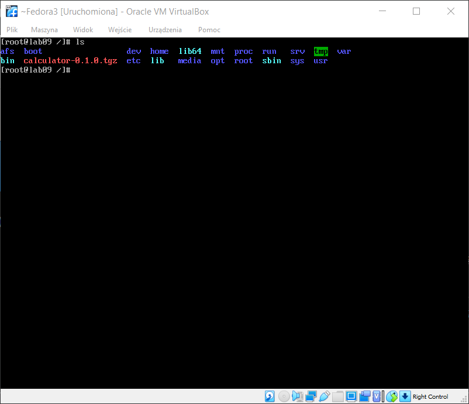


	


