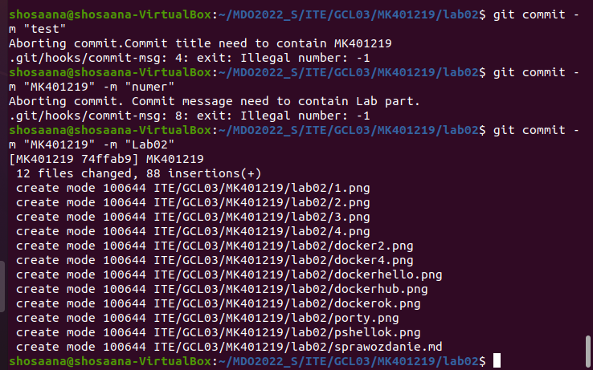
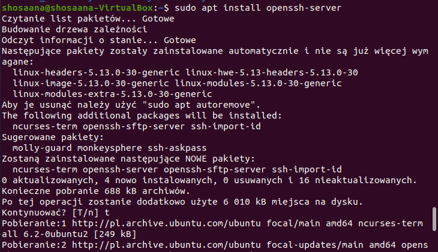
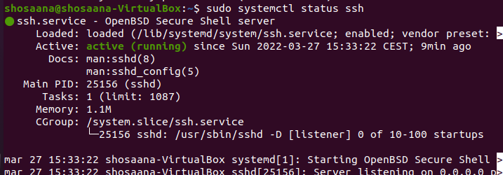
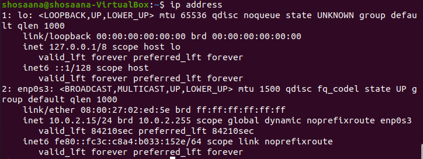
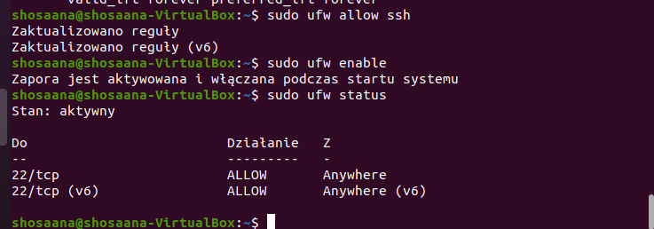
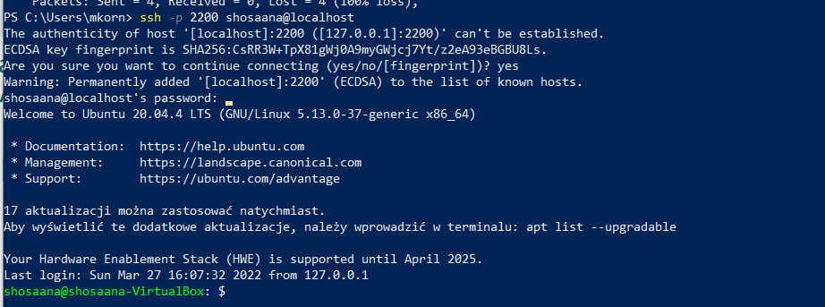
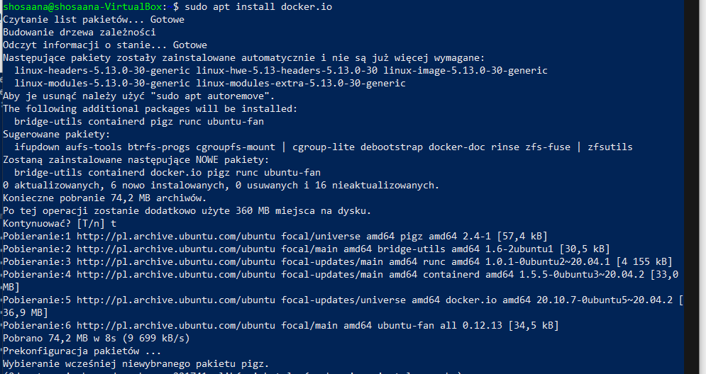
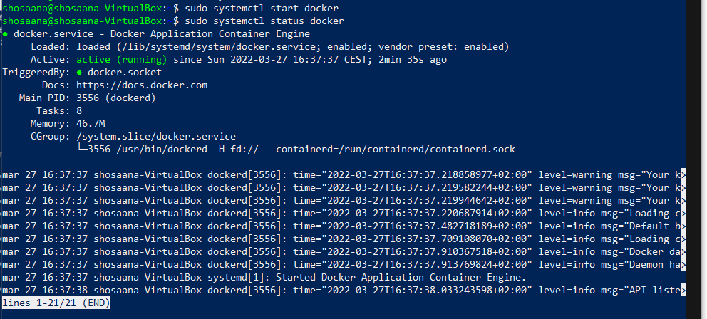
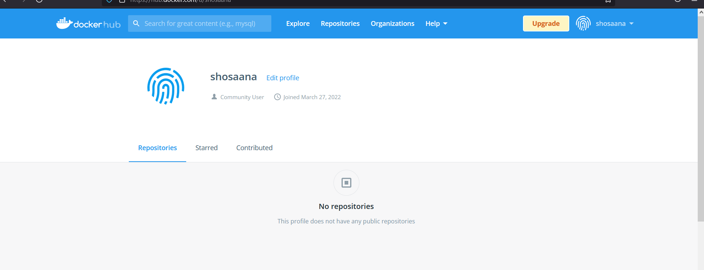

# 1. Przygotuj git hook, który rozwiąże najczęstsze problemy z commitami sprawdzający czy tytuł commita nazywa się ```<inicjały><numer indeksu>```
W katalogu .git/hooks w lokalnym repozytorium należało stworzyć plik commit-msg (```touch commit-msg```) zawierający skrypt:
```bash
#!/bin/sh
test -n "$(grep 'MK401219' ${1})" || {
echo >&2 "Aborting commit.Commit title need to contain MK401219"
exit -1
}
test -n "$(grep 'Lab' ${1})" || {
echo >&2 "Aborting commit. Commit message need to contain Lab part."
exit -1
}
```
Żeby plik działał należało mu dodać odpowiednie uprawnienia komendą ```chmod 750 commit-msg```.

Działanie git hook: 





# 2. Umieść hook w sprawozdaniu w taki sposób aby dało się go przejrzeć.
# 3. Rozpocznij przygotowanie środowiska dockerowego.
* zapewnij dostęp do maszyny wirtualnej przez zdalny terminal
Aby zrealizować ten podpunkt należało zainstaować na maszynie wirtualnej usługę OpenSSH - ```sudo apt install openssh```.





Usługa została zainstalowana, sprawdzono więc jeszcze jej status - ```sudo systemctl status ssh```.





Usługa jest aktywna więc kolejnym krokiem było sprawdzenie adresu IP maszyny komendą ```ip address```.





Aby umożliwić łączenie z maszyną przez ssh należało jeszcze umożliwić połączenie poprzez port ssh. Efekt taki uzyskano stsoując polecenie ```sudo ufw allow ssh``` otwierające port oraz uruchamiając firewalla z nową regułą: ```sudo ufw enable```. Dla pewności sprawdzono jeszcze status firewalla - ```sudo ufw status```. 





Ostatnią rzeczą, która należało wykonać prze dpołączeniem ssh było ustawienie przekierowania portów w ustawieniach sieciowych maszyny wirtualnej. Wykorzystany został do tego wcześniej sprawdzony adres ip.


Komendą ```ssh -p 2200 shosaana@localhost``` zostało nawiązane połączenie ssh z maszyną co przedstawiania poniższy zrzut ekranu:




* zainstaluj środowisko dockerowe w stosowanym systemie operacyjnym
Komendami ```sudo apt install docker``` oraz ```sudo apt install docker.io``` zainstalowano dockera.





Następnie poleceniem ```sudo systemctl start docker``` uruchomiono dockera i sprawdzono jego status (```sudo systemctl status docker```).





# 4.Działanie środowiska
*Wykaż że środowisko jest uruchomione i działa (z definicji)
Za pomocą polecenia ```sudo docker run hello-world``` uruchomiono aplikację testową na dockerze:


*Wykaż działanie w sposób praktyczny (z własności)
Ściągnięto obraz ubuntu poleceniem ```sudo docker pull ubuntu``` oraz uruchomiono kontener ```sudo docker run --name ub -it ubuntu```. Wersję sprawdzono z użyciem poleceń ```uname -a``` oraz ```cat /etc/lsb-release```:


# 5. Założ konto na Docker Hub
Założone konto na Docker Hub:



