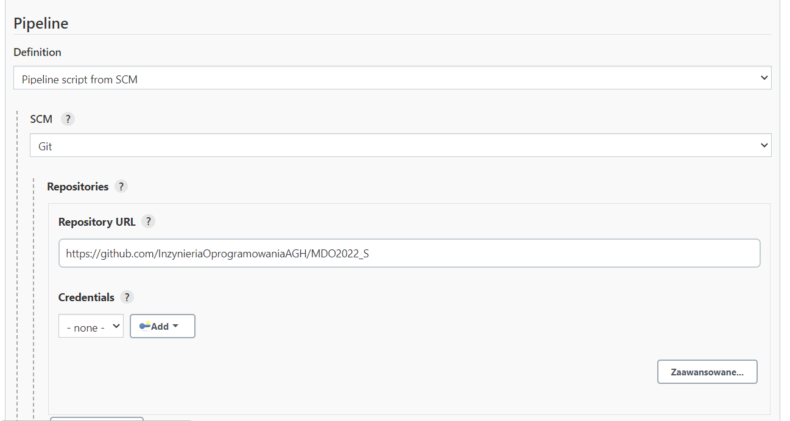
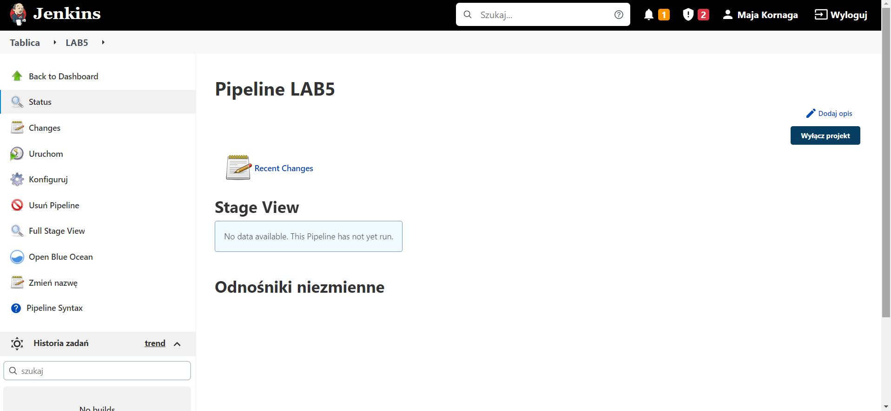
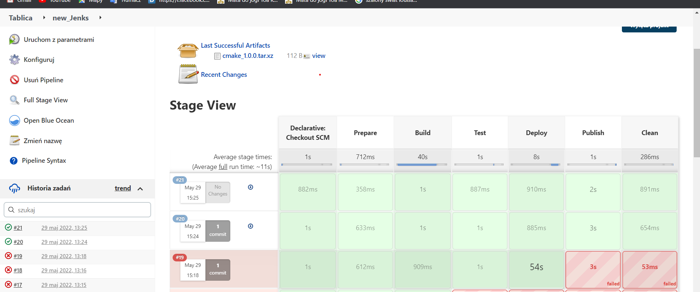

# Sprawozdanie z laboratorium nr 5
#Maja Kornaga
## Cel projektu:

Celem projektu było utworzenie pipeline'u za pomocą serwera Jenkins. Pipeline ma na celu zbudownie, testowanie, wdrożenie oraz opublikowanie wybranego projektu.
Użyto do tego celu programu z open sourcowego repozytorium - https://github.com/cytoscape/cytoscape.js. Technologie wykorzystane w projekcie to Jenkins, Docker, git oraz npm. 


## Utworzenie projektu:

### Przygotowanie kontenerów.
Na samym początku należało przygotować kontenery niezbędne do wykonania zadania. Były to dwa kontenery - jeden kontener z Jenkinsem oraz kontener z obrazem DIND. Szczegółowa instrukcja uruchamiania tych kontenerów została opisana w sprawozdaniu z laboratorium nr 4 (od podpunktu 3).
Komendą `sudo docker ps ` można sprawdzić poprawne uruchomienie kontenerów.


### Utworzenie projektu w Jenkinsie.
Po utworzeniu kontenerów należy połączyć się za pomocą url http://localhost:8080/ z Jenkinsem oraz zalogować. Następnie należy stworzyć nowy projekt typu pipeline, nazwać go oraz skonfigurować (zaznaczyć pola `Do not allow concurrent builds` oraz `To zadanie jest sparametryzowane`).


Następnie w opcjach zaawansowanych jako Definition należy wybrać z listy rozwijanej `Pipeline script from SCM` oraz jako SCM należy wybrać opcję `Git` z listy rozwijanej. Ponadto należy dodać Repository URL, tj. repozytorium przedmiotu `https://github.com/InzynieriaOprogramowaniaAGH/MDO2022_S`. 



Kolejnym krokiem jest dodanie Branch Specifier. W polu należy wpisać nazwę własnego brancha - `*/MK401219` oraz w ostatnim polu dodać ścieżkę do Jenkinsfile `ITE/GCL03/MK401219/lab05/Jenkinsfile`.

Po utworzneiu projektu widoczny jest następujący erkan startowy:




### Niezbędne pliki.
Przed przejściem do pisania pipeline należy umieścić pliki dockerfile w branchu dodanym podczas konfiguracji. W tym przypadku są to trzy pliki `Dockerfile_Build`, `Dockerfile_Test` oraz uprzednio wskazany plik `Jenkinsfile`. 


`Dockerfile_Build`:
```
FROM ubuntu:latest

RUN DEBIAN_FRONTEND=noninteractive
ENV TZ=Europe/Warsaw
RUN ln -snf /usr/share/zoneinfo/$TZ /etc/localtime && echo $TZ > /etc/timezone

RUN apt update
RUN apt install -y tzdata git cmake build-essential

RUN git clone https://github.com/dmonopoly/gtest-cmake-example
WORKDIR gtest-cmake-example
RUN mkdir build
WORKDIR build
RUN cmake ..
RUN make
RUN cd ..
RUN cmake -Dtest=ON ..
RUN make
RUN ./project1

```
Pierwszy z plików odpowiedzialny jest za budowanie projektu. Wykonywane jest w nim po kolei klonowanie projektu z repozytorium, instalowanie zależności oraz komendy `cmake` oraz `make` stricte odpowiedzialne za build programu.

`Dockerfile_Test`:
```
FROM mk_build:latest
RUN ./runUnitTests

```
Plik DockerfileTest odpowiedzialny jest natomiast za uruchomienie testów znajdujących się w projekcie.
Ostatnim pilkiem jest plik Jenkinsfile zawierający treść całego pipelinu.

`Jenkinsfile`:

```
pipeline
{
 	parameters
    {
        	string(name: 'VERSION', defaultValue: '1.0.0', description: '')
        	booleanParam(name: 'PROMOTE', defaultValue: true, description: '')
    }
		agent any
		stages
	{
	
	stage('Prepare')
		{
			steps
			{
		sh '''
		echo "Project preparing.."
				
			
		docker volume prune -f
		docker volume  create --name volume_in
				docker volume  create --name volume_out
				 	      
                    		echo "Preparing finished."
				'''
				
			}
		}
	
		stage('Build')
		{
			steps
			{
			sh '''
			echo "Project building..."
				
				docker build . -f ./ITE/GCL03/MK401219/lab05/Dockerfile_Build -t mk_build
                    		docker run --mount type=volume,src="mk_build",dst=/volume_in mk_build:latest bash -c "cd .. &&  cp -r build/ volume_in/ && cp -r volume_in/ volume_out/ && ls ./volume_in && ls ./volume_out" 
                    		 	      
                    		echo "Building finished."
				'''
				
			}
		}
		
		stage('Test')
		{
			steps
			{
			sh '''
			echo "Project testing..."
				
	docker rm -f Dockerfile_Test || true
	docker build . -f ./ITE/GCL03/MK401219/lab05/Dockerfile_Test -t mk_test
	docker run --name test_container --rm --mount source=mk_test,target=/volume_in mk_test:latest
				
	echo "Testing finished."
				'''
			}
		}
		
		 stage('Deploy')
        {
            steps
            {
                sh '''
             echo "Project deploying..."
                
             docker rm -f deploy_container || true
             docker run -dit --name deploy_container --mount type=volume,src="volume_out",dst=/mk_project node
             exit $(docker inspect deploy_container --format="{{.State.ExitCode}}")
                
                echo "Deploying finished."
            	 '''
            }
        }
        
       stage ('Publish')
        {
            when
            {
                expression {return params.PROMOTE}
            }
            steps
            {
            	sh ''' echo "Publishing project..." '''
            	 
              sh 'rm -rf /var/jenkins_home/workspace/artifacts_mk'
              sh 'mkdir /var/jenkins_home/workspace/artifacts_mk'
              sh 'chmod -R 777 /var/jenkins_home/workspace/artifacts_mk'
              sh 'docker rm -f mk_publish || true'
              sh 'docker run -d --name mk_publish --mount type=volume,src="volume_out",dst=/usr/local/mk_project --mount type=bind,source=/var/jenkins_home/workspace/artifacts_mk,target=/usr/local/mk_copy node bash -c "chmod -R 777 /usr/local/mk_project && chmod -R 777 /var/jenkins_home/workspace/artifacts_mk && cp -R /usr/local/mk_project/. /usr/local/mk_copy"'
                sh "tar -zcvf cmake_${params.VERSION}.tar.xz -C /var/jenkins_home/workspace/artifacts_mk ."
                archiveArtifacts artifacts: "cmake_${params.VERSION}.tar.xz"
                
              sh ''' echo "Publishing finished." '''
                
            }
        }
        
        stage('Clean')
		{
			steps
			{
			sh '''
			echo "Project cleaning..."
				
			docker rm -f mk_build || true
                	docker rm -f mk_test || true
                	docker rm -f deploy_container || true
                	docker rm -f mk_publish || true
				
			echo "Cleaning finished"
				'''
			}
		}
        
	}
	
	
}

```
`Prepare`

Plik Jenkinsfile składa się z kilku poszczególnych części zwanych stage'ami. Pierwszym z nich jest Stage Prepare odpowiedzialny za utworzenie dwóch woluminów - wejściowego oraz wyjściowego. Zastosowane jest tu również zabezpieczenie usuwające pozostałe po uprzednich uruchominiach kontenery oraz woluminy.

`Build`

W drugim kroku przeprowadzany jest build projektu znajdującego się pod wskazanym linkiem. Uruchamiany jest tu kontener wynikowy z podpiętym woluminem wejściowym. Zbudowany projekt kopiowany jest do obu poprzednio utworzonych woluminów (volume_in oraz volume_out), po czym wyświetlana jest ich zawartośc w celu weryfikacji poprawności wykonanego kopiowania. dzięki któremu projekt jest kompilowany, a następnie pliki wynikowe są kopiowane z woluminu wejściowego na wyjściowy.  

`Test`

W kroku trzecim testowany jest program - na podstawie dockerfile `Dockerfile_Test` tworzony jest kontener `mk_test`, w którym uruchamiane są testy znajdujące się w projekcie. 

`Deploy`

Krok ten odpowiedzialny jest za wdrożenie projektu. Uruchamiany jest tutaj kontener z podpiętym woluminem wyjściowym, w celu wdrożenia projektu.

`Publish`

W kroku publish pubikowany jest program. Sprawdzany jest tutaj parametr `PROMOTE` na podstawie, którego przeprowadzana jest weryfikacja czy należy publikować nową wersję programu czy też nie. Uruchamiany jest tutaj kontener do publikowania (`mk_publish`) z podpiętym woluminem wyjściowym oraz tworzony jest artefakt z numerem wersji określonym w parametrze `VERSION`. Krok publish tworzy paczkę z projektem.

`Clean`

Krok ten kończy działanie pipeline - odpowiedzilany jest za usuwanie powstałych uprzednio kontenerów.


### Uruchomienie projektu.

W celu uruchomienia projektu należy wcisnąć przycisk uruchom z parametrami widoczny po lewej stronie tablicy projektu (Przy pierwszym uruchomieniu jest to tylko przycisk uruchom, należy więc uruchomić pipeline ponownie w celu utworzenia artefaktów). Nie jest konieczne zmienianie domyślnych wartości ustawionych parametrów.
Na poniższym zrzucie ekranu widoczne jest prawidłowe ukończenie poszczególnych etapów.




### Diagram aktywności.

