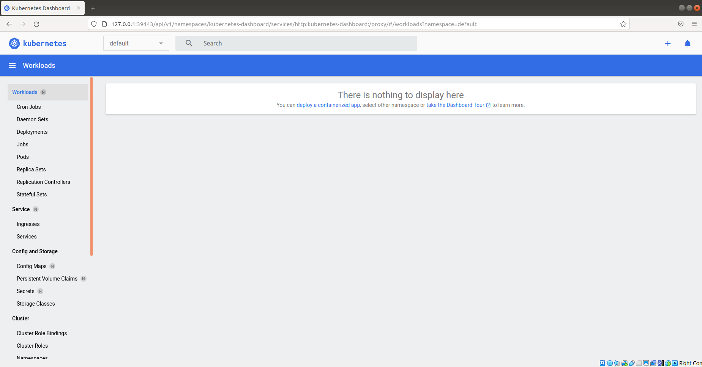
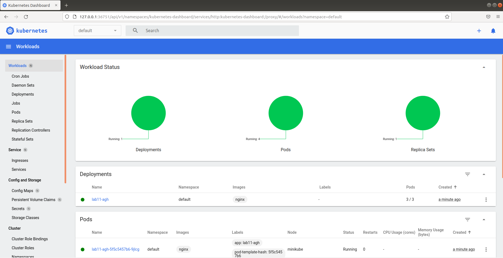

Wojciech Jaskowski

# Sprawozdanie

### Instalacja klastra Kubernetes

* Zaopatrz się w implementację stosu k8s: minikube

```
curl -LO https://storage.googleapis.com/minikube/releases/latest/minikube-linux-amd64
```


* Przeprowadź instalację, wykaż poziom bezpieczeństwa instalacji

```
sudo install minikube-linux-amd64 /usr/local/bin/minikube
```


* zaopatrz się w polecenie kubectl

Pobranie kubectl oraz checksum kubectl

```
curl -LO "https://dl.k8s.io/release/$(curl -L -s https://dl.k8s.io/release/stable.txt)/bin/linux/amd64/kubectl"
curl -LO "https://dl.k8s.io/$(curl -L -s https://dl.k8s.io/release/stable.txt)/bin/linux/amd64/kubectl.sha256"
```


Instalacje kubectl

```
sudo install -o root -g root -m 0755 kubectl /usr/local/bin/kubectl
```


* Uruchom Kubernetes, pokaż działający kontener/worker

```
sudo minikube start
```


Poprawne uruchomienie wymaga dodania użytkownika do grupy docker

```
sudo usermod -aG docker $USER
newgrp docker
```


```
minikube start
```


Dodanie aliasu

```
kubectl get po -A
alias kubectl="minikube kubectl --"
```


* Uruchomienie Dashboardu

```
minikube dashboard
```




### Analiza posiadanego kontenera

Wykorzystywana wcześniej aplikacja nie nadaje się do wykorzystania podczas tego ćwiczenia, dlatego wykorzystano obraz nginx.

* Pobrano obraz nginx oraz uruchomiono 

```
docker pull nginx
docker run -it --rm -d -p 8090:80 --name nginx_agh nginx
```


### Uruchomienie oprogramowania

```
kubectl run nginx-lab11 --image=nginx --port 80 --labels app=nginx-lab11
```


```
kubectl port-forward nginx-lab11 9999:80
```


### Przekucie wdrożenia manualnego w plik wdrożenia (wprowadzenie)

* Zapisanie wdrożenia jako plik YML

```yaml
apiVersion: apps/v1
kind: Deployment
metadata:
  name: lab11-agh
spec:
  selector:
    matchLabels:
      app: lab11-agh
  replicas: 3
  template:
    metadata:
      labels:
        app: lab11-agh
    spec:
      containers:
      - name: nginx-agh
        image: nginx
        ports:
        - containerPort: 80
```

```
kubectl apply -f kubernetes-deployment.yml
```


