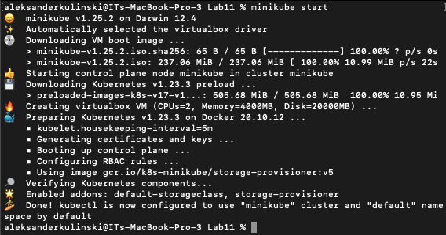
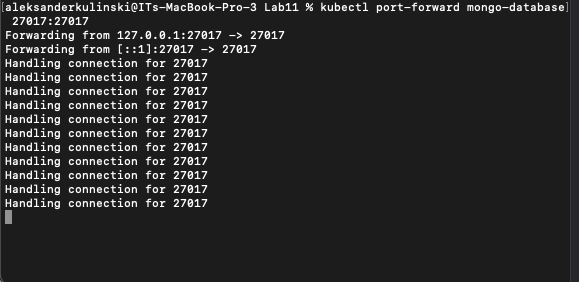
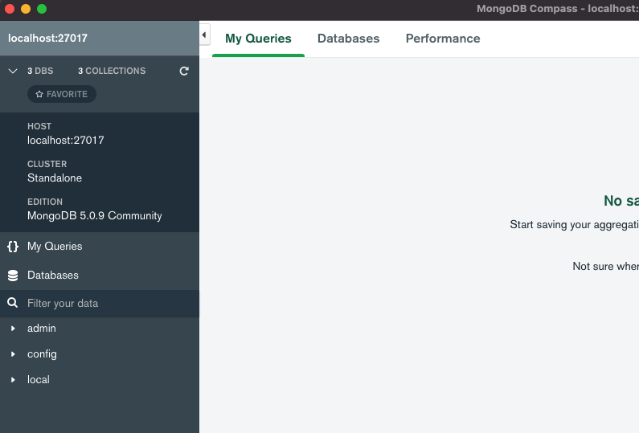

# Sprawozdanie z Lab11
### Instalacja minikube'a



### Uruchomienie minikube w dashboardzie


### Uruchomienie mongo bezpośrednio z obrazu


### Screen z działającego poda


### Przekierowanie portów


### Podłaczenie do hostowanej bazy


## Część druga

### Plik .yaml z configiem deploymentu
```
apiVersion: apps/v1
kind: Deployment
metadata:
  name: mongo-database
  labels:
    app: mongo-database
spec:
  replicas: 4
  selector:
    matchLabels:
      app: mongo-database
  template:
    metadata:
      labels:
        app: mongo-database
    spec:
      containers:
      - name: mongo-database
        image: mongo:latest
        ports:
        - containerPort: 27017
```
### Wersja z 4 replikami


### Wersja z pojedynczym podem


### Wersja z zerem replik


### Uruchomienie ze zmienioną wersja obrazu na latest


### Rollout status z poprawnie wdrożonym deploymentem


### Zmieniona wersja obrazu, na taką która wywoła crash


### Odwołanie wykonanych czynności przez rollout undo


## Kontrola wdrożenia
### Komenda do uruchomienia skryptu:
```
sleep 60 && sh ./Lab11/script.sh
```
### skrypt
```
cmd() {
    kubectl rollout status deployment/mongo-database
}
if cmd | grep -q 'successfully rolled out'; then
  echo "Deployment is up and running"
else
  echo "Deployment is not running"
fi
```

### Strategia recreate
recreate - pody za każdym razem zostają wyłączone i tworzeone są od nowa, wszystkie jednoczesnie
```
apiVersion: apps/v1
kind: Deployment
metadata:
  name: mongo-database
  labels:
    app: mongo-database
spec:
  strategy:
    type: Recreate
  replicas: 4
  selector:
    matchLabels:
      app: mongo-database
  template:
    metadata:
      labels:
        app: mongo-database
    spec:
      containers:
      - name: mongo-database
        image: mongo:latest
        ports:
        - containerPort: 27017
```

### Strategia rolling update
rolling update - Jednoczesnie updatowana jest n podow. W danym momencie wyłączane jest n podów, kiedy wstaną - kolejna są updateowane.
```
apiVersion: apps/v1
kind: Deployment
metadata:
  name: mongo-database
  labels:
    app: mongo-database
spec:
  strategy:
    type: RollingUpdate
    rollingUpdate:
      maxSurge: 2
      maxUnavailable: 1
  replicas: 4
  selector:
    matchLabels:
      app: mongo-database
  template:
    metadata:
      labels:
        app: mongo-database
    spec:
      containers:
      - name: mongo-database
        image: mongo:latest
        ports:
        - containerPort: 27017
```

### Strategia canary

canary - Wymagane są dwa deploymenty, ze starą i nową wersją. Następnie manualnie zmieniamy wersje która działa na danym podzie.
