# Zajęcia 04 
## Rosiak Błażej
## Dodatkowa terminologia w konteneryzacji, instancja Jenkins
### Zachowywanie stanu
 - Utworzono wolumin wejściowy i wyjściowy komendą `docker volume create <nazwa>` o nazwach odpowiednio:
	> input_v
	>  output_v

Woluminy te wyświetlono komendą `docker volume ls`:
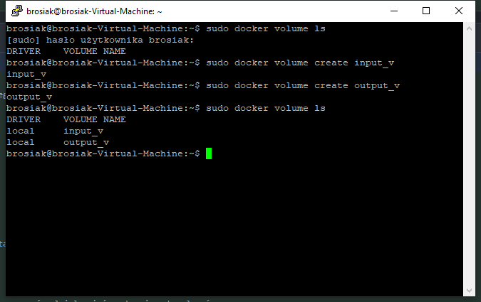

- Uruchomiono kontener i zainstalowano zależności (bez gita):
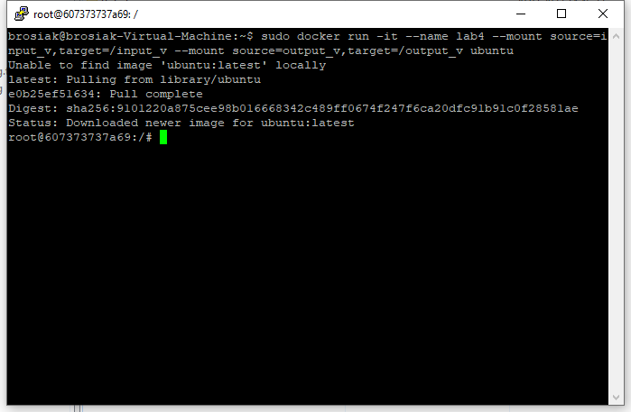
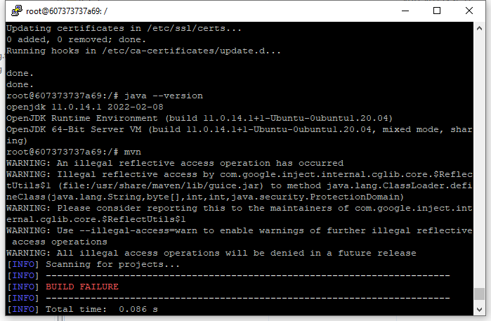

- Repozytorium *GITa* zostało sklonowane przy użyciu `git clone` podając jako argument ścieżkę, gdzie chcemy to repozytorium zapisać
> /var/lib/docker/volumes/input_v/_data

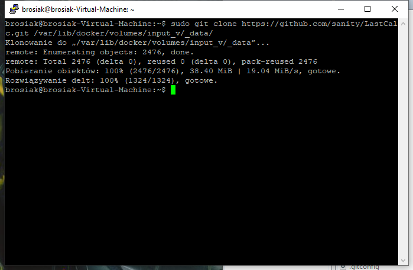
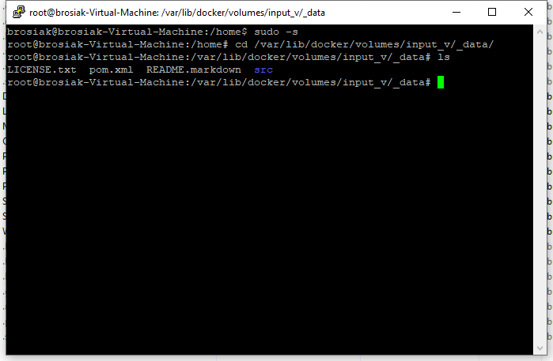 
Potwierdzenie skopiowania się repozytorium do podanego wyżej katalogu.

- W kontenerze zbudowano projekt wcześniej sklonowanego repozytorium oraz przekopiowano go na wolumin wyjściowy.
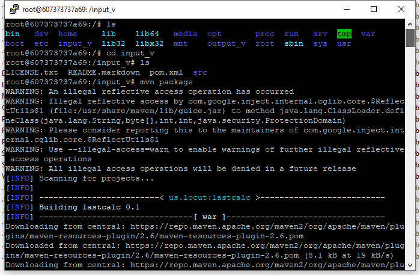
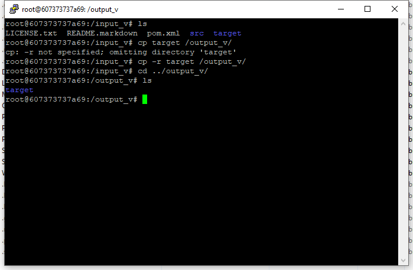

- Sprawdzono, czy na maszynie wirtualnej powstał zbudowany projekt.
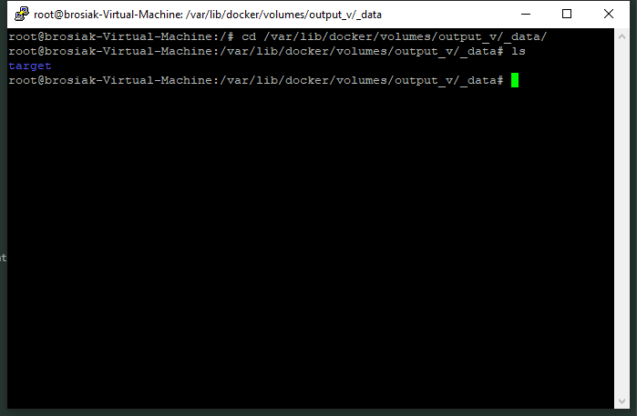

---
### Eksponowanie portu
- W kontenerze zainstalowano i uruchomiono serwer *iperf3*, by nasłuchiwał na porcie 1999.
> iperf3 -s -p 1999

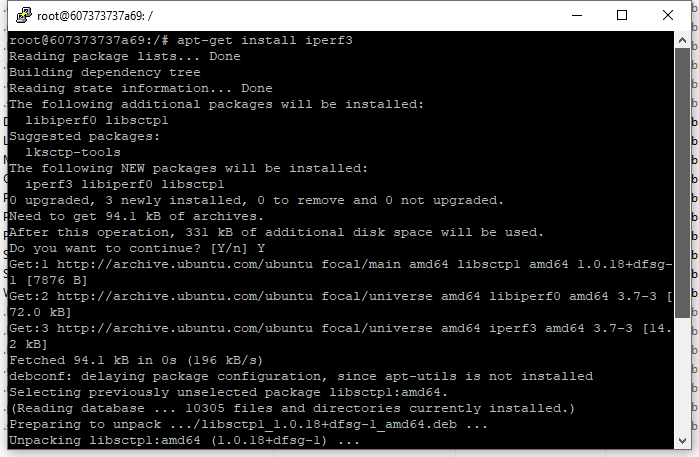
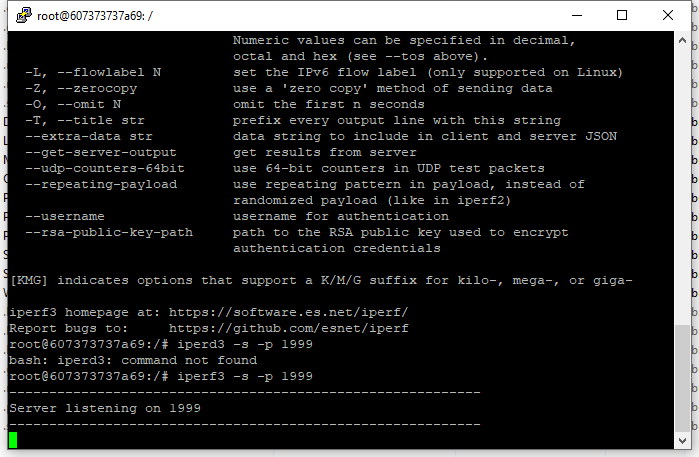

- Zainstalowano również *nettools*, by mieć dostęp do komendy `ifconfig`, by w łatwy sposób dostać się do adresu IP kontenera.

- Uruchomiono drugi kontener i powtórzono czynności z poprzednich punktów (instalacja *iperf3* i *nettools*). 
> iperf3 -c 172.17.0.2 -p 1999

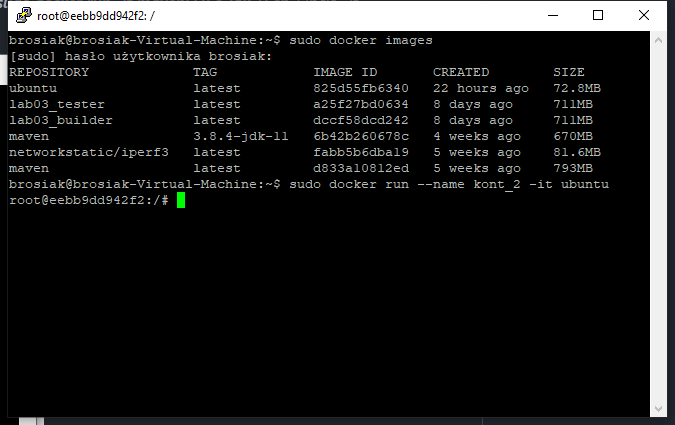

- Na hoście zainstalowano *iperf3* i połączono się z kontenerem tak samo jak w poprzednim punkcie

- Problem pojawił się próbując połączyć się z serwerem *iperf3* kontenera spoza hosta. Pierwsze próby łączenia, przekierowywania portów na nic się nie zdawały. Dopiero uruchomienie usługi **Telnet** w systemie Windows poskutkowało połączeniem się z kontenerem.
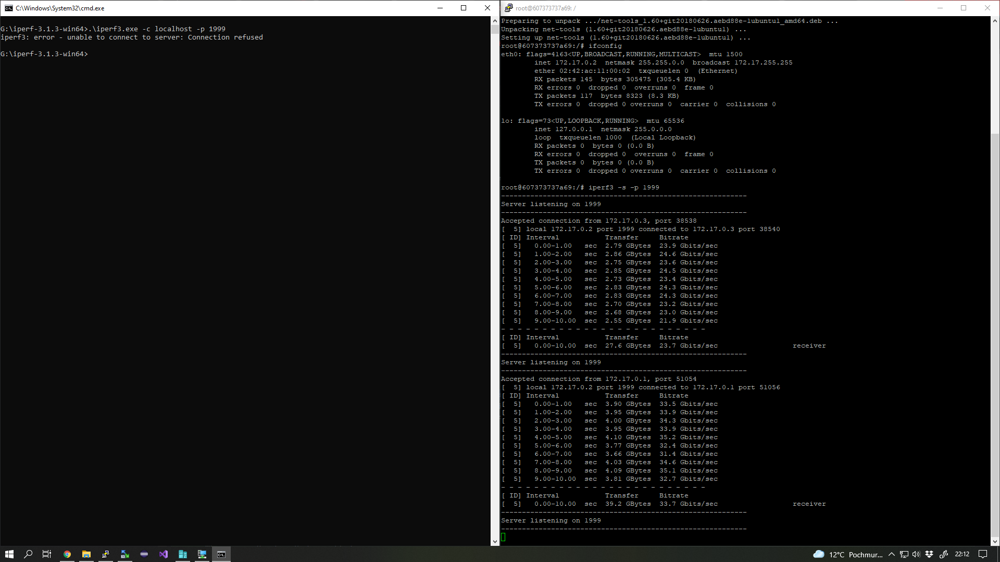

---
### Instancja Jenkins
- Instalację instancji *Jenkins* przeprowadzono krok po kroku według "*poradnika*" `https://www.jenkins.io/doc/book/installing/docker/`.
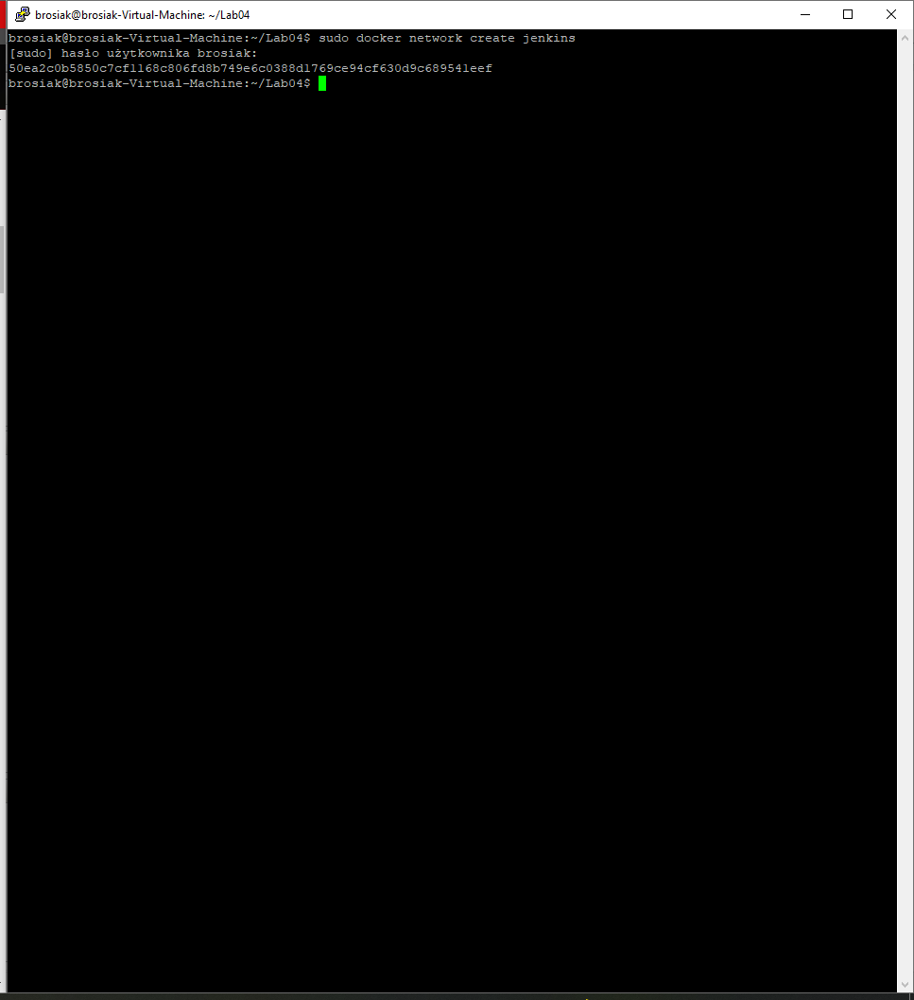

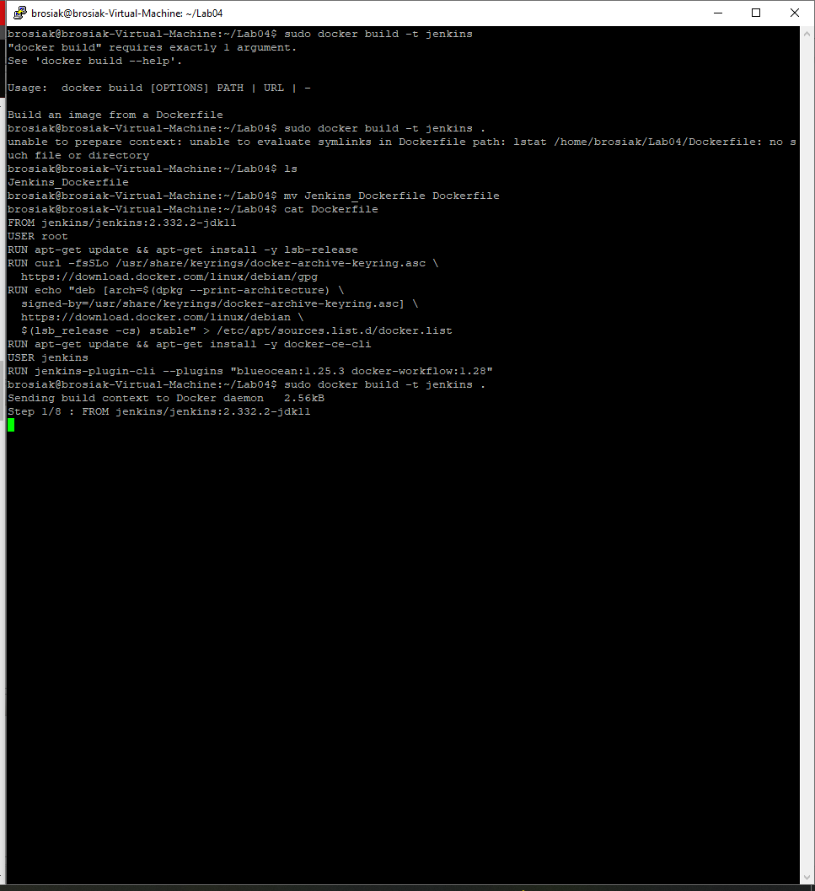

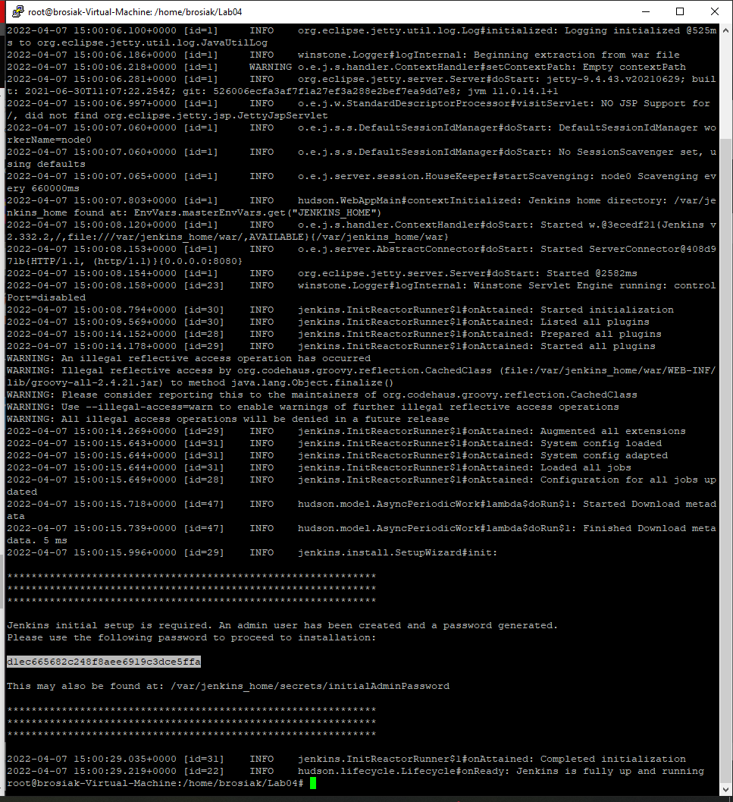

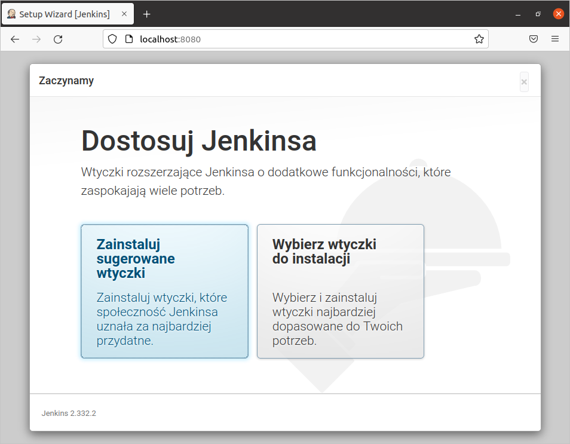
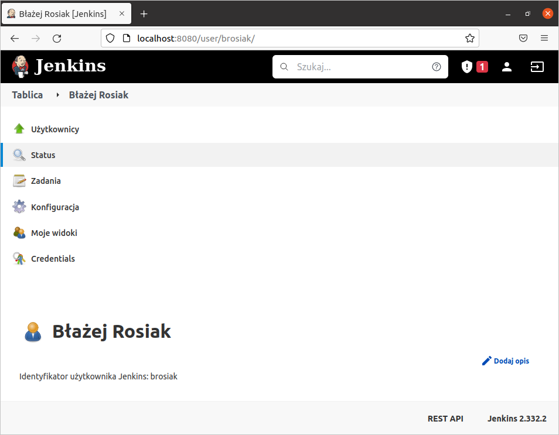