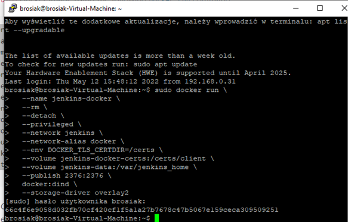
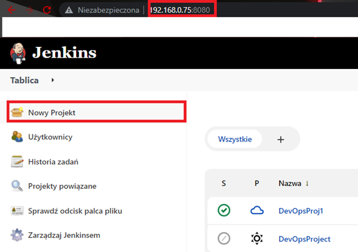
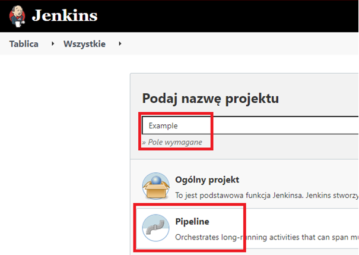
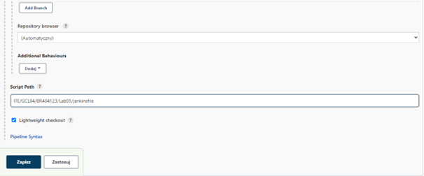
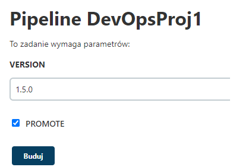

# Projekt 
## Rosiak B³a¿ej
### Przygotowujemy pipeline
Niniejsze sprawozdanie zawiera przebieg realizacji projektu dotycz¹cego przygotowania _pipeline_. Ze wzglêdu na charakter zadania oraz wymaganie, ¿eby wiêkszoœæ osób by³a w stanie odtworzyæ etapy budowania artefaktu, jêzyk techniczny/fachowy bêdzie ograniczony, natomiast bêdzie mo¿na w wielu miejscach zauwa¿yæ ¿argon, porównania oraz uproszczenia.

Po co wiêc budowaæ pipeline? Jest to zwi¹zane z pewnymi powtarzalnymi etapami, które praktycznie zawsze trzeba wykonaæ w celu dostarczenia „dzia³aj¹cego” produktu (dzia³aj¹cego bo wstêpnie spe³nia swoje zadanie, ale zawsze znajd¹ siê jakieœ bugi). Pipeline budujemy po to, by zautomatyzowaæ te czynnoœci – czyli by u³atwiæ sobie pracê. Zazwyczaj taki pipeline  obejmuje automatyzacjê budowania projektu, jego testowanie, walidacjê i raportowanie. W pipeline mog¹ wystêpowaæ pewne zdarzenia, które mog¹ wymagaæ interwencji cz³owieka.

W skrócie – projekt polega³ na tym, by przygotowaæ odpowiednie pliki _DOCKERFILE_ oraz _PIPELINE_, które nale¿a³o wrzuciæ na repozytorium. _Jenkins_, który zosta³ ju¿ zainstalowany i skonfigurowany w ramach poprzedzaj¹cych zajêæ. Tam tworzony jest projekt, który na samym pocz¹tku pobiera potrzebne pliki z repozytorium z odpowiedniej ga³êzi, a nastêpnie wykonuje kolejno etapy wed³ug przepisu podanego w _jenkinsfile_. Je¿eli wszystkie etapy zakoñcz¹ siê powodzeniem oraz zaznaczyliœmy opcje, ¿e chcemy promowaæ projekt to zostanie zbudowany artefakt _calculator_X.jar_, gdzie _X_ jest wersj¹, któr¹ podaliœmy.

Na pocz¹tku nale¿a³o by uruchomiæ naszego _Jenkinsa_, którego na tym etapie powinniœmy mieæ skonfigurowanego. Nale¿y uruchomiæ kontener _DIND_ (bo inaczej w _pipeline’ie_ nie bêd¹ dzia³a³y praktycznie ¿adnego instrukcje _docker_) oraz samego _Jenkinsa_. Odpalono je z pomoc¹ dokumentacji _Jenkinsa_ ze strony [https://www.jenkins.io/doc/book/installing/docker/](https://www.jenkins.io/doc/book/installing/docker/).  
Uruchomienie _dind’a_:
> docker run \
  --name jenkins-docker \
  --rm \
  --detach \
  --privileged \
  --network jenkins \
  --network-alias docker \
  --env DOCKER_TLS_CERTDIR=/certs \
  --volume jenkins-docker-certs:/certs/client \
  --volume jenkins-data:/var/jenkins_home \
  --publish 2376:2376 \
  docker:dind \
  --storage-driver overlay2

Uruchomienie _jenkins’a_:

> docker run \
  --name jenkins-blueocean \
  --restart=on-failure \
  --detach \
  --network jenkins \
  --env DOCKER_HOST=tcp://docker:2376 \
  --env DOCKER_CERT_PATH=/certs/client \
  --env DOCKER_TLS_VERIFY=1 \
  --publish 8080:8080 \
  --publish 50000:50000 \
  --volume jenkins-data:/var/jenkins_home \
  --volume jenkins-docker-certs:/certs/client:ro \
  myjenkins-blueocean:2.332.3-1 

_Zdajê sobie sprawê, ¿e komenda sudo mo¿e frustrowaæ, lecz wyszed³em z za³o¿enia, ¿e s¹ to tylko zajêcia laboratoryjne, które maj¹ tylko nauczyæ pos³ugiwaæ siê Jenkinsem i pipelinami. Podejrzewam, ¿e w normalnym przypadku konto dla pracownika DevOps by³o by tak skonfigurowane, by nie musia³ u¿ywaæ polecenia sudo – jest wiêc to coœ co raczej powinno nale¿eæ do administratora systemów._

Kiedy _Jenkins_ siê uruchomi³, mo¿na siê zabraæ za przygotowanie plików do _pipeline_. £¹cznie stworzono 4 pliki – 3 pliki _dockerfile_ dla etapów _build_, _test_ oraz _deploy_.

Dockerfile _builder_ odpowiada za œci¹gniêcie projektu z repozytorium na wolumin wejœciowy _input_v_ (**git clone**) a nastêpnie zbudowanie projektu (**mvn package**) i przekopiowanie go na wolumin wyjœciowy _output_v_ (**cp -r target /output_v/**). Dockerfile buduje obraz na bazie obrazu _maven_.

Dockerfile _tester_ odpowiada za przetestowanie projektu (**mvn test**), który znajduje siê na woluminie wejœciowym. Ten dockerfile buduje obraz na bazie obrazu _builder_.

Dockerfile _deploy_ odpowiada za sprawdzenie czy zbudowany plik _jar_ dzia³a w œrodowisku konsumenckim. Tak wiêc nie mo¿na budowaæ obrazu na bazie _buildera_, lecz na bazie innego – w tym przypadki _maven’a_. W celu u³atwienia zadania _Dockerfile_ zbudowano w taki sposób, by w³aœciwie uruchamia³ program i koñczy³ dzia³anie programu poprzez wpisanie 5 (_program konsolowy_).

Mo¿na powiedzieæ, ¿e pipeline jest podzielony na 4 g³ówne etapy – Build, Test, Deploy i Publish. Kroki Build, Test i Deploy zosta³y podzielone na 2 podetapy – pierwszy z nich przygotowuje odpowiedniego agenta bazuj¹cego na odpowiednim _Dockerfile_. Dodatkowo pojawia siê krok Prepare do przygotowania œrodowiska do stworzenia artefaktu. Pipeline dodatkowo przyjmuje 2 parametry:

- PROMOTE – typu boolean - informuje o tym czy ma byæ budowany i publikowany artefakt – sprawdzane jest to przed etapem publish – domyœlnie na _false_.

- VERSION – typu string – zawiera informacje odnoœnie wersji artefaktu, który jest dopisywany na koniec nazwy pliku _jar_ (je¿eli opcja _PROMOTE_ jest zaznaczona) – domyœlnie na 1.0.0

Jest te¿ na samym koñcu _post_ – _always_ – blok instrukcji, który zawsze powinien siê wykonaæ. Wykorzystywany jest jako swego rodzaju czyœcioch.

	pipeline {
    agent any
    parameters {
        string(name: 'VERSION', defaultValue: '1.0.0', description: '')
        booleanParam(name: 'PROMOTE', defaultValue: false, description: '')
    }
   
    stages {
    	stage('Prepare') {
    	    steps {
            	sh 'echo Uruchomiono Prepare'
    	    	sh 'mkdir publish -p'
    	    	sh 'ls publish'
    	    	sh 'pwd'
    	        sh 'chmod 777 -R publish'
		sh 'docker volume prune -f'
    	    	sh 'docker volume create --name input_v'
    	    	sh 'docker volume create --name output_v'
    	    }
    	}
        stage('Build 1') {
            steps {
                sh 'echo Uruchomiono Build 1'
                sh 'docker build -t lab05_builder . -f ITE/GCL04/BR404123/Lab05/dockerfile_builder'
                sh 'ls'
            }
        }
	stage('Build 2'){
	    agent {
		docker {
		    image'lab05_builder'
                    args '-v input_v:/input_v -v output_v:/output_v --user root'
                    reuseNode false
		}
	    }
	    steps {
		sh 'echo Uruchomiono Build 2'
		sh 'cp -r /input_v/target/* /output_v/'
		sh 'ls /output_v/'
	    }
	}
        stage('Test 1') {
            steps {
                sh 'echo Uruchomiono Test 1'
                sh 'docker build -t lab05_tester . -f ITE/GCL04/BR404123/Lab05/dockerfile_tester'
                sh 'ls'
            }
        }
	stage('Test 2') {
	    agent {
		docker {
		    image'lab05_tester'
                    args '-v input_v:/input_v --user root'
                    reuseNode false
		}
	    }
	    steps {
		sh 'echo Uruchomiono Test 2'
	    }
	}
        stage('Deploy 1') {
            steps {
                sh 'echo Uruchomiono Deploy'
                sh 'docker build -t lab05_deploy . -f ITE/GCL04/BR404123/Lab05/dockerfile_deploy'
                sh 'ls'
            }
        }
	stage('Deploy 2') {
	    agent {
		docker {
		    image'lab05_deploy'
                    args '-v output_v:/output_v --user root'
                    reuseNode false
		}
	    }
	    steps {
		sh 'echo Uruchomiono Deploy 2'
	    }
	}
        stage('Publish') {
            when {
                environment name: 'PROMOTE', value: "true"
            }
	    agent {
		docker {
		    image'lab05_builder'
                    args '-v output_v:/output_v --user root'
                    reuseNode false
		}
	    }
            steps {
                sh 'echo Uruchomiono Publish'
                sh 'ls'
		sh 'echo ${VERSION}'
		sh 'cp -r /output_v/ ./publish/'
		sh 'ls publish'
		sh 'mv publish/calculatorDevOps-1.0-SNAPSHOT-jar-with-dependencies.jar	 publish/calculator_${VERSION}.jar'
		sh 'ls publish'
		sh 'pwd'
                archiveArtifacts artifacts: 'publish/calculator_*.jar', fingerprint: true
		sh 'rm -rf publish'
            }
        }
    }
    post {
    	always {
	    sh 'echo Czyszchoch'
            sh 'ls publish'
	    sh 'pwd'
    	    sh 'chmod 777 -R publish'
    	    sh 'rm -rf publish'
    	}
      }
    }

Maj¹c tak przygotowane pliki wrzucone na GIT’a mo¿na zabraæ siê za samego Jenkins’a. Wiedz¹c po ostatnich zajêciach jaki adres IP ma VM oraz na jakim porcie odpalono Jenkins’a mo¿na wejœæ do niego przez przegl¹darkê. Po zalogowaniu tworzy siê Nowy Projekt wybieraj¹c przy tym Pipeline i podaj¹c nazwê projektu. W nastêpnym oknie nale¿y zwróciæ uwagê na sekcjê _Pipeline_. Skrypt musi byæ pobierany z _SCM_, a w polu _SCM_ nale¿y wybraæ okno GIT. Kolejne okna odnoœnie GITa uzupe³nia siê dosyæ prosto – link do repozytorium, nazwa brancha a tak¿e œcie¿kê do katalogu, gdzie znajduje siê pipeline.

Tak wiêc jest ju¿ projekt zbudowany, wiêc mo¿na uruchomiæ pipeline’a klikaj¹c w opcjê _Uruchom z parametrami_ oraz uzupe³niamy pola.

Ca³y pipeline, pocz¹wszy od kroku _Prepare_ a¿ po _Publish_ przebieg³ pomyœlnie i naszym oczom ukaza³ siê kalkulator z wersj¹, któr¹ wczeœniej podano – 1.5.0.
Diagram aktywnoœci:

