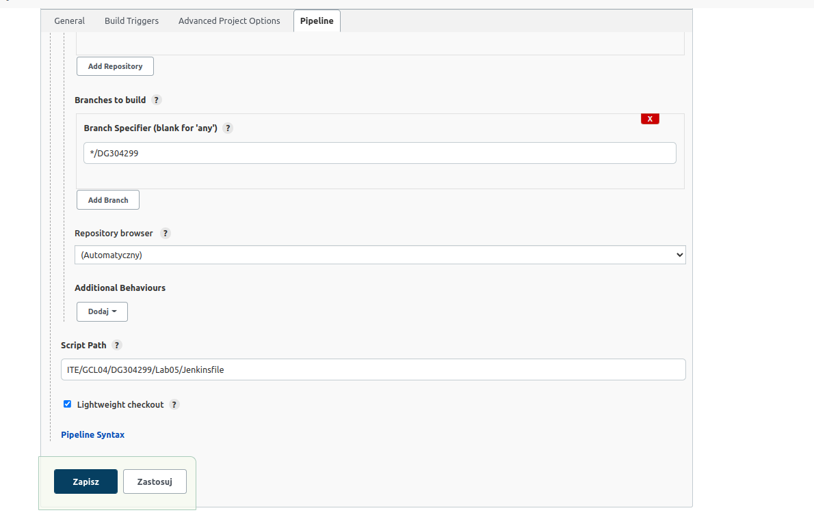
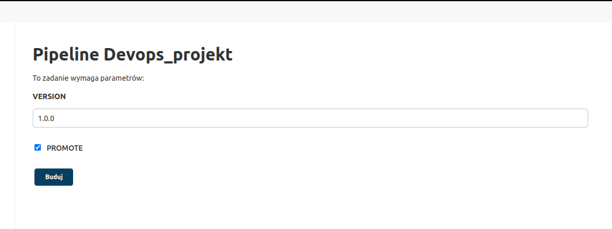

# SPRAWOZDANIE - PROJEKT JENKINS
## DANIEL GABRYŚ
## LAB 04

</br>


## Cel i opis projektu

Celem projektu było utworzenie jenkinsowego pipeline'a, w celu przeprowadzenia automatyzacji kroków build, test, deploy oraz publish wybranego oprogramowania.

Wybrane repozytorium: https://github.com/LondonJim/Guess-Word-Game.git

Projekt jest oparty o Javę (Gradle)

 </br>

# Utworzenie projektu 

 1. W zakładce Nowy Projekt wybrano opcję Pipeline
   

   
 2. Następnie ustawiono opcję script from SCM, aby móc skorzystać z zamieszczonego na repozytorium Jenkinsfile.
   


3.  Skonfigurowano url’a do sklonowania repozytorium, brancha z którego zostanie wykorzystany Jenkinsfile oraz ścieżkę do pliku Jenkinsfile.




# Wykonanie Pipeline

## 1. CLONE

- Stage Clone w Jenkinsfile

    Na wstępie usuwamy niepotrzebne kontenery i woluminy. Następnie tworzymy wolumeny repo_vol (tam zostanie sklonowane repozytorium), oraz build_vol(tam zostanie sklonowany build).
Uruchamiamy Dockerfile klonujący repozytorium, o nazwie "clone".
Po zbudowaniu kontener zostaje uruchomiony z podmontowanym voluminem repozytorium repo_vol
   
    ```
      stage('Clone') 
        {
            steps 
            {
              sh "docker system prune --all -f"
              sh 'docker volume  create --name repo_vol'
              sh 'docker volume  create --name build_vol'
              sh "docker build -t clone . -f ./ITE/GCL04/DG304299/Lab05/docker_clone"
              sh "docker run -v repo_vol:/Guess-Word-Game clone"           
            }
        }
    ```

- Dockerfile dla Clone

    Bazą jest obraz Debian, Wykonuje się tutaj aktualizację źródeł (apt update) oraz instalacja gita aby umożliwić sklonowanie. Nastepnie wykowywane jest klonowanie

    ```
    FROM debian:latest

    RUN apt update
    RUN apt install -y git

    RUN git clone https://github.com/LondonJim/Guess-Word-Game.git
    ```

## 2. BUILD

- Stage Clone w Jenkinsfile

    Budowany i uruchamiany jest obraz docker_build(kontener build) montowane są woluminy repo_vol na lokalizację katalogu projektu(Guess-Word-Game), build_vol na lokalizację /build

  ```
      stage('Build') 
        {
            steps 
            {
               sh 'docker build -t build . -f ./ITE/GCL04/DG304299/Lab05/docker_build'
               sh 'docker run --name build_container -v repo_vol:/Guess-Word-Game -v build_vol:/build build'
            }
        }
    ```

- Dockerfile do budowania projektu

    Do zbudowania potrzebujemy pakietu jdk o raz gradle  Po instalacji, zmieniamy katalog roboczy na właściwy i wykonujemy 2 rzeczy.
     
    - budujemy program (gradle build) - w trakcie tej operacji tworzą się potrzebne klasy oraz plik .jar który posłuży jako artefakt.
    - po zbudowaniu kopiujemy stworzony plik .jar do katalogu build (podmontowanej lokalizacji voluminu build)

    </br>


    ```
    FROM debian:latest

    RUN apt update
    RUN apt install -y default-jdk gradle

    WORKDIR Guess-Word-Game

    CMD ["sh", "-c", "gradle build && cp ./build/libs/guess.jar /build"]

    ```

## 3. TESTOWANIE

- Stage Test w Jenkinsfile

   Tworzymy obraz na bazie kontenera z buildem, tworzymy i uruchamiamy kontener z podmontowanym do folderu Guess-Word-Game woluminem z repozytorium.
   Jeżeli testy wykonają się z powodzeniem to pipeline przejdzie dalej, a jeżeli nie to zostanie przerwany

  ```
     stage('Test') 
        {
            steps 
            {
               sh 'docker build -t test . -f ./ITE/GCL04/DG304299/Lab05/docker_test'
               sh 'docker run --name test_container -v repo_vol:/Guess-Word-Game test'
            }
        }
    ```

- Dockerfile do testowania

   Jak wspomniano wyżej, wykorzystamy obraz z builda do utworzenia aktualnego obrazu,
    uruchamiamy testy komendą "gradle test"

    ```
    FROM build

    CMD gradle test

    ```


## 4. WDRAŻANIE

- Stage Deploy w Jenkinsfile

     Wstępną koncepcją była próba uruchomienia artefaktu (pliku .jar powstałego w etapie budowania) w osobnym kontenerze. Z Racji że projekt do działania potrzebuję środowiska graficznego (Gui), próba uruchomienia aplikacji z dedykowanym kontenerze kończy się niepowodzeniem

    Dockerfile - pierwsza koncepcja

     ```
    FROM openjdk:11

    CMD java -jar ../build/guess.jar

    ```

     
     
     W takim przypadku za deploy zostało przyjęte sprawdzenie czy dany plik .jar jest rozpoznawany przez środowisko (zawiera niepuste pliki klas itp powstałe w wyniku budowania.)
     
     Sprawdzono zawartość artefaktu poleceniem

     Jeżeli uda się uruchomić kontener i praca działającego w nim programu zakończy się sukcesem (code 0), wdrożenie uznawane jest za pomyślne. 

     Na potrzeby tego etapu utworzono Dockerfile dla obrazu, który opiera się na obrazie openjdk:11. (nie jest to obraz na bazie obrazów poprzednich z zainstalowanymi zależnościami, ponieważ do uruchoniemia potrzebna jest tylko java)

     ```
     stage('Deploy') 
        {
            steps 
            {
               sh 'docker build -t deploy_1 . -f ./ITE/GCL04/DG304299/Lab05/docker_deploy'
                    script
                    {
                            try 
                            {
                                sh 'docker run --name deploy_container -v build_vol:/build deploy_1'
                            } 
                            catch (Exception e) 
                            {
                                echo 'Exception occurred: ' + "Graphic enviroment is needed to run this app"
                            }
                    }

                sh 'docker build -t deploy_final . -f ./ITE/GCL04/DG304299/Lab05/docker_deploy_final'
                sh 'docker run --name deploy_container_final -v build_vol:/build deploy_final'

                sh "rm -rf artifact && mkdir artifact"
                sh 'docker cp deploy_container:./build/guess.jar artifact' 

                sh 'docker ps -a'
            }
        }
     ```

    W pierwszym kroku tworzymy nowy obraz na bazie docker_deploy według 1 koncepcji
    i próbujemy uruchomić plik .jar w kontenerze, operacja nie powodzi się, zatem łapiemy wyjątek, po to aby pipeline mogł być dalej kontunuowany

    Następnie tworzymy obraz na bazie docker_deploy_final, uruchamiamy oraz podpinamy volumin z plikiem .jar. Rozpoczynamy przygotowanie pod krok Publish Tworzymy folder na artefakt, kopiujemy plik .jar z kontenera na naszego hosta (poza kontener do katalogu artifact)
    

     ```
     FROM openjdk:11

     CMD jar tfv ../build/guess.jar

     ```

    


## 5. PUBLISH

- Stage Publish w Jenkinsfile

     Jeżeli wszystkie poprzednie kroki zakończą się pomyślnie oraz zaznaczono opcję PUBLISH przy uruchamianiu pipeline'a, aplikacja jest publikowana, jeśli nie wyświetlamy komunikat W celu publikacji psołużono się Jenkinsem jako serwerem buildów.

     W kroku Publish zmieniamy nazwę pliku tak by uwzględnić nazwę wersji oraz używamy polecenia archiveArtifacts aby zapisać archiwum jako artefakt w Jenkinsie.

     ```
    stage("Publish") 
        {
            steps
            {
               script {
                    if(params.PROMOTE)
                     {
                         
                         sh "mv ./artifact/guess.jar ./artifact/guess_${VERSION}.jar"
                         archiveArtifacts artifacts: "artifact/guess_${VERSION}.jar"

                         sh "ls -a ./artifact"
                    }
                    else 
                    {
                        echo "Success, but not promoting to new version! (check button)"
                    }
                }
            }
        }

    ```

    </br>

 ## 6. URUCHOMIENIE PIPELINE 

 - Pipeline, poza wszystkimi opisanymi wyżej krokami, zawiera parametr VERSION
 informujący o wersji oprogramowania, oraz parametr określający czy ma być zastosowany krok Publish


    ```
    agent any

        parameters 
        {
        
            string(name: 'VERSION', defaultValue: '1.0.0', description: '')
            booleanParam(name: 'PROMOTE', defaultValue: false, description: '')

        }
    ```
    

    


## 6. DIAGRAM

- Diagram aktywności w formacie png:

    


     


  
 
 


  


  


  

  


  