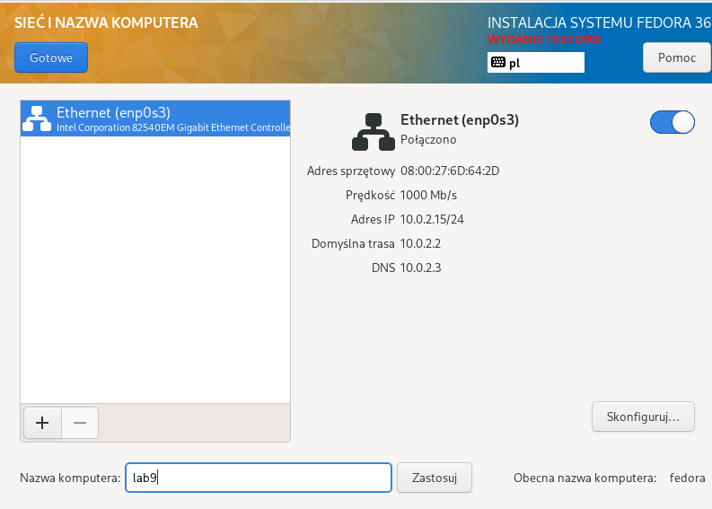
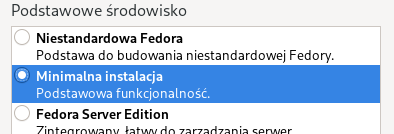
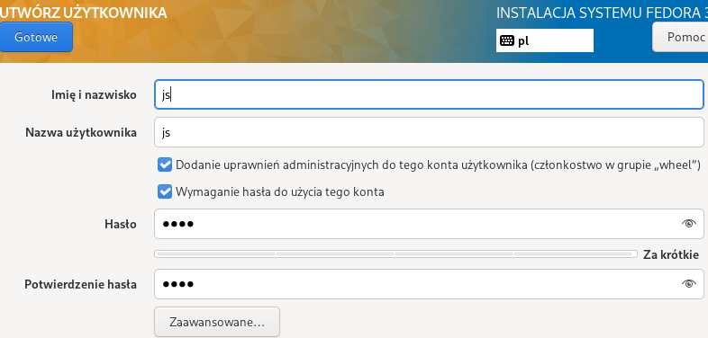
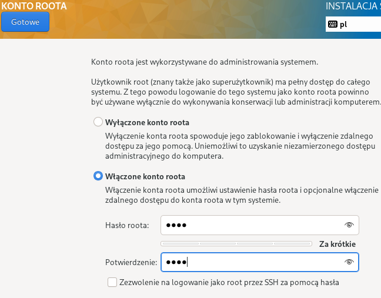
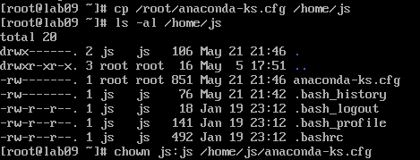
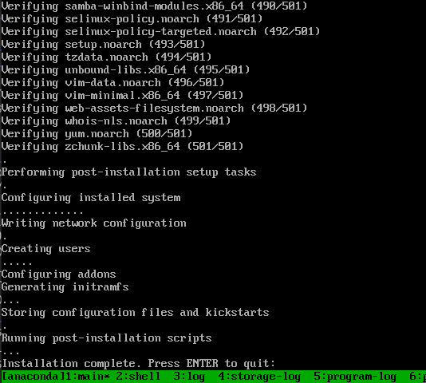

# Sprawozdanie lab09

## Utworzenie pierwszej VM

Stworzenie VM z 16GB pamięci


Wybrano kolejno podanych opcji podczas instalacji









Zlokalizowano plik `anaconda-ks.cfg`


Skopiowano plik `anaconda-ks.cfg` do folderu domowego użytkownika `js`.



```
cp /root/anaconda-ks.cfg
chown js:js /root/anaconda-ks.cfg
systemctl start sshd
```

Skopiowano plik `anaconda-ks.cfg` na hosta

```
scp js@192.168.0.242:/home/js/anaconda-ks.cfg .
```

## Uruchamianie instalacji nienadzorowanej

W moim przypadku artefaktem był obraz. Napotkałem na początku parę problemów:
- próbowałem uruchamiać kontener w bloku `%post` w pliku `anaconda-ks.cfg` - problemem było to, że serwis dockera jeszcze nie działał, a nie dało się go włączyć za pomocą `systemctl`
- wykonywanie jako skrypt rc - bardzo możliwe, że robiłem coś źle, ale nie jestem pewien co to było

Potem przetestowałem sposób z uruchomieniem całej procedury uruchomienia i przetestowania wyniku działania artefaktu przy pomocy `crontab`. Operacje odpowiedzialne za uruchomienie obsługiwanie artefaktu zostały wyeksportowane do oddzielnego skryptu `script.sh`

```
#!/bin/sh
mkdir -p /deploy/jenkins
wget https://raw.githubusercontent.com/bsponge/gomodifytags/main/jenkins/example -O /deploy/jenkins/example
wget https://raw.githubusercontent.com/bsponge/gomodifytags/main/jenkins/expected-output -O /deploy/expected
wget https://raw.githubusercontent.com/bsponge/gomodifytags/main/Dockerfile-test-deploy -O /deploy/Dockerfile-test-deploy

cd /deploy

docker build -t deploy-test -f Dockerfile-test-deploy --build-arg image=bsponge/deployment-image:latest .
docker run --name test-deployment deploy-test
docker logs test-deployment >> testoutput.log
diff testoutput.log expected && touch success
```

Skrypt tworzył wymagane foldery oraz pobierał plik Dockerfile, które budował oraz pliki zawierające spodziewany wynik działania programu i plik wsadowy do programu, a na końcu uruchamiał wybudowany obraz. Plik Dockerfile, z którego skorzystałem to ten sam, który został użyty podczas testowania działania artefaktu w pipeline Jenkinsa.

Dockerfile-test-deploy

```
ARG image

FROM $image

COPY ./jenkins/example .
CMD gomodifytags -file example -all -add-tags json
```

Skrypt był pobierany na VM oraz zostawał dodany do `crontab`. Przy okazji instalowany był `docker`, `wget` oraz `crontabs`. Skrypt był uruchamiany z opóźnieniem ponieważ, gdy opóźnienia nie było skrypt failował (prawdopodobnie serwis nie wystartował, bo nie mogłem uzyskać żadnych logów) przy korzystaniu z dockera.

```
yum install -y wget
yum install -y docker
yum install -y crontabs

wget https://raw.githubusercontent.com/InzynieriaOprogramowaniaAGH/MDO2022_S/JS400219/ITE/GCL04/JS400219/Lab09/script.sh -O /home/js/script.sh
chmod +x /home/js/script.sh
crontabl -l > mycron
echo "@reboot sleep 5 && /home/js/script.sh" >> mycron
crontab mycron
rm mycron
```

Instalacja przechodziała bez problemów



