<h1>Sprawozdanie z Lab9</h1>

<h3> Konrad Krzempek</h3>
grupa lab 4

Wykonanie ćwiczenia:

<h3> Instalacja Fedory </h3>

    Przygotowanie maszyny wirtualnej:
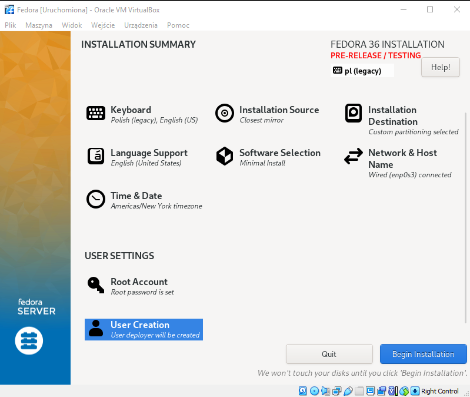

Zainstalowana została Fedora 36 w wersji beta. Stworzono na niej konto roota i użytkownika (deployer). 

Wybrane ustawienia instalacji:
<ul>
<li>język angielski z polskim układem klawiatury </li>
<li>minimalna instalacja </li>
<li>30GB miejsca na dysku </li>
<li>manualne partycjonowanie </li>
</ul>
   
    Host name:

    Po ukończeniu instalacji na maszynie znajduje sie plik anaconda-ks.cfg.
    Plik ten zawiera informacje dla instalatora umożliwiające szybkie odtworzenie instalacji bez konieczności ponownego wybierania opcji.
    Domyślnie znajdował się on na koncie root'a po czym został skopiowany na deployer'a.

<h3> Instalacja drugiej Fedory z serwerem HTTP </h3>

    Utworzono drugą maszynę wirtualną w taki sam sposób jak wcześniej, po czym zainstalowano httpd.

    Aktualizacja listy pakietów:
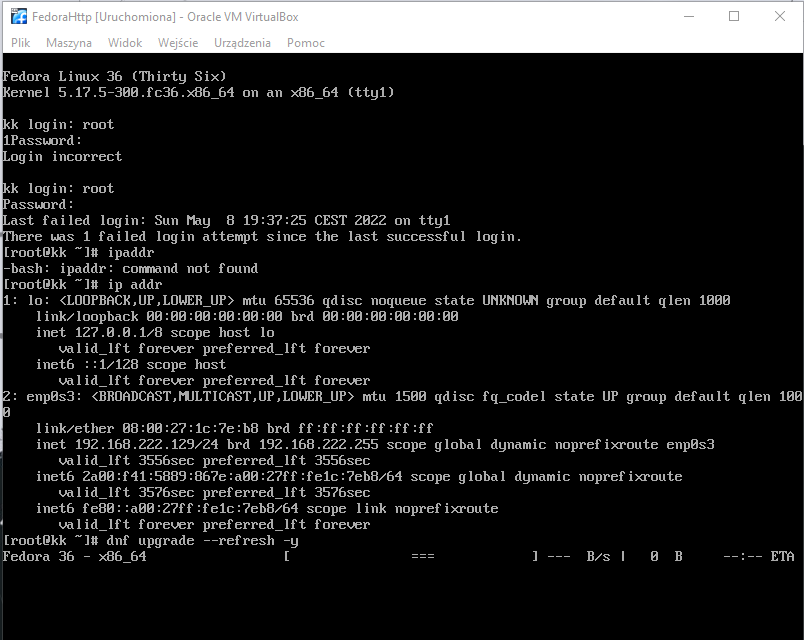

    Instalacja httpd:
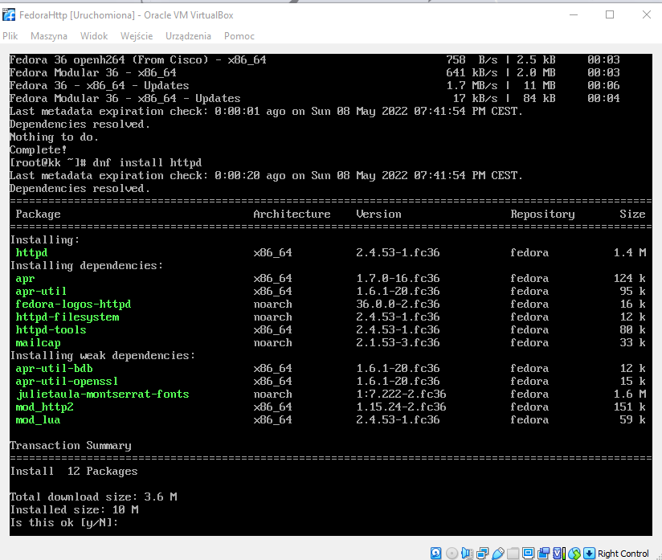

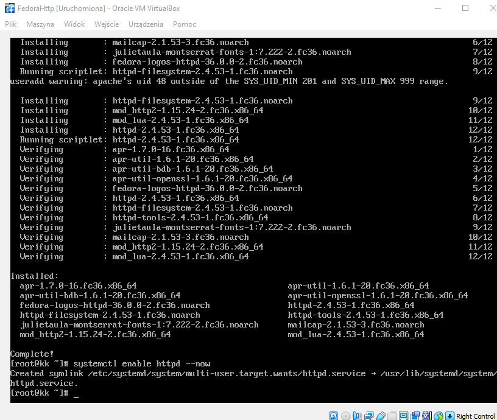

    Uruchomienie httpd:
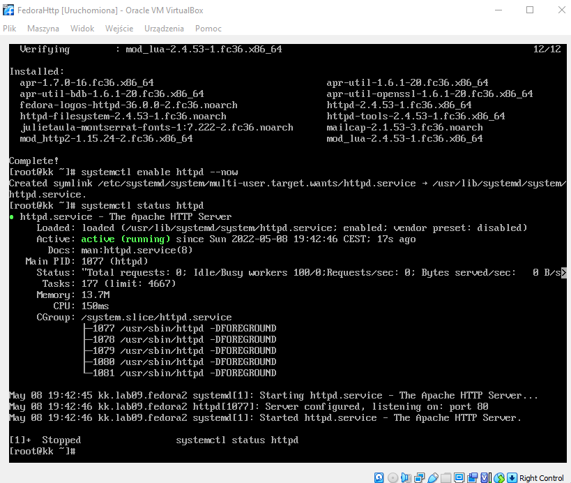

    Dodanie wyjątków do zapory:
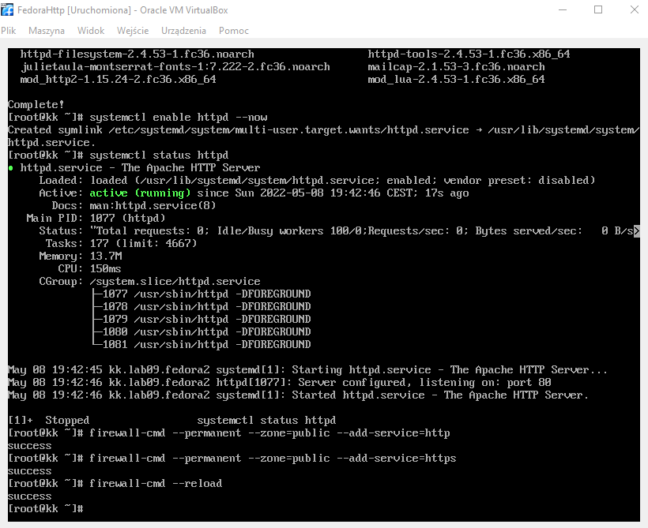

    Pierwsze połączenie się z serwerem:

    Połączenie po utworzeniu w folderze var/www/html folderu "test1" do którego skopiowano plik irssi.
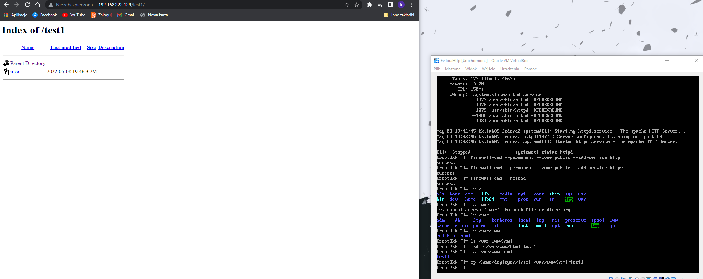

    Instalacja wget na pierwszej maszynie wirtualnej:
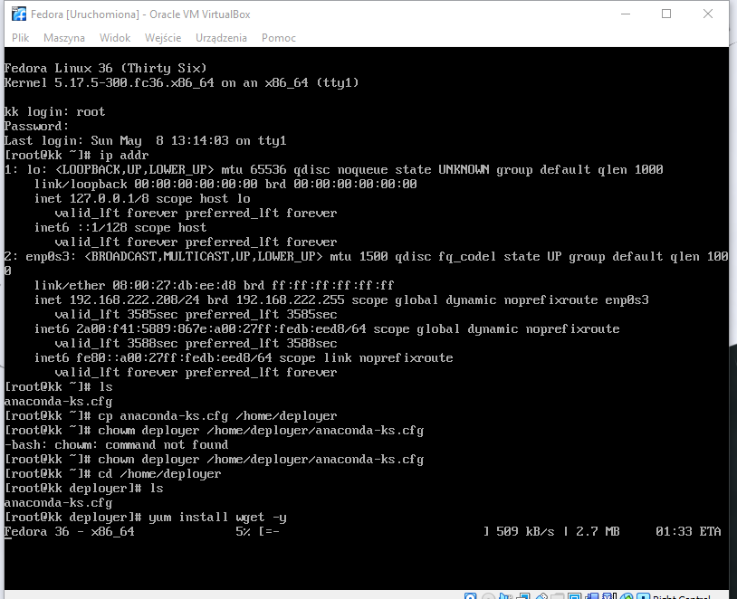

    Pobranie irssi z serwera:
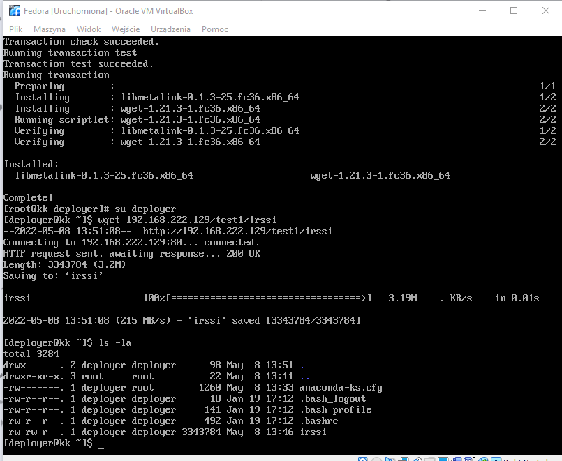

    Zmiana uprawnień do pliku irrsi tak aby można go było uruchomić:
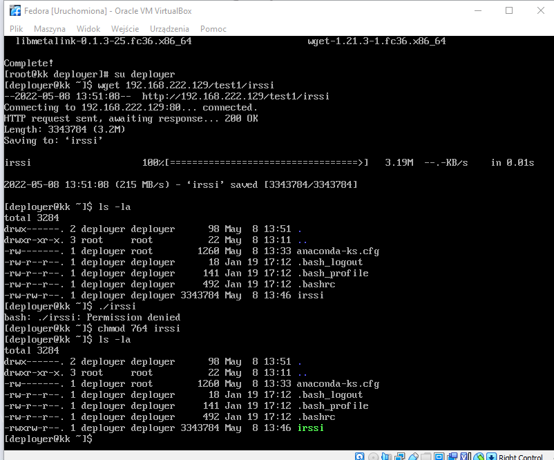

    Uruchomienie irssi:

<h3>Przeprowadzenie instalacji nienadzorowanej </h3>

W celu przeprowadzenie instalacji nienadzorowanej konieczna będzie odpowiednia edycja pliku anaconda-ks.cfg i umieszczenie go na githubie.

    Przesłanie pliku anaconda-ks.cfg za pomocą FileZilli do katalogu roboczego.
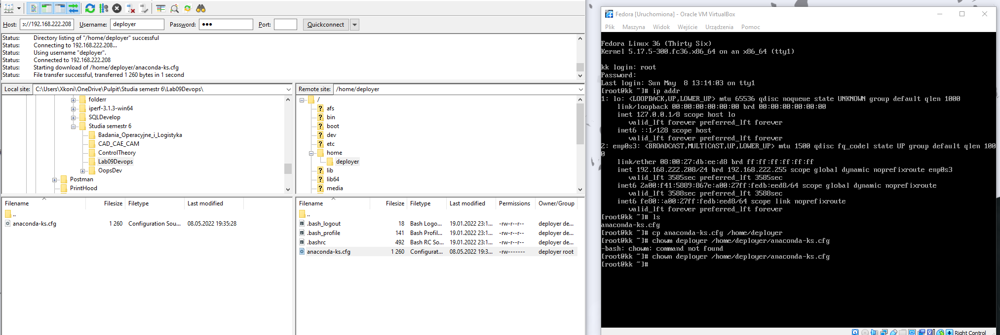

    Edycja pliku anaconda-ks.cfg:
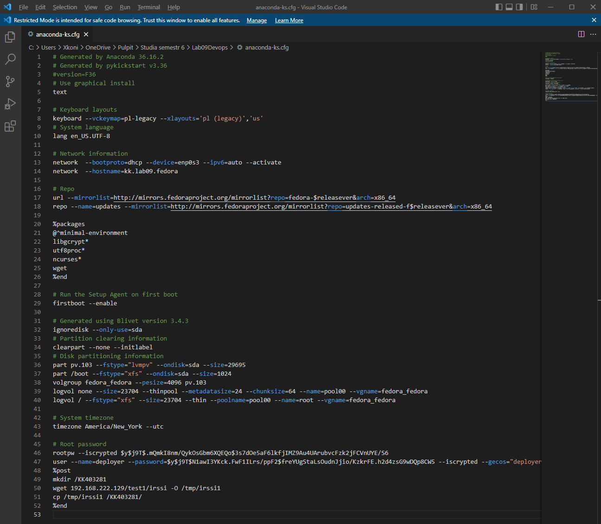

Dokonane zmiany:
<ul>
<li>Zmieniono typ instalacji na tekstowy (linia 5) </li>
<li>Dodano informacje o repozytorium (linie 16-19)</li>
<li>Dodano zależności (linie 19-26</li>
<li>Pobieranie irssi (linie od 48) </li>
</ul>

    Plik ten został umieszczony na githubie w katalogu lab9.

    Utworzenie nowej maszyny wirtualnej:
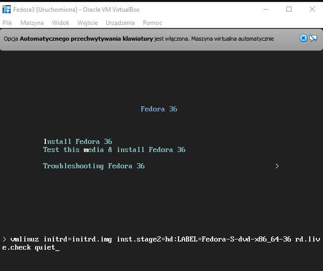

    Uruchomienie instalacji nienadzorowanej:

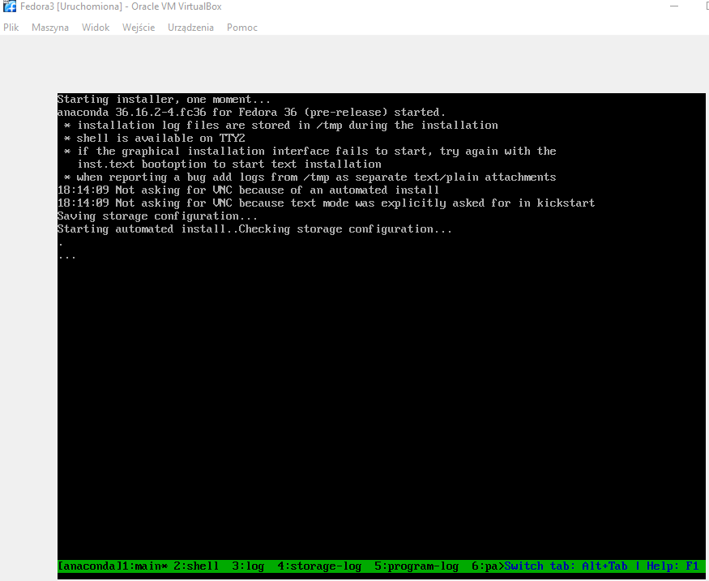

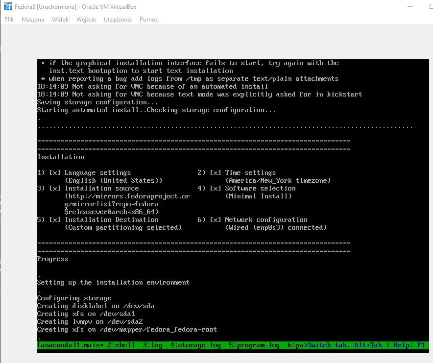

    Uruchomienie irssi w celu sprawdzenia czy wszystko działa poprawnie:
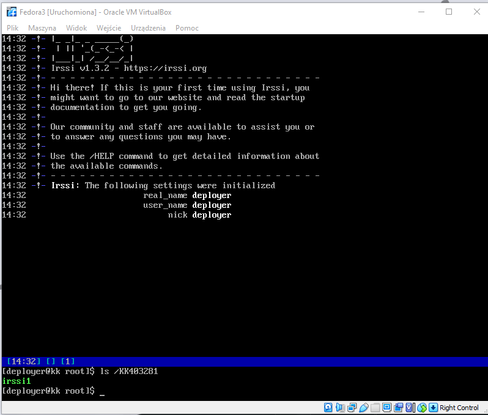

