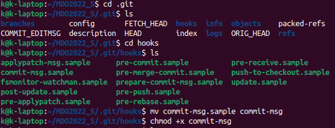
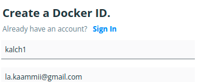

# ***Ćwiczenia 2***

## 1. Przygotowanie git hook



- hook sprawdzający, czy tytuł commita nazywa się <inicjały><numer indeksu>
- hook sprawdzający, czy w treści commita pada numer labu, właściwy dla zadania

```
title=`head -n1 $1`
message=`tail -n1 $1`
message_num="(2)"
title_patt="KL299629"
message1="Title is wrong!"
message2="Wrong commit message!"

if ! [ "$title" = $title_patt ]; then
	echo $message1
	exit 1
fi

if ! [[ "$message" =~ .*$message_num.* ]]; then
	echo $message2
	exit 1
fi

```

Sprawdzenie czy hooki działają:


## 2. Przygotowanie środowiska Dockerowego

Zadanie wykonywane na Linuxie 
```cat /proc/version ```


Sprawdzenie statusu zainstalowanego Dockera komendą ```sudo systemctl status docker```


## 3. Działanie środowiska

- środowisko dockerowe jest uruchomione i działa (z definicji)


- działanie w sposób praktyczny (z własności):
	- pobranie ubuntu - użyta komenda ```docker pull ubuntu```


- Uruchomienie obrazu Ubuntu. Użyte komendy:
	- ```docker run ubuntu```
	- ```sudo docker ps -a```


## 4. Rejestracja w Docker Hub


