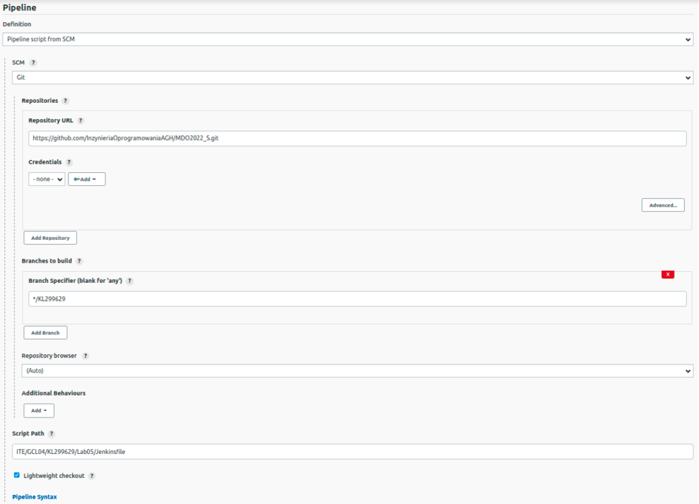
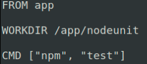
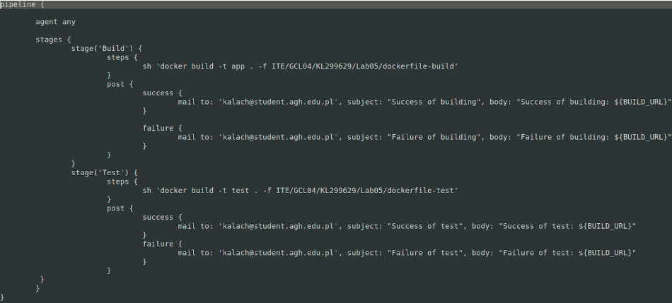
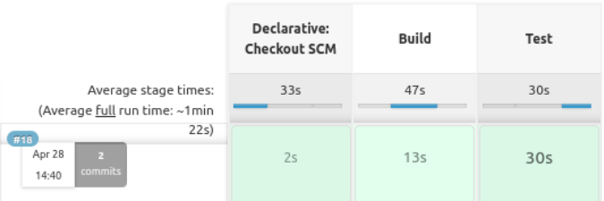
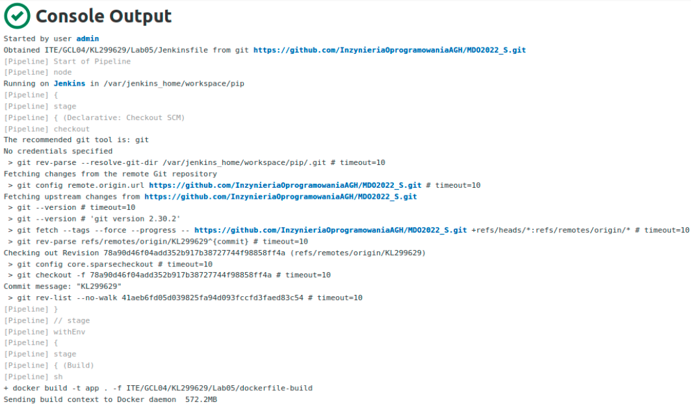
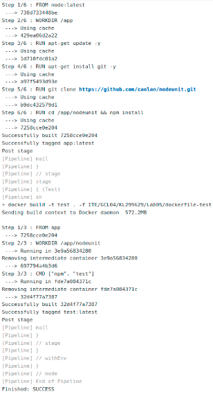
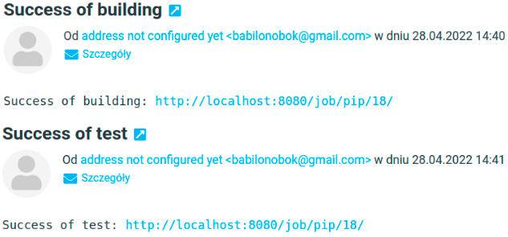
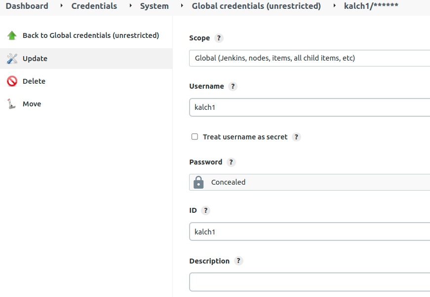
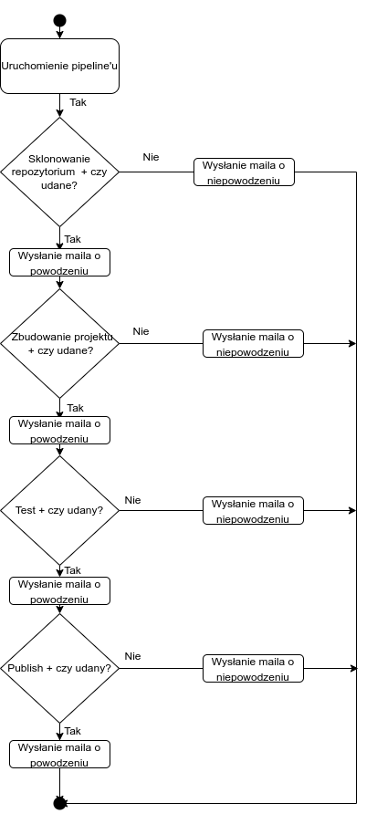

# ***Projekt***


Aby zacząć wykonywać zadanie potrzebujemy:
- uruchomionego kontenera DIND:
  ```
  sudo docker run \
  --name jenkins-docker \
  --rm \
  --detach \
  --privileged \
  --network jenkins \
  --network-alias docker \
  --env DOCKER_TLS_CERTDIR=/certs \
  --volume jenkins-docker-certs:/certs/client \
  --volume jenkins-data:/var/jenkins_home \
  --publish 2376:2376 \
  docker:dind \
  --storage-driver overlay2
  ```
  
- zbudowanego obrazu:
  ```
  sudo docker build -t myjenkins-blueocean:2.332.2-1 -f Dockerfile2 .
  ```
  
- uruchomionego obrazu jenkins-blueocean:
  ```
  sudo docker run \
  --name jenkins-blueocean \
  --rm \
  --detach \
  --network jenkins \
  --env DOCKER_HOST=tcp://docker:2376 \
  --env DOCKER_CERT_PATH=/certs/client \
  --env DOCKER_TLS_VERIFY=1 \
  --publish 8080:8080 \
  --publish 50000:50000 \
  --volume jenkins-data:/var/jenkins_home \
  --volume jenkins-docker-certs:/certs/client:ro \
  myjenkins-blueocean:2.332.2-1 
  ```
  
Następnym krokiem jest przejście do Jenkinsa. Tam tworzony jest pipeline. Jego konfiguracja przedstawia się następująco:



Na początku stworzono builda, aby sprawdzić czy wszystkie ustawienia działają.
Do tego wykorzystano plik dockerfile-build, który znajduje się w katalogu Lab05 na gałęzi ```KL299629```. Skrypt Jenkinsfile przedstawiał się następująco:


```
pipeline {
agent any
	
	stages {
		stage('Build') {
			steps {
				sh 'docker build -t app . -f ITE/GCL04/KL299629/Lab05/dockerfile-build'
			}
		}
	}
}

```

Po uruchomieniu, build zakończył się sukcesem.


Poprawne wykonanie skryptu:


Mozliwe jest otrzymywanie wiadomości na mail, informujących o powodzeniu/niepowodzeniu przejścia danego stage'a. Dlatego następnym krokiem było skonfigurowanie ustawień tak, aby umożliwić powiadomienia na mail.


Przeprowadzono również test, czy konfiguracja jest poprawna - w ramach testu otrzymano mail:


Następnie zmieniono pipeline tak, aby otrzymywac wiadomości na podanego maila:


Po spushowaniu zmian na git, znów uruchomiono build. Znów zakończył się sukcesem, co spowodowało otrzymanie maila na podany adres mailowy w sekcji post.


Następnie stworzono etap testujący. Wykorzystywany jest do tego dockerfile-test, który znajduje się w katalogu Lab05 na gałęzi ```KL299629```.



Następnie dokonano zmiany pliku Jenkinsfile dodając nowy stage:



Zmiany dodano na git’a i ponownie uruchomiono pipeline



Testy i build przebiegły pomyślnie a output wyglądał następująco:





Otrzymano również powiadomienia na maila, mówiące o pomyślnym przebiegu build i test:



Dodany został ```Global Credentials``` aby móc zalogować się do DockerHub, a tam zrobić push. 


Dodane global credentials:



W związku z tym, do Pipeline’a dodany zostaje stage ```Login```, odpowiadający za zalogowanie się do Docker Hub, oraz ```Publish```. W stage'u ```Publish```, tworzony jest tag i push do repozytorium, które zostało stworzone właśnie na DockerHub.

Repozytorium:


Stage ```Login``` oraz ```Publish``` pzebiegły pomyślnie


Otrzymano również powiadomienie odnośnie prowidłowego publish'a:


Widok w repozytorium


W pipeline róznież umieszczono fragment:


odpowiadający za wylogowanie z Docker Hub.


### Diagram aktywności dla pipeline:




## Cały pipeline

```
pipeline {

	agent any
	
	environment {
		DOCKERHUB_CREDENTIALS=credentials('kalch1')
	}
	
	stages {
		stage('Build') {
			steps {
				sh 'docker build -t app . -f ITE/GCL04/KL299629/Lab05/dockerfile-build'
			}
			post {
				success {
					mail to: 'kalach@student.agh.edu.pl', subject: "Success of building", body: "Success of building: ${BUILD_URL}"
				}

				failure {
					mail to: 'kalach@student.agh.edu.pl', subject: "Failure of building", body: "Failure of building: ${BUILD_URL}"
				}
			}
		}
		stage('Test') {
			steps {
				sh 'docker build -t test . -f ITE/GCL04/KL299629/Lab05/dockerfile-test'     
			}
         		post {
				success {
					mail to: 'kalach@student.agh.edu.pl', subject: "Success of test", body: "Success of test: ${BUILD_URL}"
				}
				failure {
					mail to: 'kalach@student.agh.edu.pl', subject: "Failure of test", body: "Failure of test: ${BUILD_URL}"
				}
			}
         	}
         	stage('Login') {
			steps {
				sh 'echo $DOCKERHUB_CREDENTIALS_PSW | docker login -u $DOCKERHUB_CREDENTIALS_USR --password-stdin'
			}
		}
		stage('Publish') {
			steps {
				sh '''
				docker tag app:latest kalch1/kl299629:1.0
				docker push kalch1/kl299629:1.0
				'''
			}
			post {
				success {
					mail to: 'kalach@student.agh.edu.pl', subject: "Success of publish", body: "Success of publish: ${BUILD_URL}"
				}
				failure {
					mail to: 'kalach@student.agh.edu.pl', subject: "Failure of publish", body: "Failure of publish: ${BUILD_URL}"
				}
			}

		}
	}
	post {
		always {
			sh 'docker logout'
		}
	}
}
```