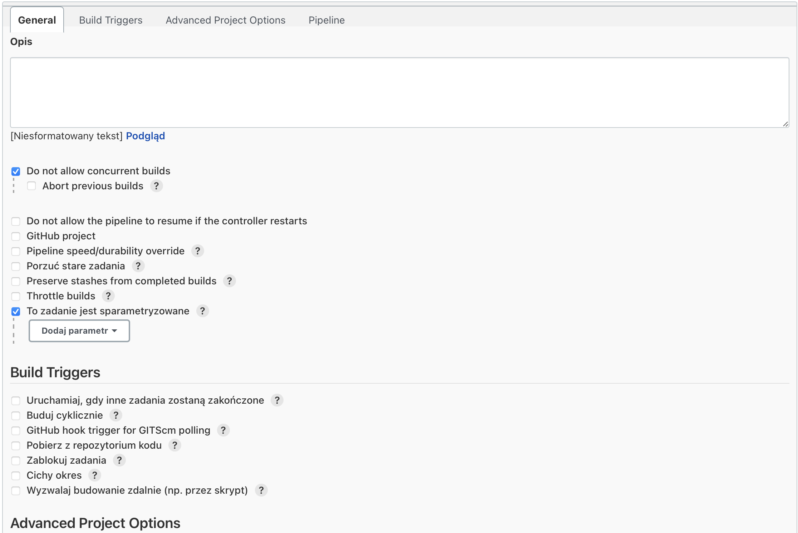
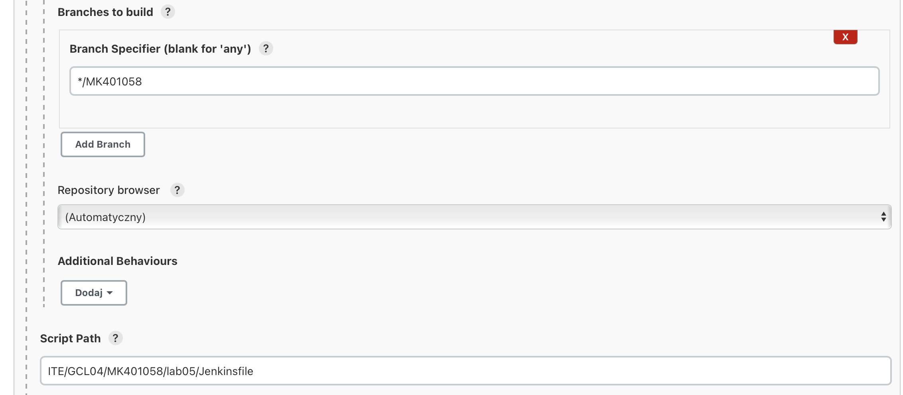

# Sprawozdanie Lab.05

### Opis projektu
Celem projektu było utworzenie pipeline'a z pomocą Jenkins. Miał on za zadanie zbudować, przetestować, wdrożyć oraz opublikować aplikację wybraną przez nas na poprzednich zajęciach laboratoryjnych - `https://github.com/alexjoverm/vue-testing-series.git`

### Wykonanie ćwiczenia
##### 1. Utworzenie kontenerów
Na początku utworzone zostały dwa kontenery dockerowe - pierwszy z Jenkinsem oraz drugi z obrazem DIND.


##### 2. Utworzenie projektu w Jenkinsie
Następnie utworzono projekt w Jenkinsie typu pipeline. Skonfigurowano projekt zaznaczając opcje ` Do not allow concurrent builds ` 



W opcjach zaawansowanych wybrano z listy rozwijanej opcję ` Pipeline script from SCM `, jako SCM wybrano Git i wpisano URL repozytorium


Jako branch wybrano własny (MK401058), na końcu wpisano ścieżkę do pliku Pipeline w repozytorium



##### 3. Dodanie plików Dockerfile do repozytorium
Aby rozpocząć pisanie Pipeline potrzebne są pliki Dockerfile w repozytorium, `Dockerfile_Build` oraz `Dockerfile_Test` 

###### DockerfileBuild
```
macbookpro@MacBookPros-MacBook-Pro Lab5 % cat DockerfileBuild
FROM node
RUN git clone https://github.com/alexjoverm/vue-testing-series.git
WORKDIR /vue-testing-series/
RUN npm install
RUN npm run build
```

###### DockerfileTest
```
macbookpro@MacBookPros-MacBook-Pro Lab5 % cat DockerfileTest 
FROM mk_build:latest
WORKDIR /vue-testing-series/
RUN npm test
```


###### Jenkinsfile

##### Prepare
Parametr POMOTORE określa czy sekcja publish się wykona. Parametr VERSION oznacza wersję wydawanego programu (domyślnie 1.0.0). W sekcji Prepare znajduje się konfiguracja projektu, tworzenie woluminu wejściowego oraz wyjściowego, usuwanie kontenera z uprzednio zbudowanym projektem.
```
pipeline
{
 parameters
    {
        string(name: 'VERSION', defaultValue: '1.0.0', description: '')
        booleanParam(name: 'PROMOTE', defaultValue: true, description: '')
    }
    agent any
    stages
    {
    
    stage('Prepare')
        {
            steps
            {
                sh '''
                echo "Preparing to build..."
                
                docker rm -f mk_build || true
                docker volume prune -f
                docker volume  create --name volume_input
                docker volume  create --name volume_output
                           
                echo "Preparing finished!"
                '''
                
            }
        }
```
##### Build
Sekcja ta odpowiada za zbudowanie projektu z pliku DockerfileBuild znajdującego się w folderze `/ITE/GCL04/MK401058/Lab05/DockerfileBuild`. Następnie uruchamiany jest kontenter pod nazwą mk_build, z woluminem wejściowym volume_input i wyjściowym volume_output.
```
        stage('Build')
        {
            steps
            {
                sh '''
                echo "Building project..."
                
                docker build . -f ./ITE/GCL04/MK401058/Lab05/DockerfileBuild -t mk_build
                            docker run --mount type=volume,src="mk_build",dst=/volume_input mk_build:latest bash -c "cd .. &&  cp -r /vue-testing-series /volume_input && cp -r /volume_input /volume_output && ls ./volume_input && ls ./volume_output" 
                                     
                echo "Building finished!"
                '''
                
            }
        }
```
##### Test
W tej sekcji znajduje się testowanie projektu. Usuwany jest kontener z poprzedniego testowania, następnie uruchamiany jestnowy kontener z woluminem wejściowym volume_input
```
 
        stage('Test')
        {
            steps
            {
                sh '''
                echo "Testing project..."
                
                docker rm -f mk_test || true
                docker build . -f ./ITE/GCL04/MK401058/Lab05/DockerfileTest -t mk_test
                docker run --name test_container --rm --mount source=mk_test,target=/volume_input mk_test:latest
                
                echo "Testing finished!"
                '''
            }
        }
```
##### Deploy
W tym kroku projekt jest wdrażany. Poleceniem `exit` sprawdzany jest status operacji, jeżeli wszystkie kroki przejdą pomyślnie, pipeline kontynuuje pracę, w przeciwnym razie praca pipeline zostaje zatrzymana.
```
        
        stage('Deploy')
                {
                    steps
                    {
                            sh '''
                echo "Deploying project..."
                
                            docker rm -f deploy_container || true
                            docker run -dit --name deploy_container --mount type=volume,src="volume_output",dst=/mk_project node
                            exit $(docker inspect deploy_container --format="{{.State.ExitCode}}")
                
                echo "Deploying finished!"
                         '''
                    }
                }
```
##### Publish
Na początku sprawdzany jest parametr PROMOTE. Jeżeli użytkownik chce opublikować nową wersję programu, należu ustawić ten parametr na `true`. 
```
        
               stage ('Publish')
                {
                    when
                    {
                            expression {return params.PROMOTE}
                    }
                    steps
                    {
                sh 'echo "Publishing project..."'
                 
                            sh 'rm -rf /var/jenkins_home/workspace/mk_artifacts'
                            sh 'mkdir /var/jenkins_home/workspace/mk_artifacts'
                            sh 'chmod -R 777 /var/jenkins_home/workspace/mk_artifacts'
                            sh 'docker rm -f mk_publish || true'
                            sh 'docker run -d --name mk_publish --mount type=volume,src="volume_output",dst=/usr/local/mk_project --mount type=bind,source=/var/jenkins_home/workspace/mk_artifacts,target=/usr/local/mk_copy node bash -c "chmod -R 777 /usr/local/mk_project && chmod -R 777 /var/jenkins_home/workspace/mk_artifacts && cp -R /usr/local/mk_project/. /usr/local/mk_copy"'
                            sh "tar -zcvf vuetestingseries${params.VERSION}.tar.xz -C /var/jenkins_home/workspace/mk_artifacts ."
                            archiveArtifacts artifacts: "vuetestingseries${params.VERSION}.tar.xz"
                
                sh 'echo "Publishing finished!"'
                
                    }
                }
```
##### Clean
W tym kroku usuwane są uprzednio stworzone kontenery.
```
        stage('Clean')
        {
            steps
            {
                sh '''
                echo "Cleaning project..."
                
                docker rm -f mk_build || true
                            docker rm -f mk_test || true
                            docker rm -f deploy_container || true
                            docker rm -f mk_publish || true
                
                echo "Cleaning finished!"
                '''
            }
        }
        
    }
    
    post {
                success {
            echo 'Pipeline completed successfully!'
                }
                failure {
            echo 'Pipeline completed with errors!'
                }
        }
    
    
}
```
