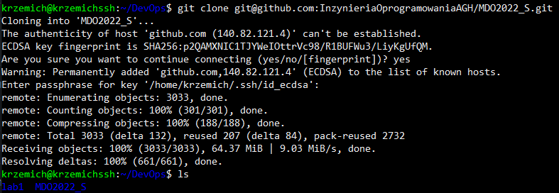
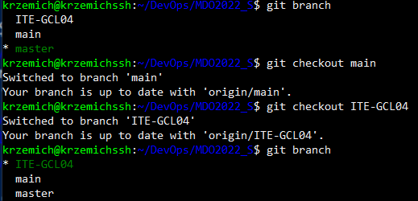

# Sprawozdanie 1
## Lab 1

W celu wykonania zadania skorzystano z maszyny wirtualnej z systemem Ubuntu 20.04.4 live server z wcześniej zainstalowanym serwerem ssh. 

1. Połączono się z serwerem ssh z maszyny hosta poprzez wykorzystanie narzędzia ssh z poziomu terminala Windows PowerShell. Połączenie zostało zrealizowane poprzez forward portu 22 z maszyny gościa.

2. Podjęto próbę instalacji obsługi gita na serwerze ssh, poprzez wykorzystanie polecenia: `sudo apt install git` . Instalacja nie została wykonana z powodu istniejącej na serwsze aktualnej wersji obsługi git.

3. Do specjalnie przygotowanego folderu sklonowano repozytorium po HTTPS przy użyciu polecenia: `git clone link-do-repozytorium`.

4. Utworzono dwa klucze ssh przy pomocy polecenia `ssh-keygen` z wykorzystaniem ecdsa oraz ed25519. W trakcie tworzenia obu kluczy dodano hasło.

5. Utworzone klucze dodano do konta na githubie przy wykorzystaniu opcji githuba dostępnych z poziomu przeglądarki.

6. Sklonowano repozytorium przy użyciu połączenia po ssh wykorzystując polecenie `git clone`

7. Przełączono się na gałąź grupy ITE-GCL04 przechodząc poprzez gałąź main wykorzystując polecenie `git checkout`

8. Przy użyciu polecenia `git checkout -b` utworzono brancha MK402993 i przeniesiono się na niego.

9. Na nowo utworzonej gałęzi przeniesiono się do folderu grupy w którym utworzono katalog o nazwie MK402993.

10. 