# Sprawozdanie DevOps lab8
## Michał Krzemień
### Informatyka Techniczna 
#### Grupa laboratoryjna 4.

<br>

## Wstęp

W trakcie wykonywanie ćwiczenia do łączenia się z maszyną wirtualną po ssh wykorzystano oprogramowanie MobaXterm, które służy również jako x-server do uruchamiania aplikacji linuxa z interfejsem graficznym w oknach hosta po stronie windowsa.


## Instalacja klastra Kubernetes

1. Przygotowano nową maszynę wirtualną ze względu na wymagania sprzętowe K8s.

2. Zainstalowano minikube na maszynie wirtualnej według kroków podanych w dokumentacji dla wersji stabilnej, na architekturze x86-64 przy użyciu instalacji binarnej.

3. Konieczne było doinstalowanie następujących elementów:
- docker
- conntrack

4. Uruchomiono minikube przy pomocy polecenia `minikube start`. 


5. Otrzymano błąd wynikający z braku uprawnień dostępu użytkownika "krzemich" do socketów dockera. W celu zniwelowania tego błędu wykonano wskazówki otrzymane w wiadomości błędu, tj. dodano użytkownika krzemich do grupy docker poleceniem `sudo usermod -aG docker $USER && newgrp docker`. Następnie ponownie uruchomiono minikube.


6. Zainstalowano kubectl zgodnie z instrukcją instalacji binarnej z dokumentacji kubernetesa. `https://kubernetes.io/docs/tasks/tools/install-kubectl-linux/`

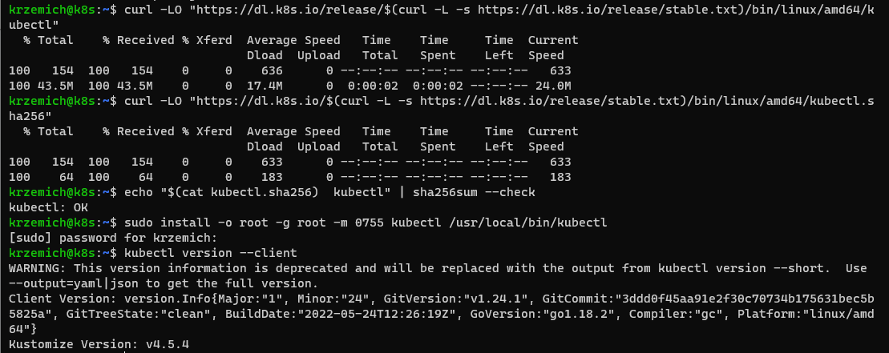

7. Przy pomocy polecenia `kubectl get nodes` wyświetlono aktywne nody kubernetesa, następnie wykonano polecenie `kubectl get namespaces` w celu wylistowania dostępnych przestrzeni nazw. Sprawdzono wszystkie wylistowane przestrzenie nazw w celu zorientowania się, które z nich posiadają bazowo utworzone zasoby - wykorzystano do tego polecenie `kubectl get pods -n namespace` gdzie w miejsce "namespace" wpisano nazwę przestrzeni nazw. Wynikiem tego testu jest informacja, że tylko w przestrzeni kube-system tworzone są pody przy pierwszym uruchomieniu klastra minikube.

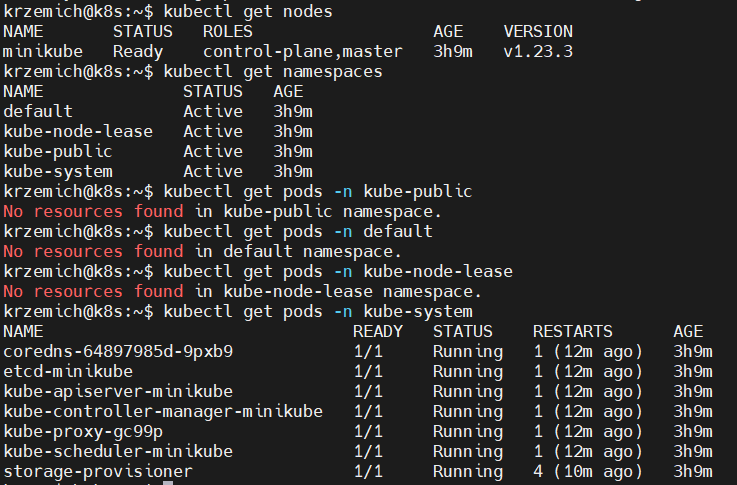

Dalsze wykonywanie ćwiczenia jest niemożliwe ze względu na niedziałające repozytoria ubuntu w sieci akademickiej.


Ze względu na problemy napotykane w trakcie wykonywania ćwiczenia będąc połączonym z siecią w akademiku dalszą część ćwiczenia wykonano przy połączeniu z inną siecią. Umożliwiło to uruchomienie maszyny wirtualnej z mostkowaną kartą sieciową i działanie na niej jak na maszynie w tej samej sieci lokalnej, łącząc się po adresach ip, a nie poprzez przekierowanie portów.

8. Podjęto próbę uruchomienia minikube dashboard przy pomocy x servera i chromium-browser. Napotkano błąd informujący o braku xdg-settings co rozwiązano poprzez instalację xdg-utils przy pomocy polecenia `sudo apt install xdg-utils`. Kolejnym problemem okazał się komunikat informujący o braku zmiennej środowiskowej DISPLAY lub x servera. Niestety problemu nie udało się rozwiązać z niewiadomych dla mnie przyczyn, ponieważ xterm oraz firefox działają przy użyciu xservera MobaXterm, jednakże firefox zbyt mocno się zawiesza aby uruchomić w nim dashboarda. Podjęto również próbę wykorzystania VcXsrv, jednakże próba uruchomienia terminala xterm przy pomocy komendy `xterm -display ip_hosta_windows:0.0` kończyła się niepowodzeniem. Z tego powodu przygotowano nową maszynę wirtualną z systemem posiadającym graficzny interfejs użytkownika i ponowiono na niej wszystkie powyższe kroki. 


9. Na nowo zainstalowanym i przygotowanym systemie wykonano polecenie `minikube dashboard`, którego wynikiem było uruchomienie się dashboard'a w domyślnej przeglądarce.

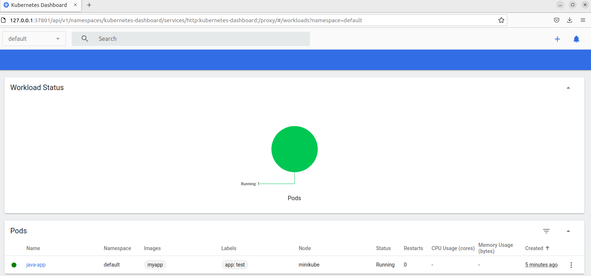

## Analiza posiadanego kontenera

1. Do wykonania tego ćwiczenia użyto obrazu zbudowanego przy użyciu artefaktu uzyskanego z pipeline'a projektu. Utworzono nowy obraz na podstawie obrazu bazowego openjdk:8 przy użyciu Dockerfile'a w którym sprecyzowano obszar roboczy i skopiowanie artefaktu .jar do obrazu. Kontener uruchamiany na bazie tego obrazu domyślnie uruchamia aplikację będącą wynikiem pipeline'a.

Dockerfile
```
FROM openjdk:8

WORKDIR /app

COPY junitsample-0.0.1-SNAPSHOT.jar .

EXPOSE 8080

CMD ["java", "-jar", "junitsample-0.0.1-SNAPSHOT.jar"]
```

2. Zbudowano obraz `docker build -t myapp .`. Następnie uruchomiono kontener na podstawie zbudowanego obrazu i wykazano działanie aplikacji poprzez uruchomienie strony w przeglądarce.


## Uruchamianie aplikacji

1. Przygotowano plik definicji dla poda wybranej aplikacji. W terminalu włączono obsługę docker daemona z poziomu klastra minikube poleceniem `eval $(minikube docker-env)`, nastepnie utworzono poda poleceniem `kubectl apply -f dep1.yml`.

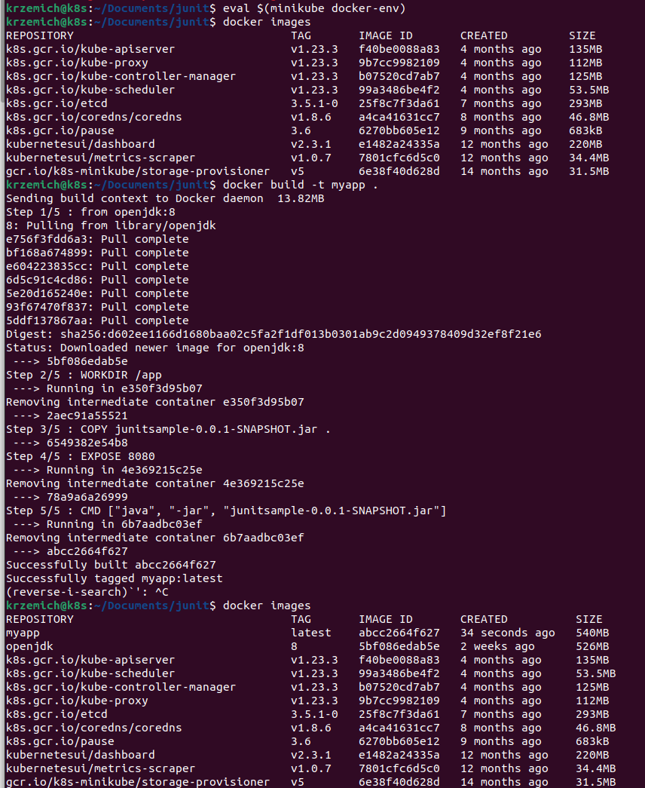


2. Po utworzeniu poda wyprowadzono port w celu umożliwienia połączenia z aplikacją.

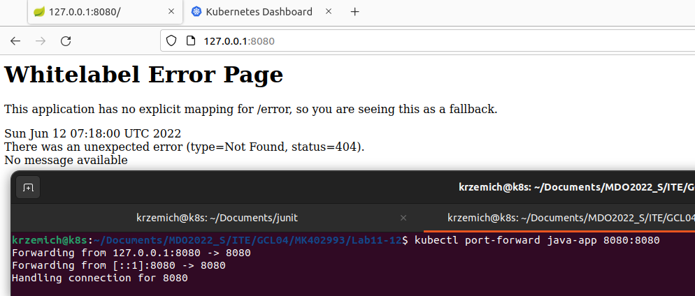

## Przekucie wdrożenia manualnego w plik wdrożenia

1. Zmodyfikowano wcześniej przygotowany plik yaml tworzący poda na plik rodzaju Deployment. A następnie wykonano polecenie `kubectl apply -f dep2.yml` w celu utworzenia replikasetu podów.

```
apiVersion: apps/v1
kind: Deployment
metadata:
  name: java-app
  labels:
    app: test
spec:
  replicas: 3
  selector:
    matchLabels:
      app: test
  template:
    metadata:
      labels:
        app: test
    spec:
      containers:
        - name: myapp
          image: myapp
          imagePullPolicy: Never
          ports:
          - containerPort: 8080
 ```


 2. Wyniki apply sprawdzono graficznie poprzez uruchomienie dashboarda.

 

 ### Laboratorium 12

 3. Ustawiono liczbę replik na 4. Następnie ponownie wykonano `kubectl apply`, a stan zbadano przy pomocy `kubectl rollout status`

 ```
 spec:
   replicas:4
```


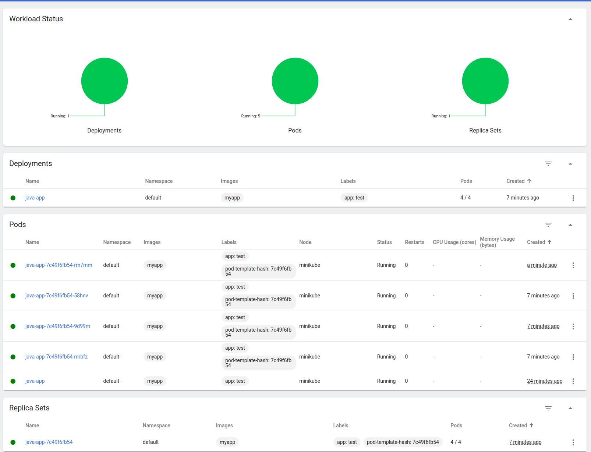

## Przygotowanie nowego obrazu

1. Przygotowano obraz z tagiem "latest", który został umieszczony na dockerhubie, po uprzednim logowaniu w dockerze przy pomocy polecenia `docker login -u`. Następnie przygotowano drugi obraz, którego uruchomienie kończy się błędem, uzyskano to poprzez zmianę obrazu bazowego na alpine'a, który nie posiada potrzebnej do uruchomienia apliakcji javy. 


Ostatecznie nie wykorzystano obrazów znajdujących się w repozytorium na Dockerhubie, lecz lokalnie utworzonoe obrazy w klastrze minikube'a.

## Zmiany w deploymencie

1. W pliku wdrożenia deklaratywnego zwiększono liczbę replik do 7 i wykonano polecenie `kubectl apply`.

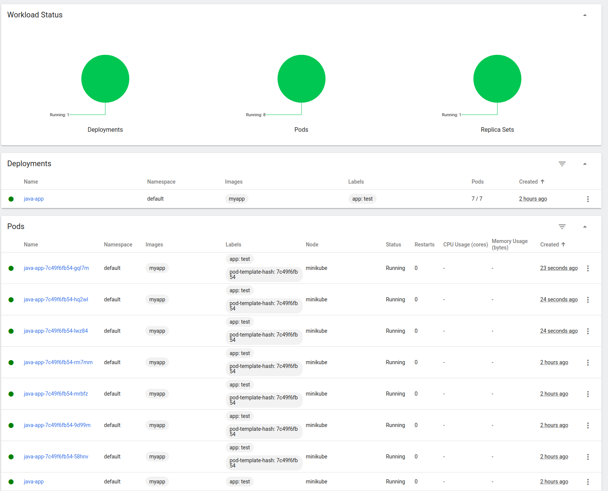

2. Zmniejszono liczbę replik do 1.

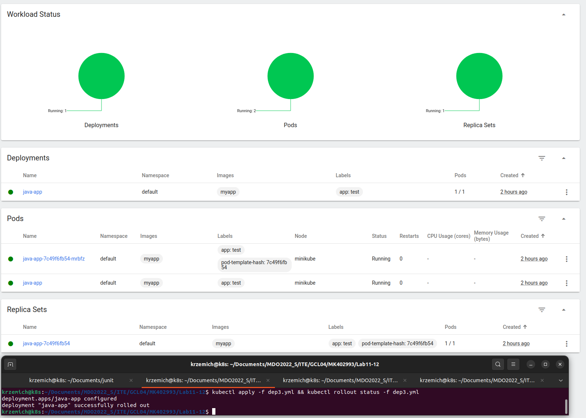

3. Ostatecznie ustawiono liczbę replik na 0.

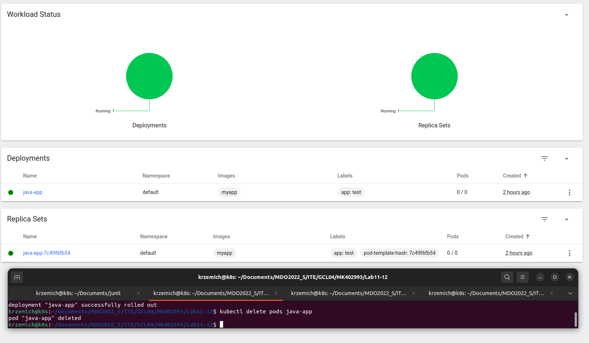

W trakcie wprowadzania tych zmian można było zauważyć, że w trakcie zmniejszania liczby podów działają one przez chwilę zanim zostaną usunięte. Przy liczbie podów równej zero można zauważyć w dashboardzie, że graficzne przedstawienie podów zniknęło, jednkaże deployment i replica sety nadal są aktywne i bez problemu można zwiększyć liczbę podów bez konieczności tworzenia nowego deploymentu.

4. Uruchomiono wdrożenie z wcześniej przygotowanym obrazem o tagu latest, a nastepnie zmieniono obraz na obraz z tagiem failem i zaobserowano, że przy próbie wprowadzenia zmiany obrazu na wadliwy tylko 3 pody zmieniły swój stan i wprowadzanie zmian wdrożenia się zawiesiło.


5. Następnie sprawdzono historię zmian deploymentu przy pomocy polecenia `kubectl rollout history nazwa_deploymentu`. Sprawdzono dokładną historię trzech wyświetlonych revision poprzez dodanie flagi `--revision=revision_number`.


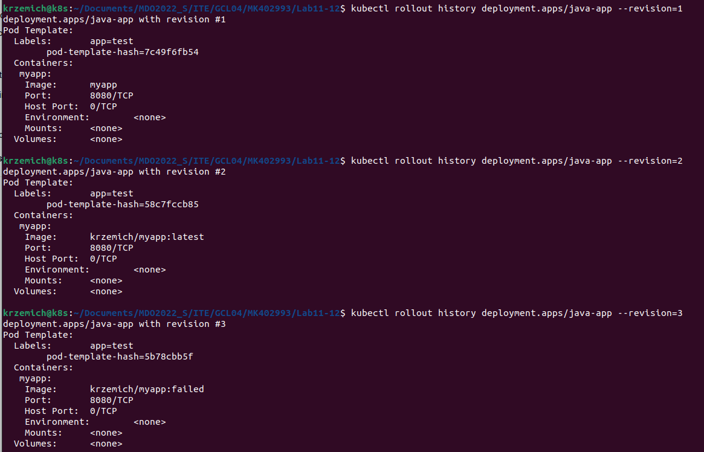

6. Następnie wykonano powrót do poprzednich revision dzięki poleceniu `kubectl rollout undo` z flagą `--to-revision=`.

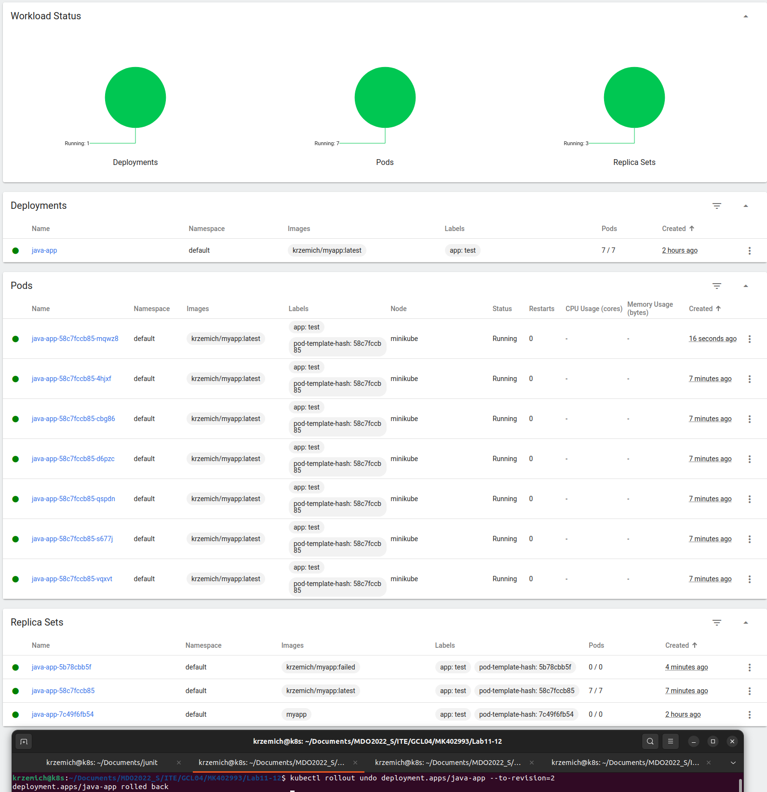

## Kontrola wdrożenia

1. Przygotowano skrypt bashowy, który przyjmuje dwa argumenty: nazwę pliku wdrożenia yaml i nazwę deploymentu do sprawdzenia. Następnie wykonano testy dla wdrożenia obrazu z tagiem latest.

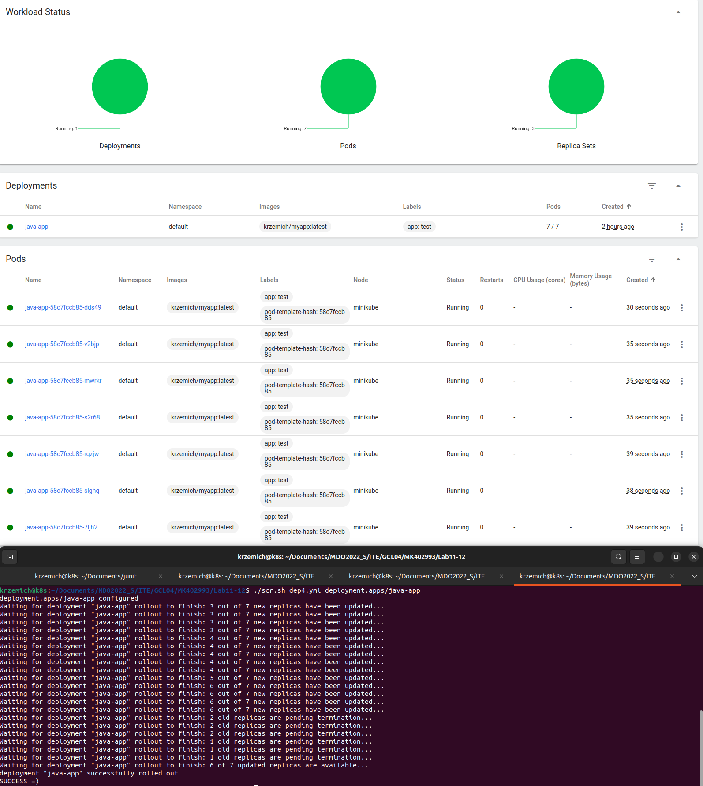

Nie wykonano testu dla obrazu działającego błędnie ze względu na zawieszanie się procesu w trakcie przetwarzania błędu.

## Strategie wdrożenia

Podjęto próbę wykonania strategii wdrożenia i przygotowano pliki wdrożenia dla zawartych w instrukcji strategii, jednakże przy wykonywaniu polecenia apply nie zachodziły żadne zmiany konfiguracyjne i nie udało się zauważyć żadnych różnic w trakcie wykonywania wdrożeń.

Podsumowując K8s pozwala w łatwy sposób kontrolować wdrożenie i skalowanie aplikacji dzięki deklaratywnym plikom wdrożeniowym. Podstawy są wyjaśnione w bardzo prosty i przyjazny sposób, a jednocześnie jest wiele sposób na to, żeby dostosować K8s pod własne potrzeby. Więcej problemów w trakcie wykonywania tego ćwiczenia sprawił mi sprzęt, niż sam kubernetes, przez który termin wykonania odsunął się w czasie.