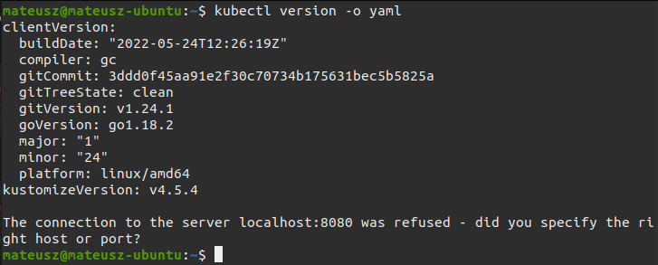
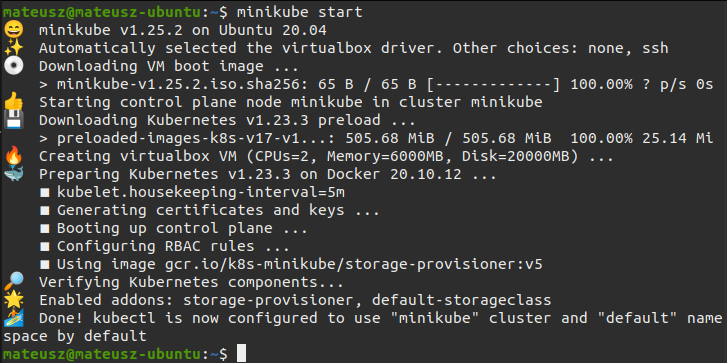
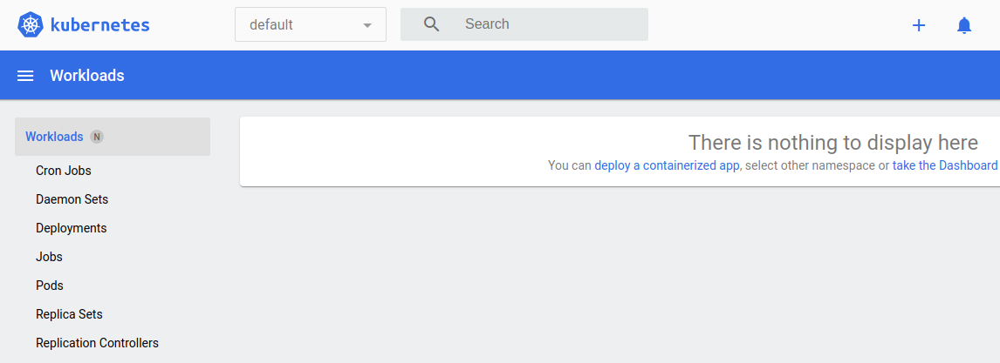
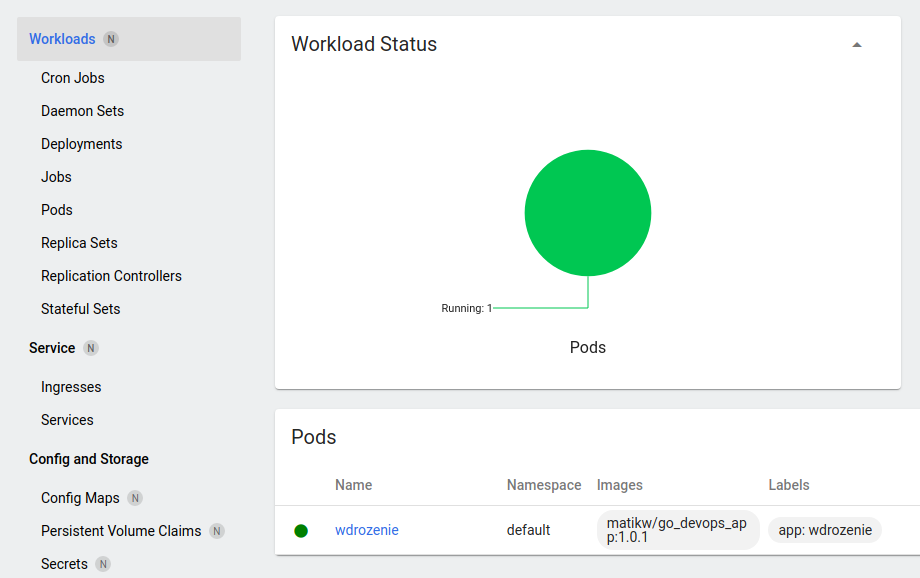
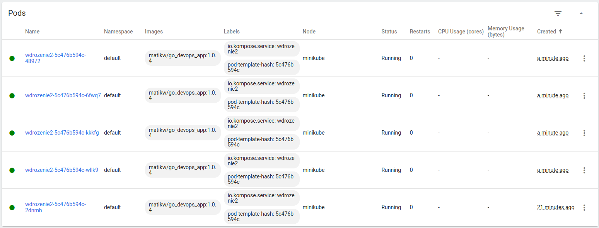
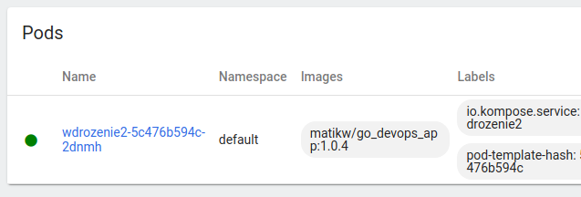
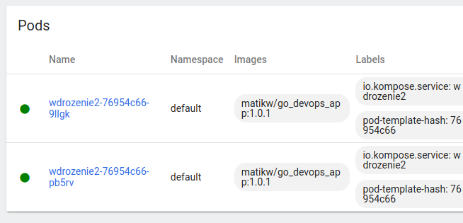
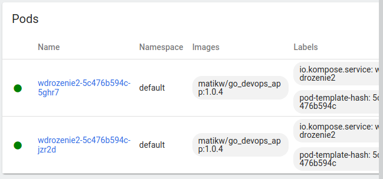
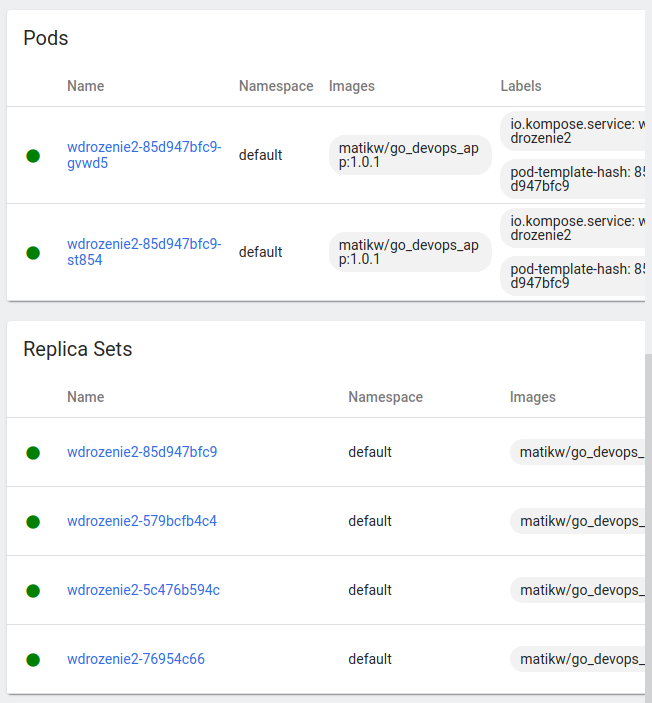

# Sprawozdanie Lab11
## Mateusz Kwiecień, Informatyka Techniczna 
### Realizacja laboratorium

1. Na początku zainstalowano narzędzie minikube


2. Następnie zainstalowano polecenia kubectl



3. Po uruchomienu komendy `minikube start`, został wybrany dostępny drier domyślny, czyli na mojej maszynie narzędzie virtualbox.



4. Następnie uruchomioniono dashboard za pomocą `minikube dashboard`




5. Znaleziono prosty projekt oraz go sklonowano. Stworzono plik Dockerfile

```
FROM golang:1.16-alpine
USER root 
WORKDIR "/app"
RUN apk add git 
RUN git clone https://github.com/mati-kw/Golang-Static-HTTP-Server.git
WORKDIR "/app/Golang-Static-HTTP-Server"
RUN go build -o /go_app
EXPOSE 8000
CMD [ "/go_app" ]
```

6. `sudo docker build -t go_devops_app:1.0.1 .`
7. Zbudowano i dodano image na Dockerhuba korzystając z poniższych poleceń

```
docker build -t matikw/go_devops_app:1.0.1 .
docker login 
docker push matikw/go_devops_app:1.0.1
```


8. Deploy konteneru do poda
```
kubectl run wdrozenie --image=matikw/go_devops_app:1.0.1 --port=8000 --labels app=wdrozenie
```



9. Poprawnie uruchomiony pod


10. Nowe wdrozenie korzystając z plików
```
kubectl apply  -f backend-deployment.yaml,backend-service.yaml
```


11. Forwardowanie portu by komunikować się z aplikacjią

```
kubectl port-forward service/wdrozenie2 8000:8000
```


12. Zbadano status za pomocą 

```
kubectl rollout status deployment/wdrozenie2
```


13. Zmieniono liczbe replik i pownownie uruchomiono komendę
```
kubectl apply  -f backend-deployment.yaml,backend-service.yaml
```


14. Zmieniono ponownie liczbe replik na 1



14. Zmieniono liczbe replik na 0


15. Zastosowano starszy obraz(1.0.1 - widać na screenshocie) z ilością replik 2



16. Wykonano rollout history
```
kubectl rollout history deployment/wdrozenie2
```


17. Przywrócono do poprzedniej wersji(1.0.4 - widać na screenshocie) za pomocą:
```
kubectl rollout undo deployment/wdrozenie2
```


18. Skopiowano skrypt sprawdzający poprawność wdrożenia lecz nie udało się wywołać sztucznie sytuacji gdzie uruchamia się on przez 60 sekund (wdrożenie zajmuje za mało czasu - niecałą sekundę)
```
#!/bin/bash
set -o errexit
set -o pipefail
set -o nounset

deployment=

get_generation() {
  get_deployment_jsonpath '{.metadata.generation}'
}

get_observed_generation() {
  get_deployment_jsonpath '{.status.observedGeneration}'
}

get_replicas() {
  get_deployment_jsonpath '{.spec.replicas}'
}

get_available_replicas() {
  get_deployment_jsonpath '{.status.availableReplicas}'
}

get_deployment_jsonpath() {
  local readonly _jsonpath="$1"

  kubectl get deployment "${deployment}" -o "jsonpath=${_jsonpath}"
}

if [[ $# != 1 ]]; then
  echo "usage: $(basename $0) <deployment>" >&2
  exit 1
fi

readonly deployment="$1"

readonly generation=$(get_generation)
echo "waiting for specified generation ${generation} to be observed"
while [[ $(get_observed_generation) -lt ${generation} ]]; do
  sleep .5
done
echo "specified generation observed."

readonly replicas="$(get_replicas)"
echo "specified replicas: ${replicas}"

available=-1
while [[ ${available} -ne ${replicas} ]]; do
  sleep .5
  available=$(get_available_replicas)
  echo "available replicas: ${available}"
done

echo "deployment complete."
```


19. Strategia Recreate - usuwa uruchomione instancje i odtwarza je z nowszą wersją (były 2, usunięte 2, stworzone nowe 2 przez plik yaml czyli 2 pody i 4 repliki tak jak na screenshocie)
```
strategy:
  type: Recreate
```




20. Strategia rolling update - updatuje ReplicaSet - powolnie, wersje są wprowadzane po jednej instancji na raz - nie udało się wystarczająco szybko stworzyć screenshota.
```
type: RollingUpdate
  rollingUpdate:
    maxSurge: 2
    maxUnavailable: 0
```

21. Canary Deployment workload - opiera się na wprowadzaniu zmian tylko do niektórych ReplicaSet. Pozwala to na przetestowanie zmian na podgrupie użytkowników upewniając się w tym czasie czy wprowadzone zmiany nie powodują możliwych błędów.

```
spec:
  replicas: 1
```