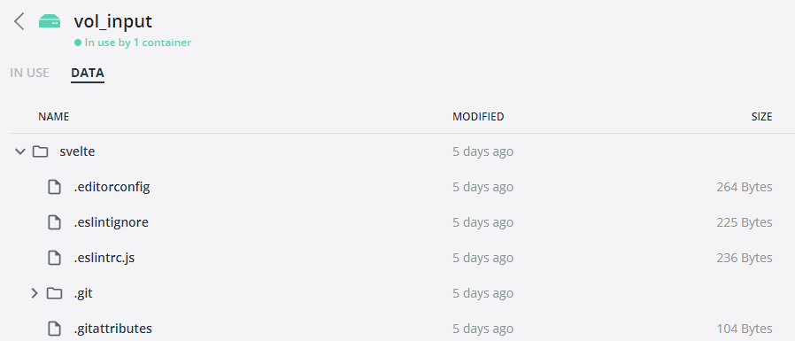
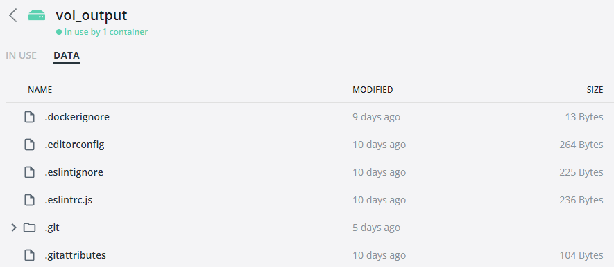
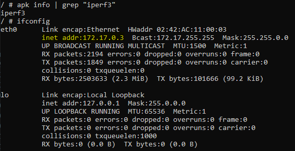
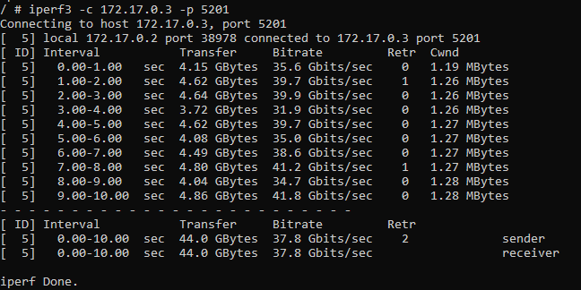
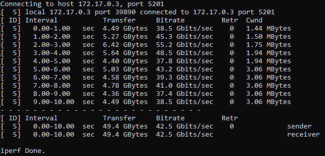

## Sprawozdanie 4

## Dodatkowa terminologia w konteneryzacji, instancja Jenkins

## Zadania do wykonania

### Zachowywanie stanu

-   Przygotuj woluminy wejściowy i wyjściowy, o dowolnych nazwach, i podłącz je do kontenera bazowego, z którego rozpoczynano poprzednio pracę

    ```bash
    docker volume create vol_input
    docker volume create vol_output
    ```

    

-   Uruchom kontener, zainstaluj niezbędne wymagania wstępne (jeżeli istnieją), ale _bez gita_

    Ponieważ kontener używany na ostatnich zajęciach bazował na najnowszym obrazie **NodeJS**, do którego dołączany jest _git_, to postanowiono tym razem operować na wersji **Alpine 17**.

    Uruchomiono i dołączono woluminy za pomocą poniższego polecenia:

    ```bash
    docker run -dt \
        --name node_js \
        --mount src=vol_input,dst=/cloned \
        --mount src=vol_output,dst=/built \
        node:17-alpine
    ```

-   Sklonuj repozytorium na wolumin wejściowy

    Stworzono do tego nowy Dockerfile:

    ```bash
    FROM node:17-alpine

    RUN apk add --update git
    RUN git clone https://github.com/sveltejs/svelte.git

    VOLUME ["vol_input"]
    ```

    

    -   Przed <br/>
        

    -   Po <br/>
        

-   Uruchom build w kontenerze

    Do stworzenia build'a wykorzystano **Dockerfile** z ostatnich zajęć.

-   Zapisz powstałe/zbudowane pliki na woluminie wyjściowym

    

### Eksponowanie portu

-   Uruchom wewnątrz kontenera serwer iperf (iperf3)

    ```bash
    docker run -it --name iperf_server alpine
    ```

    

-   Połącz się z nim z drugiego kontenera, zbadaj ruch

    

-   Połącz się spoza kontenera (z hosta i spoza hosta)

    

-   Przedstaw przepustowość komunikacji lub problem z jej zmierzeniem (wyciągnij log z kontenera)

    Odnotowano większą przepustowość przy połączeniu z hosta. Dokładne wyniki widoczne na screenach powyżej.

### Instancja Jenkins

-   Zapoznaj się z dokumentacją https://www.jenkins.io/doc/book/installing/docker/

        Zgodnie z dokumentacją, postanowiono utworzyć sieć **jenkins**.

        ```bash
        docker network create jenkins
        ```

    

-   Przeprowadź instalację skonteneryzowanej instancji Jenkinsa z pomocnikiem DIND

    Uruchomiono obraz Docker-in-Docker zgodnie z instrukcją Jenkinsa.

    ```bash
    docker run --name jenkins-docker --rm --detach \
        --privileged --network jenkins --network-alias docker \
        --env DOCKER_TLS_CERTDIR=/certs \
        --volume jenkins-docker-certs:/certs/client \
        --volume jenkins-data:/var/jenkins_home \
        --publish 2376:2376 \
        docker:dind --storage-driver overlay2
    ```

    Z powodu problemów ze stworzeniem Dockerfile do edycji obrazu **Jenkins Docker**, wykorzystano obraz **jenkins-blueocean** w najnowszej wersji.

-   Zainicjalizuj instację, wykaż działające kontenery, pokaż ekran logowania

    -   Działające kontenery <br/>
        

    -   Panel użytkownika
        
