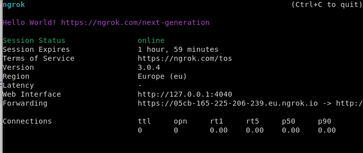
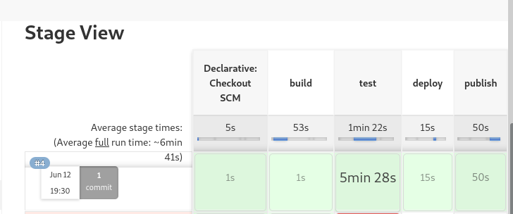
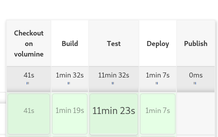
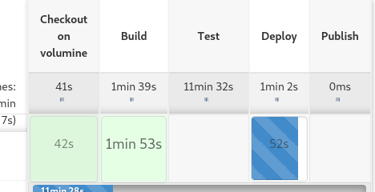
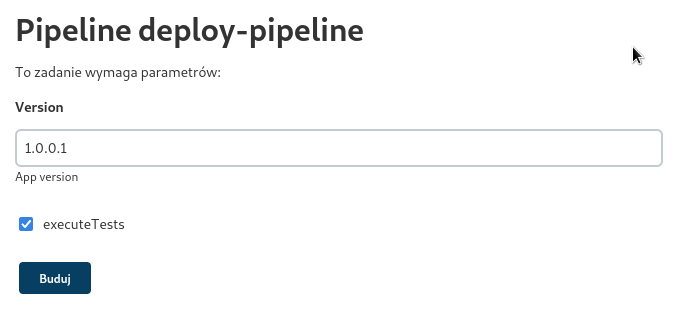
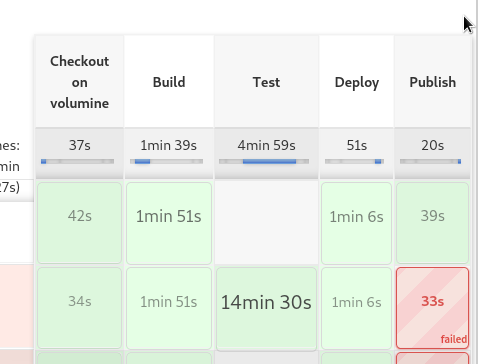

# LAB 5-8 - Dominika Lazarowicz
### Sprawozdanie - pipeline

Kontener Jenkins został skonfigurowany wedle oficjalnych instrukcji (https://www.jenkins.io/doc)

 co zostało przedstawione w sprawozdaniach z poprzednich ćwiczeń.

W celu zapoznania się z narzędziem jaki jest Jenkins został przeze mnie stworzony pipeline testowy. 

```
pipeline {
  agent { docker { image 'node:16.13.1-alpine' } }
  	stages {
	  stage('build') {
		steps {
         sh 'node --version'
		 }
      }
  }
}
```

Plik ze skryptem został umieszczony w zdalnym repoztytorium skąd był on pobierany automatycznie w trakcie uruchamiania pipeline'a. 

Całość zakończyła się sukcesem, co pozwala nam przejść do dalszej pracy.


### Webhhook

Do mojego repozytorium postanowiłam dodać funkcjonalność uruchamiania pipeline'a za każdym razem, gdy jakiekolwiek zmiany zostaną dodane do projektu.

W tym celu użyłam webhook'a praz narzedzia ngrok w celu udostępnienia adresu Jenkinsa (metoda tunelowania).



Wygenerowany adres dodałam do repozytorium.


Materiały z których korzystałam:

https://www.youtube.com/watch?v=palp_5k81j0

 https://dzone.com/articles/adding-a-github-webhook-in-your-jenkins-pipeline


# **Wersja 1 - użycie dockerfile's**

W pierwszej wersji pipeline'a postanowiłam użyć skryptów pisanych w ramach poprzednich labolatoriów i na ich postawie będą wykonywać się kolejne stage'e.

Nasz pipeline będzie składać się z czterech głównych stage'ów:

- build
- test
- deploy
- publish

Jako parametry początkowe do naszego pipeline'a podaje jako string wersję aplikacji, którą będę budować.

```
  parameters {

    string(name: 'Version', defaultValue: '', description: 'App version')

  }
```

##### 1.Build

W kroku `Build` tworzymy obraz `builder` na podstawie obrazu `node`.  Klonujemy repozytorium i wykonujemy w nim

- npm install
- npm run build

```
       stage("build") 
         steps {
           dir('CI'){
       		sh 'docker build . -f builder.dockerfile -t builder'
           }
         }
       }
```

```
       FROM node:latest
       
       RUN git clone https://github.com/ldidil/nodejs.org.git
       WORKDIR nodejs.org
       RUN npm install
       RUN npm run build
```

##### 2.Test

Analogicznie do poprzedniego punktu wywołuje skrypt i  uruchamiam testy .

 ```
       stage('test') {
            steps {
                dir('CI'){
				 sh 'docker build . -f test.dockerfile -t tester'
			     sh' docker run tester'
                }
 ```
```
FROM builder:latest

WORKDIR /nodejs.org/

RUN npm run test
```

##### 3.Deploy

W tym kroku kopiujemy folder `build`, który uprzednio wyciągnęliśmy z `buildera`, do `/usr/share/nginx/html`,  Ponadto ustawiamy przekierowanie portu z 80, na którym domyślnie działa `nginx` na port 3000, dzięki czemu możemy wejść na naszą hostowaną stronę poprzez `localhost`.

Po odpaleniu  kontenera wyłączam go w celu przyśpieszenia pipeline'u.

W tej wersji nie używam żadnych woluminów.
```
stage('deploy') {
    steps {
       dir('CI'){
          sh 'docker build . -f deploy.dockerfile -t deploy'
          sh 'docker run  -d -p 3000:80 deploy '      
	      sh 'docker stop $(docker ps -a -q)'
       }         
   }
}
```
```
FROM nginx:stable-alpine

COPY --from=builder nodejs.org/build/en /usr/share/nginx/html
COPY --from=builder nodejs.org/build/static /usr/share/nginx/html/static
```

##### 4.Publish

Ostatnim krokiem jest publikacja naszej aplikacji. Ja zdecydowałam się zapakować mój build do archiwum.
```
FROM builder:latest

WORKDIR /nodejs.org/

RUN npm run test
```
```
stage('publish') {
		environment{
			version = "${params.version}"
		}
            steps {
                 dir('CI'){
	              sh 'docker build . -f publish.dockerfile -t publish'
	              sh "docker run --volume /var/jenkins_home/workspace/volumes:/final publish mv 			  nodejs.tar.xz /final"
	              echo "NODEJS.ORG version ${params.version} published " 	
                 }
            }
        }
   }
```

Wykonany pipeline:




Spakowany obraz:


### Stages

Przechodzę do własciwej części zadania chciałabym omówić budowe pipeline'a. 

Składa on się z 6 kroków, których celem jest deploy do npm.

Po kilku pierwszysch uruchomieniach zauważyłam, że testy są najdłużej wykonywanem stage'em. Z tej racji postanowiłam dodać parametr, który pozwoli ominąć ten  krok przy uruchamianiu pipepline'a.


```
    parameters {
       booleanParam(name: 'executeTests', defaultValue: true, description: '')
    }
```

executeTests = true



executeTests = false




**1. Volumine**

Ten stage tworzy nam dwa voluminy: wejściowy i wyjściowy poleceniem `docker volume create` (analogicznie jak robiliśmy to w lab04)

Checkout dokonywany jest poprzez wbudowaną w Jenkinsa funkcjonalność `checkout scm`.

Następnie uruchamiam tymczasowy kontener ( tworzony jest jako detached w celu pracy w tle). Do kontenera podpinam wolumin wejsciowy. 
```
stage('Create Volumine') {
            agent any
            steps {
                script{
                    try{
                        sh 'docker volume create vol-in'
                        sh 'docker volume create vol-out'
                        sh 'rm * -r'
                        sh 'docker volume ls'

                        sh 'docker run -d --rm --name tmp -v vol-in:/vi alpine tail -f /dev/null'
                        dir('scm_cp') {
                            checkout scm
                            sh 'rm .git .github -r'
                            sh 'cat package.json'
                            sh 'docker cp . tmp:/vi/$BUILD_NUMBER'
                            sh 'docker stop tmp'
                        }
                    }
                    catch (Exception e) {
                        sh 'docker stop tmp'
                        throw new Exception(e.toString())
                    }
                }
            }
```


**2. Build**

W kroku build używany jest agent dockerowy z imagem node.

 Jako argumenty podane są trzy woluminy: wejściowy, wyjściowy i odwołanie do katalogu roboczego jenkinsa. 

W katalogu BLD kopiuję zawartość katalogu roboczego do aktualnego katalogu, przechodzimy do instalacji pakietów npm i rozpoczynamy build. Wyświetlam zbudowane elementy i pozostałe pliki wyprowadzam do katalogu pckg w katalogu roboczym jenkinsa.

```
stage('Build') {
            agent {
                docker {
                    image 'node'
                    args '-v vol-in:/vi -v vol-out:/vo -v $WORKSPACE:/output'

                }
            }
            steps {
                sh 'ls /vi/$BUILD_NUMBER -al'
                dir('BLD') {
                    sh 'cp /vi/$BUILD_NUMBER/ . -r'
                    sh 'npm install --save --legacy-peer-deps'
                    sh 'npm run build'
                    sh 'cp . /output/pckg -r'
                }
            }
        }
```


**3. Test**

Tak jak w poprzednim kroku używam agenta dockerowego na obrazie z nodem. Na plikach w katalogu BLD uruchamiam testy poleceniem `npm test` .
```
stage('Test') {
            agent {
                docker {
                    image 'node'
                    args '-v vol-in:/vi -v vol-out:/vo'

                }
            }
            when {
                expression {
                    params.executeTests
                }
            }

            
            steps {

                dir('BLD') {
                    sh 'npm run test'
                }

            }
        }

```

**4.  Deploy**

W blocku try-catch uruchamiam standardowe npm start, które objęte jest timeout'em.
Cały problem rozwiązuje w bloku try-catch. Uruchamiam npm start i w bloku łapię wyzwolony błąd gdzie podejmuje decyzję co dalej. Jeśli jest to wzorcowy błąd wyzwolony poprzez interrupt to idę dalej, a jeśli inny to pipeline kończy się z błędem
```
        stage('Deploy') {
            agent {
                docker {
                    image 'node'
                    args '-v vol-in:/vi -v vol-out:/vo'

                }
            }
            steps {

                dir('BLD') {
                    script {
                        try {
                            timeout(time: 1, unit: 'MINUTES') {
                                sh 'npm start'
                            }
                        } catch (Exception e) {
                            echo e.toString()
                            		if(e.toString()=="org.jenkinsci.plugins.workflow.steps.FlowInterruptedException")
                            {
                                echo 'Deployed successfully!'
                            }else{
                                throw new Exception(e.toString())
                            }
                        }
                    }

                }

            }
        }
```

**5.  Publish**

W tym podpunkcie wykonuje publish na npm registry. W tym celu założyłąm konto na stronie https://www.npmjs.com/, wygenerowałam token, `NPMJS_TOKEN` który dodałam do zmiennych środowiskowych.  Wygenerowałam token `GH_TOKEN`też dla swojego konta github.Dodatkowo zmodyfikowałam plik package.json gdzie zmieniłam wartości `name` oraz `reposotory`.


```
stage('Publish') {
            agent {
                docker {
                    image 'node'
                    args '-v vol-in:/vi -v vol-out:/vo'
                }
            }
            steps {
                dir('pckg/$BUILD_NUMBER') {
                        sh 'ls . -al'                    
                        withEnv(["TOKEN=${NPMJS_TOKEN}"]) {
                            sh 'echo "//registry.npmjs.org/:_authToken=${TOKEN}" >> ~/.npmrc'
                        }
                        sh 'npm version ${VER}-build$BUILD_NUMBER'
                        sh 'npm publish'
                }
            }
        }
```


**6. Sekcja Post**

Dzięki tej sekcji możemy wykonywać akcje niezależnie czy pipeline się powiedzie czy nie. Postanowiłam go wykorzystać  w celu wysyłania maila po każdym wykonianiu.Używam do tego pluginu Email Extension w ustawieniach Jenkinsa i wywołuje funkcje `emailtext` .

```
post{
        failure{
                emailext subject: "Job '${env.JOB_NAME} [${env.BUILD_NUMBER}]' failed",
                body: "FAIL: Job '${env.JOB_NAME} [${env.BUILD_NUMBER}]':\n Check console output at ${env.BUILD_URL}",
                to: 'dominila.l@gmail.com'
        }
        success {
             emailext subject: "Job '${env.JOB_NAME} [${env.BUILD_NUMBER}]' executed successfully.",
                body: "SUCCESS: Job '${env.JOB_NAME} [${env.BUILD_NUMBER}]'",
                to: 'dominila.l@gmail.com'
        }
    }
```


### **Diagram **


## **Rezultat**






## **Wnioski**

Udało mi się stworzyć 2 działające pipeliny. . Pierwszy z nich działa na podstawie budowania obrazów z Dockerfile, przy jednoczesnym zastosowaniu zalet skryptowego jenkinsfile. W drugim rozwiązaniu cały kod znajduje się w jednym pliku a sam pipepline został rozszerzony o działanie na voluminach oraz agencie node.
Oba również mocno różnią się sposobem publikacji.
