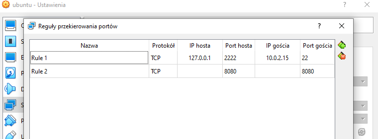
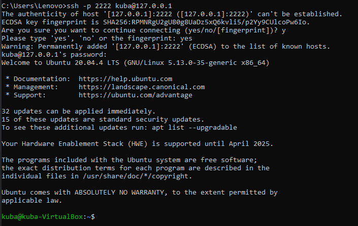
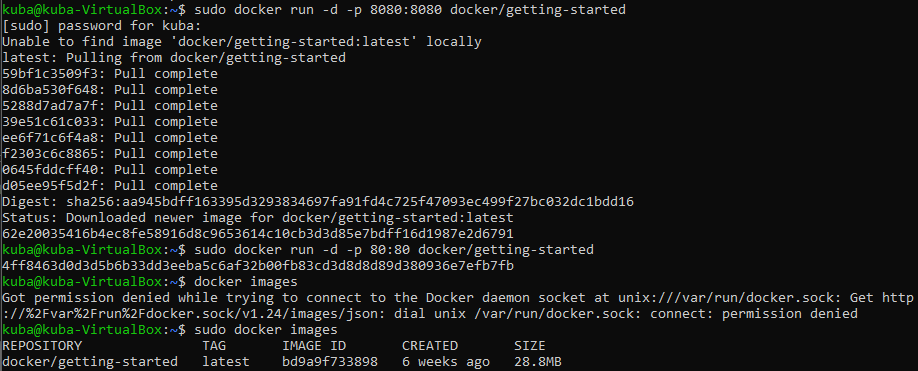

# Sprawozdanie 2 z Metodyk DevOps

## Wykonane zadania:

1.Przygotowano git hook, którego zadaniem jest rozwiązanie problemów z commitami

Hook sprawdza, czy tytuł commita ma taką samą nazwę jak branch, a także, czy w treści commita znajduje 
się numer laboratorium.

Działanie hook'a, które testowano w wirtualnej maszynie poprzez dodanie testowego pliku, oraz "exit 1" w pliku
commit-msg:

Jak widać, należy dokładnie podać inicjały wraz z numerem indeksu, oraz numer labolatorium.

Treść hook'a:

#!/usr/bin/env bash

INPUT_FILE=$1

LAB_NO="Lab02"

if ! [[ "$(cat $1)" =~ "JM400165 $LAB_NO" ]]; then

echo "Commit failed"

exit 1
fi
echo "Success"

2.Kolejnym krokiem było przygotowanie środowiska Dockerowego.

Zapewniono dostęp do wirtualnej maszyny poprzez zdalny terminal, wcześniej zmieniając porty 
w ustawieniach wirtualnej maszyny:

Jak widać na powyższym screenie, dostęp został przyznany.

Środowisko dockerowe na maszynie wirtualnej oraz na systemie Windows zostało już wcześniej zainstalowane,
więc wystarczyło ten fakt sprawdzić poleceniem "docker --version": 

3.Następnie pobrano obraz, który był wyświetlony po zainstalowaniu Dockera na Windowsie:

Oraz pobrano obraz dystrybucji linuksowej, w tym przypadku Ubuntu, oraz uruchomiono go:

Jak można zauważyć wersja pobranego ubuntu to "bionic-20220315"

4.Ostatnim krokiem było załozenie konta na DockerHub.

5.Polecenia użyte w terminalu:

sudo apt-get update

docker --version

docker run -d -p 8080:8080 docker/getting-started

sudo docker run -d -p 80:80 docker/getting-started

docker images

sudo docker images

docker pull ubuntu:bionic-20220315

sudo docker pull ubuntu:bionic-20220315

sudo docker images

cd MDO2022_S/.git/hooks

ls

cp commit-msg.sample commit-msg

nano commit-msg

cd ../..

touch test

git add .

git commit -m "tersrr"

git config --global user.email "jakub.michalik15@gmail.com"

git config --global user.name "KubaMichalik"

git commit -m "tersrr"

nano commit-msg

nano .git/hooks/commit-msg

git commit -m "test"

git commit -m "JM400165"

nano .git/hooks/commit-msg

git commit -m "test"

chmod +x  .git/hooks/commit-msg

git commit -m "test"

chmod a+x .git/hooks/commit-msg

git commit -m "test"

git commit -m "JM400165 Lab02"

nano .git/hooks/commit-msg

git commit -m "JM400165"

nano .git/hooks/commit-msg

git commit -m "JM400165"

nano .git/hooks/commit-msg

git commit -m "JM400165"

git commit -m "JM400165 Lab02"

git commit -m "JM400165"

nano .git/hooks/commit-msg

ls

rm test

ls

git branch

git checkout JM400165

git branch

ls

cd ITE/GCL05/JM400165

ls

mkdir Lab02

cd Lab02

mkdir screens

touch sprawozdanie02.md

git add .

git status

cd ../../../..

git add .

git status

git commit -m "JM400165 Lab02"

git push

