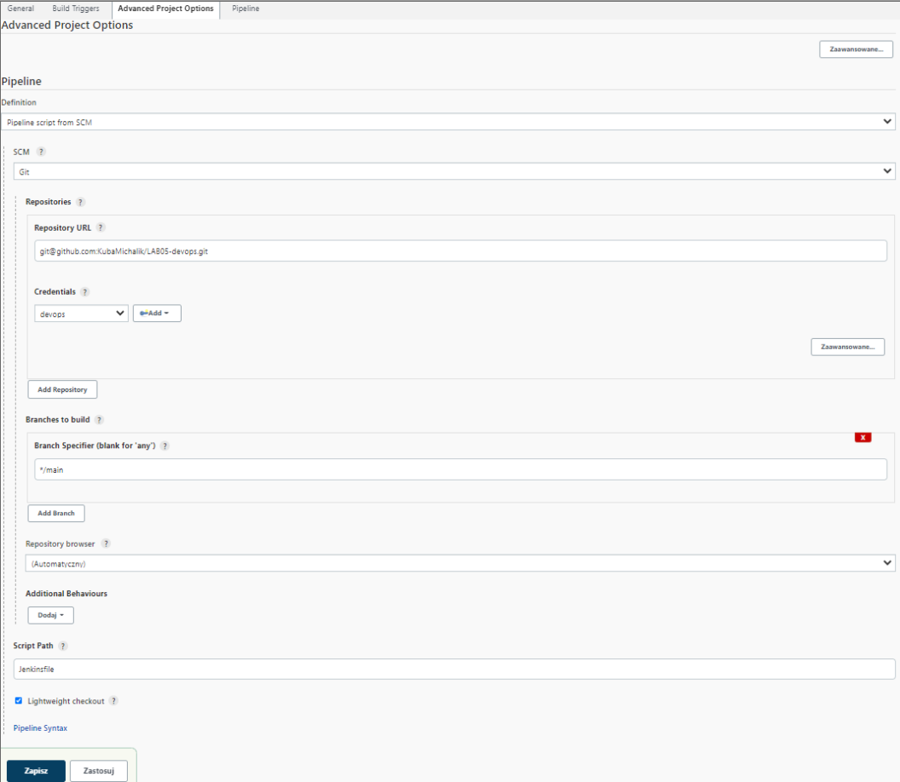
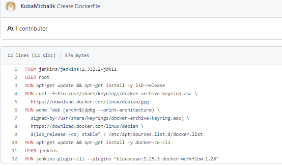
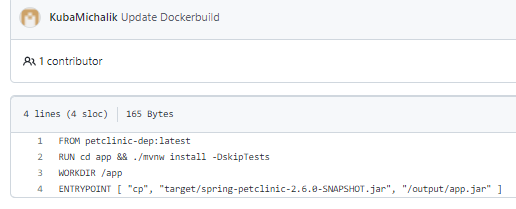
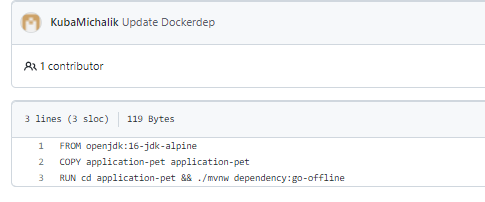
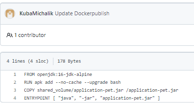
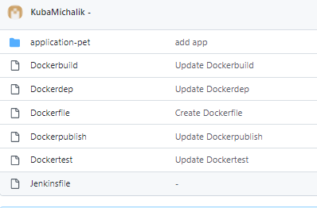

#Projekt z laboratorió 05-08, Pipeline Jenkins - Jakub Michalik

##Logowanie do Jenkinsa

1. Po uruchomieniu Virtualnej Maszyny i włączeniu Jenskinsa na serwerze localhost:8080, 
pojawił się panel logowania do Jenkinsa

2. Kolejnym krokiem było wpisanie danych do logowania i zalogowanie się

 

##Tworzenie repozytorium

3. Następnym krokiem było stworzenie repozytorium, które będzie przechowywało Dockerfile, kod aplikacji itp.

##Dodanie Credentials do Github'a

4. Potem należało dodać wspomniane w tytule Credentials do githuba, aby Jenkins mógł pobierać repozytorium
w trakcie wykonywania pipelina.

5. W zakładce "Nowy projekt" wybrano Pipeline oraz nadano mu nazwę "pipeline_devops_JM400165", co 
widoczne jest na screenie:

 
6. Następnie trzeba było skonfigurować Pipelina, w zakładce General, nic nie zaznaczamy, natomiast w zakładce 
Pipeline, definicje ustawiamy jako "Pipeline script from SCM", potem w polu SCM ustawiamy "Git". W kolejnym miejscu 
wpisujemy adres SSH repozytorium, tutaj akurat "git@github.com:KubaMichalik/LAB05-devops.git".
Potem następne ustawienia wybrałem zgodnie z instrukcja znalezioną w internecie.

7. Pliki umieszczone w repozytorium.

Dockerfile:

Dockerbuild:

Buduje apikacje baując na zbudowanym obrazie. Po uruchomieniu kontenera, plik .jar zostanie skopiowany i gdy wszystko
przebiegnie pomyślnie pipeline zostanie artefaktem

Dockerdep:

Będzie on służył do pobierania aplikacji. Pobiera bazę kontenera i kopiuje pliki aplikacji.

Dockerpublish:

Testuje, czy aplikacja może uruchomić na pliku .jar. Entrypoint ustawia się, aby na starcie kontenera aplikacja uruchamiała się

Dockertest:

Zadaniem Dockertestu jest testowanie zbudowanej aplikacji.

8. Tworzenie pipeline'a

Każdy stworzony plik dokera wykorzystywany jest przez stage w "Jenkinsfile". Na początku budujemy obraz, 
następnie budowana jest aplikacja wewnątrz. Kolejny stage to testowanie, czyli po prostu przeprowadzane są
testy aplikacji. Na końcu tworzony jest obraz na podstawie Dockerpublish. Na końcu zapisywany jest artefakt, gdy cała 
aplikacja zostanie pomyslnie ukończona.

 
9. Stworzone repozytorium:

10.Podsumowanie

Niestety nie udało się stworzyć pipeline  dla tej aplikacji. Spowodowane to może być błędem popełnionym we wcześniejszych
zadaniach laboratoryjnych. Kolejną możliwością popełnienia błędu jest pośpiech i nieuwaga przy wykonywaniu kroków.

