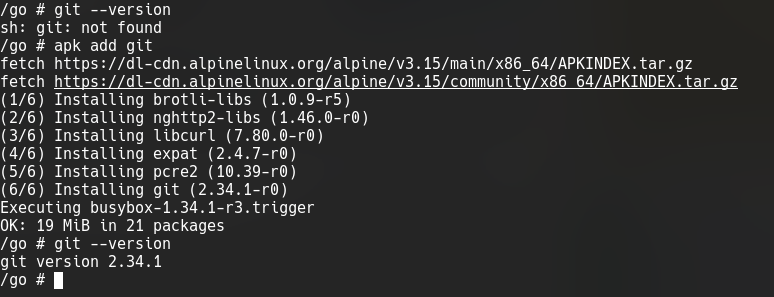
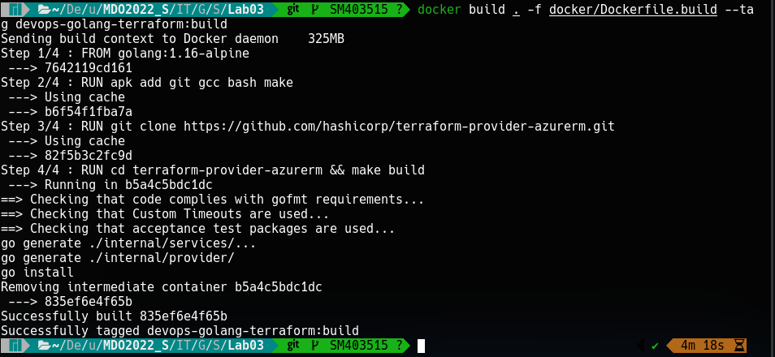

# Sprawozdanie - LAB 03

## Zadania do wykonania

### Wybór oprogramowania na zajęcia

- Znajdź repozytorium z kodem dowolnego oprogramowania, które:
- Sklonuj niniejsze repozytorium, przeprowadź build programu (doinstaluj wymagane zależności)

```
git clone https://github.com/hashicorp/terraform-provider-azurerm.git
```


```
make build
```


- Uruchom testy jednostkowe dołączone do repozytorium

```
make test
```


### Przeprowadzenie buildu w kontenerze

1. Wykonaj kroki build i test wewnątrz wybranego kontenera bazowego

   - uruchom kontener
   - podłącz do niego TTY celem rozpoczęcia interaktywnej pracy

```
docker run -it --name devops-golang-azure golang:1.16-alpine sh
```


- zaopatrz kontener w wymagania wstępne (jeżeli proces budowania nie robi tego sam)
- sklonuj repozytorium

```
apk add git gcc libc-dev bash make
git clone https://github.com/hashicorp/terraform-provider-azurerm.git
```




- uruchom build

```
make build
```


- uruchom testy - output z testów znajduje się w pliku ze względu na objętość

```
make test
```


2. Stwórz dwa pliki Dockerfile automatyzujące kroki powyżej, z uwzględnieniem następujących kwestii
   - Kontener pierwszy ma przeprowadzać wszystkie kroki aż do builda

```
FROM golang:1.16-alpine

RUN apk add git gcc libc-dev bash make

RUN git clone https://github.com/hashicorp/terraform-provider-azurerm.git

RUN cd terraform-provider-azurerm && make build
```



- Kontener drugi ma bazować na pierwszym i wykonywać testy

```
FROM devops-golang-terraform:build

RUN cd terraform-provider-azurerm && make test
```


3. Wykaż, że kontener wdraża się i pracuje poprawnie. Pamiętaj o różnicy między obrazem a kontenerem. Co pracuje w takim kontenerze?

```
docker images
```


```
docker run -it --rm --name devops-golang-azure-test-pass-run devops-golang-terraform:test
```


### Zakres rozszerzony tematu sprawozdania

#### Docker Compose

- Zamiast ręcznie wdrażać kontenery, ujmij je w kompozycję

#### Przygotowanie do wdrożenia (deploy): dyskusje

Otrzymany kontener ze zbudowanym programem może, ale nie musi, być już końcowym artefaktem procesu przygotowania nowego wydania. Jednakże, istnieje szereg okoliczności, w których nie ma to sensu. Na przykład gdy chodzi o oprogramowanie interaktywne, które kiepsko działa w kontenerze.

Przeprowadź dyskusję i wykaż:

- czy program nadaje się do wdrażania i publikowania jako kontener, czy taki sposób interakcji nadaje się tylko do builda
- opisz w jaki sposób miałoby zachodzić przygotowanie finalnego artefaktu
  - jeżeli program miałby być publikowany jako kontener - czy trzeba go oczyszczać z pozostałości po buildzie?
  - A może dedykowany _deploy-and-publish_ byłby oddzielną ścieżką (inne Dockerfiles)?
  - Czy zbudowany program należałoby dystrybuować jako pakiet, np. JAR, DEB, RPM, EGG?
  - W jaki sposób zapewnić taki format? Dodatkowy krok (trzeci kontener)? Jakiś przykład?
