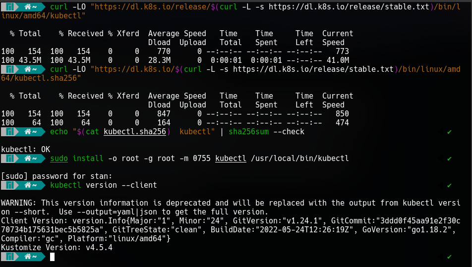
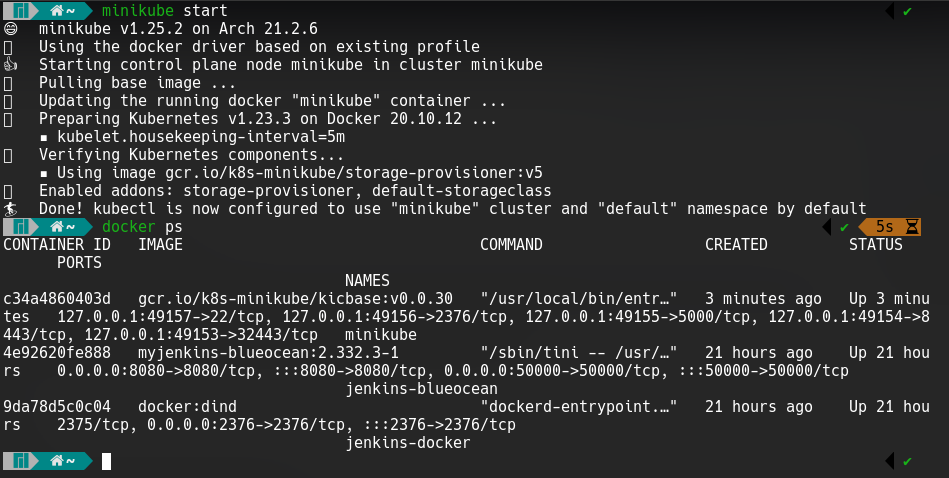
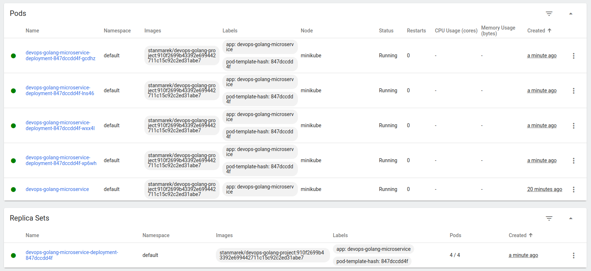

## Instalacja klastra Kubernetes

- Zaopatrz się w implementację stosu k8s: minikube

  `Instalacja przez curl i program install na Manjaro Linux`

  

- zaopatrz się w polecenie kubectl

  

- Uruchom Kubernetes, pokaż działający kontener/worker

  ```
  minikube start
  ```

  

- Zmityguj problemy wynikające z wymagań sprzętowych lub odnieś się do nich (względem dokumentacji)

  `Kontener od razu ma nadaną nazwę zmiast losowej - celem tej operacji jest zablokowanie tworzenia więcej niż jednego kontenera minikube'a`

- Uruchom Dashboard, otwórz w przeglądarce, przedstaw łączność

  ```
  minikube dashboard
  ```

  

- Zapoznaj się z koncepcjami funkcji wyprowadzanych przez kubernetesa (pod, deployment itp)

  ~~A kto by to robił~~ Zapoznałem się :heavy_check_mark:

## Analiza posiadanego kontenera

- Zdefiniuj krok "Deploy" swojego projektu jako "Deploy to cloud":

  - Deploy zbudowanej aplikacji powinien się odbywać "na kontener"

    `Nie tworzyłem nowego kroku oraz nie modyfikowałem pipeline'a ponieważ juz działał w ten sposób`

  - Przygotuj obraz Docker ze swoją aplikacją

    `https://hub.docker.com/repository/docker/stanmarek/devops-golang-project`

  - Jeżeli wybrana aplikacja nie nadaje się do pracy w kontenerze i nie wyprowadza interfejsu funkcjonalnego przez sieć, wymień projekt na potrzeby tego zadania:

    - Minimum: obraz-gotowiec
    - Optimum: samodzielnie wybrany program, obraz zbudowany na jego bazie
    - Plan max: obraz wygenerowany wskutek pracy pipeline'u

    `Moja apka to plan max`

  - Wykaż, że wybrana aplikacja pracuje jako kontener

  

  `Konetner/aplikacja nasłuchuje na różnych endpointach (np. /ping, /login) ponieważ jest to mikroserwis. W tym czasie (zrzut ekranu powyżej) widoczne są logi uruchomieniowowe`

## Uruchamianie oprogramowania

- Uruchom kontener na stosie k8s

  ```
  minikube kubectl run -- devops-golang-microservice
  --image=stanmarek/devops-golang-project:910f2699b43392e699442711c15c92c2ed31abe7
  --port=9090 --labels app=devops-golang-microservice
  ```

- Kontener uruchomiony w minikubie zostanie automatycznie ubrany w pod.
- Przedstaw że pod działa (via Dashboard oraz kubectl)

  ```
  # kontenery z defaultowego namespace
  minikube kubectl -- get pods
  # wszystkie kontenery
  minikube kubectl -- get po -A
  ```

  
  
  `Tworzenie kontenera`
  
  `Działający kontener`
  

- Wyprowadź port celem dotarcia do eksponowanej funkcjonalności

  ```
  kubectl port-forward devops-golang-microservice 2137:9090
  ```

  

- Przedstaw komunikację z eskponowaną funkcjonalnością

  
  
  
  

  `Po wykonaniu kilku requestów widać że przekierowany port był wykorzystany`

## Przekucie wdrożenia manualnego w plik wdrożenia (wprowadzenie)

- Zapisanie wdrożenia jako plik YML

  

- Dodanie replik

  ```yaml
  apiVersion: apps/v1
  kind: Deployment
  metadata:
  name: devops-golang-microservice-deployment
  labels:
    app: devops-golang-microservice
  spec:
  replicas: 4
  selector:
    matchLabels:
      app: devops-golang-microservice
  template:
    metadata:
      labels:
        app: devops-golang-microservice
    spec:
      containers:
        - name: devops-golang-microservice
          image: stanmarek/devops-golang-project:910f2699b43392e699442711c15c92c2ed31abe7
          ports:
            - containerPort: 9090
  ```

- `kubectl apply` na pliku

  ```
  kubectl apply -f devops-golang-deployment.yaml
  ```

  
  `Obok pierwszego kontenera utworzone zostały 4 nowe zgodnie z plikiem deploymentu`
  
  
