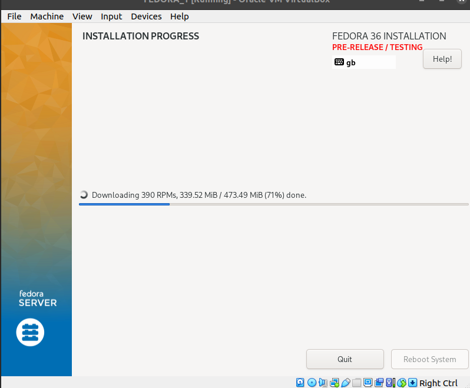
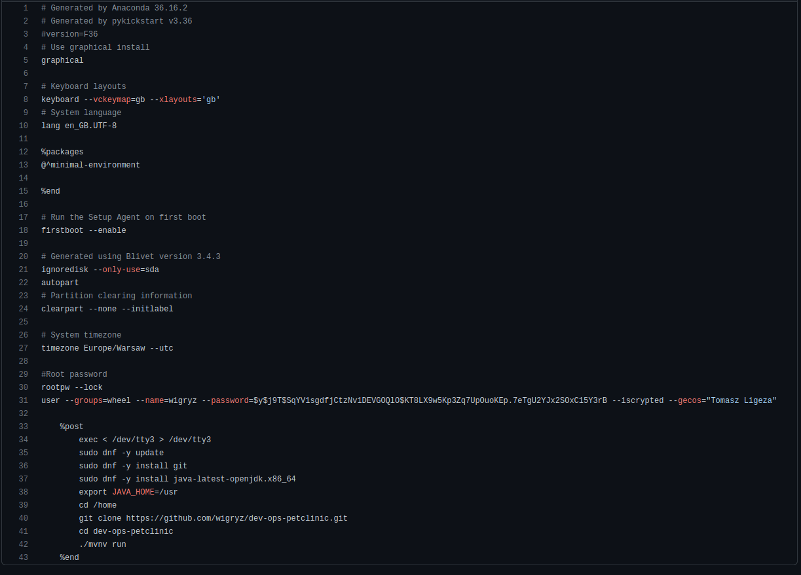
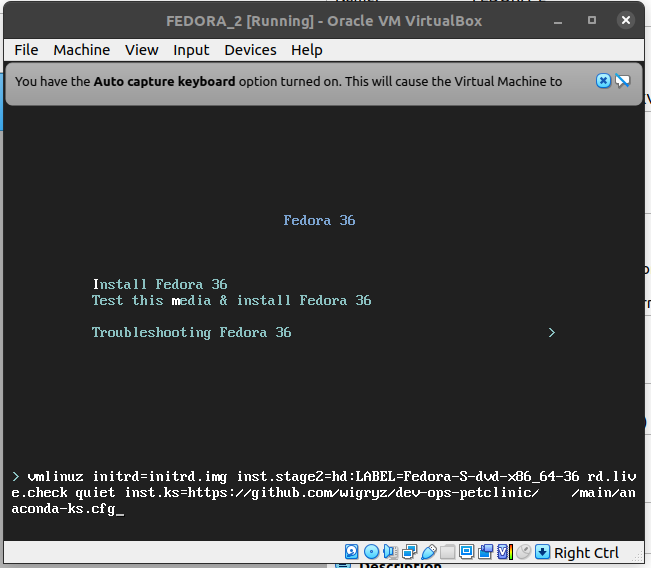
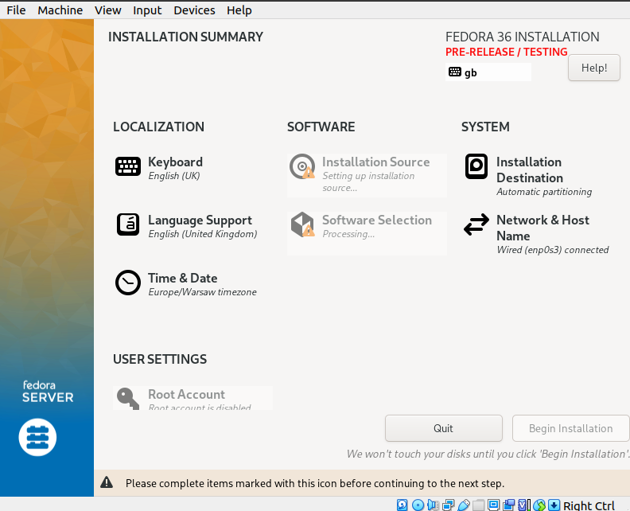
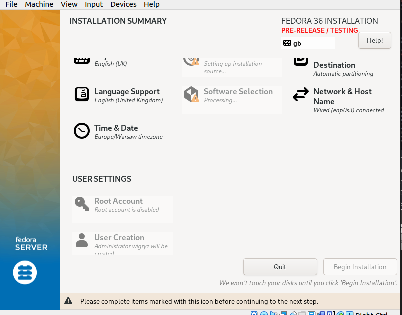

## Sprawozdanie

1. Pierwszym elementem zajęć było ręczne zainstalowanie systemu fedora na wirtualnej maszynie. W tym celu został pobrany obraz systemu fedora-server. Następnie uruchomiona została instalacja. Skonfigurowane zostało jedno konto użytkownika wigryz z hasłem 1234devops. Instalacja bazowała na minimalnym pakiecie systemu.



2. Po zakończonej instalacji na systemie zainstalowany został git, oraz java w wersji 18.

3. Następnie sklonowane zostało repozytorium na którym znajdował się zarówno kod źródłowy aplikacji jak i artefakt.
4. Uruchomione zostały testy, aby sprawdzić poprawność działania.


5. W celu przystąpienia do instalacji automatycznej musiałem przenieść plik kickstart anacondy z systemu fedora do hosta.

Zawiera on również krótki skrypt doinstalowujący git oraz javę w wersji 18, jak róœnież klonujący repozytorium.
6. Po skopiowaniu tego pliku został on wrzucony na repozytorium razem z aplikacją. Dzięki temu mogłem podać ścieżkę do niego tak, aby instalator systemu fedora mógł zaciągnąć ustawienia instalacji z poprzedniej instalacji.

7. Niestety wystąpił problem, którego nie udało mi się ominąć, mianowicie Installation Source blokował się przy ustawianiu źródła instalacji.

8. Pomimo błędu jestem w stanie stwierdzić, że konfiguracja systemu zaciągnęła się poprawnie, gdyż w ustawieniach użytkownika widnieje nazwa mojego użytkownika.

9. Podjąłem kolejną próbę instalacji fedory z przygotowanego pliku anaconda-ks.cfg, tym razem przebiegła ona pomyślnie, a przynajmniej częściowo.
Pasek instalacji doszedł do końca, na ekranie ukazał się napis "Complete!", lecz mimo to po restarcie znowu ukazał się obraz startowy instalacji systemu.

Plik anaconda-ks.cfg miał następującą postać:
```
# Generated by Anaconda 36.16.2
# Generated by pykickstart v3.36
#version=F36
# Use graphical install
graphical

# Keyboard layouts
keyboard --vckeymap=gb --xlayouts='gb'
# System language
lang en_GB.UTF-8

%packages
@^minimal-environment

%end

# Run the Setup Agent on first boot
firstboot --enable

# Generated using Blivet version 3.4.3
ignoredisk --only-use=sda
autopart
# Partition clearing information
clearpart --none --initlabel

# System timezone
timezone Europe/Warsaw --utc

#Root password
rootpw --lock
user --groups=wheel --name=wigryz --password=$y$j9T$SqYV1sgdfjCtzNv1DEVGOQlO$KT8LX9w5Kp3Zq7UpOuoKEp.7eTgU2YJx2SOxC15Y3rB --iscrypted --gecos="Tomasz Ligeza"

# Repo
url --mirrorlist=http://mirrors.fedoraproject.org/mirrorlist?repo=fedora-$releasever&arch=x86_64
repo --name=updates --mirrorlist=http://mirrors.fedoraproject.org/mirrorlist?repo=updates-released-f$releasever&arch=x86_64


    %post
        exec < /dev/tty3 > /dev/tty3
        sudo dnf -y update
        sudo dnf -y install git
        sudo dnf -y install java-latest-openjdk.x86_64
        export JAVA_HOME=/usr
        cd /home
        git clone https://github.com/wigryz/dev-ops-petclinic.git
        cd dev-ops-petclinic
        ./mvnv run
    %end
```