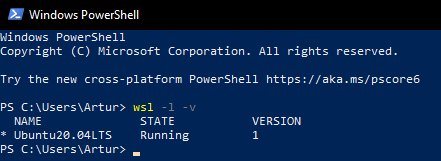
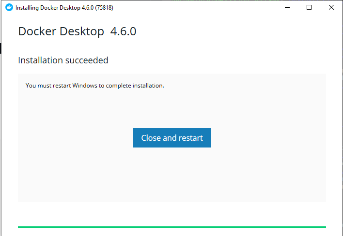
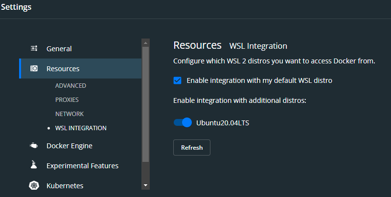
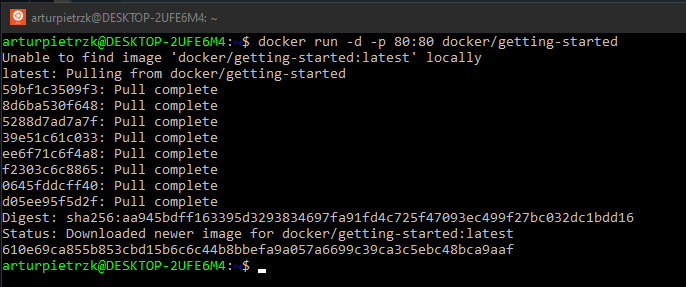
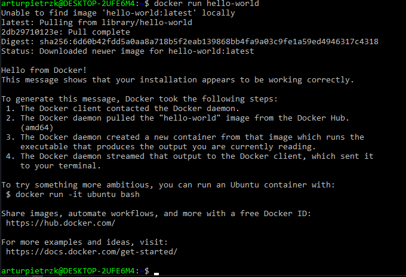
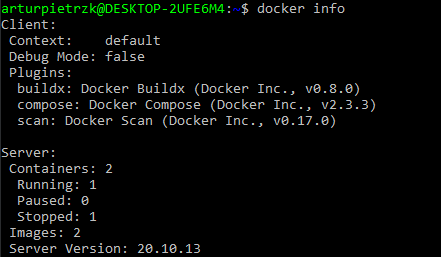
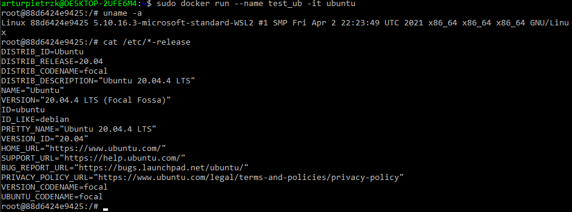
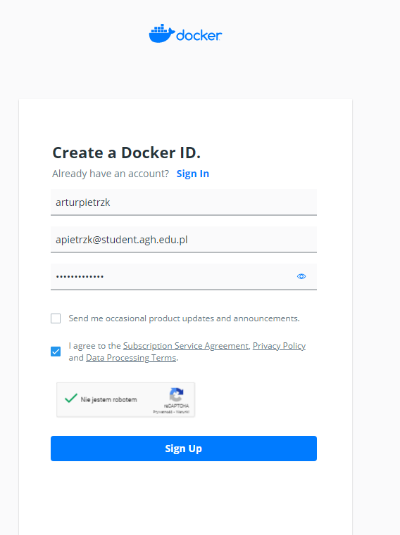
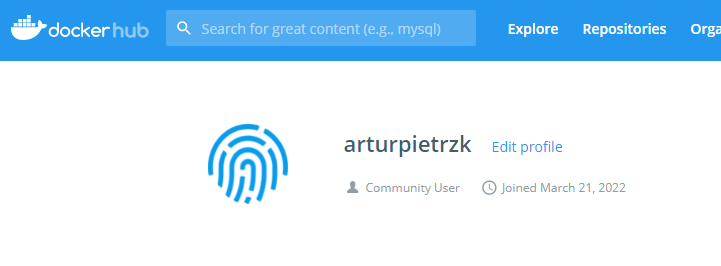

# Sprawozdanie 2

### Zadanie 1

- Utworzenie wymaganych folderów

- Hook sprawdzający czy tytuł commita nazywa się <AP304152> tak jak nasz branch oraz czy w treści commita znajduję się numer laboratorium
  
  

- Przetestowanie działania
  
  

  ### Zadanie 2
- Zawartość commit-msg:
  
  #!/usr/bin/env bash

INPUT_FILE=$1

START=head $INPUT_FILE

if ! [[ "$START" =~ "JP300987" ]]; then

echo "Bad commit"

exit 1

fi

if ! [[ "$START" == *"Lab02"* ]]; then

echo "Bad commit"

exit 1

fi
  
### Zadanie 3
  - Wykorzystano WSL, dzięki czemu nie ma potrzeby konfiguracji SSH
  
  
  
  
  - Sprawdzenie w Windows PowerShell działających dystrybucji Linux'a oraz ich wersji i  ewentualna zmiana wersji wsl z 1 na 2:
  
  
  
  
  
  - Instalowanie środowiska Dockerowego:
  
  
  
  
  
  - Następnie należy przejść do ustawień i sprawdzić czy jest włączona integracja dla WSL:
  
  
  
  
  ### Zadanie 4
  Przetestowanie działania środowiska:
  
  
  
  
  
  - Wykazanie, że środowisko dockerowe jest uruchomione i działa(z definicji):
  
  
  
  
  
  
   - Wykazanie, że środowisko dockerowe jest uruchomione i działa(sposób praktyczny):
  
  
  
  
  - Uruchomienie dystrybucji Ubuntu i wyświetlenie numeru wersji:
  
  
  
  
  ### Zadanie 5
  - Założenie konta na DockerHub
  
  
  
  

  ### Użyte komendy
  
  - cd MDO2022_S/ITE/GCL06/AP304152
  - git branch
  - mkdir Lab02
  - cd Lab02
  - touch Sprawozdanie02.md
  - git add Lab02/
  - nano ~/MDO2022_S/.git/hooks/commit-msg
  - chmod a+x ~/MDO2022_S/.git/hooks/commit-msg
  - git commit -m 'dbsjdbs' -m 'dsd'
  - git commit -m 'AP304152' -m 'dsd'
  - git commit -m 'fsdsfds' -m 'dsLab02'
  - git commit -m 'AP304152' -m 'dsLab02fds'
  - uname -a
  - docker run -d -p 80:80 docker/getting-started
  - docker run hello-world
  - docker info
  - sudo docker images
  - sudo docker rmi docker/getting-started --force
  - sudo docker rmi hello-world --force
  - sudo docker system prune --volumes
  - sudo docker pull ubuntu
  - sudo docker images
  - sudo docker run --name test_ub -it ubuntu
