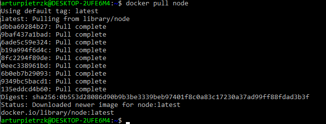
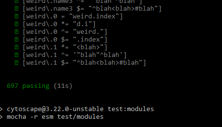

# Sprawozdanie z laboratorium 3

## 1.Repozytorium z kodem oprogramowania:https://github.com/cytoscape/cytoscape.js?files=1, które:
- dysponuje otwartą licencją
- jest umieszczone wraz ze swoimi narzędziami Makefile tak, aby możliwe był uruchomienie w repozytorium czegoś na kształt make build oraz make test.
- Zawiera zdefiniowane i obecne w repozytorium testy, które można uruchomić np. jako jeden z "targetów" Makefile'a. 
Testy muszą jednoznacznie formułować swój raport końcowy (gdy są obecne, zazwyczaj taka jest praktyka)

## 2.Przeprowadzenie buildu w kontenerze
- Pobranie obrazu node

- Uruchomienie kontenera z node i podłączenie TTY

- Sklonowanie repozytorium i sprawdzenie konfiguracji środowiska

- Instalacja dependencji

- Uruchomienie testów

## 3.Stworzenie dwóch plików Dockerfile automatyzujących powyższe wykonane kroki z uwzględnieniem poniższych kwestii:
## - Kontener pierwszy ma przeprowadzać wszystkie kroki aż do builda
## - Kontener drugi ma bazować na pierwszym i wykonywać testy

Kontener pierwszy wykorzystywany do przeprowadzenia wszystkich kroków aż do builda
FROM node:latest

#clone repo and build
RUN apt update
RUN git clone https://github.com/cytoscape/cytoscape.js.git
RUN cd cytoscape.js && npm i
