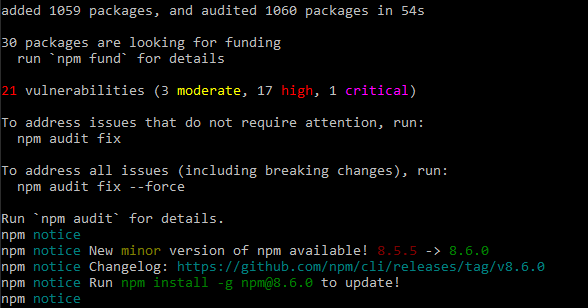
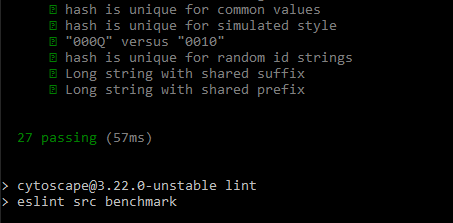

# Sprawozdanie z laboratorium 3

## 1.Repozytorium z kodem oprogramowania:https://github.com/cytoscape/cytoscape.js?files=1, które:
- dysponuje otwartą licencją
- jest umieszczone wraz ze swoimi narzędziami Makefile tak, aby możliwe był uruchomienie w repozytorium czegoś na kształt make build oraz make test.
- Zawiera zdefiniowane i obecne w repozytorium testy, które można uruchomić np. jako jeden z "targetów" Makefile'a. 
Testy muszą jednoznacznie formułować swój raport końcowy (gdy są obecne, zazwyczaj taka jest praktyka)

## 2.Przeprowadzenie buildu w kontenerze
- Pobranie obrazu node

- Uruchomienie kontenera z node i podłączenie TTY

- Sklonowanie repozytorium i sprawdzenie konfiguracji środowiska

- Instalacja dependencji

- Uruchomienie testów

## 3.Stworzenie dwóch plików Dockerfile automatyzujących powyższe wykonane kroki z uwzględnieniem poniższych kwestii:
### - Kontener pierwszy ma przeprowadzać wszystkie kroki aż do builda
### - Kontener drugi ma bazować na pierwszym i wykonywać testy

- Kontener pierwszy wykorzystywany do przeprowadzenia wszystkich kroków aż do builda:

`FROM node:latest`

`#clone repo and build`

`RUN apt update`

`RUN git clone https://github.com/cytoscape/cytoscape.js.git`

`RUN cd cytoscape.js && npm i`

- Kontener drugi bazujący na pierwszym i wykonujący testy: 
 
`previous image name`

`FROM cytoscape:latest`

`RUN cd cytoscape.js && npm test`

- Uruchomienie nowego obrazu 

## 4.Zastosowane polecenia

docker pull node

docker run -it --name AP --entrypoint /bin/sh node

W kontenerze:

git clone https://github.com/cytoscape/cytoscape.js.git

npm i

npm test

Po wyjściu z kontenera:

nano dockerfile_1

docker build . -f dockerfile_1 -t cytoscape

nano dockerfile_2

docker build . -f dockerfile_2 -t cytoscape_test

sudo docker images

docker run -it --name cytoscape_test cytoscape_test
