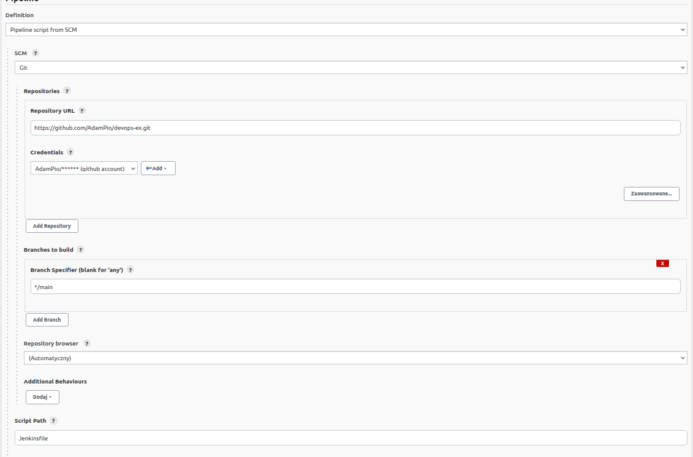

## Stworzenie repozytorium dla naszego pipeline'a
https://github.com/AdamPio/devops-ex
## Stworzenie nowego pipeline

## Konfiguracja pipeline'a
Ustawiamy nasze repozytorium i już wcześniej utworzene credentials, aby możliwe było pobranie repo

## Utworzenie plików pipeline'a
### Dockerdep
```docker
FROM openjdk:11
COPY petclinic petclinic
RUN cd app && ./mvnw dependency:go-offline
```
### Dockerbuild
```docker
FROM petclinic-dep:latest
RUN cd petclinic && ./mvnw package
WORKDIR /app
ENTRYPOINT [ "cp", "target/spring-petclinic-2.7.0.jar", "/output/app.jar"]
```

### Dockertest
```docker
FROM petclinic-build:latest
WORKDIR /petclinic
RUN ./mnvw test
```

### Dockerpublish
```docker
FROM openjdk:11
RUN apk add --no-cache --upgrade bash
COPY shared_volume/petclinic.jar /petclinic.jar
ENTRYPOINT[ "java", "-jar", "app.jar"]
```

## Przygotowanie pipeline'a
### Jenkinsfile
```
pipeline {
    agent any

    stages {
        stage("Fetch dependencies") {
            steps {
                script {
                    docker.build("petclinic-dep", ". -f Dockerdep")
                    sh 'echo dependencies fetched'
                }
            }
        }
        
        stage('Build') {
            steps {
                script {
                    sh 'ls'
                    def imageBuild = docker.build("petclinic-build", ". -f Dockerbuild")
                    sh 'rm -rf shared_volume'
                    sh 'mkdir shared_volume'
                    imageBuild.run("-v \$(pwd)/shared_volume:/output")
                    sh 'ls shared_volume'
                }
            }
        }
        stage('Test') {
            steps {
                script {
                    docker.build("petclinic-test", ". -f Dockertest")
                    sh 'echo tested'
                }
            }
        }
        stage('Deploy') {
            steps {
                script {
                    sh 'docker rm -f petclinic'
                    def deployImage = docker.build("petclinic", ". -f Dockerpublish")
                    deployImage.run("--name petclinic")
                    sh 'sleep 5'
                    sh 'docker rm -f petclinic'
                }
            }
        }
    }
    post {
        success {
            echo 'Succeeded, now I`m saving artifact.'
            archiveArtifacts artifacts: 'shared_volume/app.jar', fingerprint: true
        }
        failure {
            echo 'Failed, I`m not saving any artifacts.'
        }
    }
}
```
* Dockerdep - pobiera dependecje aplikacji
* Dockerbuild - buduje aplikację z kodów źródłowych
* Dockertest - uruchamia testy aplikacji
* Dockerpublish - testujemy, czy aplikacja może zostać uruchomiona tylko za pomocą kopiowanego pliku jar

## Odpalenie pipeline'a
Niestety, odpalenie się nie powiodło z powodu błędu połączenia, którego nie potrafiłem rozwiązać
