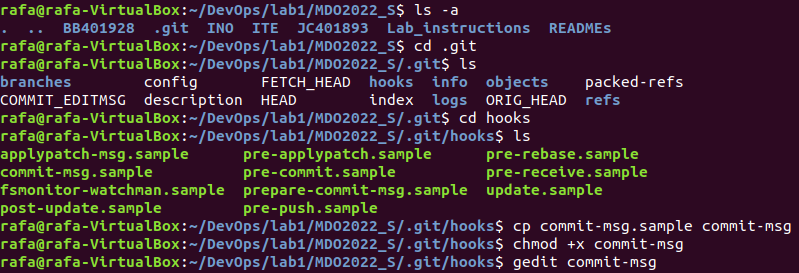
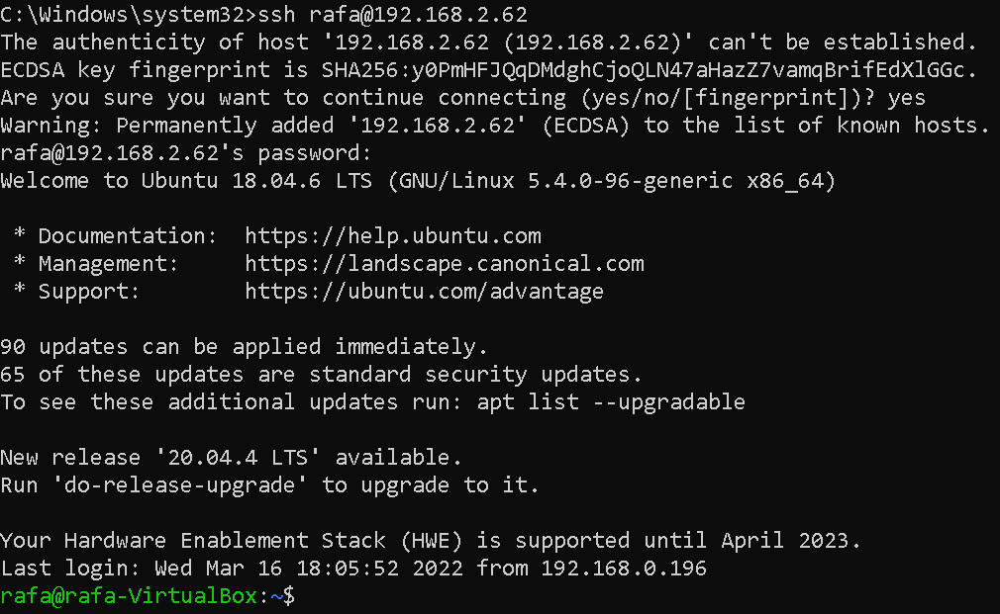

# Rafał Olech - Sprawozdanie z laboratorium 2

## Cel ćwiczeń laboratoryjnych:

Celem ćwiczeń było przygotowanie środowiska Dockerowego oraz zapoznanie się z jego podstawową obsługą i działaniem. Utworzenie git hook'a rozwiązującego najczęstsze problemy z commitami. 

## Wykonanie ćwiczenia:

1. Przygotowanie git hook sprawdzającego, czy tytuł commita jest poprawnie nazwany, a więc składa się z moich inicjałów oraz numeru indeksu oraz sprawdzającego, czy w treści commita pada numer laboratorium, który jest właściwy dla zadania.


 * Utworzenie kopii w folderze hooks pliku o nazwie commit-msg.sample. Utworzona została kopia o tej samej nazwie, lecz bez rozszerzenia .sample.


 * Uczynienie pliku commit-msg jako wykonywalny za pomocą komendy `chmod +x commit-msg`.    




 * Zawartość pliku commit-msg:


```bash
#!/bin/bash

PARAMETER="$(cat $1)"
 
if  [[ "$PARAMETER" != *"RO400876"* ]];
then
 echo "Name of commit is not correct."
 exit 1
else
 echo "Name of commit is correct." 
fi 


if  [[ "$PARAMETER" != *"Lab02"* ]];
then
 echo "Lab number is not correct."
 exit 1
else
 echo "Lab number is correct."
 exit 0
fi
```

 * Wpisanie niepoprawnej nazwy commita w celu sprawdzenia działania utworzonego hook'a:

 


 * Wpisanie poprawnej nazwy commita w celu sprawdzenia działania utworzonego hook'a:

 


2. Przygotowanie środowiska dockerowego.


 * Zapewnienie dostępu do maszyny wirtualnej poprzez zdalny terminal. Połączenie się z maszyną wirtualną z poziomu cmd na windowsie korzystając z SSH:


 * Połączenie następuje po wpisaniu w cmd komendy `ssh rafa@192.168.2.62`:

 


 * Docker został zainstalowany już wcześciej co jest widoczne po wpisnaiu komendy `systemctl status docker`:

 


 * Za pomocą komendy `docker -v` można sprawdzić wersję zainstalowanego dockera:

 


3. Działanie środowiska dockerowego:

 * Wykazanie, że środowisko dockerowe jest uruchomione i działa (z definicji) za pomocą komendy `systemctl status docker`. Status serwisu docker wskazuje na aktywny, co oznacza, że docker jest aktualnie uruchomiony i działa poprawnie:

 


4. Wykazanie działania dockera w sposób praktyczny (z własności).

 * Pobranie obrazu ubuntu komendą `sudo docker pull ubuntu`:

 


 * Sprawdzenie zainstalowanych obrazów za pomocą komendy `sudo docker images`:

 


 * Za pomocą polecenia `sudo docker run --name ubuntu_Rafal -it ubuntu` zostaje utworzony i uruchomiony kontener o nazwie ubuntu_Rafal, a natępnie za pomocą komendy `uname -a` zostaje wyświetlona jego wersja:

 


 * Uruchomienie kontenera o nazwie ubuntu_Rafal za pomocą polecenia `sudo docker start ubuntu_docker`:

 


 * Wyświetlenie listy aktualnych kontenerów komendą `sudo docker ps`:

 


 5. Założenie konta na Docker Hub :

 


