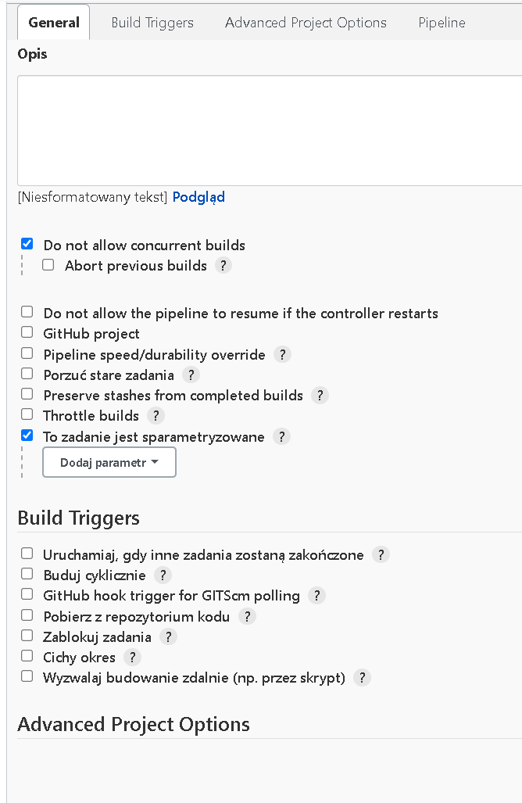

# Rafał Olech - Sprawozdanie z laboratorium 5

## Cel i opis projektu:

Celem projektu było utworzenie pipeline'u za pomocą serwera Jenkins. Zadaniem utworzonego pipeline'u było wykonanie wszystkiech czynności przeprowadzonych na wcześniejszych laboratoriach ale w sposób zautomatyzowany. Pipeline ma na celu zbudownie, testowanie, wdrożenie oraz opublikowanie wybranego projektu. Jako projekt wzięty został program z open sourcowego repozytorium, który znajduję się pod następującym linkiem: https://github.com/RafalOlech00/cytoscape.js.  


## Wykonanie ćwiczenia:

### 1. Przygotowanie kontenerów.

Przed rozpoczęciem pracy z Jenkinsem należy przygotować kontenery, potrzebne do wykonania projektu. Potrzebne są dwa kontenery: kontener z Jenkinsem, który został utworzony pod nazwą jenkins-blueocean oraz kontener z obrazem DIND o nazwie jenkins_Dockerfile.
Szczegółowa instrukcja jak uruchomić wyżej wspomniane dockerowe kontenery znajduję na moim githubie w sprawozdaniu do lab04 znajdującym się pod linkiem: https://github.com/InzynieriaOprogramowaniaAGH/MDO2022_S/blob/RO400876/ITE/GCL06/RO400876/lab04/sprawozdanie.md

Aby sprawdzić czy uruchomienie kontenerów przebiegło pomyślnie należy skorzystać z komendy `sudo docker ps`, za pomocą której można zobaczyć aktualnie działające kontenery. 


### 2. Utworzenie projektu w Jenkinsie.

Jeżeli posiadamy działające kontenery, kolejnym krokiem jest zalogowanie się w Jenkinsie i utworzenie nowego projektu. Jako typ projektu należy wybrać pipeline, nadać nazwę projektu, a następnie zatwierdzić.


Po utworzeniu projektu należy skonfigurować pipeline w sposób pokazany poniżej.



Zostało dodane repozytorium wraz z branchem, z którego będą uruchamiane dockerfile.


Po ukończeniu konfiguracji pipline ukaże się poniższy ekran startowy utworzonego projektu.


### 3. Zawartość pipline'u.

* Parameters:

Pipline przyjmuje dwa parametry `PROMOTE` oraz `VERSION`, które są określone w sekcji `parameters`. Parametr `VERSION` oznacza wersję wydawanego programu. W tym przypadku parametr określający wersję domyślnie ustawiony jest na 1.0.0 lecz przy każdym uruchomieniu pipline'u istnieje możliwość zmiany wersji. Drugi parametr czyli `PROMOTE` decyduje czy sekcja Publish się wykona. Jeżeli wszystkie poprzednie etapy pipelin'u przejdą poprawnie i PROMOTE jest zaznaczone, sekcja Publish buduje publikowalny artefakt, o numerze wersji z parametru `VERSION`.

Sekcja `agent` konfiguruje, na których węzłach można uruchomić potok. Określenie `agent any` oznacza, że ​​Jenkins uruchomi zadanie na dowolnym z dostępnych węzłów.

```
parameters
    {
        string(name: 'VERSION', defaultValue: '1.0.0', description: '')
        booleanParam(name: 'PROMOTE', defaultValue: true, description: '')
     }
    
	agent any
```


* Prepare:

Krok `Prepare` został utworzony w celu uporzodkowania skryptu aby był bardziej przejrzysty. W sekcji tej następuje ogólne przygotowanie projektu, w którym znajduję się utworzenie woluminów wejściowego o nazwie `volume_input` oraz wyjściowego o nazwie `volume_output`. W kroku tym usuwany jest także kontener o nazwie `ro_build`, który powstaje przy budowaniu projektu w kroku nastęþnym. Kontener ten usuwany jest jeżeli istnieje ma to szczególne znaczenie jeśli projekt uruchamiany jest kilkukrotnie. Za pomocą komendy `docker volume prune -f` usuwane są także wszystkie aktualnie nie używane woluminy.


```
stage('Prepare')
		{
			steps
			{
				sh '''
				echo "Przygotowanie projektu..."
				
				docker rm -f ro_build || true
				docker volume prune -f
				docker volume  create --name volume_input
				docker volume  create --name volume_output
				 	      
                echo "Przygotowanie zakończone"
				'''	
			}
		}
```


