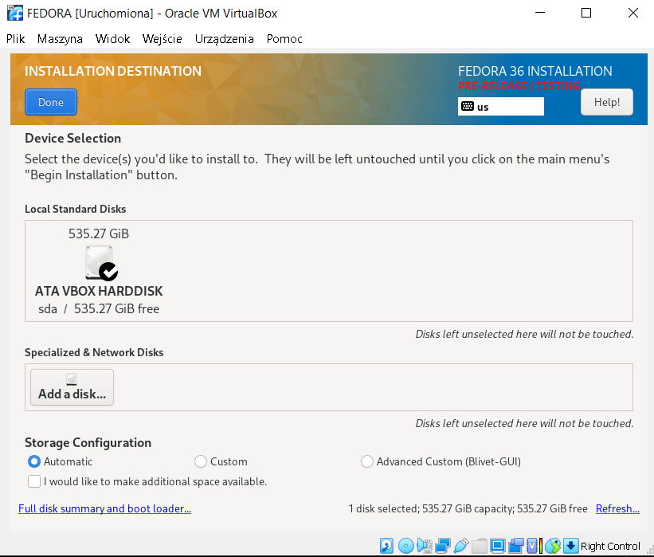
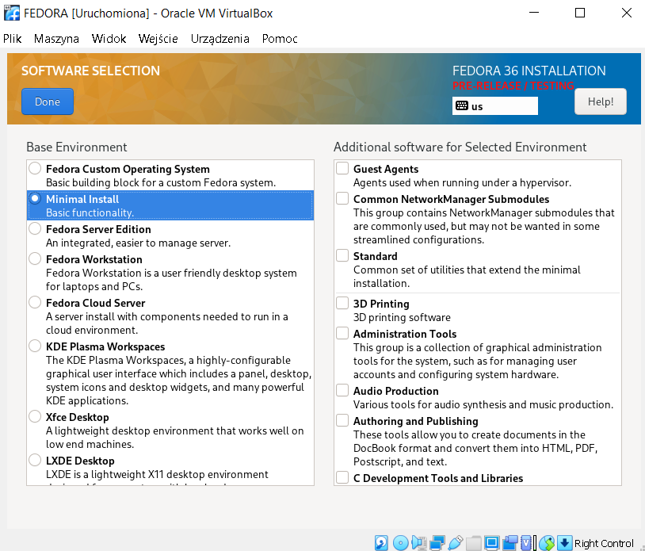
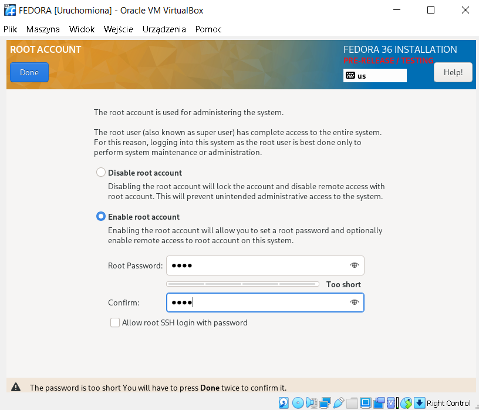
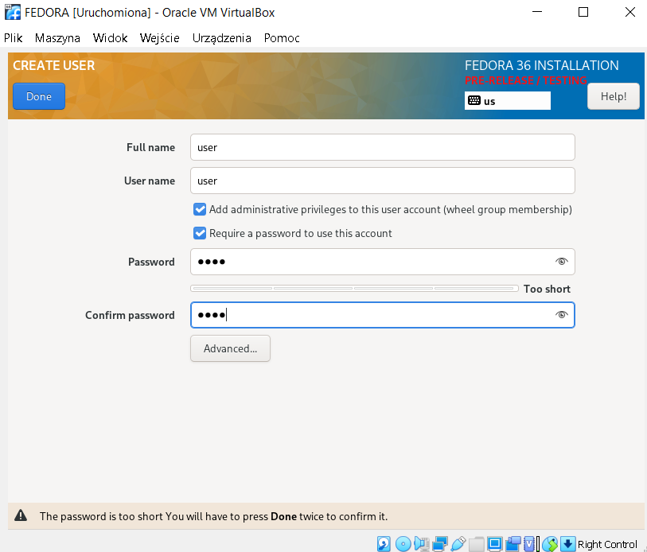
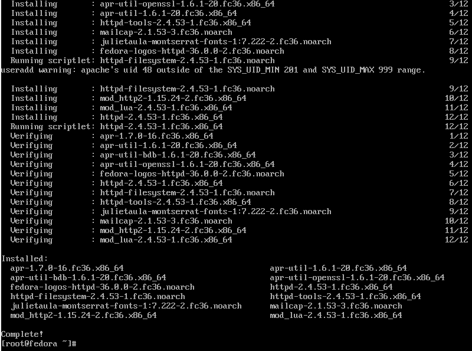
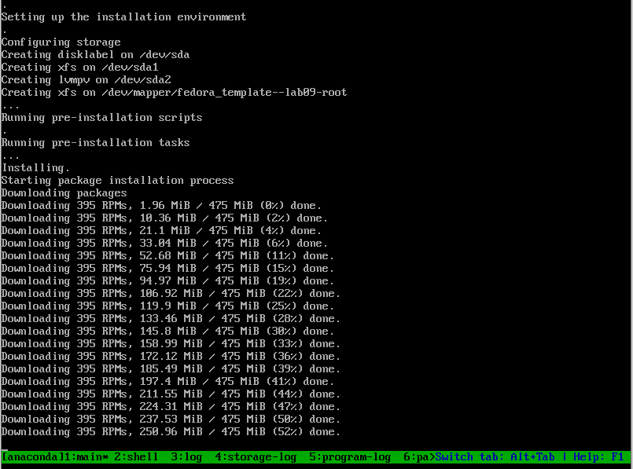
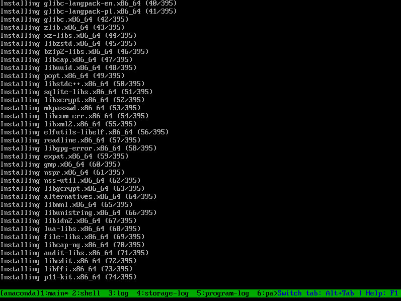
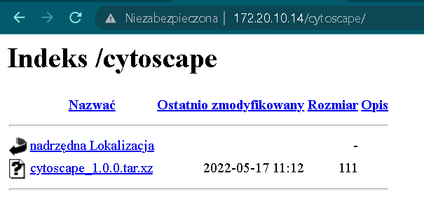
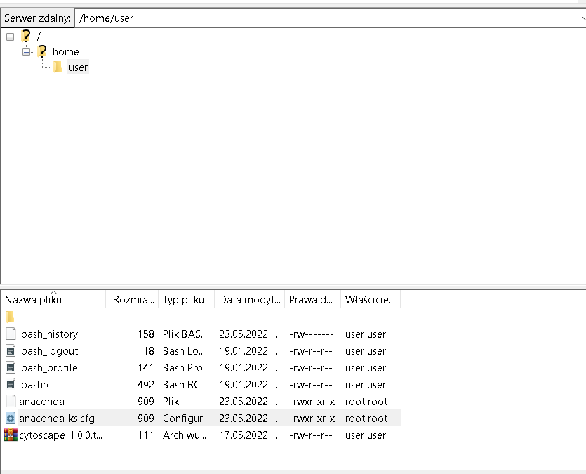
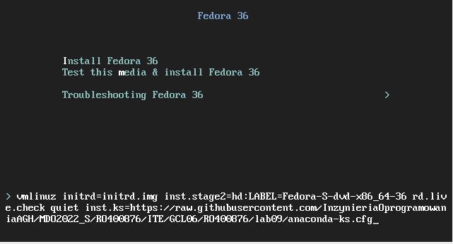

# Rafał Olech - Sprawozdanie z laboratorium 9

## Cel ćwiczeń:

Celem ćwiczeń laboratoryjnych była instalacja i konfiguracja systemu Fedora na VM. Wykorzystanie podstawowych działań na pliku odpowiedzi z instalacji.


## Wykonanie ćwiczenia:

### 1. Instalacja Fedory.

Podczas instalowania systemu Fedora wybrałem język na angielski, następnie wybrałem układ klawiatury na Polish (legacy). 

Jako miejsce instalacji systemu zostawiłem ustawienia domyślne.




W kolejnym kroku konfiguracji systemu zmieniłem nazwę hosta na `template-lab9.agh`.


Następnie wybieram podstawową/minimalną wersję oprogramowania do zainstalowania.




Należy dodać konto administratora z nadaniem loginu i hasła.




W ostatnim kroku dodawany jest użytkownik o nazwie `user`.



Po zakończonej pomyślnie instalacji i włączeniu się Fedory możiwe jest zalogowanie na utworzonego użytkownika.


### 2. Instalacja i konfiguracja drugiej Fedory.

Została zainstalowana druga Fedora, której celem będzie wyłącznie serwowanie repozytorium po HTTP.


Następnie na nowo zainstalowanym systemie została zainstalowana usługa httpd za pomocą komendy `sudo dnf -y install httpd`.




Następnie została rozpoczęta instalacja z pliku odpowiedzi:






Uruchomienie usługi httpd poleceniem `systemctl enable httpd --now`:


Aby sprawdzić czy usługa została poprawnie uruchomiona i sprawdzić jej aktualny status należy skorzystać z polecenia `systemctl status httpd`. Na poniższym zrzucie ekranu widoczne jest, że usługa jest aktywna.


W dalszej konfiguracji nowego systemu należy wyłączyć firewalla poniższymi komendami:


Utworzenie katalogu o nazwie wybranego repozytorium, w moim przypadku jest to `cytoscape`:


Wejście do utworzonego na serwerze katalogu za pomocą wyszukiwarki:


Umieszczenie artefaktów z projektu na serwerze HTTP:


Aby sprawdzić czy projekt się pomyślnie dodał na serwer, można się na niego zalogować korzystając z wyszukiwarki:




Na zainstalowanej jako pierwsza Fedorze korzystając z polecenia `wget 172.20.10.14/cytoscape/cytoscape_1.0.0.tar.xz` zostają pobrane artefakty z serwera:


### 3. Instalacja nienadzorowana.

Pobranie pliku o nazwie `anaconda-ks.cfg` w celu jego modyfikacji:




Modyfikacja pliku `anaconda-ks.cfg`. Poniżej znajdują się zmienione lub dodane fragmenty pliku:

```
# Use graphical install
#graphical
text

# Repo
url --mirrorlist=http://mirrors.fedoraproject.org/mirrorlist?repo=fedora-$releasever&arch=x86_64
repo --name=updates --mirrorlist=http://mirrors.fedoraproject.org/mirrorlist?repo=updates-released-f$releasever&arch=x86_64

%post
mkdir cytoscape
wget 172.20.10.14/cytoscape/cytoscape_1.0.0.tar.xz
%end
```

Przy instalacji trzeciej Fedory należy użyć poniższej komendy. Instalacja uruchamiana jest z pliku odpowiedzi. który został umieszczony na GitHubie:

