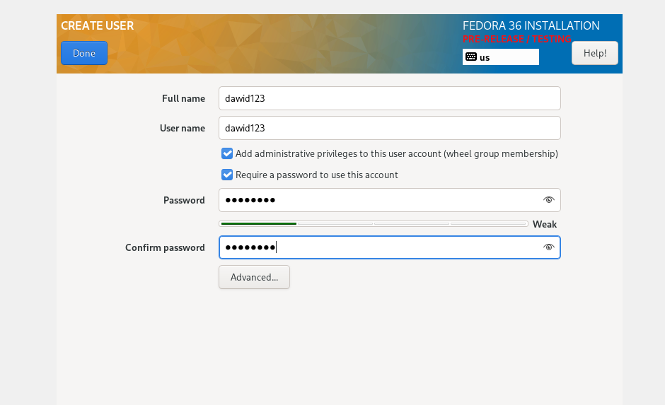
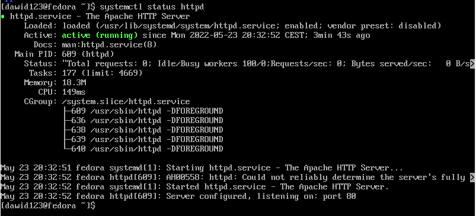
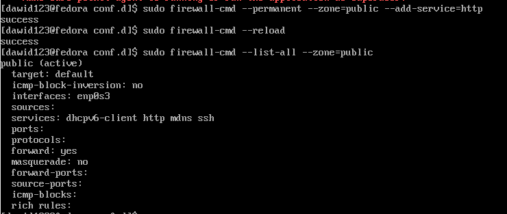

# Sprawozdanie Lab 9 - Dawid Skorupa

W ramach laboratorium wdrożono maszyny wirtualne z systemem Fedora. Dokonano tego w dwóch wariantach:
* Ręcznie, przeklikując kolejne okna w graficznym menedżerze instalacji.
* Wykorzystując plik kickstart (anaconda-ks.cfg) wygenerowany automatycznie po ręcznym zainstalowaniu systemu.

## Ręczne wdrożenie maszyny wirtualnej

1. Podczas instalacji wybrano wariant minimalny. Utworzono przykładowego użytkownika. Pozostałe opcje pozostawiono domyślne, ponieważ były satysfakcjonujące.  

    
    
2. Po instalacji sprawdzono katalog /root w celu potwierdzenia, że plik odpowiedzi został wygenerowany prawidłowo.

    
3. Kroki powielono dla drugiej maszyny wirtualnej.
4. Na jednej z maszyn wirtualnych zainstalowano i skonfigurowano serwer HTTP (apache2).  

Utworzono katalog /var/www/html/artifacts dla artefaktów, które zwraca serwer. We wspomnianym katalogu umieszczono artefakt (połączenie za pomocą SFTP, Filezilla).  

      
Dodano odpowiednie reguły firewalla, aby umożliwić połączenia przychodzące HTTP.  

    
5. Z poziomu drugiej maszyny wirtualnej znajdującej się w tej samej sieci NAT w VirtualBox wykonano zapytanie za pomocą narzędzia wget w celu pobrania artefaktu.  

    

## Instalacja nienadzorowana

1. Za pomocą programu Filezilla skopiowano plik odpowiedzi z maszyny wirtualnej na maszynę hosta.
2. Zmodyfikowano plik odpowiedzi tak, aby zawierał niezbędne dependencje potrzebne do pobrania artefaktu z serwera HTTP, a zatem narzędzie wget.  
Zmodyfikowano sekcję %packages tak, aby poza instalacją minimalnego środowiska zainstalowane zostało również narzędzie wget.  

    ```
    %packages
    @^minimal-environment
    wget
    %end
    ```
3. Dodano repozytoria, z których będą pobierane:
   * pliki potrzebne do instalacji systemu
   * dodatkowe pakiety (menedżer pakietów)  

    Wykorzystano przy tym komendy url oraz repo.
4. Dodano sekcję post (czynności po instalacji systemu operacyjnego), w której wykonywane jest pobranie artefaktu z repozytorium.
    ```
    %post
    wget http://10.0.30.5/artifacts/app.jar
    %end
    ```
5. Zastąpiono również opcję graphical opcją text po to, aby przeprowadzić instalację bez interfejsu graficznego.
6. Zmodyfikowany plik odpowiedzi wysłano do repozytorium przedmiotowego na osobistego brancha (DS402563).
7. Przy pomocy pliku odpowiedzi wdrożono kolejną maszynę wirtualną. W tym celu, do komendy widocznej po starcie maszyny, dodano opcję inst.ks o wartości będącej źródłem pliku wyjścia (serwery Github'a, osobisty branch w repozytorium przedmiotowym).