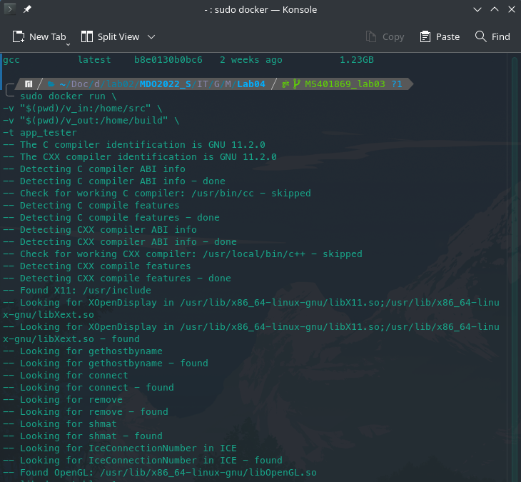
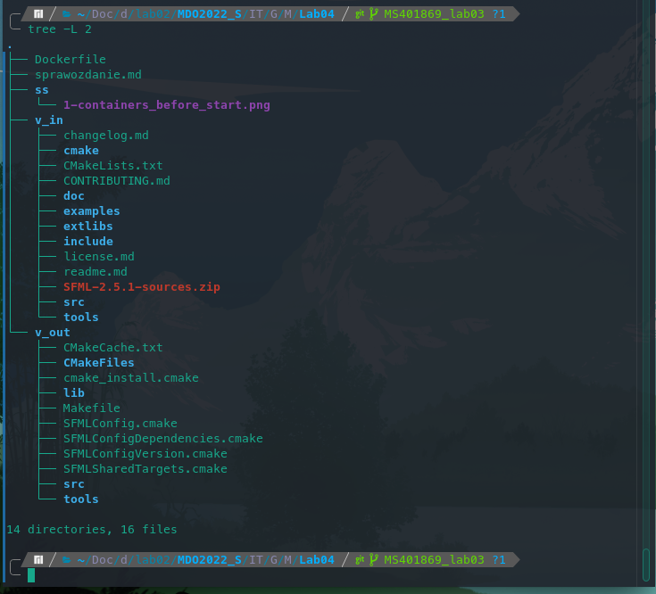
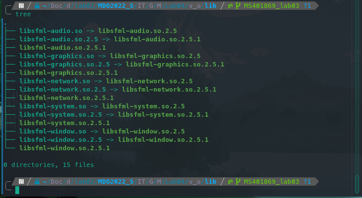
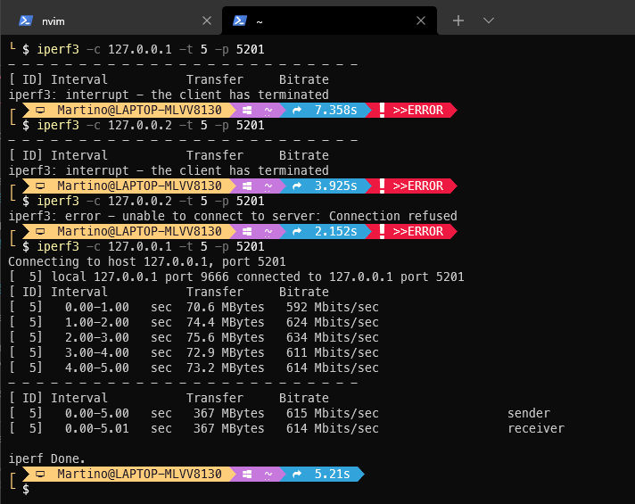

# metodyki DevOps sprawozdanie - lab04

## Przygotowanie obrazu do budowania

Do budowy repozytorium został użyty obraz bazowy z poprzedinch laboratoriów
`gcc:latest`

Początkowy stan kontenerów


Folder projektu przed uruchomieniem kontenera


Dockerfile do budowy obrazu

```dockerfile
FROM gcc:latest

RUN mkdir /home/src && mkdir /home/build
WORKDIR /home/build

RUN apt update

# Install OpenGL
RUN apt -y install libglu1-mesa-dev freeglut3-dev mesa-common-dev

# Install libx11-dev
# RUN apt -y install libx11-dev

# Install xorg-dev to provide X11_X11_LIB and X11_Xrandr_LIB
RUN apt -y install xorg-dev

# Install xrandr
RUN apt -y install lxrandr

# Install udev
RUN apt -y install udev libudev-dev

# Install libfreetype-dev
# RUN apt -y install libfreetype-dev

# Install openal
RUN apt -y install libopenal-dev

# Install flac
RUN apt -y install flac libflac-dev

# Install vorbis
RUN apt -y install vorbis-tools libshout-dev

# Install cmake
RUN apt -y install cmake

CMD cmake ../src && cmake --build .
```
Komeda użyta do budowy obrazu


	sudo docker build -f ./Dockerfile -t app_tester:latest .

Poniższy zrzut ekranu przedstawia udaną budowę obrazu


Widok kontenerów po budowie obrazu


## Uruchomienie obrazu

Początek działania obrazu - konfiguracja cmake


	sudo docker run \
	-v "$(pwd)/v_in:/home/src" \
	-v "$(pwd)/v_out:/home/build" \
	-t app_tester


Fragmęt budowy bibliotek sfml


Fragmęt przedstawiający pomyśle zakończenie budowy obrazu


Folder projektu po uruchomieniu kontenera


Folder v_out/lib przedstawiający skompilowane biblioteki


## iperf3

Run container

	sudo docker run -p 5201:5201 -it ubu01 "bash"

Run `iperf3` server on the container

	iperf3 -s

Run `perf3` client in the host to test the connection

	iperf3 -c 127.0.0.1 -t 30 -p 5201

Check listening ports

	sudo netstat -tunpa | grep LISTEN

If you want connect to the server from host of VM forward port `5201`

#### container - container connection
As documentation says:

>If two containers are on the same network, they can talk to each other.
>If they aren’t, they can’t.

Create new network

	sudo docker network create mynet

Check network addres as well as specific containers ip addresses

	sudo docker network inspect mynet

Run server's container, add `--network` option to add it to the network

	sudo docker run --network=mynet -it ubu01 "bash"

Start server on the server's container

	iperf3 -s

Run client's container, add `--network` option to add it to the network
	
	sudo docker run --network=mynet -it ubu02 "bash"

Start iperf3 client on the client's container

	iperf3 -c 172.19.0.2 -t 5 -p 5201

**We can still connect to the server running on the container from container's
host or VM host, but keep in mind to use appropirate ip address (`172.19.0.1` in
this case)**

### Testowanie transferu danych

#### Między kontenerami


#### Między kontenerem, a hostem dockera (linux)


#### Między kontenerem, a hotem VM (windows)



#### Server `iperf3` uruchomiony na kontenerze
Zrzut przdstawia uruchomienie kontenera, oraz logi po wykonaniu ww. zapytań
klienta


