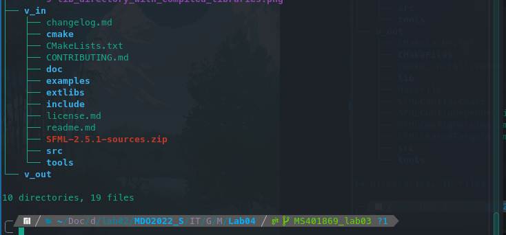
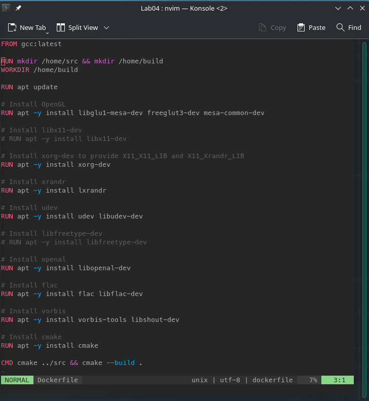
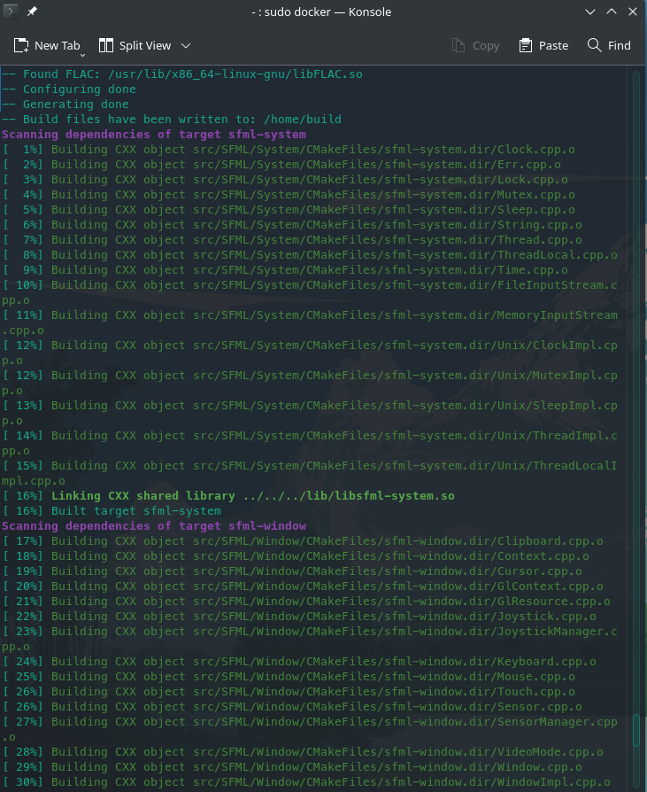
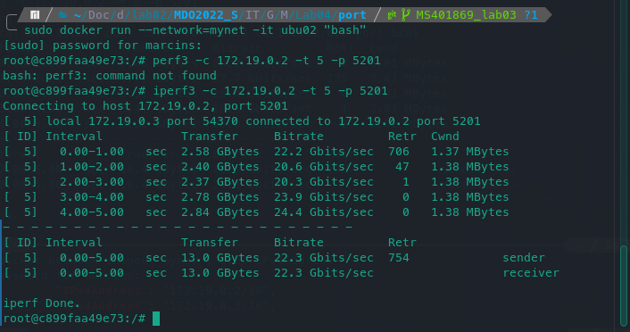
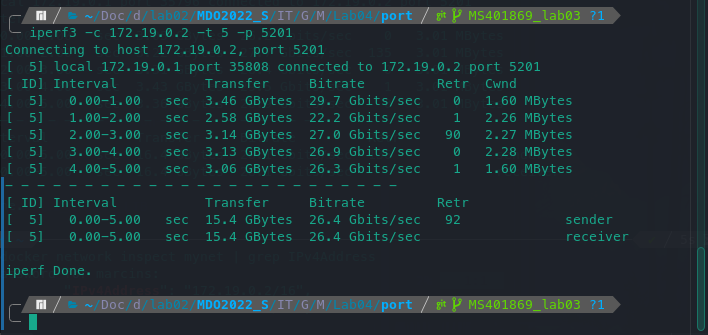
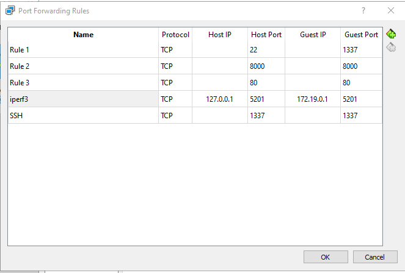
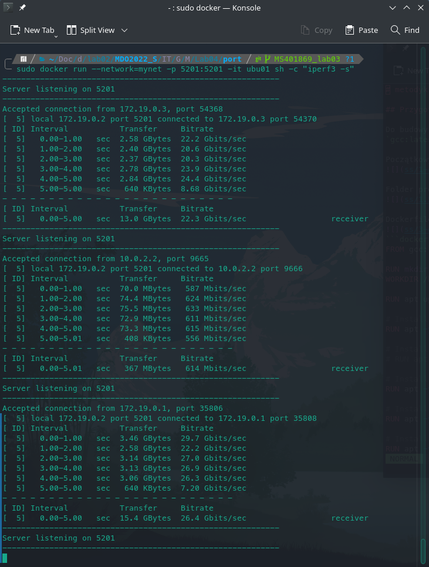
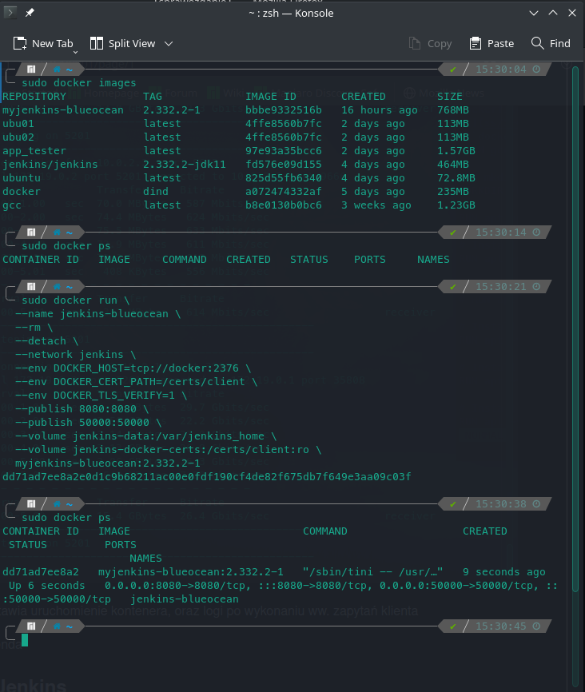
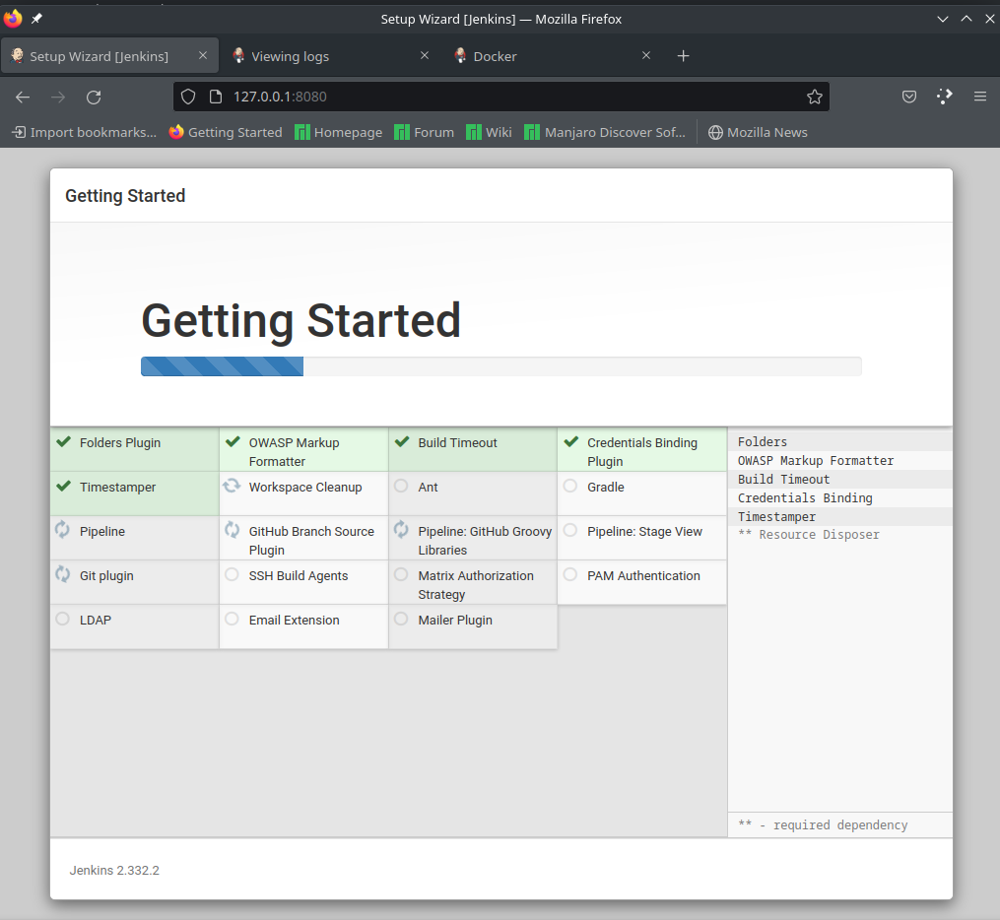
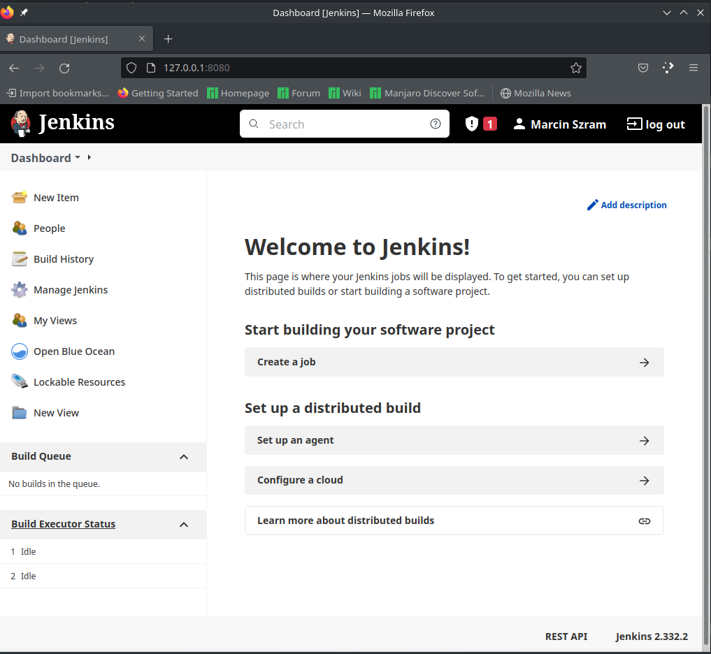

# metodyki DevOps sprawozdanie - lab04

Uwaga
- Poniższe sprawozdanie zawiera zrzuty ekranu, na których powerline
mylnie wzkazuje na pracę na branchu `MS401869_lab3`. Barnch został
zmieniony dopiero pod koniec pracy, dlatego należy to zigorować
## Zachowanie stanu
Do realizacji tego podpunktu wykorzystano bibliotekę `sfml`.
Celem jest budowa kodu źrółowego tej biblioteki z wykorzystaniem
kontenerów docker'a.
### Przygotowanie obrazu do budowania

Do budowy repozytorium został użyty obraz bazowy z poprzedinch laboratoriów
`gcc:latest`

1. Początkowy stan kontenerów

	

2. Folder projektu przed uruchomieniem kontenera

	

3. Dockerfile do budowy obrazu

	

Powyższy dockerfile w formie tekstowej
```dockerfile
FROM gcc:latest

RUN mkdir /home/src && mkdir /home/build
WORKDIR /home/build

RUN apt update

# Install OpenGL
RUN apt -y install libglu1-mesa-dev freeglut3-dev mesa-common-dev

# Install libx11-dev
# RUN apt -y install libx11-dev

# Install xorg-dev to provide X11_X11_LIB and X11_Xrandr_LIB
RUN apt -y install xorg-dev

# Install xrandr
RUN apt -y install lxrandr

# Install udev
RUN apt -y install udev libudev-dev

# Install libfreetype-dev
# RUN apt -y install libfreetype-dev

# Install openal
RUN apt -y install libopenal-dev

# Install flac
RUN apt -y install flac libflac-dev

# Install vorbis
RUN apt -y install vorbis-tools libshout-dev

# Install cmake
RUN apt -y install cmake

CMD cmake ../src && cmake --build .
```

4. Budowa obrazu do budowania

	

Użyta komenda

	sudo docker build -f ./Dockerfile -t app_tester:latest .

- `-f` wzkazuje na dockerfile, który powinien zostać użyty. W tym
kontekście opcja ta mogłaby zostać pominięta, ponieważ dockerfile
posiada domyślną nazwę
- `-t` opcja pozwalająca na określenie nazwy obrazu. Użyta nazwa
`app_tester` nie jest adekwatna i została użyta przez pomyłkę, jednak
została zachowana, aby nie powtarzać całego procesu od nowa
- `.` wskazuje na katalog `root`, w którym powinny znajdować się pliki
dockerfile

6. Zrzut ekranu przedstawia udaną budowę obrazu

	

7. Widok kontenerów po budowie obrazu

	

### Uruchomienie obrazu

1. Uruchomienie obrazu do budowania `sfml`

	1. Zrzut ekranu przedstawia kilka początkowych linijek po
		uruchomieniu komendy. Fragmęt ten przedstawia konfigurację cmake

		

	2. Poniższy fragmęt ten przedstawia budowę projektu

		

	3. Fragmęt przedstawiający pomyśle zakończenie budowy obrazu

		

Użyta komdenda

	sudo docker run \
	-v "$(pwd)/v_in:/home/src" \
	-v "$(pwd)/v_out:/home/build" \
	-t app_tester

- `-v` utworzenie volumenów dla folderu z kodem źródłowym, oraz
	buidem. Użyto `bind mount`

	> Named volumes are great if we simply want to store data, as we don’t
	> have to worry about where the data is stored.
	> With **bind mounts**, we control the exact mountpoint on the host.
	
		-v [ścieżka_do_zasobów_hosta]:[ścieżka_do_zasobów_wewnątrz_kontenera]
- `-t` określenie nazwy kontenera do uruchomienia

4. Folder projektu po uruchomieniu kontenera

	

	Na powyższym zrzucie widać, że folder `v_out` został wypełniowy
	zawartością.

5. Folder `v_out/lib` przedstawiający skompilowane biblioteki

	

## Eksportowanie portu

### Testowanie transferu danych

Komenda `iperf3`
- `-s` oznacza uruchomienie serwera `iperf3`
- `-c` oznacza uruchomienie klienta `iperf3` po użyciu tej opcji należy
	podać adres ip, na którym pracuje serwer `iperf3`
- `-t` opcja pozwalająca określić czas transferu danych w sekundach
- `-p` opcja pozwalająca na określenie portu, na którym pracuje serwer

1. Utworzenie nowej sieci

	Zgodnie z wpisem dokumentajci dockera
	>If two containers are on the same network, they can talk to each other.
	>If they aren’t, they can’t.

	Aby możliwe było przetestowanie komunikacji między dwoma kontenerami,
	konieczne jest utworzenie sieci, do której będą podpięte oba 
	kontenery -- srwera oraz klienta.

		sudo docker network create mynet
	
	Aby pozyskać adresy ip sieci/kontenerów (głównie przydatny będzie adres
	serwera) można użyć komendy

		sudo docker network inspect mynet
	
	
	
	Aby łatwiej zidentyfikować adresy kontenerów można użyć `grep`

		sudo docker inspect network mynet | grep IPv4Address


1. Uruchomienie kontenera z serwerem `iperf3`
	
		sudo docker run --network=mynet -p 5201:5201 -it ubu01 sh -c "iperf3 -s"

- `--network` opcja pozwalająca na zdefiniowania, w której sieci będzie
	pracował kontener. W tym przypadku kontener został podłączony do sieci
	`mynet` utworzenej wcześniej
- `-p` przekierowanie portów z `5201` kontenera na `5201` hosta
- `-it` opacja `-i` zachowuje standardowy strumień wejścia otwarty.
	opcja `-t` definiuje, który kontener ma zostać uruchomiony. 
- `sh -c "iperf3 -s"` uruchomienie powłoki zaraz po starcie kontenera, oraz
	(poprzez opcję `-c`) określenie komendy, która ma zostać wykonana
	w tejże powłoce

	*Zrzut dokumentujący wywołanie powyższej komendy znajduje się niżej*

2. Test przepustowości między kontenerami

	

	Komenda uruchamiająca kontener pełniący rolę klienta `iperf3`

		sudo docker run --network=mynet -it ubu02 "bash"

- `--network` opcja pozwalająca na zdefiniowania, w której sieci będzie
	pracował kontener. W tym przypadku kontener został podłączony do sieci
	`mynet` utworzenej wcześniej
- `-it` opacja `-i` zachowuje standardowy strumień wejścia otwarty.
	opcja `-t` definiuje, który kontener ma zostać uruchomiony. Ostatni
	parametr `"bash"` powoduje uruchomienie powłoki po starcie kontenera

	Komenda uruchamiająca klienta `iperf3`

		iperf3 -c 172.19.0.2 -t 5 -p 5201

	Należy pamiętać, że pracujemy we własno zdefiniowanej sieci `mynet`,
	dlatego należy podać adres ip kontenera, na którym pracuje serwer
	właściwy dla tej sieci.
	W celu pozyskania informacji o adresie ip kontenera z serwerem można
	skorzystać z komendy `sudo docker network inspect mynet`
	

3. Test przepustowości między kontenerem, a hostem dockera (linux)

	

4. Test przepustowości między kontenerem, a hotem VM (windows)

	Aby umożliwić połączenie klienta działającego na hoście maszyny 
	wirtualnej (windows) należy ustawić port forwarding z `127.0.0.1:5201`
	na `172.19.0.1:5201`. Jest to konieczne ze względu na fakt, że
	adpater karty sieciowej na maszynie wirtualnej wykorzystuje NAT.

	

	Próba połączenia się z serwerem `iperf3`

	

	*`iperf3` został na windows doinstalowany z wykorzystaniem choco:
	`choco install iperf3`*

5. Server `iperf3` uruchomiony na kontenerze po przeprowadzeniu testów
	przepustowości

	

	Zrzut przedstawia uruchomienie kontenera, oraz logi po wykonaniu ww. zapytań
	klienta. Na jego podstawie można wnioskować, że:

- Przepustowość kontener--kontener jest zbliżona do przepustowości
	kontener--host docker'a
- Przepustowość kontener--host VM jest znacznie mniejsza od
	przepustowości kontener--kontener oraz kontener--host docker'a


### Instancja Jenkins

1. Instalacja jenkins odbyła się zgodnie z
	[dokumentacją](https://www.jenkins.io/doc/book/installing/docker/)

	Widok obrazów oraz procesów po instalacji oraz uruchomieniu jenkins'a

	

2. Pobranie hasła początkowego w celu utworzenia konta admin

	

3. Pierwsze uruchomienie jenkins z przeglądarki -- instalacja pluginów

	

4. Widok w pełni działającego jenkins'a

	
